# Manual de Desenvolvimento de Módulos SEI — v5.0

---

## Índice

- [1. Introdução](#1-introdução)
- [2. Criação e Ativação](#2-criação-e-ativação)
- [3. Considerações Prévias](#3-considerações-prévias)
  - [Restrições do Ambiente](#restrições-do-ambiente)
  - [Perfis, Recursos e Menus](#perfis-recursos-e-menus)
  - [Auditoria](#auditoria)
  - [Conexões e Transações](#conexões-e-transações)
  - [Andamentos](#andamentos)
  - [Classes do Sistema](#classes-do-sistema)
- [4. InfraPHP](#4-infraphp)
  - [Visão Geral](#visão-geral)
  - [InfraDTO](#infradto)
  - [InfraPagina (1ª Camada)](#infrapagina-1ª-camada)
  - [InfraRN (2ª Camada)](#infrarn-2ª-camada)
  - [InfraBD (3ª camada)](#infrabd-3ª-camada)
  - [Métodos Padronizados](#métodos-padronizados)
  - [InfraException](#infraexception)
  - [Estrutura de Diretórios](#estrutura-de-diretórios)
- [5. Padrão de Modelagem de Dados](#5-padrão-de-modelagem-de-dados)
  - [Regras Gerais](#regras-gerais)
  - [Tabelas](#tabelas)
  - [Colunas](#colunas)
  - [Tipos de Dados](#tipos-de-dados)
  - [Chave Primária](#chave-primária)
  - [Chave Alternativa](#chave-alternativa)
  - [Chave Estrangeira](#chave-estrangeira)
  - [Índices](#índices)
  - [Sequências](#sequências)
- [6. Padrão de Codificação PHP](#6-padrão-de-codificação-php)
  - [Nomes de Arquivos](#nomes-de-arquivos)
  - [Indentação](#indentação)
  - [Classes e Interfaces](#classes-e-interfaces)
  - [Instâncias de Classes](#instâncias-de-classes)
  - [Constantes](#constantes)
  - [Atributos e Variáveis de Métodos](#atributos-e-variáveis-de-métodos)
  - [Métodos](#métodos)
  - [Elementos HTML](#elementos-html)
- [7. Gerador de Código](#7-gerador-de-código)
- [8. Classes API](#8-classes-api)
  - [AcessoExternoAPI](#acessoexternoapi)
  - [AndamentoAPI](#andamentoapi)
  - [AnexoAPI](#anexoapi)
  - [AndamentoMarcadorAPI](#andamentomarcadorapi)
  - [ArquivoExtensaoAPI](#arquivoextensaoapi)
  - [ArvoreAcaoItemAPI](#arvoreacaoitemapi)
  - [AssinaturaAPI](#assinaturaapi)
  - [AssuntoAPI](#assuntoapi)
  - [AtributoAndamentoAPI](#atributoandamentoapi)
  - [AtributoOuvidoriaAPI](#atributoouvidoriaapi)
  - [BlocoAPI](#blocoapi)
  - [CampoAPI](#campoapi)
  - [CargoAPI](#cargoapi)
  - [CidadeAPI](#cidadeapi)
  - [ConfiguracoesAssinaturaAPI](#configuracoesassinaturaapi)
  - [ContatoAPI](#contatoapi)
  - [DefinicaoMarcadorAPI](#definicaomarcadorapi)
  - [DestinatarioAPI](#destinatarioapi)
  - [DocumentoAPI](#documentoapi)
  - [EntradaAdicionarArquivoAPI](#entradaadicionararquivoapi)
  - [EntradaAdicionarConteudoArquivoAPI](#entradaadicionarconteudoarquivoapi)
  - [EntradaAgendarPublicacaoAPI](#entradaagendarpublicacaoapi)
  - [EntradaAlterarPublicacaoAPI](#entradaalterarpublicacaoapi)
  - [EntradaAnexarProcessoAPI](#entradaanexarprocessoapi)
  - [EntradaAtribuirProcessoAPI](#entradaatribuirprocessoapi)
  - [EntradaBloquearDocumentoAPI](#entradabloqueardocumentoapi)
  - [EntradaBloquearProcessoAPI](#entradabloquearprocessoapi)
  - [EntradaCancelarAgendamentoPublicacaoAPI](#entradacancelaragendamentopublicacaoapi)
  - [EntradaCancelarDisponibilizacaoBlocoAPI](#entradacancelardisponibilizacaoblocoapi)
  - [EntradaCancelarDocumentoAPI](#entradacancelardocumentoapi)
  - [EntradaConcluirBlocoAPI](#entradaconcluirblocoapi)
  - [EntradaConcluirControlePrazoAPI](#entradaconcluircontroleprazoapi)
  - [EntradaConcluirProcessoAPI](#entradaconcluirprocessoapi)
  - [EntradaConfirmarDisponibilizacaoPublicacaoAPI](#entradaconfirmardisponibilizacaopublicacaoapi)
  - [EntradaConsultarBlocoAPI](#entradaconsultarblocoapi)
  - [EntradaConsultarDocumentoAPI](#entradaconsultardocumentoapi)
  - [EntradaConsultarProcedimentoAPI](#entradaconsultarprocedimentoapi)
  - [EntradaConsultarProcedimentoIndividualAPI](#entradaconsultarprocedimentoindividualapi)
  - [EntradaConsultarPublicacaoAPI](#entradaconsultarpublicacaoapi)
  - [EntradaDefinirControlePrazoAPI](#entradadefinircontroleprazoapi)
  - [EntradaDesanexarProcessoAPI](#entradadesanexarprocessoapi)
  - [EntradaDesbloquearProcessoAPI](#entradadesbloquearprocessoapi)
  - [EntradaDevolverBlocoAPI](#entradadevolverblocoapi)
  - [EntradaDisponibilizarBlocoAPI](#entradadisponibilizarblocoapi)
  - [EntradaEnviarEmailAPI](#entradaenviaremailapi)
  - [EntradaEnviarProcessoAPI](#entradaenviarprocessoapi)
  - [EntradaExcluirBlocoAPI](#entradaexcluirblocoapi)
  - [EntradaExcluirDocumentoAPI](#entradaexcluirdocumentoapi)
  - [EntradaExcluirProcessoAPI](#entradaexcluirprocessoapi)
  - [EntradaGerarBlocoAPI](#entradagerarblocoapi)
  - [EntradaGerarProcedimentoAPI](#entradagerarprocedimentoapi)
  - [EntradaIncluirDocumentoBlocoAPI](#entradaincluirdocumentoblocoapi)
  - [EntradaIncluirProcessoBlocoAPI](#entradaincluirprocessoblocoapi)
  - [EntradaLancarAndamentoAPI](#entradalancarandamentoapi)
  - [EntradaListarAndamentosAPI](#entradalistarandamentosapi)
  - [EntradaListarAndamentosMarcadoresAPI](#entradalistarandamentosmarcadoresapi)
  - [EntradaListarCargosAPI](#entradalistarcargosapi)
  - [EntradaListarCidadesAPI](#entradalistarcidadesapi)
  - [EntradaListarContatosAPI](#entradalistarcontatosapi)
  - [EntradaListarEstadosAPI](#entradalistarestadosapi)
  - [EntradaListarExtensoesPermitidasAPI](#entradalistarextensoespermitidasapi)
  - [EntradaListarFeriadosAPI](#entradalistarferiadosapi)
  - [EntradaListarHipotesesLegaisAPI](#entradalistarhipoteseslegaisapi)
  - [EntradaListarUnidadesAPI](#entradalistarunidadesapi)
  - [EntradaListarUsuariosAPI](#entradalistarusuariosapi)
  - [EntradaReabrirBlocoAPI](#entradareabrirblocoapi)
  - [EntradaReabrirProcessoAPI](#entradareabrirprocessoapi)
  - [EntradaRegistrarAnotacaoAPI](#entradaregistraranotacaoapi)
  - [EntradaRegistrarOuvidoriaAPI](#entradaregistrarouvidoriaapi)
  - [EntradaRelacionarProcessoAPI](#entradarelacionarprocessoapi)
  - [EntradaRemoverControlePrazoAPI](#entradaremovercontroleprazoapi)
  - [EntradaRemoverRelacionamentoProcessoAPI](#entradaremoverrelacionamentoprocessoapi)
  - [EntradaRemoverSobrestamentoProcessoAPI](#entradaremoversobrestamentoprocessoapi)
  - [EntradaRetirarDocumentoBlocoAPI](#entradaretirardocumentoblocoapi)
  - [EntradaRetirarProcessoBlocoAPI](#entradaretirarprocessoblocoapi)
  - [EntradaSobrestarProcessoAPI](#entradasobrestarprocessoapi)
  - [EstadoAPI](#estadoapi)
  - [FeriadoAPI](#feriadoapi)
  - [HipoteseLegalAPI](#hipoteselegalapi)
  - [InteressadoAPI](#interessadoapi)
  - [MarcadorAPI](#marcadorapi)
  - [ObservacaoAPI](#observacaoapi)
  - [OrgaoAPI](#orgaoapi)
  - [PaginaComplementoAPI](#paginacomplementoapi)
  - [PaisAPI](#paisapi)
  - [ProcedimentoAPI](#procedimentoapi)
  - [ProcedimentoResumidoAPI](#procedimentoresumidoapi)
  - [ProtocoloBlocoAPI](#protocoloblocoapi)
  - [PublicacaoAPI](#publicacaoapi)
  - [PublicacaoImprensaNacionalAPI](#publicacaoimprensanacionalapi)
  - [RemetenteAPI](#remetenteapi)
  - [SaidaConsultarBlocoAPI](#saidaconsultarblocoapi)
  - [SaidaConsultarDocumentoAPI](#saidaconsultardocumentoapi)
  - [SaidaConsultarProcedimentoAPI](#saidaconsultarprocedimentoapi)
  - [SaidaConsultarPublicacaoAPI](#saidaconsultarpublicacaoapi)
  - [SaidaEnviarEmailAPI](#saidaenviaremailapi)
  - [SaidaGerarProcedimentoAPI](#saidagerarprocedimentoapi)
  - [SaidaIncluirDocumentoAPI](#saidaincluirdocumentoapi)
  - [SerieAPI](#serieapi)
  - [TipoConferenciaAPI](#tipoconferenciaapi)
  - [TipoContatoAPI](#tipocontatoapi)
  - [TipoPrioridadeAPI](#tipoprioridadeapi)
  - [TipoProcedimentoAPI](#tipoprocedimentoapi)
  - [UnidadeAPI](#unidadeapi)
  - [UnidadeProcedimentoAbertoAPI](#unidadeprocedimentoabertoapi)
  - [UsuarioAPI](#usuarioapi)
  - [VeiculoPublicacaoAPI](#veiculopublicacaoapi)
- [9. Eventos](#9-eventos)
  - [adicionarElementoMenu](#adicionarelementomenu)
  - [agendarPublicacao](#agendarpublicacao)
  - [alterarContato](#alterarcontato)
  - [alterarDocumento](#alterardocumento)
  - [alterarHipoteseLegal](#alterarhipoteselegal)
  - [alterarIconeArvoreDocumento](#alterariconearvoredocumento)
  - [alterarProcesso](#alterarprocesso)
  - [alterarPublicacao](#alterarpublicacao)
  - [alterarVeiculoPublicacao](#alterarveiculopublicacao)
  - [anexarProcesso](#anexarprocesso)
  - [assinarDocumento](#assinardocumento)
  - [atualizarConteudoDocumento](#atualizarconteudodocumento)
  - [bloquearProcesso](#bloquearprocesso)
  - [cadastrarContato](#cadastrarcontato)
  - [cadastrarHipoteseLegal](#cadastrarhipoteselegal)
  - [cadastrarVeiculoPublicacao](#cadastrarveiculopublicacao)
  - [cancelarAgendamentoPublicacao](#cancelaragendamentopublicacao)
  - [cancelarDocumento](#cancelardocumento)
  - [cancelarDisponibilizacaoAcessoExterno](#cancelardisponibilizacaoacessoexterno)
  - [cancelarLiberacaoAssinaturaExterna](#cancelarliberacaoassinaturaexterna)
  - [confirmarAtualizacaoConteudoDocumento](#confirmaratualizacaoconteudodocumento)
  - [confirmarPublicacao](#confirmarpublicacao)
  - [concluirProcesso](#concluirprocesso)
  - [darCienciaDocumento](#darcienciadocumento)
  - [darCienciaProcesso](#darcienciaprocesso)
  - [desanexarProcesso](#desanexarprocesso)
  - [desativarArquivoExtensao](#desativararquivoextensao)
  - [desativarContato](#desativarcontato)
  - [desativarHipoteseLegal](#desativarhipoteselegal)
  - [desativarTipoContato](#desativartipocontato)
  - [desativarTipoDocumento](#desativartipodocumento)
  - [desativarTipoProcesso](#desativartipoprocesso)
  - [desativarUnidade](#desativarunidade)
  - [desativarUsuario](#desativarusuario)
  - [desativarVeiculoPublicacao](#desativarveiculopublicacao)
  - [desbloquearProcesso](#desbloquearprocesso)
  - [eliminarDocumento](#eliminardocumento)
  - [eliminarProcesso](#eliminarprocesso)
  - [enviarProcesso](#enviarprocesso)
  - [excluirArquivoExtensao](#excluirarquivoextensao)
  - [excluirContato](#excluircontato)
  - [excluirDocumento](#excluirdocumento)
  - [excluirHipoteseLegal](#excluirhipoteselegal)
  - [excluirProcesso](#excluirprocesso)
  - [excluirTipoContato](#excluirtipocontato)
  - [excluirTipoDocumento](#excluirtipodocumento)
  - [excluirTipoProcesso](#excluirtipoprocesso)
  - [excluirUnidade](#excluirunidade)
  - [excluirUsuario](#excluirusuario)
  - [excluirVeiculoPublicacao](#excluirveiculopublicacao)
  - [gerarDocumento](#gerardocumento)
  - [gerarProcesso](#gerarprocesso)
  - [Inicializar](#inicializar)
  - [listarUnidadesEnvioProcesso](#listarunidadesenvioprocesso)
  - [montarAcaoControleAcessoExterno](#montaracaocontroleacessoexterno)
  - [montarAcaoDocumentoAcessoExternoAutorizado](#montaracaodocumentoacessoexternoautorizado)
  - [montarAcaoDocumentoAcessoExternoNegado](#montaracaodocumentoacessoexternonegado)
  - [montarAcaoProcessoAnexadoAcessoExternoAutorizado](#montaracaoprocessoanexadoacessoexternoautorizado)
  - [montarAcaoProcessoAnexadoAcessoExternoNegado](#montaracaoprocessoanexadoacessoexternonegado)
  - [montarAcaoPublicacao](#montaracaopublicacao)
  - [montarAcaoVeiculoPublicacao](#montaracaoveiculopublicacao)
  - [montarBotaoAcessoExternoAutorizado](#montarbotaoacessoexternoautorizado)
  - [montarBotaoAssinaturaExterno](#montarbotaoassinaturaexterno)
  - [montarBotaoAssinaturaInterno](#montarbotaoassinaturainterno)
  - [montarBotaoChatIA](#montarbotaochatia)
  - [montarBotaoControleAcessoExterno](#montarbotaocontroleacessoexterno)
  - [montarBotaoControleProcessos](#montarbotaocontroleprocessos)
  - [montarBotaoDocumento](#montarbotaodocumento)
  - [montarBotaoCadastroDocumento](#montarbotaocadastrodocumento)
  - [montarBotaoLoginExterno](#montarbotaologinexterno)
  - [montarBotaoProcesso](#montarbotaoprocesso)
  - [montarBotaoVeiculoPublicacao](#montarbotaoveiculopublicacao)
  - [montarDadosImprensaNacional](#montardadosimprensanacional)
  - [montarIconeAcompanhamentoEspecial](#montariconeacompanhamentoespecial)
  - [montarIconeControleProcessos](#montariconecontroleprocessos)
  - [montarIconeDocumento](#montariconedocumento)
  - [montarIconeOrdenarArvore](#montariconeordenararvore)
  - [montarIconeProcesso](#montariconeprocesso)
  - [montarIconeSistema](#montariconesistema)
  - [montarMensagemProcesso](#montarmensagemprocesso)
  - [montarMenuConsultaProcessual](#montarmenuconsultaprocessual)
  - [montarMenuPublicacoes](#montarmenupublicacoes)
  - [montarMenuUsuarioExterno](#montarmenuusuarioexterno)
  - [montarTextoInformativoPublicacao](#montartextoinformativopublicacao)
  - [moverDocumento](#moverdocumento)
  - [obterAcoesAjaxExternasSemLogin](#obteracoesajaxexternassemlogin)
  - [obterAcoesExternasSemLogin](#obteracoesexternassemlogin)
  - [obterConfiguracoesAssinatura](#obterconfiguracoesassinatura)
  - [obterDiretorioIconesMenu](#obterdiretorioiconesmenu)
  - [obterProximaDataPublicacao](#obterproximadatapublicacao)
  - [obterRelacaoVariaveisEditor](#obterrelacaovariaveiseditor)
  - [ocultarAcaoAlterarPublicacao](#ocultaracaoalterarpublicacao)
  - [ocultarAcaoCancelarAgendamentoPublicacao](#ocultaracaocancelaragendamentopublicacao)
  - [ocultarBotaoSalvarPublicacao](#ocultarbotaosalvarpublicacao)
  - [ocultarDadosImprensaNacionalPublicacao](#ocultardadosimprensanacionalpublicacao)
  - [permitirAndamentoConcluido](#permitirandamentoconcluido)
  - [prepararAssinaturaDocumento](#prepararassinaturadocumento)
  - [prepararCloneDocumento](#prepararclonedocumento)
  - [processarControlador](#processarcontrolador)
  - [processarControladorAjax](#processarcontroladorajax)
  - [processarControladorAjaxExterno](#processarcontroladorajaxexterno)
  - [processarControladorExterno](#processarcontroladorexterno)
  - [processarControladorPublicacoes](#processarcontroladorpublicacoes)
  - [processarControladorWebServices](#processarcontroladorwebservices)
  - [processarPaginaCadastroDocumento](#processarpaginacadastrodocumento)
  - [processarPaginaInclusaoDocumentoItemEtapa](#processarpaginainclusaodocumentoitemetapa)
  - [processarPesquisaRapida](#processarpesquisarapida)
  - [processarVariaveisEditor](#processarvariaveiseditor)
  - [reabrirProcesso](#reabrirprocesso)
  - [reativarArquivoExtensao](#reativararquivoextensao)
  - [reativarContato](#reativarcontato)
  - [reativarHipoteseLegal](#reativarhipoteselegal)
  - [reativarTipoContato](#reativartipocontato)
  - [reativarTipoDocumento](#reativartipodocumento)
  - [reativarTipoProcesso](#reativartipoprocesso)
  - [reativarUnidade](#reativarunidade)
  - [reativarUsuario](#reativarusuario)
  - [reativarVeiculoPublicacao](#reativarveiculopublicacao)
  - [relacionarProcesso](#relacionarprocesso)
  - [removerRelacionamentoProcesso](#removerrelacionamentoprocesso)
  - [removerSobrestamentoProcesso](#removersobrestamentoprocesso)
  - [sobrestarProcesso](#sobrestarprocesso)
  - [substituirContato](#substituircontato)
  - [tratarLinkSemAssinatura](#tratarlinksemassinatura)
  - [validarContato](#validarcontato)
  - [validarEliminacaoDocumento](#validareliminacaodocumento)
  - [validarEliminacaoProcesso](#validareliminacaoprocesso)
  - [verificarAcessoProtocolo](#verificaracessoprotocolo)
  - [verificarAcessoProtocoloExterno](#verificaracessoprotocoloexterno)
  - [verificarAcessoTipoContato](#verificaracessotipocontato)
  - [verificarLoginExterno](#verificarloginexterno)
- [10. Operações](#10-operações)
  - [adicionarArquivo](#adicionararquivo)
  - [adicionarConteudoArquivo](#adicionarconteudoarquivo)
  - [agendarPublicacao](#agendarpublicacao)
  - [alterarPublicacao](#alterarpublicacao)
  - [anexarProcesso](#anexarprocesso)
  - [atribuirProcesso](#atribuirprocesso)
  - [atualizarContatos](#atualizarcontatos)
  - [bloquearDocumento](#bloqueardocumento)
  - [bloquearProcesso](#bloquearprocesso)
  - [cancelarAgendamentoPublicacao](#cancelaragendamentopublicacao)
  - [cancelarDisponibilizacaoBloco](#cancelardisponibilizacaobloco)
  - [cancelarDocumento](#cancelardocumento)
  - [concluirBloco](#concluirbloco)
  - [concluirControlePrazo](#concluircontroleprazo)
  - [concluirProcesso](#concluirprocesso)
  - [ConfirmarDisponibilizacaoPublicacao](#confirmardisponibilizacaopublicacao)
  - [consultarBloco](#consultarbloco)
  - [consultarDocumento](#consultardocumento)
  - [consultarProcedimento](#consultarprocedimento)
  - [consultarProcedimentoIndividual](#consultarprocedimentoindividual)
  - [consultarPublicacao](#consultarpublicacao)
  - [definirControlePrazo](#definircontroleprazo)
  - [definirMarcador](#definirmarcador)
  - [desanexarProcesso](#desanexarprocesso)
  - [desbloquearProcesso](#desbloquearprocesso)
  - [devolverBloco](#devolverbloco)
  - [disponibilizarBloco](#disponibilizarbloco)
  - [enviarEmail](#enviaremail)
  - [enviarProcesso](#enviarprocesso)
  - [excluirBloco](#excluirbloco)
  - [excluirDocumento](#excluirdocumento)
  - [excluirProcesso](#excluirprocesso)
  - [gerarBloco](#gerarbloco)
  - [gerarProcedimento](#gerarprocedimento)
  - [incluirDocumento](#incluirdocumento)
  - [incluirDocumentoBloco](#incluirdocumentobloco)
  - [incluirProcessoBloco](#incluirprocessobloco)
  - [lancarAndamento](#lancarandamento)
  - [listarAndamentos](#listarandamentos)
  - [listarAndamentosMarcadores](#listarandamentosmarcadores)
  - [listarCargos](#listarcargos)
  - [listarCidades](#listarcidades)
  - [listarContatos](#listarcontatos)
  - [listarEstados](#listarestados)
  - [listarExtensoesPermitidas](#listarextensoespermitidas)
  - [listarFeriados](#listarferiados)
  - [listarHipotesesLegais](#listarhipoteseslegais)
  - [listarMarcadoresUnidade](#listarmarcadoresunidade)
  - [listarPaises](#listarpaises)
  - [listarSeries](#listarseries)
  - [listarTiposConferencia](#listartiposconferencia)
  - [listarTiposProcedimento](#listartiposprocedimento)
  - [listarTiposProcedimentoOuvidoria](#listartiposprocedimentoouvidoria)
  - [listarUnidades](#listarunidades)
  - [listarUsuarios](#listarusuarios)
  - [reabrirBloco](#reabrirbloco)
  - [reabrirProcesso](#reabrirprocesso)
  - [registrarAnotacao](#registraranotacao)
  - [registrarOuvidoria](#registrarouvidoria)
  - [relacionarProcesso](#relacionarprocesso)
  - [removerControlePrazo](#removercontroleprazo)
  - [removerRelacionamentoProcesso](#removerrelacionamentoprocesso)
  - [removerSobrestamentoProcesso](#removersobrestamentoprocesso)
  - [retirarDocumentoBloco](#retirardocumentobloco)
  - [retirarProcessoBloco](#retirarprocessobloco)
  - [sobrestarProcesso](#sobrestarprocesso)

# 1. Introdução

O Sistema Eletrônico de Informações (SEI) possui uma API (`Application Programming Interface`) que permite o desenvolvimento de módulos. Por meio dessa API os módulos podem:

- **adicionar botões e ícones específicos** em diversas funcionalidades do core do SEI, como na tela de Controle de Processos e na visualização da árvore de documentos dos processos;

- **incluir itens de menu** nas telas de usuários internos, de usuários externos e de pesquisa de publicações;

- **interceptar eventos** do sistema para tratamento específico, como no momento da assinatura de documentos, do envio de processos e do cancelamento de documentos;

- **realizar operações** no sistema, como geração de processos, lançamento de andamentos no histórico e inclusão de documentos.

Na seção **InfraPHP** consta uma descrição resumida do framework PHP do sistema. Algumas classes do framework são descritas ao longo deste documento, pois a interação com elas será obrigatória devido a questões de segurança e integração com o sistema.

Para evitar conflitos com outros módulos recomendamos que ao nomear os artefatos, como classes, recursos e tabelas, seja utilizado o prefixo md seguido de até três letras que identifique o módulo (`md_jul`, `md_pet`, `md_lit`, etc).

- Este documento contém também seções descrevendo o **Padrão de Modelagem de Dados** e o **Padrão de Codificação PHP** utilizados no SEI.

# 2. Criação e Ativação

Os códigos-fonte do módulo de exemplo ABC estão disponíveis no diretório `sei/config/modulo_exemplo` (ver arquivo **instrucoes.txt**).

Siga os passos básicos para a criação de um módulo:

a)  criar diretório dentro do diretório já existente de módulos do sistema (`sei/web/modulos`), um diretório opcional para identificar a instituição e o diretório que identifica o módulo de fato.


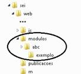

b)  criar uma classe que estenda a classe `SeiIntegracao` do core do SEI e implemente os métodos `getNome`, `getVersao` e `getInstituicao`. Exemplo:

```php
class AbcExemploIntegracao extends SeiIntegracao{

  public function getNome(){
    return 'Módulo de exemplos ABC';
  }

  public function getVersao() {
    return '1.0.0';
  }

  public function getInstituicao(){
    return 'TRF4 - Tribunal Regional Federal da 4ª Região';
  }
}
```

A classe acima exemplificada deve ser salva em um arquivo com o mesmo nome. No exemplo acima, ficaria `AbcExemploIntegracao.php`.

c)  adicionar no arquivo de configuração do sistema `ConfiguracaoSEI.php` na chave `Modulos` a referência para o nome da classe e para o diretório onde ela se encontra:

```php
'SEI' => array(....
              'Modulos' => array('AbcExemploIntegracao' => 'abc/exemplo')
                ),
```

d)  verificar se o módulo foi carregado por meio do menu Infra/Módulos do SEI:


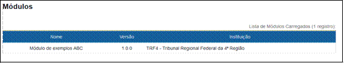

# 3. Considerações Prévias

Antes de iniciar a construção de um módulo é necessário conhecer o funcionamento básico do SEI com relação ao controle de Perfis, Recursos, Menus e Auditoria geridos pelo Sistema de Permissões (SIP) e questões relacionadas com o controle de Conexões e Transações, Andamentos e Classes do Sistema.

## Restrições do Ambiente

O desenvolvimento de módulos deve considerar as restrições do ambiente definidas para a instalação do SEI, pois elas impactam diretamente a implementação de telas, processamentos e integrações.

### Dependências técnicas do projeto

Além do uso do framework PHP padrão do sistema, existem algumas dependências técnicas importantes que o desenvolvedor deve observar:

- Sistema Operacional Linux;
- PHP 8.2 e extensões adicionais previstas no manual de instalação;
- Bootstrap 5.3.1;
- jQuery 3.7.0; e
- jQuery UI 1.13.2.

### Codificação de arquivos (charset)

Os arquivos textuais do módulo devem ser salvos em `ISO-8859-1`, mantendo compatibilidade com o charset configurado no servidor PHP. Não se deve assumir `UTF-8` como padrão implícito do projeto. Em caso de acentuação incorreta nas telas, deve verificar se a codificação do arquivo ou se o default_charset do PHP estão corretos, usando `ISO-8859-1`.

### Limites de upload

O tamanho máximo de upload aceito pelo ambiente deve respeitar a configuração do servidor. Como referência da instalação padrão, temos:

- `upload_max_filesize` = 200M
- `post_max_size` = 201M

O valor de `post_max_size` deve ser ligeiramente maior que `upload_max_filesize`. Além disso, o módulo deve manter coerência com o **parâmetro `SEI_TAM_MB_DOC_EXTERNO`** configurado no SEI como um todo e com os valores específicos por extensão de arquivo configurados no menu **Administração > Extensões de Arquivos Permitidas**. Portanto, não se deve implementar funcionalidades sem observar os mencionados limites configurados no SEI para upload de arquivos.

## Perfis, Recursos e Menus

Todas as operações realizadas no SEI estão atreladas a **recursos** cadastrados no SIP. Os recursos podem ou não estar associados com itens de **menu**. Os recursos e itens de menu são **agrupados em perfis** que são então liberados para os usuários **por meio das permissões**.

Os itens de menu serão montados automaticamente no login do usuário no SEI, mas outros elementos associados com recursos (como botões e ícones) devem ser tratados via programação.

- Ver seção **Classes do Sistema**, classe **SessaoSEI**, método **verificarPermissao**.

A seguir são demonstrados os passos para adicionar um item de menu em um novo perfil.

1\) criar o recurso no SIP pelo menu Recursos/Novo, sendo recomendado que recursos de módulos tenham o prefixo ``MD_<instituição/módulo>``:

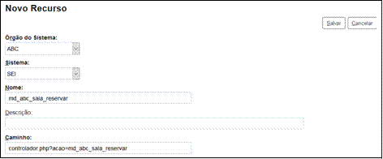


2\) adicionar item de menu associado com o recurso no SIP pelo menu Menus/Montar:

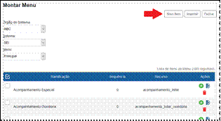


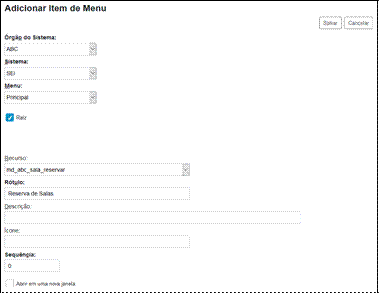


Para associar um ícone com o item de menu é necessário implementar no módulo o evento `obterDiretorioIconesMenu`, colocar o arquivo SVG do ícone no diretório correspondente aos ícones de menu do módulo e informar apenas o nome do arquivo SVG no campo `Ícone` na tela de cadastro de item de menu acima.

3\) criar um perfil específico no SIP pelo menu Perfis/Novo, sendo recomendado que perfis de módulos tenham o prefixo ``MD_<instituição/módulo>``:

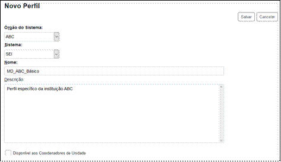


4\) Adicionar o recurso e o item de menu no perfil no SIP pelo menu Perfis/Montar:


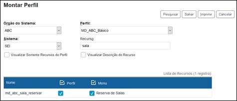

5\) atribuir permissão no perfil criado no SIP pelo menu Permissão/Nova:

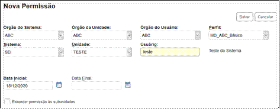


6\) O item de menu criado deve aparecer no SEI. Alterações na montagem de perfis e na atribuição de permissões no SIP demandam novo login do usuário que já esteja logado no SEI:


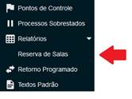

As telas de usuário externo e pesquisa de publicações não recebem itens de menu geridos pelo SIP. Entretanto, é possível adicionar itens através dos eventos `montarMenuUsuarioExterno` e `montarMenuPublicacoes`.

- Ver seção **Eventos**.

## Auditoria

Para utilizar o mecanismo de auditoria é necessário:

a\) criar uma regra de auditoria no SIP e adicionar o recurso que pretende gravar trilhas de auditoria de operação, sendo recomendado que as regras de módulos tenham o prefixo ``MD_<instituição/módulo>``;


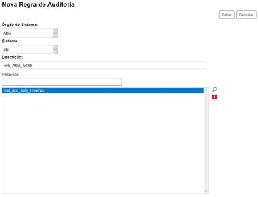

b\) No método da camada de regra de negócio que realiza a operação no módulo no SEI deve incluir uma chamada para `validarAuditarPermissao`, que recebe como parâmetros o nome do recurso, o nome do método e os valores associados que devem ser gravados na tabela de auditoria. Esse método também lançará um erro de acesso negado ao recurso se o usuário não tiver permissão. Se o recurso não fizer parte de nenhuma regra de auditoria, então apenas a validação de permissão será realizada.

```php
protected function lancarAndamentosControlado($arrParametros){
  try{

    SessaoSEI::getInstance()->validarAuditarPermissao('md_abc_andamento_lancar', __METHOD__, $arrParametros);

    //processamento

  }catch(Exception $e){
    throw new InfraException('Erro lançando andamentos do módulo ABC.',$e);
  }
}
```

As operações auditadas poderão ser consultadas no SEI pelo menu Infra/Auditoria.

## Conexões e Transações

O controle das conexões e transações no banco de dados pode ser feito manipulando diretamente o objeto `BancoSEI::getInstance()` ou utilizando os sufixos `Conectado` e `Controlado`.

- Ver mais detalhes na seção **Classes do Sistema**, classe **BancoSEI**; e na seção **InfraPHP**, classe **InfraRN**.

Se o módulo realizar processamento de operações no sistema como, por exemplo, geração de processos e inclusão de documentos então será obrigatório utilizar um dos controles descritos abaixo.

### Controle manual de conexões e transações

Para controle manual, basta chamar os métodos diretamente do objeto de banco. Exemplo:

```php
class MdAbcTesteRN {

  public function processarXXXXX($a, $b){
    try{

      BancoSEI::getInstance()->abrirConexao();
      BancoSEI::getInstance()->abrirTransacao();

      //executa comandos

      BancoSEI::getInstance()->confirmarTransacao();
      BancoSEI::getInstance()->fecharConexao();

    }catch(Exception $e){

      try{
        BancoSEI::getInstance()->cancelarTransacao();
      }catch(Exception $e2){}

      try{
        BancoSEI::getInstance()->fecharConexao();
      }catch(Exception $e2){}

      throw new InfraException('Erro processando operação XXXXX no módulo ABC.',$e);

    }
  }
}
```

**Atenção:** Pode ser um problema quando existirem chamadas entre métodos que precisam abrir conexões/transações de forma isolada ou em conjunto. Nesse caso é necessário implementar um mecanismo de controle auxiliar para saber se a conexão ou transação já foi aberta.

### Controle automático de conexões e transações

O controle automático pode ser feito utilizando os sufixos reservados:

- **`Conectado`**: abre uma conexão se já não estiver aberta; e
- **`Controlado`**: abre uma conexão e uma transação se já não estiverem abertas.

A chamada entre métodos é transparente mantendo o escopo da conexão ou transação. Para utilizar esse mecanismo deve:

1\) criar uma classe filha de `InfraRN`;

2\) implementar o método `inicializarObjInfraIBanco` retornado a instância do banco de dados;

3\) criar um método `protected` com o sufixo Conectado ou Controlado;

4\) esse método não aceita múltiplos parâmetros, então deve ser utilizado um objeto DTO ou um array encapsulador.

Utilizando esse mecanismo após a primeira chamada a um método `Conectado` ou `Controlado` a conexão ficará aberta até o final da execução do script. Transações vão respeitar o mesmo escopo do método, sendo confirmadas no final da execução do método ou canceladas caso uma exceção seja lançada.

```php
class MdAbcTesteRN extends InfraRN {

  protected function inicializarObjInfraIBanco(){
    return BancoSEI::getInstance();
  }

  protected function processarXXXXXControlado($arrParametros){
    try{
      //executa comandos
    }catch(Exception $e){
      throw new InfraException('Erro processando operação XXXXX no módulo ABC.',$e);
    }
  }
}
```

Atenção para o uso desses sufixos em construções como a exemplificada abaixo, pois isso pode causar inconsistências em caso de erro e também problemas de desempenho:

```php
protected function processarTudoConectado(){ //abre apenas conexão

  $arr = $this->buscarItensBanco();

  foreach($arr as $itens){
    $this->processarXXXXX($itens);
    //abre e fecha uma transação PARA CADA elemento do array
  }
}
```

No exemplo acima, se houver erro durante o processamento, parte dos itens pode já ter sido gravada no banco, comprometendo a consistência da operação como um todo. Nesses casos, deve-se analisar se o método **processarTudo** deveria ser **Controlado**, de forma a garantir uma única transação para todo o processamento. Além disso, as **transações devem proteger exclusivamente a persistência principal dos dados.**

Ainda, não se deve colocar dentro da transação ações que não sejam necessárias para salvar os dados no banco. Por exemplo: envio de e-mail, chamada para outro sistema, processamento demorado ou tarefas auxiliares. Sempre que der, essas ações devem acontecer **apenas depois que a transação principal terminar** com sucesso.

### Transações de informações utilizando a operação GerarProcedimento

Quando for executar uma transação de inserção utilizando a operação **GerarProcedimento** da API, é necessário organizar o método para separar responsabilidades.

No exemplo abaixo, a função originalmente marcada como **Controlado** deve atuar apenas como orquestradora do fluxo, enquanto a lógica de persistência em banco deve constar em um método interno (gerarProcedimentoInterno no depois do exemplo abaixo). O envio de e-mails não deve ocorrer dentro da transação. Igualmente, a indexação do Solr deve ser acumulada durante a transação e executada apenas após sua finalização.

Essa abordagem evita gargalos, reduz o tempo de lock no banco e melhora a performance geral da operação.

**Código de exemplo - antes:**

```php
protected function gerarProcedimentoControlado($arrParametros)
{
  // gerarProcedimento + envio de e-mails + indexação Solr
}
```
**Código de exemplo - depois**, com separação entre persistência e efeitos colaterais:

```php
protected function gerarProcedimentoControlado($arrParametros)
{
  // Acumula indexações do Solr durante a transação
  FeedSEIProtocolos::getInstance()->setBolAcumularFeeds(true);

  // Executa apenas a persistência em banco
  $retorno = $this->gerarProcedimentoInterno($arrParametros);

  // Executa indexação após a transação
  FeedSEIProtocolos::getInstance()->setBolAcumularFeeds(false);
  FeedSEIProtocolos::getInstance()->indexarFeeds();

  // Executa envio de e-mails fora da transação
  try {
    $rn = new MdPetEmailNotificacaoRN();
    $rn->notificaoPeticionamentoExterno($retorno['parametrosEmail']);
  } catch (Exception $e) {}

  return $retorno['parametrosRecibo'];
}

protected function gerarProcedimentoInterno($arrParametros)
{
  // Apenas operações de banco
}
```

## Andamentos

Os andamentos representam os registros exibidos no histórico dos processos. Os andamentos podem ter variáveis que serão substituídas por atributos informados no momento do lançamento. Cada andamento está associado com um registro de tarefa que indica o tipo do andamento.

Tarefas com identificador menor que 1000 são reservadas do core do SEI.

A única tarefa reservada do core do SEI que um módulo pode lançar é a de ID_TAREFA=65, que representa uma atualização do andamento com texto livre (nesse caso, informar um atributo com NOME='DESCRICAO' e VALOR='texto do andamento').

Tarefas de módulos podem ser cadastradas com o comando abaixo:

```sql
INSERT INTO tarefa (
       id_tarefa,
       nome,
       sin_historico_resumido,
       sin_historico_completo,
       sin_lancar_andamento_fechado,
       sin_permite_processo_fechado,
       sin_fechar_andamentos_abertos,
       id_tarefa_modulo)
VALUES (
       ' . BancoSEI::getInstance()->getValorSequencia('seq_tarefa') . ',
       'Audiência agendada no prédio @PREDIO@ (sala @SALA@)',
       'S',
       'S',
       'N',
       'S',
       'S',
       'MD_ABC_AUDIENCIA_REALIZADA')/
```

Onde:

- **id_tarefa**

Deve ser maior ou igual a 1000. Se a inserção for realizada sem a chamada ao método `getValorSequencia('seq_tarefa')`, então é necessário buscar o maior ID da tabela de tarefas:

```sql
select max(id_tarefa)+1 from tarefa
```

Se o valor retornado for maior ou igual a 1000, utilizar o valor retornado. Caso contrário, utilizar 1000. Depois precisa atualizar a sequência `seq_tarefa` para retornar à ordem padrão:

\- MySQL:

```sql
alter table seq_tarefa AUTO_INCREMENT = [último valor utilizado]
```

\- SQL Server:

```sql
DBCC CHECKIDENT ('seq_tarefa', RESEED, [último valor utilizado])
```

\- Oracle:

```sql
drop sequence seq_tarefa;
CREATE SEQUENCE seq_tarefa START WITH [último valor utilizado] INCREMENT BY 1
NOCACHE NOCYCLE
```

\- PostgreSQL:

```sql
CREATE SEQUENCE seq_tarefa INCREMENT BY 1 START WITH [último valor utilizado]
```

- `nome`

Representa o texto que será exibido no andamento. É possível utilizar variáveis no texto, que devem ter o valor informado por meio de **atributos** ao lançar o andamento. Para o texto `Audiência agendada no prédio @PREDIO@ (sala @SALA@)` é necessário informar o valor das variáveis `@PREDIO@` e `@SALA@`.

Exemplo:

```php
$objEntradaLancarAndamentoAPI = new EntradaLancarAndamentoAPI();
$objEntradaLancarAndamentoAPI->setIdProcedimento(10000000012057);
$objEntradaLancarAndamentoAPI->setIdTarefaModulo('MD_ABC_AUDIENCIA_REALIZADA');

$arrObjAtributoAndamentoAPI = array();

$objAtributoAndamentoAPI = new AtributoAndamentoAPI();
$objAtributoAndamentoAPI->setNome('PREDIO');
$objAtributoAndamentoAPI->setValor('101');
$objAtributoAndamentoAPI->setIdOrigem(54); //ID do prédio, pode ser null
$arrObjAtributoAndamentoAPI[] = $objAtributoAndamentoAPI;

$objAtributoAndamentoAPI = new AtributoAndamentoAPI();
$objAtributoAndamentoAPI->setNome('SALA');
$objAtributoAndamentoAPI->setValor('3A');
$objAtributoAndamentoAPI->setIdOrigem(9334); //ID da sala, pode ser null
$arrObjAtributoAndamentoAPI[] = $objAtributoAndamentoAPI;

$objEntradaLancarAndamentoAPI->setAtributos($arrObjAtributoAndamentoAPI);

$objSeiRN = new SeiRN();

$objSeiRN->lancarAndamento($objEntradaLancarAndamentoAPI);
```

Algumas variáveis de andamento são reservadas do sistema, mas podem ser utilizadas pelos módulos desde que as informações sejam devidamente preenchidas nos atributos:

| Nome | Valor | IdOrigem | Observação |
|---|---|---|---|
| DOCUMENTO | Número do documento | ID do documento | Gera link para o documento |
| DOCUMENTOS | Null | null | Será substituída pelos links de todos os documentos informados nos atributos DOCUMENTO associados ao andamento, separados por vírgula (agrupador) |
| NIVEL_ACESSO | null | 0 = Público<br>1 = Restrito<br>2 = Sigiloso |  |
| GRAU_SIGILO | null | U = Ultrassecreto<br>S = Secreto<br>R = Reservado |  |
| HIPOTESE_LEGAL | null | ID da hipótese legal |  |
| VISUALIZACAO |  | I = Integral<br>P = Parcial<br>N = Nenhum | Liberação de acesso externo |
| DATA_AUTUACAO | Data no formato dd/mm/aaaa | Null |  |
| TIPO_CONFERENCIA | null | ID do tipo de conferência |  |
| PROCESSO | Número do processo | ID do processo | Gera link para o processo |
| USUARIO | `[sigla]¥[Nome]` | ID do usuário |  |
| USUARIOS | Null | null | Será substituída por todos os atributos USUARIO associados ao andamento, separados por vírgula (agrupador) |
| UNIDADE | `[sigla]¥[Descrição]` | ID da unidade |  |
| ORGAO | `[sigla]¥[Descrição]` | ID do órgão |  |
| BLOCO | ID do bloco | ID do bloco |  |
| DATA_HORA | Data/hora no formato dd/mm/aaaa H:M:S | ID da atividade | Processos sigilosos |
| USUARIO_ANULACAO | `[sigla]¥[nome]` | ID da atividade | Processos sigilosos |
| INTERESSADO | `[sigla]¥[nome]` | ID do participante |  |
| LOCALIZADOR | Identificação do localizador | ID do localizador |  |
| ANEXO | Nome do anexo | ID do anexo |  |

- **`sin_historico_resumido`**

S/N -- Indica se o andamento será exibido no histórico resumido.

- **`sin_historico_completo`**

S/N -- Indica se o andamento será exibido no histórico completo.

- **`sin_lancar_andamento_fechado`**

S/N -- Indica se o andamento deverá ser lançado como aberto ou concluído. Andamento aberto aparece em amarelo na consulta do histórico, informando a última atividade realizada na unidade. Se o módulo tentar lançar um andamento aberto em processo concluído na unidade o sistema lançará um erro Processo X não possui andamento aberto na unidade Y. Para evitar esse erro ver configuração do sinalizador sin_permite_processo_fechado. Mas é importante verificar se não existe uma falha na lógica do módulo, pois talvez seja necessário reabrir o processo automaticamente ao invés de permitir o lançamento concluído. Se o processo estiver concluído e o andamento for lançado como concluído então ninguém na unidade perceberá que ocorreu alteração no histórico.

- **`sin_permite_processo_fechado`**

S/N -- Indica se permite lançar o andamento em processo concluído na unidade. Se o módulo tentar lançar um andamento aberto e o processo estiver concluído na unidade, então poderá lançar automaticamente como andamento concluído.

- **`sin_fechar_andamentos_abertos`**

S/N -- Indica se os registros de andamento em aberto na unidade devem ser concluídos. Se o processo estará aberto na unidade na hora do lançamento então utilizar o valor S. Dessa forma apenas o novo andamento ficará em amarelo no histórico de processo indicando a última atividade.

- **`id_tarefa_modulo`**

Identificador da tarefa para o módulo com até 50 caracteres maiúsculos. Utilizar o prefixo ``MD_<instituição/módulo>``. Possibilita lançar/consultar andamentos do módulo sem a necessidade de conhecer o ID interno da tarefa, que pode ser diferente em outra instalação. Não devem existir valores duplicados para esse campo. Exemplo: MD_ABC_AUDIENCIA_REALIZADA

## Classes do Sistema

### SessaoSEI

Fornece acesso aos dados da sessão do usuário no SEI. Os atributos configurados pelo módulo podem ser consultados por meio do menu **Infra/Atributos de Sessão** (necessária permissão no perfil Informática). Essa classe implementa o padrão de projeto `Singleton`, então na programação sempre deve acessar o objeto por meio do método estático `getInstance()`.

- Não é recomendado acessar diretamente o array `$_SESSION` do PHP.

Métodos de informações disponíveis na classe do sistema `SessaoSEI`:

| Método | Descrição |
|---|---|
| getNumIdUsuario() | ID do usuário no SIP |
| getStrIdOrigemUsuario() | ID Origem associado com o usuário no SIP |
| getStrSiglaUsuario() | Sigla do Usuário |
| getStrNomeUsuario() | Nome do Usuário |
| getNumIdOrgaoUsuario() | ID do órgão do usuário |
| getStrSiglaOrgaoUsuario() | Sigla do órgão do usuário |
| getStrDescricaoOrgaoUsuario() | Descrição do órgão do usuário |
| getNumIdUnidadeAtual() | ID da unidade atual de trabalho |
| getStrIdOrigemUnidadeAtual() | ID Origem associado com a unidade atual de trabalho no SIP |
| getStrSiglaUnidadeAtual() | Sigla da unidade atual de trabalho |
| getStrDescricaoUnidadeAtual() | Descrição da unidade atual de trabalho |
| getNumIdOrgaoUnidadeAtual() | ID do órgão da unidade atual de trabalho |
| getStrSiglaOrgaoUnidadeAtual() | Sigla do órgão da unidade atual de trabalho |
| getStrDescricaoOrgaoUnidadeAtual() | Descrição do órgão da unidade atual de trabalho |

Outros métodos disponíveis na classe do sistema SessaoSEI:

- **`assinarLink($strLink)`**

Assina um link associado com a sessão do usuário, evitando alteração nos parâmetros. Se ocorrer alteração nos parâmetros um erro de hash inválido será lançado, redirecionando o usuário para a tela de login.

```php
$strLinkAssinado = SessaoSEI::getInstance()->assinarLink('controlador.php?acao=...');
```

- **`validarLink($strLink=null)`**

Valida assinatura do link e se não for válido automaticamente lança um erro de `Hash inválido` e redireciona o usuário para a tela de login. Se o parâmetro não for informado então irá validar o link da página atual. É utilizado normalmente na entrada de páginas, garantindo que o usuário acessou a tela por um link válido.

```php
SessaoSEI::getInstance()->validarLink();
```

- **`verificarLink($strLink=null)`**

Realiza o mesmo comportamento do método **`validarLink`** acima, retornando true/false ao invés de lançar um erro e redirecionar para o login.

- **`validarPermissao($strNomeRecurso)`**

Verifica se o usuário tem acesso ao recurso informado. Se o usuário não tiver acesso ao recurso será lançado o erro Acesso negado a este recurso nesta unidade. Utilizado normalmente na entrada de páginas para validar se o usuário tem acesso ao recurso apontando pelo parâmetro acao da URL.

```php
SessaoSEI::getInstance()->validarPermissao($_GET['acao']);
```

- **`verificarPermissao($strNomeRecurso)`**

Realiza o mesmo comportamento do método **`validarPermissao`** acima, retornando true/false ao invés de lançar um erro. Utilizado para montar componentes na interface, como botões e ícones, e para validar a permissão nos métodos das classes de Regra de Negócio.

```php
if (SessaoSEI::getInstance()->verificarPermissao('md_abc_andamento_lancar'))
{
  //monta botão correspondente
}
```

- **`setAtributo($strNome, $strValor)`**

Configura um atributo na sessão do usuário. Para evitar nomes duplicados utilizar o prefixo ``MD_<instituição/módulo>`` no nome do atributo.

```php
SessaoSEI::getInstance()->setAtributo('MD_ABC_ATRIBUTO_SESSAO',$strValor);
```

- **`getAtributo($strNome)`**

Recupera um atributo da sessão do usuário.

```php
$strValor = SessaoSEI::getInstance()->getAtributo('MD_ABC_ATRIBUTO_SESSAO');
```

- **`isSetAtributo($strNome)`**

Verifica se um atributo consta na sessão do usuário, retornando true/false.

```php
if
(SessaoSEI::getInstance()->isSetAtributo('MD_ABC_ATRIBUTO_SESSAO')){
}
```

- **`removerAtributo($strNome)`**

Remove um atributo da sessão do usuário.

```php
SessaoSEI::getInstance()->removerAtributo('MD_ABC_ATRIBUTO_SESSAO');
```

### CacheSEI

Fornece acesso ao servidor de cache em memória (**memcache**). Os atributos podem ser consultados por meio do menu **Infra/Cache em Memória**, sendo necessária permissão no perfil `Informática`. Essa classe implementa o padrão de projeto **`Singleton`**, então na programação sempre deve acessar o objeto por meio do método estático `getInstance()`.

Métodos disponíveis na classe do sistema `CacheSEI`:

- **`setAtributo($strChave, $strValor, $numTempo)`**

Adiciona um atributo no servidor memcache, onde:

| $strChave | Nome do atributo, utilizando com o prefixo `MD_<instituição/módulo>` para evitar nomes duplicados. |
|---|---|
| $strValor | Valor do atributo diferente de nulo. |
| $numTempo | Tempo que o atributo deve ficar na cache. Utilizar CacheSEI::getInstance()->getNumTempo() para obter o valor configurado na chave CacheSEI/Tempo do arquivo ConfiguracaoSEI.php (se a chave não for definida no arquivo de configuração, então será retornado o valor padrão do sistema 3600 = 1 hora). |

```php
CacheSEI::getInstance()->setAtributo('MD_ABC_ATRIBUTO_MEMCACHE', $strValor, CacheSEI::getInstance()->getNumTempo());
```

- **`getAtributo($strChave)`**

Recupera um atributo no servidor memcache, retornando nulo se não encontrar.

```php
$strValor =
CacheSEI::getInstance()->getAtributo('MD_ABC_ATRIBUTO_MEMCACHE');
```

### InfraParametro

Permite ler/gravar parâmetros na tabela `infra_parametro` (menu **Infra/Parâmetros**). Ao criar o objeto deve ser passada a instância do banco de dados:

```php
$objInfraParametro = new InfraParametro(BancoSEI::getInstance());
```

Métodos disponíveis na classe do sistema InfraParametro:

- **`setValor($strNome, $strValor)`**

Configura o valor de um parâmetro. Se o parâmetro não existir será criado e se já existir será atualizado. Para evitar nomes duplicados deve utilizar o prefixo `MD_<instituição/módulo>`.

```php
$objInfraParametro->setValor('MD_ABC_ID_SERIE_TESTE', '601');
```

- **`getValor($strNome, $bolErroNaoEncontrado=true)`**

Retorna o valor de um parâmetro ou nulo se não encontrar. O segundo parâmetro do método é opcional e indica se deve ser lançado um erro caso o parâmetro não exista na tabela.

```php
$numIdSerieAbc = $objInfraParametro->getValor('MD_ABC_ID_SERIE_TESTE');
```

- **`isSetValor($strNome)`**

Verifica se um parâmetro existe na tabela retornando true/false. O valor do parâmetro não é analisado, ou seja, ele pode existir, mas estar vazio.

```php
if ($objInfraParametro->isSetValor('MD_ABC_ID_SERIE_TESTE')){

}
```

- **`listarValores($arrNomes, $bolErroNaoEncontrado=true)`**

Retorna conjunto de parâmetros informados no array de entrada. O segundo parâmetro do método é opcional e indica se deve ser lançado um erro caso algum parâmetro não exista na tabela. O array de retorno é indexado pelo nomes dos parâmetros.

```php
$arrSeries = $objInfraParametro->listarValores(array('MD_ABC_PAR1', 'MD_ABC_PAR2'));
```

### LogSEI

Permite gravar registros na tabela `infra_log` (menu **Infra/Log**). Essa classe implementa o padrão de projeto `Singleton`, então na programação sempre deve acessar o objeto por meio do método estático `getInstance()`.

Métodos disponíveis na classe do sistema `LogSEI`:

- **`gravar($strTexto, $strStaTipo='E')`**

Grava o texto informado na tabela `infra_log` (não pode ser vazio). O segundo parâmetro é opcional e indica o tipo do registro de log. Utilizar uma das constantes abaixo:

- InfraLog::$ERRO (default)
- InfraLog::$AVISO
- InfraLog::$INFORMACAO
- InfraLog::$DEBUG

```php
LogSEI::getInstance()->gravar('abc teste log',InfraLog::$INFORMACAO);
```

### InfraDebug

Permite ler/gravar informações de debug, armazenando os registros na sessão, sendo assim mantidos entre chamadas do sistema. Essa classe implementa o padrão de projeto `Singleton`, então na programação sempre deve acessar o objeto por meio do método estático `getInstance()`.

Utilizando o `InfraPHP` para realizar debug nas telas do sistema deve configurar no início da execução as opções desejadas:

```php
InfraDebug::getInstance()->setBolLigado(true);
InfraDebug::getInstance()->setBolDebugInfra(true);
InfraDebug::getInstance()->limpar();
```

No final deve retirar o comentário do método que monta a área de debug para visualização:

```php
PaginaSEI::getInstance()->montarAreaDebug();
```

**Atenção**: não pode esquecer de desligar o debug após sua utilização, pois poderá comprometer o desempenho e a segurança do sistema.

Métodos disponíveis na classe do sistema `InfraDebug`:

- **`gravar($strTexto)`**

Grava um registro de debug na sessão.

```php
InfraDebug::getInstance()->gravar('Valor encontrado: '.$n);
```

- **`limpar()`**

Remove todos os registros que foram gravados no debug.

```php
InfraDebug::getInstance()->limpar();
```

- **`getStrDebug()`**

Recupera todos os registros que foram gravados no debug.

```php
$strDebug = InfraDebug::getInstance()->getStrDebug();
```

- **`setBolLigado($bolLigado)`**

Recebe true/false indicando se as chamadas ao método gravar devem ser processadas ou ignoradas.

```php
InfraDebug::getInstance()->setBolLigado(true);
```

- **`setBolDebugInfra($bolDebugInfra)`**

Recebe true/false indicando se deve registrar textos de debug gerados automaticamente pelo **`InfraPHP`** contendo, por exemplo, os SQLs executados.

```php
InfraDebug::getInstance()->setBolDebugInfra(true);
```

- **`setBolEcho($bolEcho)`**

Recebe true/false indicando se na chamada do método `gravar` deve ser feito um `echo` automaticamente do conteúdo.

```php
InfraDebug::getInstance()->setBolEcho(true);
```

### ConfiguracaoSEI

Permite ler informações do arquivo de configurações do sistema `ConfiguracaoSEI.php`. Essa classe implementa o padrão de projeto **`Singleton`**, então na programação sempre deve acessar o objeto por meio do método estático `getInstance()`.

- **`getValor($strGrupo, $strChave=null, $bolErroNaoEncontrado=true, $strValorPadrao=null)`**

Recupera o valor associado com a chave no arquivo de configuração, onde:

| $strGrupo | Nome do grupo com o prefixo `MD_<instituição/módulo>` para evitar nomes duplicados. |
|---|---|
| $strChave | Opcional. Nome da chave dentro do grupo. |
| bolErroNaoEncontrado | Opcional (valor padrão true). Indica se deve ser lançado um erro caso a configuração não exista. |
| strValorPadrao | Opcional. Informa o valor padrão para retorno se a configuração não existir. |

```php
$strServidor = ConfiguracaoSEI::getInstance()->getValor('MD_ABC_Banco','Servidor');
```

- **`isSetValor($strGrupo, $strChave)`**

Retorna true/false indicando se uma configuração existe no arquivo de configuração. O valor da configuração não é analisado, ou seja, ela pode existir, mas estar vazia.

```php
if (ConfiguracaoSEI::getInstance()->isSetValor('MD_ABC_Banco','Servidor')) {

}
```

### BancoSEI

Fornece acesso ao banco de dados. Essa classe implementa o padrão de projeto Singleton, então na programação sempre deve acessar o objeto por meio do método estático getInstance().

- **`abrirConexao()`**

Abre conexão com o banco de dados.

```php
BancoSEI::getInstance()->abrirConexao();
```

- **`fecharConexao()`**

Fecha conexão com o banco de dados.

```php
BancoSEI::getInstance()->fecharConexao();
```

- **`getIdConexao()`**

Retorna um identificador da conexão ou nulo. Esse identificador não representa um recurso de conexão do PHP, ou seja, não pode ser utilizado em chamadas diretas da extensão do banco de dados utilizado. Por **questões de segurança** o recurso de conexão é privado e controlado pela classe de banco de dados do framework `InfraPHP`.

```php
If (BancoSEI::getInstance()->getIdConexao()==null){
  BancoSEI::getInstance()->abrirConexao();
}
```

- **`abrirTransacao()`**

Inicia uma transação.

```php
BancoSEI::getInstance()->abrirTransacao();
```

- **`confirmarTransacao()`**

Confirma uma transação (commit).

```php
BancoSEI::getInstance()->confirmarTransacao();
```

- **`cancelarTransacao()`**

Cancela uma transação (rollback).

```php
BancoSEI::getInstance()->cancelarTransacao();
```

- **`consultarSql($strSql)`**

Executa no banco de dados a consulta SQL recebida, retornando um array com os registros retornados.

```php
$rs = BancoSEI::getInstance()->consultarSql('select nome, valor
from infra_parametro where nome like \'SEI_%\' order by nome asc');

Array
(
  [0] => Array
    (
      [nome] => SEI_HABILITAR_AUTENTICACAO_DOCUMENTO_EXTERNO
      [valor] => 2
    )
  [1] => Array
    (
      [nome] => SEI_HABILITAR_GRAU_SIGILO
      [valor] => 1
    )
  [2] => Array
    (
      [nome] => SEI_HABILITAR_HIPOTESE_LEGAL
      [valor] => 1
    )
  ...
)
```

- **`executarSql($strSql, $arrCamposBind=null)`**

Executa no banco de dados o comando SQL recebido, retornando o número de registros afetados. O parâmetro $arrCamposBind é utilizado apenas em bases de dados Oracle, sendo um array indexado pelos nomes dos campos CLOB para bind.

```php
BancoSEI::getInstance()->executarSql('update infra_parametro set valor =\'2\' where nome=\'SEI_HABILITAR_HIPOTESE_LEGAL\'');
```

### InfraErroPHP

No PHP 8 várias situações que antes geravam apenas Notices passaram a gerar Warnings. Por exemplo, ao acessar uma posição de array que ainda não existe. Isso provocará um erro no sistema que antes não acontecia.

A classe `InfraErroPHP` trata essas situações, permitindo controlar o que o sistema deve fazer (ignorar, registrar em uma tabela ou lançar uma exceção).

Constantes de erro:

```php
InfraErroPHP::$W_UNDEFINED_ARRAY_KEY
InfraErroPHP::$W_UNDEFINED_VARIABLE
InfraErroPHP::$W_UNDEFINED_PROPERTY
InfraErroPHP::$W_ATTEMPT_TO_READ_PROPERTY
InfraErroPHP::$W_TRYING_TO_ACCESS_ARRAY_OFFSET
InfraErroPHP::$W_ARRAY_TO_STRING_CONVERSION
InfraErroPHP::$W_RESOURCE_USED_AS_OFFSET_CASTING_TO_INTEGER
InfraErroPHP::$W_STRING_OFFSET_CAST_OCCURRED
InfraErroPHP::$W_UNINITIALIZED_STRING_OFFSET
InfraErroPHP::$W_CANNOT_ACCESS_OFFSET_OF_TYPE_STRING_ON_STRING
InfraErroPHP::$W_ARGUMENT_MUST_BE_PASSED_BY_REFERENCE
InfraErroPHP::$W_A_NON_NUMERIC_VALUE_ENCOUNTERED
```

Constantes de tratamento:

```php
InfraErroPHP::$T_LANCAR_EXCECAO
InfraErroPHP::$T_IGNORAR
InfraErroPHP::$T_REGISTRAR
InfraErroPHP::$T_CONTABILIZAR
```

Por padrão, o SEI ignora os erros `$W_UNDEFINED_ARRAY_KEY`, `$W_UNDEFINED_VARIABLE`, `$W_UNDEFINED_PROPERTY` e `$W_TRYING_TO_ACCESS_ARRAY_OFFSET`. Os demais passarão a lançar erros.

É possível sobrescrever esse comportamento no ambiente de desenvolvimento, adicionando a chave `InfraErroPHP` no arquivo `ConfiguracaoSEI.php`. Exemplo:

```php
'InfraErroPHP' =>
  array(
    InfraErroPHP::$W_UNDEFINED_PROPERTY => InfraErroPHP::$T_REGISTRAR,
    InfraErroPHP::$W_STRING_OFFSET_CAST_OCCURRED => InfraErroPHP::$T_IGNORAR
  ),
```

Quando o tratamento `InfraErroPHP::$T_REGISTRAR` for utilizado, o erro será gravado na tabela `infra_erro_php` e poderá ser consultado por meio do menu **Infra/Erros do PHP**. O erro é gravado apenas uma vez, desde que não ocorra alteração nas linhas de código (gerando novo registro). O tratamento `InfraErroPHP::$T_CONTABILIZAR` possui comportamento semelhante ao de registro, mas contabilizando a quantidade de vezes que o erro ocorreu. Por enquanto, ainda é possível esse tipo de tratamento, mas as versões futuras do PHP prometem gerar erros para essas situações.

# 4. InfraPHP

## Visão Geral

A arquitetura propõe a separação em múltiplas camadas, denominadas: **Cliente**, **RN** e **BD**. Cada camada possui um conjunto definido de responsabilidades:

- **Cliente**
  - Interação com o usuário ou outros sistemas.
  - Validações simples que não necessitem acesso a dados.
- **RN**
  - Controle de transação.
  - Validação de permissões.
  - Auditoria.
  - Validação das regras de negócio.
- **BD**
  - Persistência.
  - Recuperação de dados.

Além disso, devem ser respeitadas as seguintes regras:

- Toda a comunicação ocorre somente entre RNs, garantindo que sempre serão executadas as permissões de acesso, regras de negócio e auditoria;
- Uma RN não pode chamar uma BD de outra classe;
- Não deve ocorrer comunicação direta entre BDs; e
- Uma BD não pode persistir ou atualizar dados em mais de uma tabela.

## InfraDTO

Para comunicação entre as camadas foi adotado o padrão de projeto **DTO** (`Data Transfer Object`), que consiste basicamente em passar apenas um objeto nas chamadas de métodos. Assim, por exemplo, na inserção de um documento, ao invés de passar todos os valores necessários como parâmetros individuais para o método de inserção, é criada uma classe para transporte denominada DocumentoDTO. Essa classe contém atributos para todos os valores envolvidos. Para inserir um documento deve ser instanciado um objeto dessa classe, sendo preenchidos os atributos com os valores correspondentes. Após essa etapa o objeto de transporte deve ser passado para o método de inserção.

Todo o tráfego **entre as camadas** deve ser feito utilizando DTOs. Essa abordagem reduz acoplamento, melhora a legibilidade do código e preserva compatibilidade com os bancos de dados suportados pelo sistema.

O framework estendeu o conceito original para permitir que o DTO seja uma fonte de informações do modelo de dados, que possibilite a geração automática de instruções SQL. Para isso, todos os DTOs deverão herdar da classe InfraDTO, implementando alguns métodos abstratos. Ao realizar esse procedimento a classe InfraDTO passará a fornecer automaticamente o seguinte conjunto de métodos:

| Método | Descrição |
|---|---|
| set\<atributo> | Configura o valor do atributo. A configuração do valor do atributo terá reflexos na operação que será realizada com o DTO:<br><ul><li>Inserções -- serão considerados na montagem do `INSERT`</li><li>Alterações -- serão adicionados ao bloco `SET` do `UPDATE`</li><li>Consultas -- serão adicionados a cláusula `WHERE`. Nesse caso aceitará um segundo parâmetro, informado o critério de filtro:<br>`InfraDTO::$OPER_IN`<br>`InfraDTO::$OPER_NOT_IN`<br>`InfraDTO::$OPER_IGUAL (valor padrão)`<br>`InfraDTO::$OPER_DIFERENTE`<br>`InfraDTO::$OPER_LIKE`<br>`InfraDTO::$OPER_NOT_LIKE`<br>`InfraDTO::$OPER_MAIOR`<br>`InfraDTO::$OPER_MENOR`<br>`InfraDTO::$OPER_MAIOR_IGUAL`<br>`InfraDTO::$OPER_MENOR_IGUAL`</li></ul> |
| get\<atributo> | Retorna o valor do atributo. |
| unSet\<atributo> | Passa a indicar que o atributo não possui mais valor configurado. |
| isSet\<atributo> | Verifica se o atributo possui valor configurado (utilizado na montagem do SQL). |
| ret\<atributo> | Indica que o atributo deve ser retornado em consultas. |
| unRet\<atributo> | Passa a indicar que o atributo não deve mais retornar na consulta. |
| isRet\<atributo> | Verifica se o atributo deve retornar (utilizado na montagem do SQL). |
| setOrd\<atributo> | Indica que o atributo deve ser utilizado para ordenação. Recebe um parâmetro informando o tipo de ordenação (ascendente ou descendente):<br>`InfraDTO::$TIPO_ORDENACAO_ASC`<br>`InfraDTO::$TIPO_ORDENACAO_DESC`<br>Esse método obedece a ordem de configuração dos atributos (para ordenação por múltiplos atributos). |
| getOrd\<atributo> | Retorna o tipo de ordenação configurado atualmente para o atributo (utilizado na montagem do SQL). |
| unOrd\<atributo> | Passa a indicar que o atributo não deve mais ser utilizado para ordenação. |
| isOrd\<atributo> | Verifica se o atributo deve ser utilizado para ordenação (utilizado na montagem do SQL). |
| retTodos | Indica que todos os atributos devem ser retornados em uma consulta. Recebe um parâmetro true/false para indicar se os campos das tabelas relacionadas também devem ser retornados (valor padrão false). |
| unSetTodos | Indica que nenhum atributo possui valor configurado. |
| unRetTodos | Indica que nenhum atributo deve retornar em uma consulta. |
| unOrdTodos | Indica que nenhum atributo deve ser utilizado para ordenação. |

Constantes de prefixos de tipos:

| Nome | Descrição | Formato |
|---|---|---|
| InfraDTO::$PREFIXO_NUM | Numérico sem decimais |  |
| InfraDTO::$PREFIXO_DIN | Valor monetário | 999.999,99 |
| InfraDTO::$PREFIXO_DBL | Numérico com decimais | 999999,99 |
| InfraDTO::$PREFIXO_STR | Texto |  |
| InfraDTO::$PREFIXO_DTA | Data | dd/mm/aaaa |
| InfraDTO::$PREFIXO_DTH | Data e hora | dd/mm/aaaa hh:mm:ss |
| InfraDTO::$PREFIXO_BOL | Booleano |  |
| InfraDTO::$PREFIXO_ARR | Array |  |
| InfraDTO::$PREFIXO_OBJ | Objeto |  |
| InfraDTO::$PREFIXO_BIN | Dados binários |  |

A montagem do DTO pode utilizar os métodos do InfraDTO descritos abaixo:

- **`getStrNomeTabela`**

Método abstrato, que retorna o nome da tabela correspondente no banco de dados (retorna *null* se o DTO não é persistido em uma tabela). Essa tabela será a principal na geração de SQLs com inner e left joins montados em relação a ela.

- **`montarDTO`**

Método abstrato, usado para adicionar e configurar os atributos do DTO.

- **`adicionarAtributo ($strPrefixo, $strNome)`**

Adiciona um atributo que não é persistido no DTO.

| strPrefixo | Utilizar uma das constantes de prefixo de tipo da classe. |
|---|---|
| strNome | Nome do atributo. |

- **`adicionarAtributoTabela($strPrefixo, $strNome, $strCampoSql)`**

Adiciona um atributo da tabela principal no DTO.

| strPrefixo | Utilizar uma das constantes de prefixo de tipo da classe. |
|---|---|
| strNome | Nome do atributo. |
| strCampoSql | Nome do campo correspondente na tabela do banco de dados. |

- **`adicionarAtributoTabelaRelacionada($strPrefixo, $strNome, $strCampoSqlRelacionado, $strTabelaRelacionada)`**

Adiciona um atributo de uma tabela relacionada com a tabela principal do DTO. O uso desse método requer a configuração da chave-estrangeira correspondente através do método `configurarFK`.

| strPrefixo | Utilizar uma das constantes de prefixo de tipo da classe. |
|---|---|
| strNome | Nome do atributo no formato \<campo>\<tabela relacionada>. Exemplo: NomeSerie, SiglaOrgao. |
| strCampoSqlRelacionado | Nome do campo correspondente na tabela relacionada do banco de dados. |

- **`configurarPK($strAtributo, $numTipoPK)`**

Indica que o atributo é chave-primária.

- **`configurarFK($strAtributo, $strTabelaRelacionda, $strCampoRelacionado, $numTipoFK,$numFiltroFK)`**

Indica que o campo é chave-estrangeira, onde:

| strAtributo | Nome do atributo. Deve ser igual ao nome de um atributo já adicionado ao DTO através dos métodos `adicionarAtributo` ou `adicionarAtributoTabelaRelacionada`. |
|---|---|
| strTabelaRelacionada | Nome da tabela que contém o atributo chave-primária correspondente a essa chave-estrangeira. |
| strCampoRelacionado | Nome do campo chave-primária na tabela relacionada. |
| $numTipoFK | Informa o tipo da chave-estrangeira, utilizar uma das constantes:<br><ul><li>`InfraDTO::$TIPO_FK_OBRIGATORIA` (default) - fará um INNER JOIN com a tabela principal.</li><li>`InfraDTO::$TIPO_FK_OPCIONAL` - fará um LEFT JOIN com a tabela principal.</li></ul> |
| $numFiltroFK | Indica a forma como os registros relacionados serão filtrados:<br><ul><li>`InfraDTO::$FILTRO_FK_ON` (default) - montará filtros da tabela relacionada diretamente no inner ou left join através da cláusula ON.</li><li>`InfraDTO::$FILTRO_FK_WHERE` - aplicará o filtro sobre o resultado final da consulta na cláusula WHERE.</li></ul> |

- **`configurarExclusaoLogica($strAtributo, $valorDesativado)`**

Sinaliza qual atributo deve ser atualizado no caso de uma exclusão lógica (método desativar).

| strAtributo | Nome do atributo. Deve ser igual ao nome de um atributo já adicionado ao DTO através do método adicionarAtributo. |
|---|---|
| valorDesativado | Informa qual valor representa um registro desativado. |

Exemplo de código de um DTO:

```php
class DocumentoDTO extends InfraDTO {
  public function getStrNomeTabela() {
    return "documento";
  }

  public function montarDTO() {
    $this->adicionarAtributoTabela(InfraDTO::$PREFIXO_DBL, "IdDocumento", "id_documento");
    $this->adicionarAtributoTabela(InfraDTO::$PREFIXO_NUM, "IdSerie", "id_serie");
    $this->adicionarAtributoTabela(InfraDTO::$PREFIXO_STR, "Numero", "numero");

    //... demais campos da tabela documento ...

    $this->adicionarAtributoTabelaRelacionada(InfraDTO::$PREFIXO_STR, "NomeSerie", "nome", "serie");
    $this->configurarPK("IdDocumento", InfraDTO::$TIPO_PK_NATIVA);
    $this->configurarFK("IdSerie", "Serie", "id_serie");
  }
```

| strAtributo | Nome do atributo. Deve ser igual ao nome de um atributo já adicionado ao DTO através do método adicionarAtributo. |
|---|---|
| numTipoPK | Informa o tipo da chave-primária. Utilizar uma das constantes:<br><ul><li>`InfraDTO::$TIPO_PK_INFORMADO` - ao inserir um registro o valor do ID deve ser informado através da chamada do método set<atributo\> correspondente).</li><li>`InfraDTO::$TIPO_PK_SEQUENCIAL` - na inserção a classe de banco buscará o próximo ID através da classe de infraestrutura InfraSequencia.</li><li>`InfraDTO::$TIPO_PK_NATIVA` - na inserção a classe de banco buscará o próximo ID através em um objeto de sequência. Ver seção Padrão de Modelagem de Dados.</li></ul> |

Exemplo de uma consulta utilizando o DTO anterior:

1) Retornar IdDocumento, Tipo do Documento e Número;
2) Somente para tipos de documento com ID igual a 18 e 20 (Atos e Portarias);
3) Ordenadas pelo tipo de documento ascendente e pelo número descendente

```php
$objDocumentoDTO = new DocumentoDTO();
$objDocumentoDTO->retDblIdDocumento();
$objDocumentoDTO->retStrNomeSerie();
$objDocumentoDTO->retStrNumero();
$objDocumentoDTO->setNumIdSerie(array(18,20),InfraDTO::$OPER_IN);
$objDocumentoDTO->setOrdStrNomeSerie(InfraDTO::$TIPO_ORDENACAO_ASC);
$objDocumentoDTO->setOrdStrNumero(InfraDTO::$TIPO_ORDENACAO_DESC);

$objDocumentoRN = new DocumentoRN();
$arrObjDocumentoDTO =
$objDocumentoRN->listarRN0008($objDocumentoDTO);
```

Consulta SQL gerada automaticamente:

```sql
SELECT documento.id_documento AS iddocumento,serie.nome AS
nomeserie,documento.numero

FROM documento INNER JOIN serie ON documento.id_serie=serie.id_serie

WHERE documento.id_serie IN (18,20)

ORDER BY serie.nome ASC, documento.numero DESC
```

**Boas práticas para consultas em autocompletes**

Em campos de autocomplete não se deve utilizar diretamente o operador **LIKE** sobre as principais colunas textuais da tabela (strings), como nome, e-mail, CPF, CNPJ ou equivalentes.

Sempre que houver campo de **indexação textual** específico para pesquisa, a consulta deve ser realizada sobre esse campo indexado, utilizando previamente a função de preparação de índice disponibilizada pelo SEI.

Essa abordagem melhora o desempenho das consultas, reduz varreduras desnecessárias em múltiplas colunas nas tabelas e torna a pesquisa mais adequada para volumes maiores de dados.

Exemplo de preparação do valor para pesquisa:

```php
$valorIndexado = InfraString::prepararIndexacao($valorPesquisa, true);

// Exemplo de uso para Contato
$valorIndexado = InfraString::prepararIndexacao($valorPesquisa, true);
$objContatoDTO->setStrIdxContato('%' . $valorIndexado . '%', InfraDTO::$OPER_LIKE);
```

## InfraPagina (1ª Camada)

A interface é composta por arquivos PHP que acessam as classes RN e geram páginas HTML. Para a comunicação com a 2ª camada os dados devem ser encapsulados em DTOs e repassados para os métodos adequados. A comunicação entre elementos da interface pode ser feita através GET, POST ou variáveis de sessão, considerando que:

- A URL de uma página deve conter pelo menos um parâmetro obrigatório denominado `acao`, cujo valor deve ser composto por **\<entidade>_\<acao>** (por exemplo: documento_assinar, serie_excluir e cidade_listar). **Normalmente estes valores correspondem a recursos no SIP**;

- Deve existir um módulo controlador denominado `controlador.php` que estabeleça a navegação entre páginas diferentes através da análise do parâmetro `acao`;

- Toda página deve submeter os seus dados para ela mesma ou para o módulo controlador.

Os principais arquivos de interface para cada entidade do sistema são:

- `<nome da entidade>_lista.php` - listagem ou pesquisa de registros. Nessa tela normalmente também são realizadas operações sobre vários registros simultaneamente, como exclusão e desativação;

- `<nome da entidade>_cadastro.php` - suporta as operações de cadastro, alteração e consulta;

- `<nome da entidade>INT.php` - elementos de interface compartilhados (combos, checkboxes, formatação de dados para exibição, etc...).

**Para facilitar o desenvolvimento da interface, foi implementada uma classe denominada `InfraPagina`**, que monta todo o esqueleto das páginas, adicionando barras superiores, menu, barra de comandos, etc. Essa classe pode ter outras especializações montando páginas com layouts diferentes: `InfraPaginaEsquema` e `InfraPaginaEsquema2`.

Exemplo para montagem de página com a classe `InfraPagina`:

```php
<?
try {
  require_once dirname(__FILE__).'/../../SEI.php';
  session_start();

  //////////////////////////////////////////////////////////////////////////////
  //InfraDebug::getInstance()->setBolLigado(false);
  //InfraDebug::getInstance()->setBolDebugInfra(false);
  //InfraDebug::getInstance()->limpar();
  //////////////////////////////////////////////////////////////////////////////

  SessaoSEI::getInstance()->validarLink();
  SessaoSEI::getInstance()->validarPermissao($_GET['acao']);

  $arrComandos = array();

  switch($_GET['acao']){
    case 'md_abc_exemplo1':
      $strTitulo = 'Exemplo 1 ABC';
      //processamento
      break;
    case 'md_abc_exemplo2':
      $strTitulo = 'Exemplo 2 ABC';
      //processamento
    break;
    default:
    throw new InfraException("Ação '".$_GET['acao']."' não reconhecida.");
  }
//monta tabela se for página de listagem
}catch(Exception $e){
  PaginaSEI::getInstance()->processarExcecao($e);
}

PaginaSEI::getInstance()->montarDocType();
PaginaSEI::getInstance()->abrirHtml();
PaginaSEI::getInstance()->abrirHead();
PaginaSEI::getInstance()->montarMeta();
PaginaSEI::getInstance()->montarTitle(PaginaSEI::getInstance()->getStrNomeSistema().' - '.$strTitulo);
PaginaSEI::getInstance()->montarStyle();
PaginaSEI::getInstance()->abrirStyle();
?>
/* CSS */
<?
PaginaSEI::getInstance()->fecharStyle();
PaginaSEI::getInstance()->montarJavaScript();
PaginaSEI::getInstance()->abrirJavaScript();
?>
/* Javascript */
<?
PaginaSEI::getInstance()->fecharJavaScript();
PaginaSEI::getInstance()->fecharHead();
PaginaSEI::getInstance()->abrirBody($strTitulo,'onload="inicializar();"');
?>
<form ....>
<?
PaginaSEI::getInstance()->montarBarraComandosSuperior($arrComandos);
//PaginaSEI::getInstance()->montarAreaValidacao();
PaginaSEI::getInstance()->abrirAreaDados('5em');
?>
<!-- HTML \-->
<?

PaginaSEI::getInstance()->fecharAreaDados();
PaginaSEI::getInstance()->montarAreaTabela($strResultado, $numRegistros);
//PaginaSEI::getInstance()->montarAreaDebug();
PaginaSEI::getInstance()->montarBarraComandosInferior($arrComandos);
?>
</form>
<?
PaginaSEI::getInstance()->fecharBody();
PaginaSEI::getInstance()->fecharHtml();
?>
```

Segue abaixo a relação de classes CSS disponíveis:

| Controle HTML | Classe CSS | Observação |
|---|---|---|
| Input type = [button, reset,submit] | infraButton |  |
| label | infraLabelOpcional | Descrição decampos opcionais. |
| label | infraLabelObrigatorio | Descrição decampos obrigatórios. |
| table | infraTable |  |
| tr | infraTrClara | Linha clara em tabelas deresultado. |
| tr | infraTrEscula | Linha escura em tabelas deresultado. |
| th | infraTh | Linha de títulopara tabelas. |
| caption | infraCaption | Linha de descrição da tabela. |
| Input type = checkbox | infraCheckbox |  |
| Input type = radio | infraRadio |  |
| fieldset | infraFieldset |  |
| legend | infraLegendOpcional | Grupo de campos opcional. |
| legend | infraLegendObrigatorio | Grupo de campos obrigatório. |
| span | infraTeclaAtalho | Visualização da tecla de atalho em um label. |
| form | infraForm |  |
| Input type = text | infraText |  |
| Input type = password | infraPassword |  |
| textarea | infraTextarea |  |
| select | infraSelect |  |


## InfraRN (2ª Camada)

A segunda camada implementa o padrão de projeto `Facade` (um tipo de *design pattern* de sistemas), funcionando como uma fachada de acesso aos conceitos do sistema. Nela todas as regras de negócio levantadas devem ser implementadas incluindo regras simples que já tenham sido validadas na interface, como o tamanho máximo de campos e a validação de datas. Dessa forma, garantimos que qualquer cliente (browser, web service, app, ...) que acesse as classes da 2ª camada realizará as validações de regras, permissões e auditorias necessárias.

A classe InfraRN implementa um mecanismo para controle automático do contexto de conexão ou transação. Para utilização dessa classe é necessário que:

1) a classe de 2ª camada herde de `InfraRN`;

2) seja implementado o método `inicializarObjInfraIBanco`;

3) para cada método que se deseja controlar deve criar um método protegido com o sufixo `Controlado` ou `Conectado`, recebendo como parâmetro apenas o DTO da entidade ou um array de parâmetros. Ao invocar métodos com o sufixo `Conectado` a classe abrirá uma conexão se já não estiver aberta e com o sufixo `Controlado` abrirá uma conexão e uma transação se já não estiverem abertas.

Exemplo de método da camada de regras de negócio:

```php
protected function processarControlado($objDocumentoDTO) {
  try{
    //Validação de Permissão e Auditoria
    //Validação de Regras de Negócio
    //Executa métodos de outras RNs e da BD de documento
  }catch(Exception $e){
    throw new InfraException("Erro processando documento.",$e);
  }
}
```

Utilizando esse mecanismo, após a primeira chamada a um método `Conectado` ou `Controlado`, a conexão ficará aberta até o final da execução do script. Transações vão respeitar o mesmo escopo do método, sendo confirmadas no final da execução do método ou canceladas caso uma exceção seja lançada.

## InfraBD (3ª camada)

A classe BD isola a forma como os dados são acessados e foi desenvolvida com o objetivo de automatizar os métodos básicos: cadastrar, alterar, consultar, listar, contar, excluir, desativar, reativar e bloquear. Para sua utilização basta que a classe de 3ª camada herde de `InfraBD` e repasse para seu construtor a instância do banco recebida da classe de 2ª camada:

```php
class DocumentoBD extends InfraBD {
  public function __construct($objInfraIBanco){
    parent::__construct($objInfraIBanco);
  }
}
```

Após esse procedimento as chamadas aos métodos automatizados serão respondidas pela classe `InfraBD`, que dinamicamente montará o comando SQL de acordo com a configuração do DTO recebido. A classe também disponibiliza o método `getObjInfraIBanco` para recuperação do objeto passado para o seu construtor.

Se for necessário implementar algo específico na BD é recomendado utilizar os métodos abaixo:

- formatarGravacao [Dta \| Dth \| Str \| Bol \| Num \| Din \| Dbl \| Bin]
  - Para converter o formato para gravação no banco.
- formatarLeitura [Dta \| Dth \| Str \| Bol \| Num \| Din \| Dbl \| Bin]
  - Para converter o formato lido do banco.
- formatarSelecao [Dta \| Dth \| Str \| Bol \| Num \| Din \| Dbl \| Bin]
  - Para informar ao banco como trazer o campo (cast).

Exemplo de método de alteração na camada de banco:

```php
public function processarXXXXX($objXxxxxDTO){
  try {

    $objBanco = $this->getObjInfraIBanco();

    $sql = "UPDATE xxxxx SET
    campo_e=".$objBanco->formatarGravacaoStr('T')." WHERE campo_d <= ".$objBanco->formatarGravacaoDta('01/01/2016');

    $objBanco->executarSql($sql);

  }catch(Exception $e){
    throw new InfraException("Erro processando XXXXX.",$e);
  }
}
```

Mais um exemplo de método de alteração na camada de banco:

```php
public function listarXXXXX() {
  try {

    $objBanco = $this->getObjInfraIBanco();

    $sql = "SELECT ".
           $objBanco->formatarSelecaoNum('xxxxx','campo_a','CampoA').",".
           $objBanco->formatarSelecaoStr('xxxxx','campo_b','CampoB').",".
           $objBanco->formatarSelecaoDta('xxxxx','campo_c','CampoC').
           " FROM xxxxx ".
           " WHERE campo_d >
           ".$objBanco->formatarGravacaoDta('01/01/2016').
           " AND campo_e = ".$objBanco->formatarGravacaoStr('A');

    $rs = $objBanco->consultarSql($sql);

    $ret = array();
    foreach($rs as $item){
      $objXxxxxDTO = new XxxxxDTO();
      $objXxxxxDTO->setNumCampoA($objBanco->formatarLeituraNum($item['CampoA']));
      $objXxxxxDTO->setStrCampoB($objBanco->formatarLeituraStr($item['CampoB']));
      $objXxxxxDTO->setDtaCampoC($objBanco->formatarLeituraDta($item['CampoC']));
      $ret[] = $objXxxxxDTO;
    }

    return $ret;
  }catch(Exception $e){
    throw new InfraException("Erro listando XXXXX.",$e);
  }
}
```

## Métodos Padronizados

### Cadastrar (Controlado)


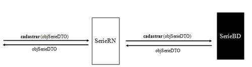

- Enviar um DTO preenchido com os atributos para cadastro (**set**). Se for uma chave-primária sequencial ou nativa, então o atributo correspondente deve ser configurado com null;

- Será retornado um DTO preenchido com a chave-primária. Por questão de uniformidade no tratamento dos métodos, mesmo que a chave-primária já seja conhecida antes do cadastramento, ainda assim será retornado um DTO com o seu valor preenchido.

### Alterar (Controlado)

- Enviar um DTO preenchido (**set**) com a chave-primária e com os atributos para alteração;

- Nenhum DTO será retornado, pois não haverá acréscimo de informações.

### Consultar (Conectado)

- Enviar um DTO com os atributos de retorno (**ret**) configurados e preenchido (**set**) com atributos que identifiquem uma determinada ocorrência (chave-primária ou chave-candidata);

- Se mais de uma ocorrência for selecionada será gerado um erro;

- É retornado um DTO com os valores dos atributos solicitados de acordo com os dados atualmente persistidos. Os campos retornados estarão disponíveis para uso no objeto (**get**).

### Listar (Conectado)

- Enviar um DTO com os atributos de retorno (**ret**), pesquisa (**set**) e ordenação (**setOrd**) preenchidos;

- Será retornada uma lista de DTOs com todos os registros que atenderam aos critérios de pesquisa e preenchido com os atributos solicitados disponíveis para uso (**get**);

- Esse método não atenderá a todos os casos possíveis. Para outras pesquisas necessárias deve criar um método Conectado com estrutura semelhante, ou seja, recebendo um DTO e retornando uma lista.

### Contar (Conectado)

- Enviar um DTO com os atributos de pesquisa (**set**) preenchidos;

- Será retornado o número de ocorrências que atenderam aos critérios de pesquisa.

### Bloquear (Controlado)

- Enviar um DTO preenchido (**set**) com o atributo chave-primária;

- Será retornado um DTO com todos os atributos da ocorrência no banco;

- O registro **ficará em lock** até o fim da transação corrente.

### Excluir, Desativar e Reativar (Controlado)


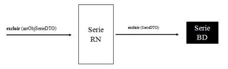

- Enviar uma lista de DTOs com os atributos correspondentes a chave-primária preenchidos (**set**);

- A passagem de uma lista permite que o método seja utilizado para processamento em lote, visto que nas interfaces é comum selecionar mais de um item para essas operações.

- O método da RN recebe uma lista, enquanto o método da BD recebe um DTO específico.

No SIP, por meio do menu **Recursos/Gerar Padrão PHP**, é possível gerar automaticamente os recursos para utilização nos métodos padrão:


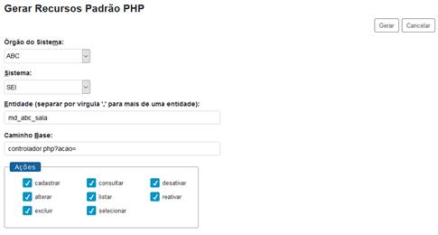

Observações:

- O método **contar** compartilha o mesmo recurso do método **listar**;

- O método **bloquear** compartilha o mesmo recurso do método **consultar**;

- O recurso **selecionar** é utilizado em telas de escolha de registros (**lupas**).

## InfraException

A classe `InfraException` fornece um mecanismo para transporte de validações e erros entre as camadas. Para que o tratamento ocorra de forma adequada, todo o código deve ser implementado com blocos **try ... catch**. A `InfraException` lançada deverá retornar na hierarquia de métodos até o ponto da 1ª camada que iniciou o procedimento, que então deverá informar o erro ou validação para o usuário. Todas as mensagens geradas pelo PHP (exceto Warnings) serão encapsuladas e lançadas em uma `InfraException` automaticamente.


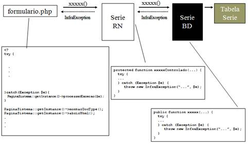

Exemplos de tratamento de validações na camada de regras de negócio (**RN**):

- Lançando uma validação em um alert:

```php
$objInfraException = new InfraException();
if (...1...){
  $objInfraException->lancarValidacao('v1');
}
```

- Acumulando diversas validações e exibindo todas em um único alert:

```php
$objInfraException = new InfraException();

if (...1...) {
  $objInfraException->adicionarValidacao('v1');
}

if (...2...) {
  $objInfraException->adicionarValidacao('v2');
}

if (...3...) {
  $objInfraException->adicionarValidacao('v3');
}
$objInfraException->lancarValidacoes();
```

Atributo `__construct($strDescricao=null, $e=null)`:

\- Construtor.

| strDescricao | Opcional. Texto indicando o motivo da exceção. |
|---|---|
| e | Opcional. Exceção original capturada no bloco *catch*. |

Atributo `adicionarValidacao($strDescricao)`:

\- Armazena uma validação de Regra de Negócio.

| strDescricao | Mensagem para exibição ao usuário. |
|---|---|

Atributo `contemValidacoes()`:

\- Verifica se o objeto contém validações armazenadas retornando true/false.

Atributo `lancarValidacao($strDescricao)`:

\- Lança imediatamente uma exceção contendo a validação passada como parâmetro.

Atributo `lancarValidacoes()`:

\- Verifica se objeto contém validações armazenadas caso afirmativo então lança o objeto.

## Estrutura de Diretórios

Segue abaixo a estrutura de diretórios recomendada:

| Diretório | Conteúdo |
|---|---|
| dto | Classes de transporte <EntidadeDTO.php>. |
| int | Classes de interface <EntidadeINT.php>. |
| rn | Classes das regras de negócio <EntidadeRN.php>. |
| bd | Classes de banco <EntidadeBD.php>. |
| ws | Classes de web services <ServicoWS.php>. |
| css | Código CSS. |
| imagens | Imagens da aplicação. |
| js | Código javascript. |

# 5. Padrão de Modelagem de Dados

## Regras Gerais

Regras de nomenclatura aplicáveis a todos os elementos (tabelas, colunas, índices, etc) do modelo de dados:

- usar somente letras, números e o caractere sublinhado;

- limitar o tamanho de **nome de tabelas e colunas** ao **máximo de 26 caracteres**;

- tendo em vista que tabelas que controlam sequencial de autoincremento de tabelas funcionais recebem automaticamente o prefixo `seq` e que elementos como índices e FKs também recebem prefixos próprios (por exemplo, i01 e fk), essa limitação de 26 caracteres reserva 4 caracteres para uso dos mencionados prefixos, o que evita cair no limitador cabal de 30 caracteres em bancos Oracle para qualquer nome de elemento de banco e de nomenclatura de colunas em DTO.
- utilizar apenas letras minúsculas;
- palavras internas devem ser separadas pelo caractere sublinhado;
- suprimir as preposições;
- utilizar apenas palavras no singular.
- todas as tabelas e colunas devem possuir uma descrição negocial no campo de metadado `comment`, informando sua finalidade funcional; se for coluna de status multi-valorado deve informar também suas opções e finalidades (Ex.: P=Processo, G=Doc. Gerado, E=Doc. Externo).

Em script de instalação/atualização é importante conhecer cada função disponível no `/infra/InfraBD.php`.

## Tabelas

- Não utilizar verbos para designar nomes de tabelas, priorizar o uso de substantivos e adicionar o prefixo `MD_<instituição/módulo>`:
  - `md_abc_pedido`
  - `md_abc_item`
  - `md_abc_nota_fiscal`

- A identificação deve tentar representar a entidade de forma clara dentro do limite de 26 caracteres, podendo utilizar de abreviações, desde que essas abreviações façam sentido:
  - `md_ri_tipo_controle_de_demanda` -> `md_ri_tp_ctrl_demanda`

- Para tabelas que implementam relacionamentos (n x n) utilizar o prefixo `MD_<instituição/módulo>`_rel seguido dos nomes das tabelas envolvidas (sem o prefixo `MD_<instituição/módulo>`) e separados por sublinhado:

  - `md_abc_rel_pedido_item`
- Se o relacionamento expressar um **conceito forte do sistema**, então o nome desse conceito pode ser utilizado:
  - `md_abc_administrador_sistema` (e não `md_abc_rel_usuario_sistema`)
- Tabelas que representam **conjuntos de valores relacionados** a uma determinada entidade, devem conter um prefixo **indicativo do tipo do conjunto** seguido do nome da entidade:
  - `md_abc_tipo_pedido`

## Colunas

- Para **chaves primárias sequenciais** utilizar o prefixo id seguido do nome da tabela:
  - `id_md_abc_pedido`
- Para **chaves primárias que fazem uso de chaves estrangeiras**, manter a nomenclatura da chave estrangeira igual à da chave primária de origem:
  - `id_md_abc_tabela_a`
  - `id_md_abc_tabela_b`

- **Prefixos recomendados**:
   \- sin_: campo sinalizador que aceita apenas os valores S ou N
   \- sta_: *status multi-valorado. Exemplo: P=Processo, G=Documento Gerado, E=Documento Externo
   \- dta_: data
   \- dth: data/hora
   \- din_: dinheiro

- Para **exclusão lógica** utilizar o nome de campo:
   \- sin_ativo

## Tipos de Dados

Quanto ao tipo de dado usado na representação, aconselha-se, para maior portabilidade, a escolha de um dos tipos principais definidos pelo padrão SQL-99 (ou SQL3):

| Tipo | Parâmetro | Significado |
|---|---|---|
| integer | \- | Números inteiros com sinal, o número de bits utilizado na representação é dependente da implementação (geralmente 32 bits). |
| smallint | \- | Números inteiros pequenos com sinal, o número de bits utilizado na representação é dependente da implementação (geralmente 16 bits). |
| numeric | [(*precisão* [,*decimais*])] | Números decimais com precisão fixa. Ao criar uma coluna do tipo numeric é necessário especificar o comprimento total do número e o número de casas decimais. Esse tipo é recomendado para representação de moedas. Muitos bancos de dados possuem um tipo money (não padronizado) que, na maioria das vezes, é um campo numeric com precisão e decimais específicos. |
| decimal | [(*precisão* [,*decimais*])] | Semelhante ao numeric, entretanto deve possuir uma precisão maior permitindo mais casas decimais. |
| float | [(*precisão*)] | Números com precisão única em ponto flutuante. A faixa de valores e a precisão da representação dependem da implementação. |
| double | \- | Números com precisão dupla em ponto flutuante. A faixa de valores e a precisão da representação dependem da implementação, mas é sempre igual ou melhor do que o tipo float. |
| blob | [(*tamanho*)] | Usado para armazenagem de qualquer dado em formato binário. O significado do parâmetro *tamanho* depende da implementação do banco, podendo ser medido em Kb, Mb ou até Gb. |
| char | [(*tamanho*)] | Usado na representação de sequências de caracteres de tamanho fixo. Tenha cuidado com o parâmetro *tamanho* -- para maior portabilidade, evite comprimentos superiores a 1000 caracteres. |
| varchar | (*tamanho*) | Usado na representação de sequências de caracteres de tamanho variável. |
| clob | [(*tamanho*)] | Semelhante ao tipo blob, só que aplicado a caracteres. |
| date | \- | Um valor de data no formato YYYY-MM-DD. A faixa de valores para o ano pode variar de 1 a 9999). |
| time | [(*precisão*)] | Um valor de hora no formato hh:mm:ss.nnn. O parâmetro *precisão* indica as frações de segundo representadas, e é dependente da implementação (geralmente variando entre 0 e 6). |
| timestamp | [(*precisão*)] | Data e hora no formato YYYY-MM-DD hh:mm:ss.nnn. O parâmetro *precisão* indica as frações de segundo representadas, e é dependente da implementação (geralmente variando entre 0 e 6). |
| boolean | \- | Valor lógico booleano (verdadeiro/falso). |

## Chave Primária

Utilizar o prefixo pk seguido do nome da entidade:

- `pk_md_abc_pedido`

## Chave Alternativa

Utilizar o prefixo ak seguido do nome da entidade e do nome do campo ou dos campos que a compõem:

- `ak_md_abc_pedido_codigo`

## Chave Estrangeira

Utilizar o prefixo fk seguido do prefixo `MD_<instituição/módulo>`, do nome da entidade que possui a chave estrangeira **e do nome da entidade à qual a chave faz referência** (sem o prefixo `MD_<instituição/módulo>`):

- `fk_md_abc_item_pedido`

## Índices

Para **índices que não representam chaves estrangeiras** utilizar o prefixo i(01-99)_  seguido do nome da entidade:

- `i01_md_abc_pedido`
- `i02_md_abc_pedido`
...
- `i99_md_abc_pedido`

Para **índices que representam chaves estrangeiras** utilizar o mesmo nome da chave:

- `fk_md_abc_item_pedido`

## Sequências

Utilizar o prefixo seq seguido do nome do objeto ao qual a sequência atende:

`seq_md_abc_pedido`

São utilizadas quando os DTOs possuem o tipo da chave primária nativa. Dependendo do banco de dados utilizado, podem ser tabelas ou sequences.

- MySQL

```sql
create table seq_md_abc_pedido (id int not null primary key AUTO_INCREMENT, campo char(1) null)
```

- SQL Server

```sql
create table seq_md_abc_pedido (id int identity(1,1), campo char(1) null)
```

- Oracle

```sql
CREATE SEQUENCE seq_md_abc_pedido START WITH 1 INCREMENT BY 1 NOCACHE NOCYCLE
```

- PostgreSQL

```sql
CREATE SEQUENCE seq_md_abc_pedido INCREMENT BY 1 START WITH 1
```

# 6. Padrão de Codificação PHP

## Nomes de Arquivos

Devem possuir apenas letras minúsculas, números e o caractere sublinhado acrescidos da extensão *.`php`*.

Classes ou interfaces devem utilizar arquivos individuais. Nesse caso, o nome do arquivo deve ser obrigatoriamente o mesmo nome da classe ou da interface acrescido da extensão *.`php`*.

## Indentação

Deve utilizar DOIS a QUATRO espaços para cada nível de indentação. **Não deve utilizar tabulação**.

## Classes e Interfaces

- Nomes de classe devem ser substantivos no singular tendo como prefixo Md e a sigla da instituição:
  - `MdAbcPedido`, `MdAbcItem`
- Utilizar a primeira letra de cada palavra em maiúscula:
  - `MdAbcNotaFiscal`
- Não deve utilizar preposições:
  - `MdAbcRequisicaoPagamento`

## Instâncias de Classes

- Para nomear instâncias de classes utilize o prefixo ***obj*** seguido do nome da classe:
  - `objMdAbcPedido`, `objMdAbcRequisicaoPagamento`
- Se for necessário utilizar mais de uma instância da mesma classe utilize um sufixo descritivo:
  - `objMdAbcPedidoOriginal`, `objMdAbcPedidoReclassificado`

## Constantes

- Devem ser declaradas com todas as letras em maiúsculo:
  - `MD_ABC_FATOR`
- Termos compostos devem ser separados pelo caractere sublinhado:
  - `MD_ABC_CONSUMO_MINIMO`

## Atributos e Variáveis de Métodos

Os atributos e variáveis devem ser nomeados utilizando um prefixo e um qualificador. O prefixo é definido de acordo com o tipo do atributo e o qualificador deve descrever o melhor possível o seu significado dentro da lógica do sistema. O qualificador deve conter a primeira letra em maiúscula e as demais em minúsculas. Termos compostos devem utilizar a primeira letra de cada termo em maiúscula e as demais em minúsculas (**não deve utilizar o caractere sublinhado**):

| Tipo do Atributo | Prefixo | Exemplo |
|---|---|---|
| Número | num | numIdadeMinima |
| String | str | strNome |
| Data | dta | dtaNascimento |
| Data/Hora | dth | dthEntrega |
| Array | arr | arrObjProtocolo |
| Booleano | bol | bolEncontrouUnidade |

## Métodos

Os nomes dos métodos devem ser verbos no infinitivo e conter apenas letras minúsculas. Termos compostos devem utilizar a primeira letra do segundo termo em diante em maiúscula (**não deve utilizar o caractere sublinhado**):

- `cadastrar`

- `calcularJuros`

- `gerarEstatisticas`

## Elementos HTML

Os elementos HTML devem ser nomeados utilizando um prefixo e um qualificador. O prefixo é definido de acordo com a tabela abaixo e o qualificador deve descrever o propósito do componente contendo a primeira letra em maiúscula e as demais em minúsculas. Termos compostos devem utilizar a primeira letra de cada termo em maiúscula e as demais em minúsculas (**não deve utilizar o caractere sublinhado**):

| Elemento | Prefixo | Exemplo |
|---|---|---|
| [input type=] text | txt | txtNome |
| [input type=] password | pwd | pwdSenha |
| [input type=] checkbox | chk | chkUnidadeProtocolo |
| [input type=] radio | rdo | rdoNivelAcesso |
| [input type=] submit | sbm | sbmSalvar |
| [input type=] file | fil | filAnexo |
| [input type=] hidden | hdn | hdnIdCidade |
| [input type=] image | img | imgLupa |
| [input type=] button | btn | btnFechar |
| Form | frm | frmAnotacaoCadastro |
| Div | div | divEndereco |
| Table | tbl | tblLocalizadores |
| iFrame | ifr | ifrmArvore |
| TextArea | txa | txaDescricao |
| Select | sel | selUnidades |

# 7. Gerador de Código

As operações básicas podem ser geradas no framework InfraPHP através de um gerador de código disponível no endereço: [*https://gerador.trf4.jus.br*](https://gerador.trf4.jus.br/)

A geração do código é realizada com base na interpretação dos comandos DDL utilizados para criação da base de dados. É muito importante seguir o padrão de modelagem de dados, principalmente com relação aos prefixos dos campos, pois o gerador utilizará essas informações para gerar máscaras para os campos na interface e validações específicas tanto em javascript como na camada de regras de negócio.

Os comandos SQL podem ser escritos em vários dialetos e o gerador aceita somente alguns deles.

**Exemplo** de comandos SQL de duas tabelas e informações necessárias para geração de código de operações básicas por meio do framework InfraPHP:


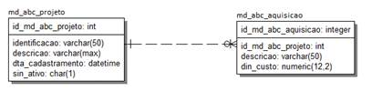

```sql
CREATE TABLE md_abc_aquisicao(
    id_md_abc_aquisicao integer NOT NULL,
    id_md_abc_projeto int NOT NULL,
    descricao varchar(50) NOT NULL,
    din_custo numeric(12,2) NOT NULL
);

ALTER TABLE md_abc_aquisicao ADD CONSTRAINT pk_md_abc_aquisicao PRIMARY KEY (id_md_abc_aquisicao ASC);

CREATE TABLE md_abc_projeto(
    id_md_abc_projeto int NOT NULL,
    identificacao varchar(50) NOT NULL,
    descricao varchar(max) NULL,
    dta_cadastramento datetime NOT NULL,
    sin_ativo char(1) NOT NULL
);

ALTER TABLE md_abc_projeto ADD CONSTRAINT pk_md_abc_projeto PRIMARY KEY (id_md_abc_projeto ASC);

ALTER TABLE md_abc_aquisicao ADD CONSTRAINT fk_md_abc_projeto_aquisicao FOREIGN KEY (id_md_abc_projeto) REFERENCES md_abc_projeto(id_md_abc_projeto);

CREATE INDEX fk_md_abc_projeto_aquisicao ON md_abc_aquisicao (id_md_abc_projeto ASC);
```

1\)  processar os comandos SQL preenchendo os campos: Usuário, Módulo Principal (que inclui o `InfraPHP`), Versão do PHP, as classes de `InfraSessao`, `InfraPagina` e `InfraBanco`. Na seção `Permissões na RN`, informar se o código na RN deve prever auditoria das permissões por meio de Regras de Auditoria cadastradas no SIP:


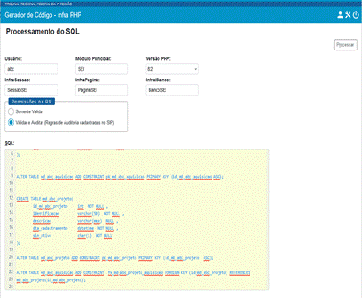

2\)  clique no botão de ação `Cadastrar Campos` da tabela escolhida para a geração do código; neste exemplo será `md_abc_projeto`:


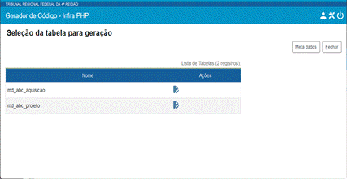

3\)  informar o campo principal, os rótulos dos campos e teclas de atalho:


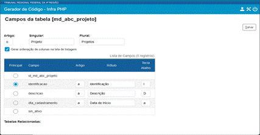

Campo principal:

- será retornado automaticamente na tela de lista junto com o ID;

- será gerado um método para montagem de combo na classe MdAbcProjetoINT buscando por esse campo;

- no DTO das tabelas relacionadas ele será recuperado automaticamente, ou seja, em `MdAbcAquisicaoDTO` será adicionada uma FK para `md_abc_projeto` e um atributo relacionado `IdentificacaoMdAbcProjeto`. Para que isso ocorra é necessário configurar o campo principal da tabela `md_abc_projeto` antes de gerar o código de `md_abc_aquisicao`. Se o código de `md_abc_projeto` fosse gerado em outra ocasião, bastaria selecionar a tabela e avançar até o passo final escolhendo apenas o campo principal (sem preencher todos os campos).

4\)  Ao final o código poderá ser baixado clicando nos botões de ação `Gerar BD`, `Gerar DTO`, `Gerar INT`, `Gerar RN`, `Gerar Tela Cadastro` e `Gerar Tela Listagem`:


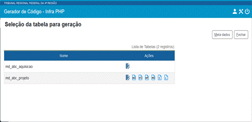

# 8. Classes API

A troca de informações do sistema com os módulos deve ser feita utilizando as classes específicas da API (diretório `sei/web/api`). Na classe de integração do módulo, ao interceptar eventos, o sistema disponibilizará objetos dessas classes API com atributos específicos preenchidos. Da mesma forma, quando o módulo realizar uma operação por meio da classe SeiRN deverá criar objetos dessas classes API informando os atributos adequados.

- Ver mais detalhes nas seções **Eventos** e **Operações**.
- **Atenção**: Não é recomendado o uso de outras classes ou objetos internos do sistema.

## AcessoExternoAPI

| IdAcessoExterno | Identificador do Acesso Externo |
|---|---|
| DataValidade | Data de validade do acesso externo |
| Procedimento | Ocorrência de ProcedimentoAPI |
| Documento | Ocorrência de DocumentoAPI |
| SinAcessoProcesso | S/N -- indica se o acesso externo possibilita visualização integral do processo |

## AndamentoAPI

| IdAndamento | Identificador do Andamento |
|---|---|
| IdTarefa | Identificador da tarefa associada |
| IdTarefaModulo | Identificador da tarefa de módulo associada |
| Descricao | Descrição do andamento |
| DataHora | Data/hora do andamento |
| Usuario | Ocorrência de UsuarioAPI |
| Unidade | Ocorrência de UnidadeAPI |
| Atributos | Conjunto de ocorrências de AtributoAndamentoAPI |
| IdProtocolo | Identificador do protocolo do andamento |

## AnexoAPI

| IdAnexo | Identificador do Anexo |
|---|---|
| Nome | Nome do anexo |
| DataHora | Data/hora do anexo |
| Tamanho | Tamanho do anexo |
| Conteudo | Conteúdo do anexo |

## AndamentoMarcadorAPI

| IdAndamentoMarcador | Identificador do andamento de marcador |
|---|---|
| Texto | Texto do andamento |
| DataHora | Data/hora do andamento |
| Usuario | Ocorrência de UsuarioAPI |
| Marcador | Ocorrência de MarcadorAPI |

## ArquivoExtensaoAPI

| IdArquivoExtensao | Identificador do registro |
|---|---|
| Extensao | Extensão de arquivo |
| Descricao | Descrição da extensão |

## ArvoreAcaoItemAPI

| Tipo | Rótulo que serve como agrupador para nós do mesmo tipo (caso seja necessário varrer todos os nós posteriormente filtrando pelo tipo). Para agrupar os itens do módulo utilizar MD + instituição + tipo. Exemplo:<br> `$objArvoreAcaoItemAPI->setTipo('MD_ABC_AUDIENCIAS')`;|
|---|---|
| Id | Identificador do nó na árvore. Deve ser único sendo recomendado utilizar o MD + instituição + descrição + ID do protocolo. Exemplo:<br> `$objArvoreAcaoItemAPI->setId('MD_ABC_AUDIENCIA_'. $dblIdDocumento);`|
| IdPai | Identificador do nó pai na árvore. O SEI monta os nós de processo e documentos usando o identificador do protocolo como valor para o campo Id. Exemplo:<br> `$objArvoreAcaoItemAPI->setIdPai($dblIdDocumento);`|
| Href | Pode ser um link ou um código javascript. Exemplo:<br>  `$objArvoreAcaoItemAPI->setHref('...link...');`<br> `$objArvoreAcaoItemAPI->setHref('javascript:alert(\'Ícone Processo ABC\');');` |
| Target | Indica qual o destino para execução do link em href:<br>**_blank** = nova janela<br>**ifrVisualizacao** = área ao lado da árvore de processo em que é exibido o conteúdo do documento<br>**null** = se o href é um javascript |
| Title | Texto que será exibido ao passar o mouse sobre o ícone |
| Icone | Caminho para a imagem sendo recomendado utilizar o formato SVG com tamanho 24x24. Exemplo:<br> `$objArvoreAcaoItemAPI->setIcone('modulos/abc/exemplo/imagens/abc_pequeno.svg');`|
| SinHabilitado | S/N -- indica se o ícone será clicável ou não |

## AssinaturaAPI

| Nome | Nome do assinante |
|---|---|
| CargoFuncao | Cargo/função utilizado na assinatura |
| DataHora | Data/hora da assinatura |
| IdUsuario | ID do usuário |
| IdOrigem | ID Origem associado com o usuário no SIP |
| IdOrgao | ID do órgão do usuário |
| Sigla | Sigla do usuário |
| Cpf | CPF do usuário |
| StaFormaAutenticacao | Tipo da autenticação:<br>C = Certificado Digital<br>S = Senha<br>M = Módulo |
| Agrupador | Identificador associado com assinaturas ainda não confirmadas |

## AssuntoAPI

| CodigoEstruturado | Código do assunto |
|---|---|
| Descricao | Descrição do assunto |

## AtributoAndamentoAPI

| Nome | Nome do atributo, corresponde a variável que será substituída no texto. Exemplo:<br> \@SALA@ |
|---|---|
| Valor | Valor do atributo. Exemplo:<br>   302 |
| IdOrigem | Identificador opcional associado com o andamento (campo texto com até 50 posições). Exemplo:<br>   76232 = identificador interno da sala |

## AtributoOuvidoriaAPI

| Id | Identificador do atributo da ouvidoria. Exemplo: P |
|---|---|
| Nome | Nome interno do atributo. Exemplo: RELACAO |
| Titulo | Título do atributo para exibição no formulário gerado no processo. Exemplo: Relação com a Justiça Federal |
| Valor | Valor do atributo para exibição associado com o título. Exemplo: Procurador Público |

## BlocoAPI

| IdBloco | Identificador do bloco |
|---|---|
| Descricao | Descrição associada com o bloco |
| Tipo | A = Assinatura<br>R = Reunião<br>I = Interno |
| Estado | A = Aberto<br>D = Disponibilizado<br>B = Recebido<br>R = Retornado<br>C = Concluído |
| Unidade | Unidade que gerou o bloco (ocorrência de UnidadeAPI) |
| Usuario | Usuário que gerou o bloco (ocorrência de UsuarioAPI) |
| SinPrioridade | S/N -- Indica se o bloco foi sinalizado como prioritário na unidade |
| SinRevisao | S/N -- Indica se o bloco foi sinalizado como revisado na unidade |
| UsuarioAtribuicao | Dados do usuário para o qual o bloco foi atribuído na unidade (ocorrência de UsuarioAPI) |
| UnidadesDisponibilizacao | Unidades configuradas para disponibilização (conjunto de UnidadeAPI) |

## CampoAPI

| Nome | Nome do campo do formulário |
|---|---|
| Valor | Valor do campo do formulário |

## CargoAPI

| IdCargo | Identificador interno do cargo |
|---|---|
| ExpressaoCargo | Descrição do cargo (Exemplo: Governador) |
| ExpressaoTratamento | Tratamento para o cargo (Exemplo: A Sua Excelência o Senhor) |
| ExpressaoVocativo | Vocativo para o cargo (Exemplo: Senhor Governador) |

## CidadeAPI

| IdCidade | Identificador da cidade |
|---|---|
| IdEstado | Identificador do estado |
| IdPais | Identificador do país |
| Nome | Nome da cidade |
| CodigoIbge | Código IBGE da cidade |
| SinCapital | S/N -- indica se a cidade é capital do estado |
| Latitude | Latitude da cidade |
| Longitude | Longitude da cidade |

## ConfiguracoesAssinaturaAPI

| NomeModulo | Nome do módulo responsável pela assinatura |
|---|---|
| TipoAssinturaSenha | true/false -- assinatura com senha |
| TipoAssinaturaCertificado | true/false -- assinatura com certificado digital |
| GerarAgrupador | true/false -- gerar ID para agrupar para as assinaturas |
| GerarIndexacao | true/false -- indexar após assinatura |
| UtilizaRevalidacao | true/false -- cadastrar assinatura como inativa até que o mecanismo revalide |
| UsuarioComCpf | true/false -- indica se o assinante precisa ter CPF cadastrado |
| ValidacaoCertificado | true/false |
| LinkValidacao | Link para validação da assinatura |
| TipoTarjaAssinatura | Tipo da tarja de assinatura existente no banco que será utilizada |
| TipoTarjaAutenticacao | Tipo da tarja de autenticação existente no banco que será utilizada |

## ContatoAPI

| StaOperacao | A = Cadastrar/Alterar<br>E = Excluir<br>D = Desativar<br>R = Reativar |
|---|---|
| IdContato | Identificador do contato |
| IdTipoContato | Tipo do contato |
| NomeTipoContato | Nome do tipo de contato |
| Sigla | Sigla do contato |
| Nome | Nome do contato |
| NomeSocial | Nome Social do Contato |
| StaNatureza | F/J = Pessoa Física/Jurídica |
| IdContatoAssociado | Identificador do contato associado |
| NomeContatoAssociado | Nome do contato associado |
| SinEnderecoAssociado | S/N -- indica se o contato utiliza ou não o endereço do contato associado |
| CnpjAssociado | CNPJ do contato associado |
| Endereco | Dados de endereçamento do contato - Endereço |
| Complemento | Dados de endereçamento do contato - Complemento do Endereço |
| Bairro | Dados de endereçamento do contato - Bairro |
| IdCidade | Dados de endereçamento do contato - id da Cidade |
| NomeCidade | Dados de endereçamento do contato - Nome da Cidade |
| IdEstado | Dados de endereçamento do contato - id do Estado |
| SiglaEstado | Dados de endereçamento do contato - Sigla do Estado |
| IdPais | Dados de endereçamento do contato - id do País |
| NomePais | Dados de endereçamento do contato - Nome do País |
| Cep | Dados de endereçamento do contato - CEP |
| StaGenero | M/F = Masculino/Feminino |
| IdCargo | Identificador interno do cargo |
| ExpressaoCargo | Descrição do cargo |
| ExpressaoTratamento | Descrição do tratamento |
| ExpressaoVocativo | Descrição do vocativo |
| Cpf | Número do CPF sem formatação |
| Cnpj | Número do CNPJ sem formatação |
| Rg | Número do RG |
| OrgaoExpedidor | Órgão expedidor |
| Matricula | Número de matrícula |
| MatriculaOab | Matrícula OAB |
| NumeroPassaporte | Número do passaporte |
| IdPaisPassaporte | País de emissão do passaporte |
| NomePaisPassaporte | Nome do país do passaporte |
| TelefoneFixo | Telefone fixo |
| TelefoneCelular | Telefone celular |
| DataNascimento | Data de nascimento |
| Email | E-mail |
| SitioInternet | Sítio na internet |
| Observacao | Texto de observação associado |
| SinAtivo | S/N -- Sinalizador indica se o registro está ativo |

## DefinicaoMarcadorAPI

| IdMarcador | Identificador do marcador |
|---|---|
| IdProcedimento | Identificador do processo |
| ProtocoloProcedimento | Número do processo visível para o usuário. Exemplo: 12.1.000000077-4 |
| Texto | Texto associado com a definição |

## DestinatarioAPI

| Sigla | Sigla do destinatário |
|---|---|
| Nome | Nome do destinatário |
| IdContato | Identificador interno do destinatário |
| Cpf | CPF do destinatário |
| Cnpj | CNPJ do destinatário |

## DocumentoAPI

| IdDocumento | Identificador do documento |
|---|---|
| Tipo | Tipo interno do documento:<br>G = Gerado<br>R = Recebido |
| SubTipo | Subtipos do tipo G (Gerado):<br>E = Editor eDoc (descontinuado)<br>I = Editor Interno HTML<br>A = Formulário automático XML (email, ouvidoria)<br>F = Formulário gerado<br>Subtipo do tipo R (Recebido):<br>X = Externo |
| IdProcedimento | Identificador do processo |
| ProtocoloProcedimento | Número do processo visível para o usuário.<br>Exemplo: 12.1.000000077-4 |
| IdSerie | Identificador do tipo do documento visível para o usuário |
| NomeSerie | Nome do tipo do documento visível para o usuário |
| Numero | Número do documento. Exemplo: Portaria 123 |
| NomeArvore | Nome complementar a ser exibido na árvore de documentos do processo |
| DinValor | Valor monetário. Exemplo: 133.050,95 ou 133050,95 |
| Data | Data do documento |
| Descricao | Descrição associada com o documento |
| IdTipoConferencia | Identificador do tipo de conferência |
| SinArquivamento | S/N -- Sinalizador indica se o documento deve ser arquivado |
| Remetente | Obrigatório para documentos externos, passar null para documentos gerados (ver estrutura RemetenteAPI). Todos os campos da estrutura são opcionais e o sistema tentará identificar o contato na ordem: IdContato, Cpf, Cnpj, Sigla+Nome, Sigla ou Nome. Por exemplo, se passados CPF, Sigla e Nome então a busca será apenas pelo CPF. Caso exista um registro com o CPF informado ele será usado mesmo que a Sigla/Nome sejam diferentes. Caso não encontre então será cadastrado um contato com o CPF, Sigla e Nome informados. Se o contato pode não existir então é importante passar o Nome para permitir o cadastro automático. |
| Interessados | Lista de instâncias de InteressadoAPI. Se não existirem interessados deve ser informado um conjunto vazio. Todos os campos da estrutura são opcionais e o sistema tentará identificar o contato na ordem: IdContato, Cpf, Cnpj, Sigla+Nome, Sigla ou Nome. Por exemplo, se passados CPF, Sigla e Nome então a busca será apenas pelo CPF. Caso exista um registro com o CPF informado ele será usado mesmo que a Sigla/Nome sejam diferentes. Caso não encontre então será cadastrado um contato com o CPF, Sigla e Nome informados. Se o contato pode não existir então é importante passar o Nome para permitir o cadastro automático. |
| Destinatarios | Lista de instâncias de DestinatarioAPI. Se não existirem destinatários deve ser informado um conjunto vazio. Todos os campos da estrutura são opcionais e o sistema tentará identificar o contato na ordem: IdContato, Cpf, Cnpj, Sigla+Nome, Sigla ou Nome. Por exemplo, se passados CPF, Sigla e Nome então a busca será apenas pelo CPF. Caso exista um registro com o CPF informado ele será usado mesmo que a Sigla/Nome sejam diferentes. Caso não encontre então será cadastrado um contato com o CPF, Sigla e Nome informados. Se o contato pode não existir então é importante passar o Nome para permitir o cadastro automático. |
| Observacao | Texto da observação |
| NomeArquivo | Nome do arquivo associado com o documento Tipo = R |
| NivelAcesso | 0 = Público<br>1 = Restrito<br>2 = Sigiloso |
| IdHipoteseLegal | Identificador da hipótese legal associada |
| Conteudo | Conteúdo do documento externo codificado em Base64 |
| ConteudoMTOM | Conteúdo do documento externo em formato binário |
| SinBloqueado | S/N -- se o documento estiver bloqueado então seu conteúdo não poderá ser alterado |
| IdArquivo | Identificador do arquivo no repositório (ver método adicionar Arquivo) |
| Campos | Lista de instâncias de CampoAPI |
| IdUnidadeGeradora | Identificador da unidade geradora do documento |
| NumeroProtocolo | Número SEI do documento |
| SinAssinado | S/N -- indica se o documento está assinado |
| SinPublicado | S/N -- indica se o documento está publicado |
| CodigoAcesso | Valor numérico utilizado pelo sistema para indicar se o usuário tem acesso a determinado protocolo. O usuário tem acesso se esse valor for MAIOR que zero (zero ou negativo indica falta de acesso). |
| IdOrgaoUnidadeGeradora | Identificador do órgão associado com a unidade geradora |
| IdUsuarioGerador | Identificador do usuário gerador |
| IdPlanoTrabalho | Identificador do Plano de Trabalho |
| IdEtapaTrabalho | Identificador da Etapa de Trabalho |
| IdItemEtapa | Identificador do Item da Etapa |
| IdOperacao | Identificador único gerado para a operação iniciada pelo usuário na interface |
| AtributosModulo | Conjunto chave-valor com os atributos do módulo |

## EntradaAdicionarArquivoAPI

| Nome | Nome do arquivo |
|---|---|
| Tamanho | Tamanho em bytes do arquivo |
| Hash | MD5 do conteúdo total |
| Conteudo | Conteúdo total ou parcial do arquivo |

## EntradaAdicionarConteudoArquivoAPI

| IdArquivo | Identificador do arquivo no repositório |
|---|---|
| Conteudo | Conteúdo parcial do arquivo |

## EntradaAgendarPublicacaoAPI

| IdDocumento | Identificador do documento |
|---|---|
| ProtocoloDocumento | Número do documento visível para o usuário.<br>Exemplo: 0003934 |
| StaMotivo | 1 = Publicação<br>2 = Retificação<br>3 = Republicação<br>4 = Apostilamento |
| IdVeiculoPublicacao | Identificador do veículo de publicação |
| DataDisponibilizacao | Data de disponibilização |
| Resumo | Texto do resumo de publicação |
| ImprensaNacional | Ocorrência de PublicacaoImprensaNacionalAPI preenchida com IdVeiculo, Pagina, IdSecao e Data. |

## EntradaAlterarPublicacaoAPI

| IdPublicacao | Identificador da publicação |
|---|---|
| IdDocumento | Identificador do documento |
| ProtocoloDocumento | Número do documento visível para o usuário.<br>Exemplo: 0003934 |
| StaMotivo | 1 = Publicação<br>2 = Retificação<br>3 = Republicação<br>4 = Apostilamento |
| IdVeiculoPublicacao | Identificador do veículo de publicação |
| DataDisponibilizacao | Data de disponibilização |
| Resumo | Texto do resumo de publicação |
| ImprensaNacional | Ocorrência de PublicacaoImprensaNacionalAPI preenchida com IdVeiculo, Pagina, IdSecao e Data. |

## EntradaAnexarProcessoAPI

| IdProcedimentoPrincipal | Identificador do processo que conterá o anexo |
|---|---|
| ProtocoloProcedimentoPrincipal | Número do processo que conterá o anexo visível para o usuário. Exemplo: 12.1.000000077-4 |
| IdProcedimentoAnexado | Identificador do processo que será anexado |
| ProtocoloProcedimentoAnexado | Número do processo que será anexado visível para o usuário. Exemplo: 12.1.000001213-6 |

## EntradaAtribuirProcessoAPI

| IdProcedimento | Identificador do processo |
|---|---|
| ProtocoloProcedimento | Número do processo visível para o usuário. Exemplo: 12.1.000000077-4 |
| IdUsuario | Identificador do usuário |
| SinReabrir | S/N -- indica se o processo deve ser reaberto caso esteja concluído |

## EntradaBloquearDocumentoAPI

| IdDocumento | Identificador do documento |
|---|---|
| ProtocoloDocumento | Número do documento visível para o usuário. Exemplo: 0003934 |

## EntradaBloquearProcessoAPI

| IdProcedimento | Identificador do processo |
|---|---|
| ProtocoloProcedimento | Número do processo visível para o usuário. Exemplo: 12.1.000000077-4 |

## EntradaCancelarAgendamentoPublicacaoAPI

| IdPublicacao | Identificador da publicação |
|---|---|
| IdDocumento | Identificador do documento |
| ProtocoloDocumento | Número do documento visível para o usuário. Exemplo: 0003934 |

## EntradaCancelarDisponibilizacaoBlocoAPI

| IdBloco | Identificador do bloco |
|---|---|

## EntradaCancelarDocumentoAPI

| IdDocumento | Identificador do documento |
|---|---|
| ProtocoloDocumento | Número do documento visível para o usuário. Exemplo: 0003934 |
| Motivo | Texto do motivo para cancelamento |

## EntradaConcluirBlocoAPI

| IdBloco | Identificador do bloco |
|---|---|

## EntradaConcluirControlePrazoAPI

| IdProcedimento | Identificador do processo |
|---|---|
| ProtocoloProcedimento | Número do processo visível para o usuário. Exemplo: 12.1.000000077-4 |

## EntradaConcluirProcessoAPI

| IdProcedimento | Identificador do processo |
|---|---|
| ProtocoloProcedimento | Número do processo visível para o usuário. Exemplo: 12.1.000000077-4 |

## EntradaConfirmarDisponibilizacaoPublicacaoAPI

| IdVeiculoPublicacao | Identificador do veículo de publicação |
|---|---|
| DataDisponibilizacao | Data de disponibilização efetiva |
| DataPublicacao | Data de publicação efetiva |
| Numero | Número da edição de publicação |
| IdDocumentos | Identificadores internos dos documentos |

## EntradaConsultarBlocoAPI

| IdBloco | Identificador do bloco |
|---|---|
| SinRetornarProtocolos | S/N -- indica se além dos dados do bloco também devem ser retornados os protocolos que ele contém |

## EntradaConsultarDocumentoAPI

| IdDocumento | Identificador do documento |
|---|---|
| ProtocoloDocumento | Número do documento visível para o usuário. Exemplo: 0003934 |
| SinRetornarAndamentoGeracao | S/N -- indica se deve ser retornado o andamento de geração do documento |
| SinRetornarAssinaturas | S/N -- indica se devem ser retornadas as assinaturas |
| SinRetornarPublicacao | S/N -- indica se devem ser retornadas as informações de publicação |
| SinRetornarCampos | S/N -- indica se devem ser retornados os campos (para formulários) |
| SinRetornarBlocos | S/N -- indica se devem ser retornados os blocos na unidade atual que contém o documento |

## EntradaConsultarProcedimentoAPI

| IdProcedimento | Identificador do processo |
|---|---|
| ProtocoloProcedimento | Número do processo visível para o usuário. Exemplo: 12.1.000000077-4 |
| SinRetornarAssuntos | S/N -- indica se devem ser retornados os assuntos associados (conjunto de AssuntoAPI) |
| SinRetornarInteressados | S/N -- indica se devem ser retornados os interessados (conjunto de InteressadoAPI) |
| SinRetornarObservacoes | S/N -- indica se devem ser retornadas as observações (conjunto de ObservacaoAPI) |
| SinRetornarAndamentoGeracao | S/N -- indica se deve ser retornado o andamento de geração (ocorrência de AndamentoAPI) |
| SinRetornarAndamentoConclusao | S/N -- indica se deve ser retornado o andamento de conclusão na unidade (ocorrência de AndamentoAPI) |
| SinRetornarUltimoAndamento | S/N -- indica se deve ser retornado o último andamento na unidade (ocorrência de AndamentoAPI) |
| SinRetornarUnidadesProcedimentoAberto | S/N -- indica se devem ser retornadas as unidades onde o processo está aberto (conjunto de UnidadeProcedimentoAbertoAPI) |
| SinRetornarProcedimentosRelacionados | S/N -- indica se deve ser retornados os processos relacionados (conjunto de ProcedimentoResumidoAPI) |
| SinRetornarProcedimentosAnexados | S/N -- indica se deve ser retornados os processos anexados (conjunto de ProcedimentoResumidoAPI) |

## EntradaConsultarProcedimentoIndividualAPI

| IdOrgaoProcedimento | Identificador do órgão do processo |
|---|---|
| IdTipoProcedimento | Identificador do tipo do processo |
| IdOrgaoUsuario | Identificador do órgão do usuário |
| SiglaUsuario | Sigla do usuário |

## EntradaConsultarPublicacaoAPI

| IdPublicacao | Identificador da publicação |
|---|---|
| IdDocumento | Identificador do documento |
| ProtocoloDocumento | Número do documento visível para o usuário. Exemplo: 0003934 |
| SinRetornarAndamento | S/N -- indica se deve ser retornado o andamento de publicação |
| SinRetornarAssinaturas | S/N -- indica se devem ser retornadas as assinaturas do documento |

## EntradaDefinirControlePrazoAPI

| IdProcedimento | Identificador do processo |
|---|---|
| ProtocoloProcedimento | Número do processo visível para o usuário. Exemplo: 12.1.000000077-4 |
| DataPrazo | Data certa para o prazo |
| Dias | Número de dias para o controle de prazo |
| SinDiasUteis | S/N -- indica se o valor passado no atributo Dias corresponde a dias úteis ou não |

## EntradaDesanexarProcessoAPI

| IdProcedimentoPrincipal | Identificador do processo que contém o anexo |
|---|---|
| ProtocoloProcedimentoPrincipal | Número do processo que contém o anexo visível para o usuário. Exemplo: 12.1.000000077-4 |
| IdProcedimentoAnexado | Identificador do processo anexado |
| ProtocoloProcedimentoAnexado | Número do processo anexado visível para o usuário. Exemplo: 12.1.000001213-6 |
| Motivo | Texto indicando o motivo da desanexação |

## EntradaDesbloquearProcessoAPI

| IdProcedimento | Identificador do processo |
|---|---|
| ProtocoloProcedimento | Número do processo visível para o usuário. Exemplo: 12.1.000000077-4 |

## EntradaDevolverBlocoAPI

| IdBloco | Identificador do bloco |
|---|---|

## EntradaDisponibilizarBlocoAPI

| IdBloco | Identificador do bloco |
|---|---|

## EntradaEnviarEmailAPI

| IdProcedimento | Identificador do processo |
|---|---|
| ProtocoloProcedimento | Número do processo visível para o usuário. Exemplo: 12.1.000000077-4 |
| De | Endereço do remetente |
| Para | Endereços dos destinatários (separados por ponto e vírgula `;`) |
| CCO | Endereços dos destinatários para envio com cópia oculta (separados por ponto e vírgula `;` ) |
| Assunto | Assunto da mensagem |
| Mensagem | Conteúdo da mensagem |
| NivelAcesso | Opcional<br>0 = Público (valor padrão)<br>1 = Restrito |
| IdHipoteseLegal | Opcional, Identificador interno da hipótese legal associada |
| IdDocumentos | Conjunto de identificadores internos dos documentos do processo que devem ser anexados no email |
| Arquivos | Conjunto de arquivos avulsos que devem ser anexados no email |

## EntradaEnviarProcessoAPI

| IdProcedimento | Identificador do processo |
|---|---|
| ProtocoloProcedimento | Número do processo visível para o usuário. Exemplo: 12.1.000000077-4 |
| UnidadesDestino | Identificadores das unidades para envio |
| SinManterAbertoUnidade | S/N -- indica se o processo deve ficar aberto na unidade origem |
| SinRemoverAnotacao | S/N -- indica se a anotação deve ser removida do processo após o envio |
| SinEnviarEmailNotificacao | S/N -- indica se deve ser enviado email de notificação para as unidades destino |
| DataRetornoProgramado | Data para retorno no formado dd/mm/aaaa |
| DiasRetornoProgramado | Número de dias para retorno |
| SinDiasUteisRetornoProgramado | S/N -- indica se os dias informados são úteis |
| SinReabrir | S/N -- indica se o processo deve ser reaberto automaticamente na unidade de origem antes do envio |

## EntradaExcluirBlocoAPI

| IdBloco | Identificador do bloco |
|---|---|

## EntradaExcluirDocumentoAPI

| IdDocumento | Identificador do documento |
|---|---|
| ProtocoloDocumento | Número do documento visível para o usuário. Exemplo: 0003934 |

## EntradaExcluirProcessoAPI

| IdProcedimento | Identificador do processo |
|---|---|
| ProtocoloProcedimento | Número do processo visível para o usuário. Exemplo: 12.1.000000077-4 |

## EntradaGerarBlocoAPI

| Tipo | Tipo do bloco:<br>A = Assinatura<br>R = Reunião<br>I = Interno |
|---|---|
| Descricao | Descrição do bloco |
| UnidadesDisponibilizacao | Identificadores internos das unidades para disponibilização. Passar um conjunto vazio caso o bloco não deva ser disponibilizado. |
| Documentos | Lista de protocolos de documentos (número visível para o usuário. Exemplo: 0003934) |
| IdDocumentos | Listas dos identificadores internos dos documentos |
| SinDisponibilizar | S/N -- sinalizador indicando se o bloco deve ser automaticamente disponibilizado |

## EntradaGerarProcedimentoAPI

| Procedimento | Dados do processo |
|---|---|
| Documentos | Informar os documentos que devem ser gerados em conjunto com o processo (conjunto de DocumentoAPI). Se nenhum documento for gerado informar um conjunto vazio. |
| ProcedimentosRelacionados | Identificadores dos processos que devem ser relacionados automaticamente com o novo processo |
| UnidadesEnvio | Identificadores das unidades para envio do processo após a geração. O processo ficará aberto na unidade geradora e nas unidades informadas nesse parâmetro. |
| SinManterAbertoUnidade | S/N -- sinalizador indica se o processo deve ser mantido aberto na unidade de origem |
| SinEnviarEmailNotificacao | S/N -- sinalizador indicando se deve ser enviado email de aviso para as unidades destinatárias |
| DataRetornoProgramado | Data para definição de Retorno Programado (opcional) |
| DiasRetornoProgramado | Número de dias para o Retorno Programado (opcional) |
| SinDiasUteisRetornoProgramado | S/N -- sinalizador indica se o valor passado no parâmetro DiasRetornoProgramado corresponde a dias úteis ou não (opcional) |
| IdMarcador | Identificador de um marcador da unidade para associação (opcional) |
| TextoMarcador | Texto do marcador (opcional) |
| DataControlePrazo | Data para definição do prazo (opcional) |
| DiasControlePrazo | Número de dias para definição do prazo (opcional) |
| SinDiasUteisControlePrazo | S/N -- sinalizador indica se o valor passado no parâmetro DiasControlePrazo corresponde a dias úteis ou não (opcional) |

## EntradaIncluirDocumentoBlocoAPI

| IdBloco | Identificador do bloco |
|---|---|
| IdDocumento | Identificador interno do documento |
| ProtocoloDocumento | Número do documento visível para o usuário. Exemplo: 0003934 |
| Anotacao | Texto de anotação associado com o documento no bloco |

## EntradaIncluirProcessoBlocoAPI

| IdBloco | Identificador do bloco |
|---|---|
| IdProcedimento | Identificador do processo |
| ProtocoloProcedimento | Número do processo visível para o usuário. Exemplo: 12.1.000000077-4 |
| Anotacao | Texto de anotação associado com o documento no bloco |

## EntradaLancarAndamentoAPI

| IdProcedimento | Identificador do processo |
|---|---|
| ProtocoloProcedimento | Número do processo visível para o usuário. Exemplo: 12.1.000000077-4 |
| IdTarefa | Identificador da tarefa |
| IdTarefaModulo | Identificador da tarefa de módulo |
| Atributos | Atributos associados com o andamento (conjunto de AtributoAndamentoAPI) |

## EntradaListarAndamentosAPI

| IdProcedimento | Identificador do processo |
|---|---|
| ProtocoloProcedimento | Número do processo visível para o usuário. Exemplo: 12.1.000000077-4 |
| SinRetornarAtributos | S/N -- indica se devem ser retornados os atributos associados com o andamento |
| Andamentos | Identificadores dos andamentos para filtro |
| Tarefas | Identificadores das tarefas para filtro |
| TarefasModulos | Identificadores das tarefas de módulos para filtro |

## EntradaListarAndamentosMarcadoresAPI

| IdProcedimento | Identificador do processo |
|---|---|
| ProtocoloProcedimento | Número do processo visível para o usuário. Exemplo: 12.1.000000077-4 |
| Marcadores | Identificadores dos marcadores para filtro |

## EntradaListarCargosAPI

| IdCargo | Opcional. Identificador do cargo para filtro |
|---|---|

## EntradaListarCidadesAPI

| IdPais | Identificador do país para filtro |
|---|---|
| IdEstado | Identificador do estado para filtro |

## EntradaListarContatosAPI

| IdContatos | Opcional. Filtra por identificadores de contatos. |
|---|---|
| IdTipoContato | Opcional. Filtra o tipo de contato. |
| PaginaRegistros | Opcional. Informa o número máximo de registros que devem ser retornados por página de consulta (1 a 1000 com valor padrão 1). |
| PaginaAtual | Opcional. Informa o número da página atual (valor padrão 1). |
| Sigla | Opcional. Filtra contato pela sigla. |
| Nome | Opcional. Filtra contato pelo nome. |
| CPF | Opcional. Filtra contato pelo CPF. |
| CNPJ | Opcional. Filtra contato pelo CNPJ. |
| Matricula | Opcional. Filtra contato pelo número de matrícula. |

## EntradaListarEstadosAPI

| IdPais | Identificador do país para filtro |
|---|---|

## EntradaListarExtensoesPermitidasAPI

| IdArquivoExtensao | Identificador interno de uma extensão de arquivo |
|---|---|

## EntradaListarFeriadosAPI

| IdOrgao | Identificador do órgão associado com os feriados |
|---|---|
| DataInicial | Data inicial para filtro |
| DataFinal | Data final para filtro |

## EntradaListarHipotesesLegaisAPI

| NivelAcesso | 1 = Restrito<br>2 = Sigiloso |
|---|---|

## EntradaListarUnidadesAPI

| IdUnidade | Identificador interno de uma unidade para filtro |
|---|---|
| IdOrgao | Identificador interno de um órgão para filtro |
| PalavrasPesquisa | Texto para filtro na sigla/descrição das unidades |

## EntradaListarUsuariosAPI

| IdUsuario | Identificador interno de um usuário para filtro |
|---|---|

## EntradaReabrirBlocoAPI

| IdBloco | Identificador do bloco |
|---|---|

## EntradaReabrirProcessoAPI

| IdProcedimento | Identificador do processo |
|---|---|
| ProtocoloProcedimento | Número do processo visível para o usuário. Exemplo: 12.1.000000077-4 |

## EntradaRegistrarAnotacaoAPI

| IdProcedimento | Identificador do processo |
|---|---|
| ProtocoloProcedimento | Número do processo visível para o usuário. Exemplo: 12.1.000000077-4 |
| Descricao | Texto da anotação |
| SinPrioridade | S/N -- Sinalizador indicando se a anotação é prioritária |

## EntradaRegistrarOuvidoriaAPI

| IdOrgao | Identificador do órgão da ouvidoria onde será gerado o processo |
|---|---|
| Nome | Nome do cidadão |
| NomeSocial | Nome Social do cidadão |
| Email | E-mail do cidadão |
| Cpf | CPF do cidadão |
| Rg | RG do cidadão |
| OrgaoExpedidor | Órgão expedidor do RG do cidadão |
| Telefone | Telefone do cidadão |
| Estado | Unidade Federativa do cidadão |
| Cidade | Cidade do cidadão |
| IdTipoProcedimento | Identificador do tipo de processo da ouvidoria |
| Processos | Relação textual de processos relacionados informados pelo cidadão |
| SinRetorno | S/N -- indica se o cidadão deseja retorno do contato |
| SinAnonimo | S/N -- indica se o contato é anônimo |
| SinSigilo | S/N -- indica se requer tratamento sigiloso |
| Mensagem | Conteúdo da mensagem enviada pelo cidadão |
| Anexos | Conjunto de ocorrências de AnexoAPI (preencher os atributos considerando que o IdAnexo deve conter o nome do arquivo do upoad existente no diretório temporário do PHP ou então o Conteudo em Base64). |
| AtributosAdicionais | Atributos adicionais do formulário da ouvidoria (conjunto de AtributoOuvidoriaAPI) |

## EntradaRelacionarProcessoAPI

| IdProcedimento1 | Identificador do processo 1 |
|---|---|
| ProtocoloProcedimento1 | Número do processo 1 visível para o usuário. Exemplo: 12.1.000000077-4 |
| IdProcedimento2 | Identificador do processo 2 |
| ProtocoloProcedimento2 | Número do processo 2 visível para o usuário. Exemplo: 12.1.000003541-1 |

## EntradaRemoverControlePrazoAPI

| IdProcedimento | Identificador do processo |
|---|---|
| ProtocoloProcedimento | Número do processo visível para o usuário. Exemplo: 12.1.000000077-4 |

## EntradaRemoverRelacionamentoProcessoAPI

| IdProcedimento1 | Identificador do processo 1 |
|---|---|
| ProtocoloProcedimento1 | Número do processo 1 visível para o usuário. Exemplo: 12.1.000000077-4 |
| IdProcedimento2 | Identificador do processo 2 |
| ProtocoloProcedimento2 | Número do processo 2 visível para o usuário. Exemplo: 12.1.000003541-1 |

## EntradaRemoverSobrestamentoProcessoAPI

| IdProcedimento | Identificador do processo |
|---|---|
| ProtocoloProcedimento | Número do processo visível para o usuário. Exemplo: 12.1.000000077-4 |

## EntradaRetirarDocumentoBlocoAPI

| IdBloco | Identificador do bloco |
|---|---|
| IdDocumento | Identificador interno do documento |
| ProtocoloDocumento | Número do documento visível para o usuário. Exemplo: 0003934 |

## EntradaRetirarProcessoBlocoAPI

| IdBloco | Identificador do bloco |
|---|---|
| IdProcedimento | Identificador do processo |
| ProtocoloProcedimento | Número do processo visível para o usuário. Exemplo: 12.1.000000077-4 |

## EntradaSobrestarProcessoAPI

| IdProcedimento | Identificador do processo que deve ser sobrestado |
|---|---|
| ProtocoloProcedimento | Número do processo que deve ser sobrestado visível para o usuário. Exemplo: 12.1.000000077-4 |
| IdProcedimentoVinculado | Identificador do processo para vinculação |
| ProtocoloProcedimentoVinculado | Número do processo para vinculação visível para o usuário. Exemplo: 12.1.000003541-1 |
| Motivo | Texto indicando o motivo do sobrestamento |

## EstadoAPI

| IdEstado | Identificador interno do estado |
|---|---|
| IdPais | Identificador interno do país |
| Sigla | Sigla do estado |
| Nome | Nome do estado |
| CodigoIbge | Código IBGE do estado |

## FeriadoAPI

| Data | Data do feriado |
|---|---|
| Descricao | Descrição do feriado |

## HipoteseLegalAPI

| IdHipoteseLegal | Identificador da hipótese legal |
|---|---|
| Nome | Nome da hipótese legal |
| BaseLegal | Base legal associada |
| NivelAcesso | 1 = Restrito<br>2 = Sigiloso |
| SinAtivo | S/N -- Indica se a hipótese legal está ativa |

## InteressadoAPI

| Sigla | Sigla do interessado |
|---|---|
| Nome | Nome do interessado |
| IdContato | Identificador interno do interessado |
| Cpf | CPF do interessado |
| Cnpj | CNPJ do interessado |

## MarcadorAPI

| IdMarcador | Identificador interno do marcador |
|---|---|
| Nome | Nome do marcador |
| Icone | Imagem PNG em formato base64 |
| SinAtivo | S/N -- indica se o marcador está ativo |

## ObservacaoAPI

| Descricao | Texto da observação |
|---|---|
| Unidade | Unidade associada com a observação (ocorrência de UnidadeAPI) |

## OrgaoAPI

| IdOrgao | Identificador interno do órgão |
|---|---|
| Sigla | Sigla do órgão |
| Descricao | Descrição do órgão |

## PaginaComplementoAPI

| Css | Código CSS para inclusão na respectiva seção da página |
|---|---|
| JavascriptGlobal | Código Javascript inserido na área global da página |
| JavascriptInicializacao | Código Javascript para execução na inicialização da página |
| JavascriptValidacao | Código Javascript para execução na validação da página |
| Html | Código HTML para inclusão na respectiva seção da página |
| AtributosModulo | Conjunto chave-valor com os atributos do módulo |

## PaisAPI

| IdPais | Identificador interno do país |
|---|---|
| Nome | Nome do país |

## ProcedimentoAPI

| IdProcedimento | Identificador interno do processo |
|---|---|
| IdTipoProcedimento | Identificador interno do tipo de processo |
| NomeTipoProcedimento | Nome do tipo de processo |
| NumeroProtocolo | Número do processo visível para o usuário.<br>Exemplo: 12.1.000003541-1 |
| DataAutuacao | Data de autuação do processo |
| Especificacao | Texto da especificação associada |
| IdTipoPrioridade | Identificador interno do tipo de prioridade |
| Assuntos | Assuntos do processo (ocorrências de AssuntoAPI) |
| Interessados | Lista de instâncias de InteressadoAPI. Se não existirem interessados deve ser informado um conjunto vazio. Todos os campos da estrutura são opcionais e o sistema tentará identificar o contato na ordem: IdContato, Cpf, Cnpj, Sigla+Nome, Sigla ou Nome. Por exemplo, se passados CPF, Sigla e Nome então a busca será apenas pelo CPF. Caso exista um registro com o CPF informado ele será usado mesmo que a Sigla/Nome sejam diferentes. Caso não encontre então será cadastrado um contato com o CPF, Sigla e Nome informados. Se o contato pode não existir então é importante passar o Nome para permitir o cadastro automático. |
| Observacao | Texto da observação da unidade |
| NivelAcesso | 0 = Público<br>1 = Restrito<br>2 = Sigiloso |
| IdHipoteseLegal | Identificador interno da hipótese legal associada |
| CodigoAcesso | Valor numérico utilizado pelo sistema para indicar se o usuário tem acesso a determinado protocolo. O usuário tem acesso se esse valor for MAIOR que zero (zero ou negativo indica falta de acesso) |
| SinAberto | S/N -- indica se o processo está aberto na unidade |
| IdUnidadeGeradora | Identificador interno da unidade geradora |
| IdOrgaoUnidadeGeradora | Identificador interno do órgão da unidade geradora |
| IdUsuarioGerador | Identificador interno do usuário gerador do processo |
| GrauSigilo | U = Ultrassecreto<br>S = Secreto<br>R = Reservado |

## ProcedimentoResumidoAPI

| IdProcedimento | Identificador do processo que deve ser sobrestado |
|---|---|
| ProtocoloProcedimento | Número do processo que deve ser sobrestado visível para o usuário. Exemplo: 12.1.000000077-4 |
| TipoProcedimento | Tipo do processo (ocorrência de TipoProcedimentoAPI) |

## ProtocoloBlocoAPI

| ProtocoloFormatado | Número do processo ou documento visível para o usuário |
|---|---|
| Identificacao | Nome do tipo de processo ou do tipo documento (seguido da numeração associada se existir). Exemplo: Compra de Material e Contratação de Serviços, Portaria 35 |
| Assinaturas | Assinaturas associadas com os documentos (conjunto de AssinaturaAPI) |

## PublicacaoAPI

| IdPublicacao | Identificador da publicação |
|---|---|
| IdDocumento | Identificador do documento |
| IdSerieDocumento | Identificador do tipo do documento |
| IdVeiculoPublicacao | Identificador do veículo de publicação |
| NomeVeiculo | Nome do veículo cadastrado no SEI |
| StaTipoVeiculo | I = Interno<br>E = Externo<br>M = Modulo |
| StaMotivo | 1 = Publicação<br>2 = Retificação<br>3 = Republicação<br>4 = Apostilamento |
| Numero | Número da publicação |
| DataDisponibilizacao | Data da disponibilização |
| DataPublicacao | Data da publicação |
| Resumo | Texto do resumo da publicação |
| Estado | A = Agendado<br>P = Publicado |
| ImprensaNacional | Dados da Imprensa Nacional associados (ocorrência de PublicacaoImprensaNacionalAPI) |

## PublicacaoImprensaNacionalAPI

| IdVeiculo | Identificador do veículo de publicação |
|---|---|
| SiglaVeiculo | Sigla do veículo (exemplo: DOU) |
| DescricaoVeiculo | Descrição do veículo (exemplo: Diário Oficial da União) |
| Pagina | Página da publicação |
| IdSecao | Identificador interno da seção (exemplo: 100023) |
| Secao | Seção da publicação (exemplo: 2) |
| Data | Data da publicação |

## RemetenteAPI

| Sigla | Sigla do remetente |
|---|---|
| Nome | Nome do remetente |
| IdContato | Identificador interno do remetente |
| Cpf | CPF do remetente |
| Cnpj | CNPJ do remetente |

## SaidaConsultarBlocoAPI

| IdBloco | Identificador do bloco |
|---|---|
| Descricao | Descrição associada com o bloco |
| Tipo | A = Assinatura<br>R = Reunião<br>I = Interno |
| Estado | A = Aberto<br>D = Disponibilizado<br>B = Recebido<br>R = Retornado<br>C = Concluído |
| Unidade | Unidade que gerou o bloco (ocorrência de UnidadeAPI) |
| Usuario | Usuário que gerou o bloco (ocorrência de UsuarioAPI) |
| SinPrioridade | S/N -- Indica se o bloco foi sinalizado como prioritário na unidade |
| SinRevisao | S/N -- Indica se o bloco foi sinalizado como revisado na unidade |
| UsuarioAtribuicao | Dados do usuário para o qual o bloco foi atribuído na unidade (ocorrência de UsuarioAPI) |
| UnidadesDisponibilizacao | Unidades configuradas para disponibilização (conjunto de UnidadeAPI) |
| Protocolos | Protocolos do bloco (conjunto de ProtocoloBlocoAPI) |

## SaidaConsultarDocumentoAPI

| IdProcedimento | Id interno do processo no SEI. Exemplo: 1210000000774 |
|---|---|
| ProcedimentoFormatado | Número do processo visível para o usuário. Exemplo: 12.1.000000077-4 |
| IdDocumento | Id interno do documento no SEI. Exemplo: 1140000000872 |
| DocumentoFormatado | Número do documento visível para o usuário. Exemplo: 0003934 |
| NivelAcessoLocal | Indica o nível de acesso registrado no cadastro do documento:<br>0 = Público<br>1 = Restrito<br>2 = Sigiloso |
| NivelAcessoGlobal | Indica o nível de acesso geral aplicado ao processo:<br>0 = Público<br>1 = Restrito<br>2 = Sigiloso |
| LinkAcesso | Link para acesso ao documento |
| Serie | Dados do tipo do documento (ocorrência de SerieAPI) |
| Numero | Número do documento |
| NomeArvore | Nome complementar exibido na árvore de documentos do processo |
| DinValor | Valor monetário do documento |
| Descricao | Descrição do documento |
| Data | Data de geração para documentos internos e para documentos externos é a data informada na tela de cadastro |
| UnidadeElaboradora | Dados da unidade que gerou o documento (ocorrência de UnidadeAPI) |
| AndamentoGeracao | Informações do andamento de geração (ocorrência de AndamentoAPI) |
| Assinaturas | Assinaturas do documento (conjunto de AssinaturaAPI) |
| Publicacao | Informações de publicação do documento (conjunto de PublicacaoAPI) |
| Campos | Campos do formulário (conjunto de CampoAPI) |
| Blocos | Blocos na unidade atual que contém o documento (conjunto de BlocoAPI) |

## SaidaConsultarProcedimentoAPI

| IdProcedimento | Id interno do processo no SEI. Exemplo: 1210000000774 |
|---|---|
| ProcedimentoFormatado | Número do processo visível para o usuário. Exemplo: 12.1.000000077-4 |
| Especificacao | Especificação do processo |
| DataAutuacao | Data de autuação do processo |
| NivelAcessoLocal | Indica o nível de acesso registrado no cadastro do processo:<br>0 = Público<br>1 = Restrito<br>2 = Sigiloso |
| NivelAcessoGlobal | Indica o nível de acesso geral aplicado ao processo:<br>0 = Público<br>1 = Restrito<br>2 = Sigiloso |
| LinkAcesso | Link para acesso ao processo |
| TipoProcedimento | Dados do tipo do processo (ocorrência de TipoProcedimentoAPI) |
| TipoPrioridade | Dados do tipo de prioridade (ocorrência de TipoPrioridadeAPI) |
| AndamentoGeracao | Dados do andamento de geração (ocorrência de AndamentoAPI) |
| AndamentoConclusao | Dados do andamento de conclusão (ocorrência de AndamentoAPI) |
| UltimoAndamento | Dados do último andamento (ocorrência de AndamentoAPI) |
| UnidadesProcedimentoAberto | Conjunto de unidades onde o processo se encontra aberto (conjunto de UnidadeProcedimentoAbertoAPI) |
| Assuntos | Conjunto de assuntos do processo (conjunto de AssuntoAPI) |
| Interessados | Conjunto de interessados do processo (conjunto de InteressadoAPI) |
| Observacoes | Conjunto de observações das unidades (conjunto de ObservacaoAPI) |
| ProcedimentosRelacionados | Conjunto de processos relacionados (conjunto ProcedimentoResumidoAPI) |
| ProcedimentosAnexados | Conjunto processos anexados (conjunto de ProcedimentoResumidoAPI) |

## SaidaConsultarPublicacaoAPI

| Publicacao | Dados da publicação (ocorrência de PublicacaoAPI) |
|---|---|
| Andamento | Andamento de publicação (ocorrência de AndamentoAPI) |
| Assinaturas | Assinaturas do documento (conjunto de AssinaturaAPI) |

## SaidaEnviarEmailAPI

| IdDocumento | Id interno do email no SEI. Exemplo: 1140000000872 |
|---|---|
| DocumentoFormatado | Número do email visível para o usuário. Exemplo: 0003934 |
| LinkAcesso | Link para acesso ao email |

## SaidaGerarProcedimentoAPI

| IdProcedimento | Id interno do processo no SEI. Exemplo: 1210000000774 |
|---|---|
| ProcedimentoFormatado | Número do processo visível para o usuário. Exemplo: 12.1.000000077-4 |
| LinkAcesso | Link para acesso ao processo |
| RetornoInclusaoDocumentos | Conjunto de ocorrências de RetornoInclusaoDocumentoAPI (com um item para cada documento informado na geração do processo) |

## SaidaIncluirDocumentoAPI

| IdDocumento | Id interno do documento no SEI. Exemplo: 1140000000872 |
|---|---|
| DocumentoFormatado | Número do documento visível para o usuário. Exemplo: 0003934 |
| LinkAcesso | Link para acesso ao documento |

## SerieAPI

| IdSerie | Identificador do tipo de documento |
|---|---|
| Nome | Nome do tipo de documento |
| Aplicabilidade | T = Documentos internos e externos<br>I = Documentos internos<br>E = Documentos externos<br>F = Formulários |

## TipoConferenciaAPI

| IdTipoConferencia | Identificador do tipo de conferência |
|---|---|
| Descricao | Descrição do tipo de conferência |

## TipoContatoAPI

| IdTipoContato | Identificador do tipo de contato |
|---|---|
| Nome | Nome do tipo de contato |

## TipoPrioridadeAPI

| IdTipoPrioridade | Identificador do tipo de prioridade |
|---|---|
| Nome | Nome do tipo de prioridade |

## TipoProcedimentoAPI

| IdTipoProcedimento | Identificador do tipo de processo |
|---|---|
| Nome | Nome do tipo de processo |
| SinAnonimoOuvidoria | S/N -- indica se o tipo da ouvidoria permite contato anônimo |

## UnidadeAPI

| IdUnidade | Identificador da unidade |
|---|---|
| Sigla | Sigla da unidade |
| Descricao | Descrição da unidade |
| Orgao | Órgão associado com a unidade (ocorrência de OrgaoAPI) |
| SinProtocolo | S/N -- indica se é uma unidade de protocolo |
| SinArquivamento | S/N -- indica se é uma unidade de arquivo |
| SinOuvidoria | S/N -- indica se é uma unidade de ouvidoria |

## UnidadeProcedimentoAbertoAPI

| Unidade | Dados da Unidade onde o processo está aberto (ocorrência de UnidadeAPI). |
|---|---|
| UsuarioAtribuicao | Dados do Usuário para o qual o processo está atribuído (ocorrência de UsuarioAPI) |

## UsuarioAPI

| IdUsuario | Identificador do usuário |
|---|---|
| Sigla | Sigla do usuário |
| Nome | Nome do usuário |
| StaTipo | Tipo do usuário:<br>0 = Interno (SIP)<br>1 = Sistema<br>2 = Externo Pendente<br>3 = Externo Liberado |

## VeiculoPublicacaoAPI

| IdVeiculoPublicacao | Identificador do veículo de publicação |
|---|---|
| Nome | Nome do veículo |
| Descrição | Descrição do veículo |
| StaTipo | I = Interno<br>E = Externo<br>M = Módulo |
| SinFonteFeriados | Indica se o veículo é fonte de feriados para o sistema (somente veículos externos) |
| SinPermiteExtraordinaria | Indica se o veículo permite publicações extraordinárias (somente veículos externos) |
| SinExibirPesquisaInterna | Indica se os documentos publicados no veículo devem ser exibidos na pesquisa de publicação interna |
| WebService | Endereço do serviço de publicação (somente veículos externos) |
| SinAtivo | S/N -- Indica se o veículo está ativo |

# 9. Eventos

A interceptação de eventos ocorre na classe de integração do módulo através da sobrecarga de métodos da classe `SeiIntegracao`. Dependendo do evento interceptado o módulo pode realizar processamentos adicionais ou cancelar o processamento do sistema lançando validações ou exceções.

Nos eventos que recebem múltiplos objetos como parâmetros deve ser evitada a consulta individual de registros. Por exemplo, caso a tela de **Controle de Processos** esteja com a paginação configurada em 100, isso significa que poderão ser exibidos até 200 processos (100 na coluna de gerados e 100 nos recebidos). Assim, o evento `montarIconeControleProcessos` poderá receber um array com até 200 objetos `ProcedimentoAPI`. Se for realizada uma consulta para cada processo serão 200 acessos ao banco. Nesse caso é melhor fazer uma única consulta utilizando `IN`.

Exemplos para alguns dos métodos descritos nesta seção podem ser visualizados no código do módulo de exemplo ABC disponibilizado junto com o sistema.

## adicionarElementoMenu

| **Saída** |
|---|
| `strElemento`:<br><ul><li>Conteúdo HTML para inclusão abaixo do menu.</li></ul> |

**Exemplo:**

```php
public function adicionarElementoMenu(){
  return '<div style="text-align:center;"></div>';
}
```


## agendarPublicacao

| **Entrada** |
|---|
| `$objPublicacaoAPI`:<br><ul><li>Instância preenchida com IdPublicacao, IdDocumento, IdVeiculoPublicacao, StaTipoVeiculo e DataDisponibilizacao.</li></ul> |

## alterarContato

| **Entrada** |
|---|
| `$objContatoAPI`:<br><ul><li>Instância preenchida com IdContato, IdTipoContato, IdContatoAssociado, StaNatureza, SinEnderecoAssociado, StaGenero, Cpf, Rg, OrgaoExpedidor, Matricula, MatriculaOab, NumeroPassaporte, IdPaisPassaporte, DataNascimento, Cnpj, IdCargo, Sigla, Nome, NomeSocial, TelefoneFixo, TelefoneCelular, Email, SitioInternet, Endereco, Complemento, Bairro, Cep, Observacao, SinAtivo, IdPais, IdEstado e IdCidade.</li></ul> |

## alterarDocumento

| **Entrada** |
|---|
| `$objDocumentoAPI`:<br><ul><li>Instância preenchida com IdDocumento, NumeroProtocolo, IdProcedimento, IdSerie, NivelAcesso, SubTipo, Numero, Data, IdUnidadeGeradora, DinValor, IdPlanoTrabalho e AtributosModulo.</li></ul> |

## alterarHipoteseLegal

| **Entrada** |
|---|
| `$objHipoteseLegalAPI`:<br><ul><li>Instância preenchida com IdHipoteseLegal, Nome, Descricao, BaseLegal, NivelAcesso e SinAtivo.</li></ul> |

## alterarIconeArvoreDocumento

| **Entrada** |
|---|
| `objProcedimentoAPI`:<br><ul><li>Ocorrência de ProcedimentoAPI preenchida com: IdProcedimento, NumeroProtocolo, IdTipoProcedimento, NomeTipoProcedimento, IdTipoPrioridade, NivelAcesso, IdUnidadeGeradora, IdOrgaoUnidadeGeradora, IdHipoteseLegal, GrauSigilo, CodigoAcesso e SinAberto.</li></ul> |
| `$arrObjDocumentoAPI`:<br><ul><li>Conjunto de ocorrências de DocumentoAPI preenchidas com:<br> IdDocumento, NumeroProtocolo, IdSerie, NomeSerie, IdUnidadeGeradora, IdOrgaoUnidadeGeradora, SinAssinado, SinPublicado, SinBloqueado, CodigoAcesso, Tipo e SubTipo.</li></ul> |
| **Saída** |
| `arrIcones`:<br><ul><li>Um array PHP indexado pelos IDs dos documentos onde cada posição contém o caminho para a imagem. Documentos que não devem ter o ícone alterado pelo módulo não precisam estar no array. Para as imagens é recomendado utilizar o formato SVG com tamanho 24x24.</li></ul> |

**Exemplo:**

```php
public function alterarIconeArvoreDocumento(ProcedimentoAPI $objProcedimentoAPI, $arrObjDocumentoAPI){
  $arrIcones = array();
  $objInfraParametro = new InfraParametro(BancoSEI::getInstance());
  $numIdSerieAbc = $objInfraParametro->getValor('MD_ABC_ID_SERIE_TESTE', false);
  foreach ($arrObjDocumentoAPI as $objDocumentoAPI) {
    if ($objDocumentoAPI->getIdSerie()==$numIdSerieAbc) {
      $arrIcones[$objDocumentoAPI->getIdDocumento()] = 'modulos/abc/exemplo/svg/exemplo.svg';
    }
  }
  return $arrIcones;
}
```


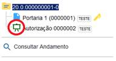


## alterarProcesso

| **Entrada** |
|---|
| `$objProcedimentoAPI`:<br><ul><li>Instância preenchida com IdProcedimento, IdTipoProcedimento e IdTipoPrioridade.</li></ul> |

## alterarPublicacao

| **Entrada** |
|---|
| `$objPublicacaoAPI`:<br><ul><li>Instância preenchida com IdPublicacao, IdDocumento, IdVeiculoPublicacao, StaTipoVeiculo e DataDisponibilizacao.</li></ul> |

## alterarVeiculoPublicacao

| **Entrada** |
|---|
| `$objVeiculoPublicacaoAPI`:<br><ul><li>Instância preenchida com IdVeiculoPublicacao, Nome, Descricao, StaTipo, SinFonteFeriados, SinPermiteExtraordinaria, SinExibirPesquisaInterna, WebService e SinAtivo.</li></ul> |

## anexarProcesso

| **Entrada** |
|---|
| `$objProcedimentoAPIPrincipal`:<br><ul><li>Instância preenchida com IdProcedimento e NumeroProtocolo.</li></ul> |
| `$objProcedimentoAPIAnexado`:<br><ul><li>Instância preenchida com IdProcedimento e NumeroProtocolo.</li></ul> |

## assinarDocumento

| **Entrada** |
|---|
| `$arrObjDocumentoAPI`:<br><ul><li>Instâncias preenchidas com IdDocumento, IdProcedimento, NumeroProtocolo, IdSerie, IdUnidadeGeradora, IdOrgaoUnidadeGeradora, IdUsuarioGerador, Tipo, SubTipo e NivelAcesso.</li></ul> |

## atualizarConteudoDocumento

| **Entrada** |
|---|
| `$objDocumentoAPI`:<br><ul><li>Instância preenchida com IdDocumento.</li></ul> |

## bloquearProcesso

| **Entrada** |
|---|
| `$arrObjProcedimentoAPI`:<br><ul><li>Instâncias preenchidas com IdProcedimento e NumeroProtocolo.</li></ul> |

## cadastrarContato

| **Entrada** |
|---|
| `$objContatoAPI`:<br><ul><li>Instância preenchida com IdContato, IdTipoContato, IdContatoAssociado, StaNatureza, SinEnderecoAssociado, StaGenero, Cpf, Rg, OrgaoExpedidor, Matricula, MatriculaOab, NumeroPassaporte, IdPaisPassaporte, DataNascimento, Cnpj, IdCargo, Sigla, Nome, NomeSocial, TelefoneFixo, TelefoneCelular, Email, SitioInternet, Endereco, Complemento, Bairro, Cep, Observacao, SinAtivo, IdPais, IdEstado e IdCidade.</li></ul> |

## cadastrarHipoteseLegal

| **Entrada** |
|---|
| `$objHipoteseLegalAPI`:<br><ul><li>Instância preenchida com IdHipoteseLegal, Nome, Descricao, BaseLegal, NivelAcesso e SinAtivo.</li></ul> |

## cadastrarVeiculoPublicacao

| **Entrada** |
|---|
| `$objVeiculoPublicacaoAPI`:<br><ul><li>Instância preenchida com IdVeiculoPublicacao, Nome, Descricao, StaTipo, SinFonteFeriados, SinPermiteExtraordinaria, SinExibirPesquisaInterna, WebService e SinAtivo.</li></ul> |

## cancelarAgendamentoPublicacao

| **Entrada** |
|---|
| `$objPublicacaoAPI`:<br><ul><li>Instância preenchida com IdPublicacao, IdDocumento, IdVeiculoPublicacao, StaTipoVeiculo e DataDisponibilizacao.</li></ul> |

## cancelarDocumento

| **Entrada** |
|---|
| `$objDocumentoAPI`:<br><ul><li>Instância preenchida com IdDocumento, NumeroProtocolo, IdSerie, IdUnidadeGeradora, Tipo, SubTipo e NivelAcesso.</li></ul> |

## cancelarDisponibilizacaoAcessoExterno

| **Entrada** |
|---|
| `$arrObjAcessoExternoAPI`:<br><ul><li>Instâncias preenchidas com IdAcessoExterno e Procedimento.IdProcedimento.</li></ul> |

## cancelarLiberacaoAssinaturaExterna

| **Entrada** |
|---|
| `$arrObjAcessoExternoAPI`:<br><ul><li>Instâncias preenchidas com IdAcessoExterno, Procedimento.IdProcedimento e Documento.IdDocumento.</li></ul> |

## confirmarAtualizacaoConteudoDocumento

| **Entrada** |
|---|
| `objDocumentoAPI`:<br><ul><li>Ocorrência de DocumentoAPI preenchida com IdDocumento.</li></ul> |
| **Saída** |
| `strMensagem`:<br><ul><li>Mensagem que será exibida antes de salvar o documento seguida pelo texto Deseja salvar o documento?</li></ul> |

**Exemplo:**

```php
public function confirmarAtualizacaoConteudoDocumento(DocumentoAPI $objDocumentoAPI){
  $ret = '';

  //if (...condicao...){
  $ret = 'A alteração do documento cancelará a solicitação.';
  //}
  return $ret;
}
```


## confirmarPublicacao

| **Entrada** |
|---|
| `$arrObjPublicacaoAPI`:<br><ul><li>Instâncias preenchidas com IdPublicacao, IdDocumento, IdSerieDocumento, IdVeiculoPublicacao, StaTipoVeiculo, DataDisponibilizacao e DataPublicacao.</li></ul> |

## concluirProcesso

| **Entrada** |
|---|
| `$arrObjProcedimentoAPI`:<br><ul><li>Instâncias preenchidas com IdProcedimento.</li></ul> |

## darCienciaDocumento

| **Entrada** |
|---|
| `$objDocumentoAPI`:<br><ul><li>Instâncias preenchidas com IdDocumento, IdProcedimento, NumeroProtocolo, IdSerie, IdUnidadeGeradora, IdOrgaoUnidadeGeradora, IdUsuarioGerador, Tipo, SubTipo e NivelAcesso.</li></ul> |

## darCienciaProcesso

| **Entrada** |
|---|
| `$objProcedimentoAPI`:<br><ul><li>Instâncias preenchidas com IdProcedimento, NumeroProtocolo, IdTipoProcedimento, IdUnidadeGeradora, IdOrgaoUnidadeGeradora, IdUsuarioGerador e NivelAcesso.</li></ul> |

## desanexarProcesso

| **Entrada** |
|---|
| `$objProcedimentoAPIPrincipal`:<br><ul><li>Instância preenchida com IdProcedimento e NumeroProtocolo.</li></ul> |
| `$objProcedimentoAPIAnexado`:<br><ul><li>Instância preenchida com IdProcedimento e NumeroProtocolo.</li></ul> |

## desativarArquivoExtensao

| **Entrada** |
|---|
| `$arrObjArquivoExtensaoAPI`:<br><ul><li>Instâncias preenchidas com IdArquivoExtensao e Extensao.</li></ul> |

## desativarContato

| **Entrada** |
|---|
| `$arrObjContatoAPI`:<br><ul><li>Instâncias preenchidas com IdContato, IdTipoContato, IdContatoAssociado, Sigla, Nome e NomeSocial.</li></ul> |

## desativarHipoteseLegal

| **Entrada** |
|---|
| `$arrObjHipoteseLegalAPI`:<br><ul><li>Instâncias preenchidas com IdHipoteseLegal, Nome, BaseLegal e NivelAcesso.</li></ul> |

## desativarTipoContato

| **Entrada** |
|---|
| `$arrObjTipoContatoAPI`:<br><ul><li>Instâncias preenchidas com IdTipoContato e Nome.</li></ul> |

## desativarTipoDocumento

| **Entrada** |
|---|
| `$arrObjSerieAPI`:<br><ul><li>Instâncias preenchidas com IdSerie, Nome e Aplicabilidade.</li></ul> |

## desativarTipoProcesso

| **Entrada** |
|---|
| `$arrObjTipoProcedimentoAPI`:<br><ul><li>Instâncias preenchidas com IdTipoProcedimento e Nome.</li></ul> |

## desativarUnidade

| **Entrada** |
|---|
| `$arrObjUnidadeAPI`:<br><ul><li>Instâncias preenchidas com IdUnidade, Sigla e Descricao.</li></ul> |

## desativarUsuario

| **Entrada** |
|---|
| `$arrObjUsuarioAPI`:<br><ul><li>Instâncias preenchidas com IdUsuario, Sigla, Nome e StaTipo.</li></ul> |

## desativarVeiculoPublicacao

| **Entrada** |
|---|
| `$arrObjVeiculoPublicacaoAPI`:<br><ul><li>Instâncias preenchidas com IdVeiculoPublicacao.</li></ul> |

## desbloquearProcesso

| **Entrada** |
|---|
| `$arrObjProcedimentoAPI`:<br><ul><li>Instâncias preenchidas com IdProcedimento e NumeroProtocolo.</li></ul> |

## eliminarDocumento

| **Entrada** |
|---|
| `$arrObjDocumentoAPI`:<br><ul><li>Instâncias preenchidas com IdDocumento e NumeroProtocolo.</li></ul> |

## eliminarProcesso

| **Entrada** |
|---|
| `$objProcedimentoAPI`:<br><ul><li>Instância preenchida com IdProcedimento e NumeroProtocolo.</li></ul> |

## enviarProcesso

| **Entrada** |
|---|
| `$arrObjProcedimentoAPI`:<br><ul><li>Instâncias preenchidas com IdProcedimento, NumeroProtocolo, IdTipoProcedimento, NomeTipoProcedimento e IdUnidadeGeradora.</li></ul> |
| `$arrObjUnidadeAPI`:<br><ul><li>Instâncias preenchidas com IdUnidade, Sigla, Descricao e OrgaoAPI (IdOrgao, Sigla, Descricao).</li></ul> |

## excluirArquivoExtensao

| **Entrada** |
|---|
| `$arrObjArquivoExtensaoAPI`:<br><ul><li>Instâncias preenchidas com IdArquivoExtensao e Extensao.</li></ul> |

## excluirContato

| **Entrada** |
|---|
| `$arrObjContatoAPI`:<br><ul><li>Instâncias preenchidas com IdContato, IdTipoContato, IdContatoAssociado, Sigla, Nome e NomeSocial.</li></ul> |

## excluirDocumento

| **Entrada** |
|---|
| `$objDocumentoAPI`:<br><ul><li>Instância preenchida com IdDocumento.</li></ul> |

## excluirHipoteseLegal

| **Entrada** |
|---|
| `$arrObjHipoteseLegalAPI`:<br><ul><li>Instâncias preenchidas com IdHipoteseLegal, Nome, BaseLegal e NivelAcesso.</li></ul> |

## excluirProcesso

| **Entrada** |
|---|
| `$objProcedimentoAPI`:<br><ul><li>Instância preenchida com IdProcedimento.</li></ul> |

## excluirTipoContato

| **Entrada** |
|---|
| `$arrObjTipoContatoAPI`:<br><ul><li>Instâncias preenchidas com IdTipoContato e Nome.</li></ul> |

## excluirTipoDocumento

| **Entrada** |
|---|
| `$arrObjSerieAPI`:<br><ul><li>Instâncias preenchidas com IdSerie, Nome e Aplicabilidade.</li></ul> |

## excluirTipoProcesso

| **Entrada** |
|---|
| `$arrObjTipoProcedimentoAPI`:<br><ul><li>Instâncias preenchidas com IdTipoProcedimento e Nome.</li></ul> |

## excluirUnidade

| **Entrada** |
|---|
| `$arrObjUnidadeAPI`:<br><ul><li>Instâncias preenchidas com IdUnidade, Sigla e Descricao.</li></ul> |

## excluirUsuario

| **Entrada** |
|---|
| `$arrObjUsuarioAPI`:<br><ul><li>Instâncias preenchidas com IdUsuario, Sigla, Nome e StaTipo.</li></ul> |

## excluirVeiculoPublicacao

| **Entrada** |
|---|
| `$arrObjVeiculoPublicacaoAPI`:<br><ul><li>Instâncias preenchidas com IdVeiculoPublicacao.</li></ul> |

## gerarDocumento

| **Entrada** |
|---|
| `$objDocumentoAPI`:<br><ul><li>Instância preenchida com IdDocumento, NumeroProtocolo, IdProcedimento, IdSerie, NivelAcesso, SubTipo, Numero, Data, IdUnidadeGeradora, DinValor, IdPlanoTrabalho, IdEtapaTrabalho, IdItemEtapa, IdOperacao e AtributosModulo.</li></ul> |

## gerarProcesso

| **Entrada** |
|---|
| `$objProcedimentoAPI`:<br><ul><li>Instância preenchida com IdProcedimento, NumeroProtocolo, IdTipoProcedimento, IdTipoPrioridade e NivelAcesso.</li></ul> |

## Inicializar

| **Entrada** |
|---|
| `strVersaoSEI`:<br><ul><li>Número da versão do SEI (exemplo: 3.1.0).</li></ul> |
| **Observações** |
| Esse método é chamado a cada acesso ao sistema e pode ser utilizado, por exemplo, para verificar a compatibilidade do módulo com a versão do SEI. Ele é executado em cada acesso ao sistema então se for necessário realizar um processamento complexo e demorado é recomendado o uso das classes SessaoSEI e CacheSEI para salvar o resultado na sessão do usuário ou no servidor memcache (garantindo que o processamento seja realizado apenas uma vez). |

## listarUnidadesEnvioProcesso

| **Entrada** |
|---|
| `$arrObjProcedimentoAPI`:<br><ul><li>Instâncias preenchidas com IdProcedimento, NumeroProtocolo, IdTipoProcedimento, NomeTipoProcedimento e IdUnidadeGeradora.</li></ul> |
| **Saída** |
| `$arrObjUnidadeAPI`:<br><ul><li>Instâncias preenchidas com IdUnidade.</li></ul> |

## montarAcaoControleAcessoExterno

| **Entrada** |
|---|
| `arrAcessoExternoAPI`:<br><ul><li>Conjunto de ocorrências de AcessoExternoAPI preenchidas com: IdAcessoExterno, DataValidade, SinAcessoProcesso, Procedimento (ocorrência de ProcedimentoAPI preenchida com IdProcedimento, NumeroProtocolo, IdTipoProcedimento, NomeTipoProcedimento, IdTipoPrioridade e NivelAcesso), Documento (ocorrência de DocumentoAPI preenchida com IdDocumento, NumeroProtocolo, IdSerie, IdUnidadeGeradora, Tipo, SinAssinado, SinPublicado e NivelAcesso).</li></ul> |
| **Saída** |
| `arrIcones`:<br><ul><li>Um array PHP indexado pelos IDs dos acessos externos onde cada posição contém outro array com o conjunto de ícones para exibição. Acessos externos que não devem exibir ícones do módulo não precisam estar no array. Para as imagens é recomendado utilizar o formato SVG com tamanho 24x24.</li></ul> |

**Exemplo:**

```php
public function montarAcaoControleAcessoExterno($arrObjAcessoExternoAPI){
  $arrIcones = array();
  foreach($arrObjAcessoExternoAPI as $objAcessoExternoAPI) {
    $arrIcones[$objAcessoExternoAPI->getIdAcessoExterno()][] = '<a href="javascript:void(0);" '.PaginaSEI::montarTitleTooltip('Ícone Ação Acesso Externo ABC','Módulo ABC').'></a>';
  }
  return $arrIcones;
}
```


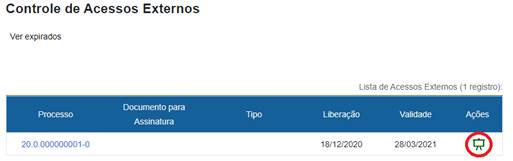


## montarAcaoDocumentoAcessoExternoAutorizado

| **Entrada** |
|---|
| `arrDocumentoAPI`:<br><ul><li>Conjunto de ocorrências de DocumentoAPI preenchidas com: IdDocumento, NumeroProtocolo, IdSerie, IdUnidadeGeradora, Tipo, SinAssinado, SinPublicado e NivelAcesso.</li></ul> |
| **Saída** |
| `arrIcones`:<br><ul><li>Um array PHP indexado pelos IDs dos documentos onde cada posição contém outro array com o conjunto de ícones para exibição. Documentos que não devem exibir ícones do módulo não precisam estar no array. Para as imagens é recomendado utilizar o formato SVG com tamanho 24x24.</li></ul> |

**Exemplo:**

```php
public function montarAcaoDocumentoAcessoExternoAutorizado($arrObjDocumentoAPI){
  $arrIcones = array();
  foreach($arrObjDocumentoAPI as $objDocumentoAPI) {
    $arrIcones[$objDocumentoAPI->getIdDocumento()][] = '<a href="javascript:void(0);" '.PaginaSEI::montarTitleTooltip('Ícone Ação Documento Acesso Externo Autorizado ABC','Módulo ABC').'></a>';
  }
  return $arrIcones;
}
```


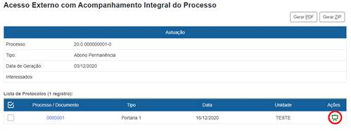


## montarAcaoDocumentoAcessoExternoNegado

| **Entrada** |
|---|
| `arrDocumentoAPI`:<br><ul><li>Conjunto de ocorrências de DocumentoAPI preenchidas com:<br> IdDocumento, NumeroProtocolo, IdSerie, IdUnidadeGeradora, Tipo, SinAssinado, SinPublicado e NivelAcesso.</li></ul> |
| **Saída** |
| `arrIcones`:<br><ul><li>Um array PHP indexado pelos IDs dos documentos onde cada posição contém outro array com o conjunto de ícones para exibição. Documentos que não devem exibir ícones do módulo não precisam estar no array. Para as imagens é recomendado utilizar o formato SVG com tamanho 24x24.</li></ul> |

**Exemplo:**

```php
public function montarAcaoDocumentoAcessoExternoNegado($arrObjDocumentoAPI){
  $arrIcones = array();
  foreach($arrObjDocumentoAPI as $objDocumentoAPI) {
    $arrIcones[$objDocumentoAPI->getIdDocumento()][] = '<a href="javascript:void(0);" '.PaginaSEI::montarTitleTooltip('Ícone Ação Documento Acesso Externo Negado ABC','Módulo ABC').'></a>';
  }
  return $arrIcones;
}
```


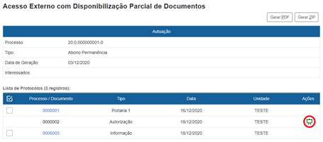


## montarAcaoProcessoAnexadoAcessoExternoAutorizado

| **Entrada** |
|---|
| `arrProcedimentoAPI`:<br><ul><li>Conjunto de ocorrências de ProcedimentoAPI preenchidas com:<br> IdProcedimento, NumeroProtocolo, IdTipoProcedimento, NomeTipoProcedimento e NivelAcesso.</li></ul> |
| **Saída** |
| `arrIcones`:<br><ul><li>Um array PHP indexado pelos IDs dos processos onde cada posição contém outro array com o conjunto de ícones para exibição. Processos que não devem exibir ícones do módulo não precisam estar no array. Para as imagens é recomendado utilizar o formato SVG com tamanho 24x24.</li></ul> |

**Exemplo:**

```php
public function montarAcaoProcessoAnexadoAcessoExternoAutorizado($arrObjProcedimentoAPI){
  $arrIcones = array();
  foreach($arrObjProcedimentoAPI as $objProcedimentoAPI) {
    $arrIcones[$objProcedimentoAPI->getIdProcedimento()][] = '<a href="javascript:void(0);" '.PaginaSEI::montarTitleTooltip('Ícone Ação Processo Anexado Acesso Externo Autorizado ABC','Módulo ABC').'></a>';
  }
  return $arrIcones;
}
```


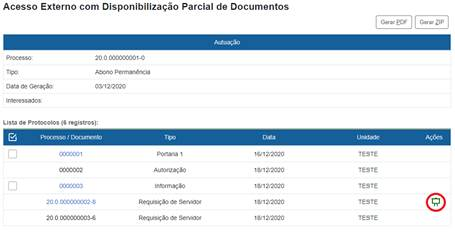


## montarAcaoProcessoAnexadoAcessoExternoNegado

| **Entrada** |
|---|
| `arrProcedimentoAPI`:<br><ul><li>Conjunto de ocorrências de ProcedimentoAPI preenchidas com:<br> IdProcedimento, NumeroProtocolo, IdTipoProcedimento, NomeTipoProcedimento e NivelAcesso.</li></ul> |
| **Saída** |
| `arrIcones`:<br><ul><li>Um array PHP indexado pelos IDs dos processos onde cada posição contém outro array com o conjunto de ícones para exibição. Processos que não devem exibir ícones do módulo não precisam estar no array. Para as imagens é recomendado utilizar o formato SVG com tamanho 24x24.</li></ul> |

**Exemplo:**

```php
public function montarAcaoProcessoAnexadoAcessoExternoNegado($arrObjProcedimentoAPI){
  $arrIcones = array();
  foreach($arrObjProcedimentoAPI as $objProcedimentoAPI) {
    $arrIcones[$objProcedimentoAPI->getIdProcedimento()][] = '<a href="javascript:void(0);" '.PaginaSEI::montarTitleTooltip('Ícone Ação Processo Anexado Acesso Externo Negado ABC','Módulo ABC').'></a>';
  }
  return $arrIcones;
}
```


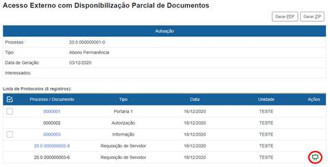


## montarAcaoPublicacao

| **Entrada** |
|---|
| `arrObjPublicacaoAPI`:<br><ul><li>Conjunto de ocorrências de PublicacaoAPI preenchidas com:<br> IdPublicacao, IdDocumento e Estado.</li></ul> |
| **Saída** |
| `arrIcones`:<br><ul><li>Um array PHP indexado pelos IDs das publicações que possuem ações liberadas pelo módulo. Cada posição contém outro array com o conjunto de ícones para exibição. Para as imagens é recomendado utilizar o formato SVG com tamanho 24x24.</li></ul> |

**Exemplo:**

```php
public function montarAcaoPublicacao($arrObjPublicacaoAPI){
  $arrIcones = array();
  foreach($arrObjPublicacaoAPI as $objPublicacaoAPI) {
    $arrIcones[$objPublicacaoAPI->getIdPublicacao()][] = '<a href="javascript:void(0);" '.PaginaSEI::montarTitleTooltip('Ícone Ação Publicação ABC','Módulo ABC').'></a>';
  }
  return $arrIcones;
}
```


## montarAcaoVeiculoPublicacao

| **Entrada** |
|---|
| `arrObjVeiculoPublicacaoAPI`:<br><ul><li>Conjunto de ocorrências de VeiculoPublicacaoAPI preenchidas com:<br> IdVeiculoPublicacao e Nome.</li></ul> |
| **Saída** |
| `arrIcones`:<br><ul><li>Um array PHP indexado pelos IDs dos veículos que possuem ações liberadas pelo módulo. Cada posição contém outro array com o conjunto de ícones para exibição. Para as imagens é recomendado utilizar o formato SVG com tamanho 24x24.</li></ul> |

**Exemplo:**

```php
public function montarAcaoVeiculoPublicacao($arrObjVeiculoPublicacaoDTO){
  $arrIcones = array();
  foreach($arrObjVeiculoPublicacaoDTO as $objVeiculoPublicacaoAPI) {
    $arrIcones[$objVeiculoPublicacaoAPI->getIdVeiculoPublicacao()][] = '<a href="javascript:void(0);" '.PaginaSEI::montarTitleTooltip('Ícone Ação Veículo Publicação ABC','Módulo ABC').'></a>';
  }
  return $arrIcones;
}
```


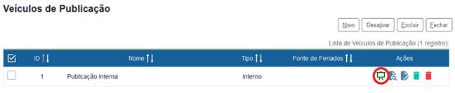


## montarBotaoAcessoExternoAutorizado

| **Entrada** |
|---|
| `objProcedimentoAPI`:<br><ul><li>Ocorrência de ProcedimentoAPI preenchida com: IdProcedimento, NumeroProtocolo, IdTipoProcedimento, NomeTipoProcedimento, IdTipoPrioridade e NivelAcesso.</li></ul> |
| **Saída** |
| `arrBotoes`:<br><ul><li>Um array PHP onde cada item representa um botão.</li></ul> |

**Exemplo:**

```php
public function montarBotaoAcessoExternoAutorizado(ProcedimentoAPI $objProcedimentoAPI){
  $arrBotoes = array();
  $arrBotoes[] = '<button type="button" id="btnExemploABC1" name="btnExemploABC1" value="ABC 1" class="infraButton">ABC 1</button>';
  $arrBotoes[] = '<button type="button" id="btnExemploABC2" name="btnExemploABC2" value="ABC 2" class="infraButton">ABC 2</button>';
  return $arrBotoes;
}
```


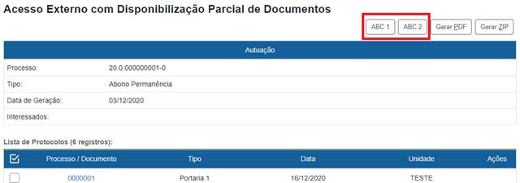


## montarBotaoAssinaturaExterno

| **Entrada** |
|---|
| `objUsuarioAPI`:<br><ul><li>Ocorrência de UsuarioAPI preenchida com: IdUsuario, Sigla, Nome e StaTipo.</li></ul> |
| **Saída** |
| `strHtml`:<br><ul><li>Código HTML do botão.</li></ul> |

**Exemplo:**

```php
public function montarBotaoAssinaturaExterno(UsuarioAPI $objUsuarioAPI){
  return '<button type="button" id="btnAbc" value="Assinar Externo ABC" class="infraButton">Assinar Externo ABC</button>';
}
```


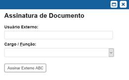


## montarBotaoAssinaturaInterno

| **Entrada** |
|---|
| `objUsuarioAPI`:<br><ul><li>Ocorrência de UsuarioAPI preenchida com: IdUsuario, Sigla, Nome e StaTipo.</li></ul> |
| **Saída** |
| `strHtml`:<br><ul><li>Código HTML do botão.</li></ul> |

**Exemplo:**

```php
public function montarBotaoAssinaturaInterno(UsuarioAPI $objUsuarioAPI){
  return '<button type="button" id="btnAbc" value="Assinar Interno ABC" class="infraButton">Assinar Interno ABC</button>';
}
```


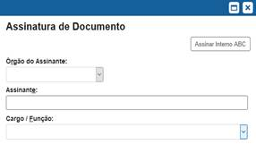


## montarBotaoChatIA

| **Saída** |
|---|
| `strBotao`:<br><ul><li>Texto com o código do botão para inclusão na página.</li></ul> |

## montarBotaoControleAcessoExterno

| **Saída** |
|---|
| `arrBotoes`:<br><ul><li>Um array PHP onde cada item representa um botão.</li></ul> |

**Exemplo:**

```php
public function montarBotaoControleAcessoExterno(){
  $arrBotoes = array();
  $arrBotoes[] = '<button type="button" id="btnExemploABC1" name="btnExemploABC1" value="ABC 1" class="infraButton">ABC 1</button>';
  $arrBotoes[] = '<button type="button" id="btnExemploABC2" name="btnExemploABC2" value="ABC 2" class="infraButton">ABC 2</button>';
  return $arrBotoes;
}
```


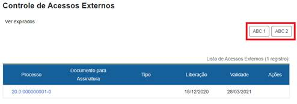


## montarBotaoControleProcessos

| **Saída** |
|---|
| `arrBotoes`:<br><ul><li>Um array PHP onde cada item representa um botão. Para as imagens<br> é recomendado utilizar o formato SVG com tamanho 24x24.</li></ul> |

**Exemplo:**

```php
public function montarBotaoControleProcessos(){
  $arrBotoes = array();
  /* Função javascript disponível na página de Controle de Processos: 
    acaoControleProcessos(link, requerSelecionado, aceitaSigiloso)
    onde: link - link para a página
    requerSelecionado - true/false, indica necessidade ou não de selecionar processos para executar a acao
    aceitaSigiloso - true/false, indica se o usuario podera selecionar processos sigilosos
  */
  if (SessaoSEI::getInstance()->verificarPermissao('md_abc_andamento_lancar'))
  {
    $arrBotoes[] = '<a href="#" onclick="return
        acaoControleProcessos(\'' . SessaoSEI::getInstance()->assinarLink('controlador.php?acao=md_abc_andamento_lancar&acao_origem=procedimento_controlar&acao_retorno=procedimento_controlar') . '\', true, false);" tabindex="' . PaginaSEI::getInstance()->getProxTabBarraComandosSuperior() . '" class="botaoSEI">
    </a>';
  }
  return $arrBotoes;
}
```


## montarBotaoDocumento

| **Entrada** |
|---|
| `objProcedimentoAPI`:<br><ul><li>Ocorrência de ProcedimentoAPI preenchida com: IdProcedimento, NumeroProtocolo, IdTipoProcedimento, NomeTipoProcedimento, IdTipoPrioridade, NivelAcesso, GrauSigilo, IdHipoteseLegal, IdUnidadeGeradora, IdOrgaoUnidadeGeradora, CodigoAcesso e SinAberto.</li></ul> |
| `$arrObjDocumentoAPI`:<br><ul><li>Conjunto de ocorrências de DocumentoAPI preenchidas com: IdDocumento, NumeroProtocolo, IdSerie, NomeSerie, IdUnidadeGeradora, IdOrgaoUnidadeGeradora, SinAssinado, SinPublicado, SinBloqueado, CodigoAcesso, Tipo, SubTipo.</li></ul> |
| **Saída** |
| `arrBotoes`:<br><ul><li>Um array PHP indexado pelos IDs dos documentos onde cada posição contém outro array com o conjunto de botões para exibição junto ao documento. Documentos que não devem exibir botões do módulo não precisam estar no array. Para as imagens é recomendado utilizar o formato SVG com tamanho 40x40.</li></ul> |

**Exemplo:**

```php
public function montarBotaoDocumento(ProcedimentoAPI $objProcedimentoAPI, $arrObjDocumentoAPI){
  $arrBotoes = array();
  if ($objProcedimentoAPI->getCodigoAcesso() > 0 && $objProcedimentoAPI->getSinAberto()=='S'){
    $dblIdProcedimento = $objProcedimentoAPI->getIdProcedimento();
    $bolAcaoAbcDocumentoProcessar = SessaoSEI::getInstance()->verificarPermissao('md_abc_documento_processar');
    //$bolAcaoAbcDocumentoProcessar2 = SessaoSEI::getInstance()->verificarPermissao('md_abc_documento_processar2');
    //$bolAcaoAbcDocumentoProcessar3 = SessaoSEI::getInstance()->verificarPermissao('md_abc_documento_processar3');
    //$bolAcaoAbcDocumentoProcessarN = SessaoSEI::getInstance()->verificarPermissao('md_abc_documento_processarN');
    foreach ($arrObjDocumentoAPI as $objDocumentoAPI) {
      if ($objDocumentoAPI->getCodigoAcesso() > 0) {
        $dblIdDocumento = $objDocumentoAPI->getIdDocumento();
        $arrBotoes[$dblIdDocumento] = array();
        if ($bolAcaoAbcDocumentoProcessar) {
          $arrBotoes[$dblIdDocumento][] = '<a href="#"
            onclick="location.href=\\\'' . SessaoSEI::getInstance()->assinarLink('controlador.php?acao=md_abc_documento_processar&id_procedimento=' . $dblIdProcedimento . '&id_documento=' . $dblIdDocumento . '&arvore=1') . '\\\';"
            tabindex="' . PaginaSEI::getInstance()->getProxTabBarraComandosSuperior() . '" class="botaoSEI"></a>';
        }
        /*
        if ($bolAcaoAbcDocumentoProcessar2) {
          $arrBotoes[$dblIdDocumento][] = '...';
        }
        if ($bolAcaoAbcDocumentoProcessar3) {
          $arrBotoes[$dblIdDocumento][] = '...';
        }
        if ($bolAcaoAbcDocumentoProcessarN) {
          $arrBotoes[$dblIdDocumento][] = '...';
        }
        */
      }
    }
  }
  return $arrBotoes;
}
```


## montarBotaoCadastroDocumento

| **Entrada** |
|---|
| `objDocumentoAPI`:<br><ul><li>Ocorrência de DocumentoAPI preenchida com: IdProcedimento, IdDocumento, IdSerie, Data, IdUnidadeGeradora, Numero, NomeArvore, DinValor, IdPlanoTrabalho e Tipo.</li></ul> |
| **Saída** |
| `arrBotoes`:<br><ul><li>Um array PHP onde cada item representa um botão.</li></ul> |

**Exemplo:**

```php
public function montarBotaoCadastroDocumento(DocumentoAPI $objDocumentoAPI){
  $arrBotoes = array();

  $objInfraParametro = new InfraParametro(BancoSEI::getInstance());
  $numIdSerieEmpenho = $objInfraParametro->getValor('MD_ABC_ID_SERIE_EMPENHO', false);
  if ($objDocumentoAPI->getIdSerie()==$numIdSerieEmpenho) {
    $arrBotoes[] = '<button type="button"
    id="btnMdAbcImportarDados" onclick="..."
    class="infraButton">Importar Dados</button>';
  }
  return $arrBotoes;
}
```


## montarBotaoLoginExterno

| **Saída** |
|---|
| `strHtml`:<br><ul><li>Código HTML do botão.</li></ul> |

**Exemplo:**

```php
public function montarBotaoLoginExterno()
{
  return '<button type="button" id="btnAbc" class="btn text-white infraCorBarraSuperior w-100">ABC</button>';
}
```


## montarBotaoProcesso

| **Entrada** |
|---|
| `objProcedimentoAPI`:<br><ul><li>Ocorrência de ProcedimentoAPI preenchida com: IdProcedimento, NumeroProtocolo, IdTipoProcedimento, NomeTipoProcedimento, IdTipoPrioridade, NivelAcesso, GrauSigilo, IdHipoteseLegal, IdUnidadeGeradora, IdOrgaoUnidadeGeradora, CodigoAcesso e SinAberto.</li></ul> |
| **Saída** |
| `arrBotoes`:<br><ul><li>Um array PHP onde cada item representa um botão. Para as imagens é recomendado utilizar o formato SVG com tamanho 40x40.</li></ul> |

**Exemplo:**

```php
public function montarBotaoProcesso(ProcedimentoAPI $objProcedimentoAPI){
  $arrBotoes = array();
  if (SessaoSEI::getInstance()->verificarPermissao('md_abc_processo_processar') && $objProcedimentoAPI->getSinAberto()=='S' && $objProcedimentoAPI->getCodigoAcesso() > 0) {
    $arrBotoes[] = '<a href="#" onclick="location.href=\\\'' . SessaoSEI::getInstance()->assinarLink('controlador.php?acao=md_abc_processo_processar&id_procedimento=' . $objProcedimentoAPI->getIdProcedimento() . '&arvore=1') . '\\\';" tabindex="' . PaginaSEI::getInstance()->getProxTabBarraComandosSuperior() . '" class="botaoSEI"></a>';
  }
  return $arrBotoes;
}
```


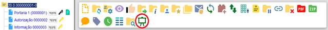


## montarBotaoVeiculoPublicacao

| **Entrada** |
|---|
| `arrObjVeiculoPublicacaoAPI`:<br><ul><li>Conjunto de ocorrências de VeiculoPublicacaoAPI preenchidas com:<br> IdVeiculoPublicacao e Tipo.</li></ul> |
| **Saída** |
| `arrBotoes`:<br><ul><li>Um array indexado pelos Ids dos veículos de publicação e pelos identificadores dos botões contendo o código html do botão. é importante que o ID do botão informado no índice do array seja o mesmo da tag id do html, pois essa informação será utilizada para controlar a visualização de acordo com o veículo selecionado na tela.</li></ul> |

**Exemplo:**

```php
public function montarBotaoVeiculoPublicacao($arrObjVeiculoPublicacaoAPI){
  $arrBotoes = array();
  $objInfraParametro = new InfraParametro(BancoSEI::getInstance());
  $numIdVeiculoPublicacaoAbc = $objInfraParametro->getValor('MD_ABC_ID_VEICULO_PUBLICACAO', false);
  foreach($arrObjVeiculoPublicacaoAPI as $objVeiculoPublicacaoAPI) {
    if ($objVeiculoPublicacaoAPI->getIdVeiculoPublicacao()==$numIdVeiculoPublicacaoAbc) {
      $arrBotoes[$objVeiculoPublicacaoAPI->getIdVeiculoPublicacao()]['btnMdABCExemplo1'] = '<button type="button" id="btnMdABCExemplo1" name="btnMdABCExemplo1" onclick="alert(\'Alert ABC 1\');" value="ABC 1" class="infraButton">ABC 1</button>';
      $arrBotoes[$objVeiculoPublicacaoAPI->getIdVeiculoPublicacao()]['btnMdABCExemplo2'] = '<button type="button" id="btnMdABCExemplo2" name="btnMdABCExemplo2" onclick="if(this.form.onsubmit()){this.form.action=\''.SessaoSEI::getInstance()->assinarLink('controlador.php?acao=....').'\';this.form.submit();}" value="ABC 2" class="infraButton">ABC 2</button>';
    }
  }
  return $arrBotoes;
}
```


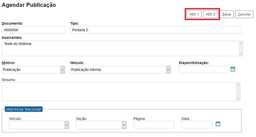


## montarDadosImprensaNacional

| **Entrada** |
|---|
| `objPublicacaoAPI`:<br><ul><li>Instância de PublicacaoAPI preenchida com: IdPublicacao, IdVeiculoPublicacao e StaTipoVeiculo.</li></ul> |
| **Saída** |
| `texto`:<br><ul><li>Texto da Imprensa Nacional para exibição na tela de publicações do documento, na tela de pesquisa de publicações e no carimbo de publicação do documento.</li></ul> |

**Exemplo:**

```php
public function montarDadosImprensaNacional(PublicacaoAPI $objPublicacaoAPI){
  return 'Texto Imprensa Nacional ABC';
}
```


## montarIconeAcompanhamentoEspecial

| **Entrada** |
|---|
| `arrObjProcedimentoAPI`:<br><ul><li>Conjunto de ocorrências de ProcedimentoAPI preenchidas com:<br> IdProcedimento, NumeroProtocolo, IdTipoProcedimento, NomeTipoProcedimento, IdTipoPrioridade, NivelAcesso, GrauSigilo, IdHipoteseLegal, IdUnidadeGeradora e IdOrgaoUnidadeGeradora.</li></ul> |
| **Saída** |
| `arrIcones`:<br><ul><li>Um array PHP indexado pelos IDs dos processos onde cada posição contém outro array com o conjunto de ícones para exibição junto ao processo. Processos que não devem exibir ícones do módulo não precisam estar no array. Para as imagens é recomendado utilizar o formato SVG com tamanho 24x24.</li></ul> |

**Exemplo:**

```php
public function montarIconeAcompanhamentoEspecial($arrObjProcedimentoAPI){
  $arrIcones = array();
  foreach($arrObjProcedimentoAPI as $objProcedimentoAPI) {
    $arrIcones[$objProcedimentoAPI->getIdProcedimento()][] = '<a href="javascript:void(0);" '.PaginaSEI::montarTitleTooltip('Ícone Acompanhamento Especial ABC','Módulo ABC').'></a>';
  }
  return $arrIcones;
}
```


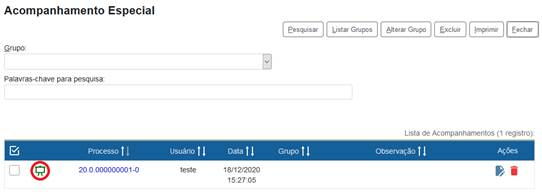


## montarIconeControleProcessos

| **Entrada** |
|---|
| `arrObjProcedimentoAPI`:<br><ul><li>Conjunto de ocorrências de ProcedimentoAPI preenchidas com:<br> IdProcedimento, NumeroProtocolo, IdTipoProcedimento, NomeTipoProcedimento, NivelAcesso, GrauSigilo, IdHipoteseLegal, IdUnidadeGeradora e IdOrgaoUnidadeGeradora.</li></ul> |
| **Saída** |
| `arrIcones`:<br><ul><li>Um array PHP indexado pelos IDs dos processos onde cada posição contém outro array com o conjunto de ícones para exibição junto ao processo. Processos que não devem exibir ícones do módulo não precisam estar no array. Para as imagens é recomendado utilizar o formato SVG com tamanho 24x24.</li></ul> |

**Exemplo:**

```php
public function montarIconeControleProcessos($arrObjProcedimentoAPI){
  $arrIcones = array();
  foreach($arrObjProcedimentoAPI as $objProcedimentoAPI) {
    $arrIcones[$objProcedimentoAPI->getIdProcedimento()][] = '<a href="javascript:void(0);" '.PaginaSEI::montarTitleTooltip('Ícone Controle de Processos ABC','Módulo ABC').'></a>';
  }
  return $arrIcones;
}
```


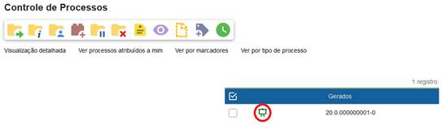


## montarIconeDocumento

| **Entrada** |
|---|
| `objProcedimentoAPI`:<br><ul><li>Ocorrência de ProcedimentoAPI preenchida com: IdProcedimento, NumeroProtocolo, IdTipoProcedimento, NomeTipoProcedimento, IdTipoPrioridade, NivelAcesso, GrauSigilo, IdHipoteseLegal, IdUnidadeGeradora, IdOrgaoUnidadeGeradora, CodigoAcesso e SinAberto.</li></ul> |
| `$arrObjDocumentoAPI`:<br><ul><li>Conjunto de ocorrências de DocumentoAPI preenchidas com:<br> IdDocumento, NumeroProtocolo, IdSerie, NomeSerie, IdUnidadeGeradora, IdOrgaoUnidadeGeradora, SinAssinado, SinPublicado, SinBloqueado, CodigoAcesso, Tipo, SubTipo.</li></ul> |
| **Saída** |
| `arrIcones`:<br><ul><li>Um array PHP indexado pelos IDs dos documentos onde cada posição contém um array de ocorrências de ArvoreAcaoItemAPI com os<br> ícones para exibição junto ao documento. Documentos que não devem exibir ícones do módulo não precisam estar no array.</li></ul> |

**Exemplo:**

```php
public function montarIconeDocumento(ProcedimentoAPI $objProcedimentoAPI, $arrObjDocumentoAPI){
  $arrIcones = array();
  if ($objProcedimentoAPI->getCodigoAcesso() > 0 && $objProcedimentoAPI->getSinAberto()=='S') {
    $bolAcaoAbcDocumentoProcessar = SessaoSEI::getInstance()->verificarPermissao('md_abc_documento_processar');
    foreach ($arrObjDocumentoAPI as $objDocumentoAPI) {
      if ($objDocumentoAPI->getCodigoAcesso() > 0) {
        $dblIdDocumento = $objDocumentoAPI->getIdDocumento();
        $arrIcones[$dblIdDocumento] = array();
        if ($bolAcaoAbcDocumentoProcessar) {
          $objArvoreAcaoItemAPI = new ArvoreAcaoItemAPI();
          $objArvoreAcaoItemAPI->setTipo('MD_ABC_DOCUMENTOS');
          $objArvoreAcaoItemAPI->setId('MD_ABC_DOC_' . $dblIdDocumento);
          $objArvoreAcaoItemAPI->setIdPai($dblIdDocumento);
          $objArvoreAcaoItemAPI->setTitle('Ícone Documento ABC');
          $objArvoreAcaoItemAPI->setIcone('modulos/abc/exemplo/svg/exemplo.svg');
          $objArvoreAcaoItemAPI->setTarget(null);
          $objArvoreAcaoItemAPI->setHref('javascript:alert(\'Ícone Documento ABC\');');
          //$objArvoreAcaoItemAPI->setTarget('_blank');
          //$objArvoreAcaoItemAPI->setTarget('ifrVisualizacao');
          //$objArvoreAcaoItemAPI->setHref(SessaoSEI::getInstance()->assinarLink('controlador.php?acao=md_abc_documento_processar&id_procedimento=' . $dblIdProcedimento . '&id_documento=' . $dblIdDocumento . '&arvore=1'));

          $objArvoreAcaoItemAPI->setSinHabilitado('S');
          $arrIcones[$dblIdDocumento][] = $objArvoreAcaoItemAPI;
        }
      }
    }
  }
  return $arrIcones;
}
```


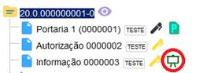


## montarIconeOrdenarArvore

| **Entrada** |
|---|
| `objProcedimentoAPI`:<br><ul><li>Ocorrência de ProcedimentoAPI preenchida com: IdProcedimento.</li></ul> |
| **Saída** |
| `$strIcone`:<br><ul><li>Ícone para exibição.</li></ul> |

**Exemplo:**

```php
public function montarIconeOrdenarArvore(ProcedimentoAPI $objProcedimentoAPI){
  return '<a href="#" onclick="alert(\'Ícone Ordenar Árvore ABC\')">getProxTabDados().'" /></a>';
}
```


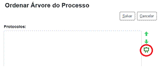


## montarIconeProcesso

| **Entrada** |
|---|
| `objProcedimentoAPI`:<br><ul><li>Ocorrência de ProcedimentoAPI preenchida com: IdProcedimento, NumeroProtocolo, IdTipoProcedimento, NomeTipoProcedimento, IdTipoPrioridade, NivelAcesso, GrauSigilo, IdHipoteseLegal, IdUnidadeGeradora, IdOrgaoUnidadeGeradora, CodigoAcesso e SinAberto.</li></ul> |
| **Saída** |
| `arrObjArvoreAcaoItemAPI`:<br><ul><li>Conjunto de ocorrências da estrutura ArvoreAcaoItemAPI.</li></ul> |

**Exemplo:**

```php
public function montarIconeProcesso(ProcedimentoAPI $objProcedimentoAPI){
  $arrObjArvoreAcaoItemAPI = array();
  if (SessaoSEI::getInstance()->verificarPermissao('md_abc_processo_processar') && $objProcedimentoAPI->getCodigoAcesso() > 0 && $objProcedimentoAPI->getSinAberto()=='S') {
    $dblIdProcedimento = $objProcedimentoAPI->getIdProcedimento();
    $objArvoreAcaoItemAPI = new ArvoreAcaoItemAPI();
    $objArvoreAcaoItemAPI->setTipo('MD_ABC_PROCESSO');
    $objArvoreAcaoItemAPI->setId('MD_ABC_PROC_' . $dblIdProcedimento);
    $objArvoreAcaoItemAPI->setIdPai($dblIdProcedimento);
    $objArvoreAcaoItemAPI->setTitle('Ícone Processo ABC');
    $objArvoreAcaoItemAPI->setIcone('modulos/abc/exemplo/svg/exemplo.svg');
    $objArvoreAcaoItemAPI->setTarget(null);
    $objArvoreAcaoItemAPI->setHref('javascript:alert(\'Ícone Processo ABC\');');
    //$objArvoreAcaoItemAPI->setTarget('_blank');
    //$objArvoreAcaoItemAPI->setTarget('ifrVisualizacao');
    //$objArvoreAcaoItemAPI->setHref(SessaoSEI::getInstance()->assinarLink('controlador.php?acao=md_abc_processo_processar&id_procedimento=' . $dblIdProcedimento . '&arvore=1'));
    $objArvoreAcaoItemAPI->setSinHabilitado('S');
    $arrObjArvoreAcaoItemAPI[] = $objArvoreAcaoItemAPI;
  }
  return $arrObjArvoreAcaoItemAPI;
}
```


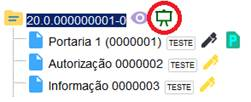


## montarIconeSistema

| **Saída** |
|---|
| `arrIcones`:<br><ul><li>Um array PHP com o conjunto de ícones para exibição na barra superior. Para as imagens é recomendado utilizar o formato SVG com tamanho 24x24.</li></ul> |

**Exemplo:**

```php
public function montarIconeSistema(){
  $arrIcones = array();
  if (SessaoSEI::getInstance()->verificarPermissao('md_abc_processo_processar'))
  {
    $arrIcones[] = '<a class="align-self-center d-none d-md-block"
      href="'.SessaoSEI::getInstance()->assinarLink('controlador.php?acao=md_abc_processo_processar').'"
      title="Botão Sistema Padrão ABC"
      tabindex="' .PaginaSEI::getInstance()->getProxTabBarraSistema().'">
      
    </a>

    <span title="Controle de Processos" class="nav-link d-flex d-md-none" >
      
      <a class="align-self-center text-white pl-1" href="'.SessaoSEI::getInstance()->assinarLink('controlador.php?acao=md_abc_processo_processar').'"
      title="Botão Sistema Móvel ABC" tabindex="' . PaginaSEI::getInstance()->getProxTabBarraSistema() . '" >
      Botão Sistema Móvel ABC
      </a>
    </span>';
  }
  return $arrIcones;
}
```


## montarMensagemProcesso

| **Entrada** |
|---|
| `objProcedimentoAPI`:<br><ul><li>Ocorrência de ProcedimentoAPI preenchida com: IdProcedimento, NumeroProtocolo, IdTipoProcedimento, NomeTipoProcedimento, IdTipoPrioridade, NivelAcesso, GrauSigilo, IdHipoteseLegal, IdUnidadeGeradora, IdOrgaoUnidadeGeradora, CodigoAcesso e SinAberto.</li></ul> |
| **Saída** |
| `strMsg`:<br><ul><li>Texto da mensagem.</li></ul> |

**Exemplo:**

```php
public function montarMensagemProcesso(ProcedimentoAPI $objProcedimentoAPI){
  $strMsg = null;
  $objInfraParametro = new InfraParametro(BancoSEI::getInstance());
  $numIdTipoProcAbc = $objInfraParametro->getValor('MD_ABC_ID_TIPO_PROCEDIMENTO_TESTE', false);
  if ($objProcedimentoAPI->getSinAberto()=='S' && $objProcedimentoAPI->getIdTipoProcedimento()==$numIdTipoProcAbc) {
    $strMsg = 'Mensagem do módulo ABC...';
  }
  return $strMsg;
}
```


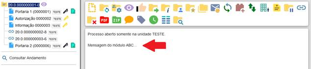


## montarMenuConsultaProcessual

| **Saída** |
|---|
| `$arrItens`:<br><ul><li>Um array de itens montados com a estrutura:<br> *[nível]\^[url]\^[título]\^[rótulo]\^[target (opcional)]*</li><li>Onde o nível é representado pelo número de "hífens" informados.</li></ul> |

## montarMenuPublicacoes

| **Saída** |
|---|
| `$arrItens`:<br><ul><li>Um array de itens montados com a estrutura:<br> *[nível]\^[url]\^[título]\^[rótulo]\^[target (opcional)]*</li><li>Onde o nível é representado pelo número de hífens informados.</li></ul> |

**Exemplo:**

```php
public function montarMenuPublicacoes(){
  $strURL = ConfiguracaoSEI::getInstance()->getValor('SEI','URL');
  $arrMenu = array();
  $arrMenu[] = '-^'.$strURL.'/publicacoes/controlador_publicacoes.php?acao=md_abc_publicacao_exemplo^Formulário Exemplo ABC - Publicações^Publicação ABC';
  $arrMenu[] = '-^#^Sites de busca sugeridos^Sites de Busca';
  $arrMenu[] = '--^http://www.google.com^Página do Google^Google^_blank';
  $arrMenu[] = '--^http://br.search.yahoo.com^Página do Yahoo!^Yahoo!^_blank';
  return $arrMenu;
}
```


## montarMenuUsuarioExterno

| **Saída** |
|---|
| `$arrItens`:<br><ul><li>Um array de itens montados com a estrutura:<br> *[nível]\^[url]\^[título]\^[rótulo]\^[target (opcional)]*</li><li>Onde o nível é representado pelo número de hífens informados.</li></ul> |

**Exemplo:**

```php
public function montarMenuUsuarioExterno(){
  $strURL = ConfiguracaoSEI::getInstance()->getValor('SEI','URL');
  $arrMenu = array();
  $arrMenu[] = '-^'.$strURL.'/controlador_externo.php?acao=md_abc_usuario_externo_exemplo^Formulário Exemplo ABC - Usuário Externo^Usuário Externo ABC';
  $arrMenu[] = '-^#^Sites de busca sugeridos^Sites de Busca';
  $arrMenu[] = '--^http://www.google.com^Página do Google^Google^_blank';
  $arrMenu[] = '--^http://br.search.yahoo.com^Página do Yahoo!^Yahoo!^_blank';
  return $arrMenu;
}
```


## montarTextoInformativoPublicacao

| **Entrada** |
|---|
| `objPublicacaoAPI`:<br><ul><li>Instância de PublicacaoAPI preenchida com: IdPublicacao, IdVeiculoPublicacao, StaTipoVeiculo e IdDocumento.</li></ul> |
| **Saída** |
| `texto`:<br><ul><li>Texto para exibição junto ao documento após a publicação.</li></ul> |

**Exemplo:**

```php
public function montarTextoInformativoPublicacao(PublicacaoAPI $objPublicacaoAPI){
  return 'Texto Informativo Publicação ABC';
}
```


## moverDocumento

| **Entrada** |
|---|
| `$objDocumentoAPI`:<br><ul><li>Instância preenchida com IdDocumento e NumeroProtocolo.</li></ul> |
| `$objProcedimentoAPIOrigem`:<br><ul><li>Instância preenchida com IdProcedimento e NumeroProtocolo.</li></ul> |
| `$objProcedimentoAPIDestino`:<br><ul><li>Instância preenchida com IdProcedimento e NumeroProtocolo.</li></ul> |

## obterAcoesAjaxExternasSemLogin

| **Saída** |
|---|
| `$arrAcoes`:<br><ul><li>Conjunto de ações.</li></ul> |
| **Observações** |
| Possibilita a chamada de eventos ajax em telas onde não é necessário que exista um usuário logado (como no formulário de Ouvidoria e de Conferência de Autenticidade de Documentos). |

**Exemplo:**

```php
public function obterAcoesAjaxExternasSemLogin(){
  return array('cidade_montar_combo');
}
```


## obterAcoesExternasSemLogin

| **Saída** |
|---|
| `$arrAcoes`:<br><ul><li>Conjunto de ações.</li></ul> |
| **Observações** |
| Possibilita a implementação de telas onde não é necessário que exista um usuário logado (como no formulário de Ouvidoria e de Conferência de Autenticidade de Documentos). |

**Exemplo:**

```php
public function obterAcoesExternasSemLogin(){
  return array('treinamento_gerencial_avaliar');
}
```


## obterConfiguracoesAssinatura

| **Entrada** |
|---|
| `objConfiguracoesAssinaturaAPI`:<br><ul><li>Instância de ConfiguracoesAssinaturaAPI preenchida com NomeModulo.</li></ul> |
| **Saída** |
| `$objConfiguracoesAssinaturaAPI`:<br><ul><li>Instância com as configurações do módulo.</li></ul> |

## obterDiretorioIconesMenu

| **Saída** |
|---|
| `$strDiretorio`:<br><ul><li>Caminho do diretório que contém as imagens associadas com itens de menu.</li></ul> |
| **Observações** |
| As imagens são referenciadas no cadastro do Item de Menu no SIP e o nome deve possuir o prefixo do módulo para evitar conflitos (exemplo: md_abc_item.svg). |

**Exemplo:**

```php
public function obterDiretorioIconesMenu(){
  return 'modulos/instituicao/abc/menu';
}
```


## obterProximaDataPublicacao

| **Entrada** |
|---|
| `objPublicacaoAPI`:<br><ul><li>Instância de PublicacaoAPI preenchida com: IdVeiculoPublicacao e StaTipoVeiculo.</li></ul> |
| **Saída** |
| `data`:<br><ul><li>Próxima data disponível para o veículo no formato dd/mm/aaaa.</li></ul> |

**Exemplo:**

```php
public function obterProximaDataPublicacao(PublicacaoAPI $objPublicacaoAPI){
  $ret = null;
  $objInfraParametro = new InfraParametro(BancoSEI::getInstance());
  $numIdVeiculoPublicacaoAbc = $objInfraParametro->getValor('MD_ABC_ID_VEICULO_PUBLICACAO', false);
  if ($objPublicacaoAPI->getIdVeiculoPublicacao()==$numIdVeiculoPublicacaoAbc)
  {
    //busca proximo dia que nao seja fim de semana
    $ret = InfraData::calcularData(1, InfraData::$UNIDADE_DIAS, InfraData::$SENTIDO_ADIANTE, InfraData::getStrDataAtual());
    while(InfraData::obterDescricaoDiaSemana($ret)=='sábado' || InfraData::obterDescricaoDiaSemana($ret)=='domingo'){
      $ret = InfraData::calcularData(1, InfraData::$UNIDADE_DIAS, InfraData::$SENTIDO_ADIANTE, $ret);
    }
  }
  return $ret;
}
```


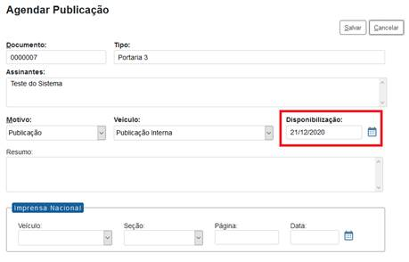


## obterRelacaoVariaveisEditor

| **Saída** |
|---|
| `$arrVariaveis`:<br><ul><li>Conjunto onde a chave é o nome da variável e o valor é sua descrição.</li></ul> |
| **Observações** |
| O nome das variáveis deve começar por `md_<instituição/módulo>` e pode conter apenas letras minúsculas sem acentuação e números. Os valores retornados serão exibidos na tela de ajuda Variáveis Disponíveis na Seção e também serão validados pelo método processarVariaveisEditor. |

**Exemplo:**

```php
public function obterRelacaoVariaveisEditor() {
  $arrVariaveis = array();
  $arrVariaveis['md_julgar_sigla_colegiado']='Sigla do Colegiado';
  $arrVariaveis['md_julgar_nome_colegiado']='Nome do Colegiado';
  return $arrVariaveis;
}
```


## ocultarAcaoAlterarPublicacao

| **Entrada** |
|---|
| `arrObjPublicacaoAPI`:<br><ul><li>Conjunto de ocorrências de PublicacaoAPI preenchidas com:<br> IdPublicacao, IdDocumento e Estado.</li></ul> |
| **Saída** |
| `arrIdPublicacao`:<br><ul><li>Um array com os Ids das publicações que não devem exibir o ícone padrão de alteração.</li></ul> |

**Exemplo:**

```php
public function ocultarAcaoAlterarPublicacao($arrObjPublicacaoAPI){
  $ret = array();
  foreach($arrObjPublicacaoAPI as $objPublicacaoAPI) {
    $ret[] = $objPublicacaoAPI->getIdPublicacao();
  }
  return $ret;
}
```


## ocultarAcaoCancelarAgendamentoPublicacao

| **Entrada** |
|---|
| `arrObjPublicacaoAPI`:<br><ul><li>Conjunto de ocorrências de PublicacaoAPI preenchidas com:<br> IdPublicacao, IdDocumento e Estado.</li></ul> |
| **Saída** |
| `arrIdPublicacao`:<br><ul><li>Um array com os Ids das publicações que não devem exibir o ícone padrão Cancelar Agendamento. Esse ícone é exibido quando o documento está no Estado A (Agendado).</li></ul> |

**Exemplo:**

```php
public function ocultarAcaoCancelarAgendamentoPublicacao($arrObjPublicacaoAPI){
  $ret = array();
  foreach($arrObjPublicacaoAPI as $objPublicacaoAPI) {
    $ret[] = $objPublicacaoAPI->getIdPublicacao();
  }
  return $ret;
}
```


## ocultarBotaoSalvarPublicacao

| **Entrada** |
|---|
| `arrObjVeiculoPublicacaoAPI`:<br><ul><li>Conjunto de ocorrências de VeiculoPublicacaoAPI preenchidas com:<br> IdVeiculoPublicacao e Tipo.</li></ul> |
| **Saída** |
| `arrIdVeiculoPublicacao`:<br><ul><li>Um array com os Ids dos veículos de publicação que não devem exibir o botão padrão Salvar.</li></ul> |

**Exemplo:**

```php
public function ocultarBotaoSalvarPublicacao($arrObjVeiculoPublicacaoAPI){
  $ret = array();
  foreach($arrObjVeiculoPublicacaoAPI as $objVeiculoPublicacaoAPI) {
    $ret[] = $objVeiculoPublicacaoAPI->getIdVeiculoPublicacao();
  }
  return $ret;
}
```


## ocultarDadosImprensaNacionalPublicacao

| **Entrada** |
|---|
| `arrObjVeiculoPublicacaoAPI`:<br><ul><li>Conjunto de ocorrências de VeiculoPublicacaoAPI preenchidas com: IdVeiculoPublicacao e Tipo.</li></ul> |
| **Saída** |
| `arrIdVeiculoPublicacao`:<br><ul><li>Um array com os Ids dos veículos de publicação que não devem exibir os campos para preenchimento dos dados da Imprensa Nacional.</li></ul> |

**Exemplo:**

```php
public function ocultarDadosImprensaNacionalPublicacao($arrObjVeiculoPublicacaoAPI){
  $ret = array();
  foreach($arrObjVeiculoPublicacaoAPI as $objVeiculoPublicacaoAPI) {
    $ret[] = $objVeiculoPublicacaoAPI->getIdVeiculoPublicacao();
  }
  return $ret;
}
```


## permitirAndamentoConcluido

| **Entrada** |
|---|
| `$objAndamentoAPI`:<br><ul><li>Instância preenchida com IdProtocolo e IdTarefa.</li></ul> |
| **Saída** |
| `$bolPermitir`:<br><ul><li>Retornar true para permitir lançar o andamento concluído.</li></ul> |
| **Observações** |
| Permite ignorar a configuração padrão de um andamento (ver seção Andamentos). |

## prepararAssinaturaDocumento

| **Entrada** |
|---|
| `$objAssinaturaAPI`:<br><ul><li>Instância preenchida com IdUsuario, Sigla, Nome, CargoFuncao, Cpf, StaFormaAutenticacao e Agrupador.</li></ul> |
| **Observações** |
| Permite processamento adicional em assinaturas por Certificado Digital ou Módulo. |

## prepararCloneDocumento

| **Entrada** |
|---|
| `$objDocumentoAPI`:<br><ul><li>Instância preenchida com IdProcedimento e IdDocumento.</li></ul> |
| **Saída** |
| `$objDocumentoAPI`:<br><ul><li>Instância preenchida opcionalmente com Data e/ou AtributosModulo.</li></ul> |

## processarControlador

| **Entrada** |
|---|
| `$strAcao`:<br><ul><li>Ação recebida na URL.</li></ul> |

**Exemplo:**

```php
public function processarControlador($strAcao){
  switch($strAcao) {
    case 'md_abc_processo_processar': require_once dirname(__FILE__).'/frm_processo.php';
    return true;
    case 'md_abc_documento_processar': require_once dirname(__FILE__).'/frm_documento.php';
    return true;
  }
  return false;
}
```


## processarControladorAjax

| **Entrada** |
|---|
| `$strAcaoAjax`:<br><ul><li>Ação ajax recebida na URL.</li></ul> |

**Exemplo:**

```php
public function processarControladorAjax($strAcao){
  $xml = null;
  switch($strAcao) {
    case 'md_abc_assunto_auto_completar': $arrObjAssuntoDTO = AssuntoINT::autoCompletarAssuntosRI1223($_POST['palavras_pesquisa']);
    $xml = InfraAjax::gerarXMLItensArrInfraDTO($arrObjAssuntoDTO,'IdAssunto', 'CodigoEstruturado');
    break;
  }
  return $xml;
}
```


## processarControladorAjaxExterno

| **Entrada** |
|---|
| `$strAcaoAjax`:<br><ul><li>Ação ajax recebida na URL.</li></ul> |

**Exemplo:**

```php
public function processarControladorAjaxExterno($strAcao){
  $xml = null;
  switch($strAcao) {
    case 'md_abc_cargo_auto_completar': $xml = InfraAjax::gerarXMLItensArrInfraDTO(CargoINT::autoCompletarExpressao($_POST['palavras_pesquisa']),'IdCargo', 'Expressao');
    break;
  }
  return $xml;
}
```


## processarControladorExterno

| **Entrada** |
|---|
| `$strAcao`:<br><ul><li>Ação recebida na URL.</li></ul> |

**Exemplo:**

```php
public function processarControladorExterno($strAcao){
  switch($strAcao) {
    case 'md_abc_usuario_externo_exemplo': require_once dirname(__FILE__) . '/usuario_externo_exemplo.php';
    return true;
  }
  return false;
}
```


## processarControladorPublicacoes

| **Entrada** |
|---|
| `$strAcao`:<br><ul><li>Ação recebida na URL.</li></ul> |

**Exemplo:**

```php
public function processarControladorPublicacoes($strAcao){
  switch($strAcao) {
    case 'md_abc_publicacao_exemplo': require_once dirname(__FILE__) . '/publicacao_exemplo.php';
    return true;
  }
  return false;
}
```


## processarControladorWebServices

| **Entrada** |
|---|
| `$strServico`:<br><ul><li>Serviço recebido na URL.</li></ul> |
| **Observação** |
| O WSDL poderá ser referenciado por:<br>https://[servidor]/sei/controlador_ws.php?servico=[nome do serviço do módulo] |

**Exemplo:**

```php
public function processarControladorWebServices($strServico){
  $strArq = null;
  switch ($strServico) {
    case 'md_abc_servico_1': $strArq = 'servico1.wsdl';
    break;
    case 'md_abc_servico_2': $strArq = 'servico2.wsdl';
    break;
  }
  if ($strArq!=null){
    $strArq = dirname(__FILE__).'/ws/'.$strArq;
  }
  return $strArq;
}
```


## processarPaginaCadastroDocumento

| **Entrada** |
|---|
| `$objDocumentoAPI`:<br><ul><li>Instância preenchida com IdProcedimento, IdDocumento, IdSerie, Data, IdUnidadeGeradora, Numero, NomeArvore, DinValor, IdPlanoTrabalho e Tipo.</li></ul> |
| **Saída** |
| `$objPaginaComplementoAPI`:<br><ul><li>Objeto com código para inserção de comportamento na página.</li></ul> |

## processarPaginaInclusaoDocumentoItemEtapa

| **Entrada** |
|---|
| `$objDocumentoAPI`:<br><ul><li>Instância preenchida com IdProcedimento, IdSerie, IdPlanoTrabalho, IdEtapaTrabalho, IdItemEtapa e IdOperacao.</li></ul> |
| **Saída** |
| `$objPaginaComplementoAPI`:<br><ul><li>Objeto com código para inserção de comportamento na página.</li></ul> |

**Exemplo:**

```php
public function processarPaginaInclusaoDocumentoItemEtapa(DocumentoAPI $objDocumentoAPI){
  if ($_GET['acao_origem']!='item_etapa_incluir_documento') {
    $strMdAbcComplemento = SessaoSEI::getInstance()->getAtributo('MD_ABC_INCLUSAO_ITEM_ETAPA_'.$objDocumentoAPI->getIdOperacao());
  }else{
    $strMdAbcComplemento = $_POST['txtMdAbcComplemento'];
    SessaoSEI::getInstance()->setAtributo('MD_ABC_INCLUSAO_ITEM_ETAPA_'.$objDocumentoAPI->getIdOperacao(), $strMdAbcComplemento);
  }
  $objPaginaComplementoAPI = new PaginaComplementoAPI();
  $objPaginaComplementoAPI->setCss( '
    #lblMdAbcComplemento {position:absolute;left:0%;top:0%;width:80%;}
    #txtMdAbcComplemento {position:absolute;left:0%;top:40%;width:80%;} ');
  $objPaginaComplementoAPI->setJavascriptValidacao( "
    if (infraTrim(document.getElementById('txtMdAbcComplemento').value)=='') {
    alert('Complemento do módulo ABC não informado.');
    document.getElementById('txtMdAbcComplemento').focus();
    return false;
    } ");
  $objPaginaComplementoAPI->setHtml( '
    <br>
    <div class="infraAreaDados" style="height:5em">
    <label id="lblMdAbcComplemento" for="txtMdAbcComplemento" accesskey="" class="infraLabelObrigatorio">Complemento ABC:</label>
    <input type="text" id="txtMdAbcComplemento" name="txtMdAbcComplemento" class="infraText" value="'.PaginaSEI::tratarHTML($strMdAbcComplemento).'" onkeypress="return infraMascaraTexto(this,event,250);" maxlength="250" tabindex="'.PaginaSEI::getInstance()->getProxTabDados().'"/>
    </div> ');
  return $objPaginaComplementoAPI;
}
```


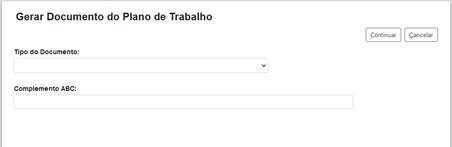


## processarPesquisaRapida

| **Entrada** |
|---|
| `$strTexto`:<br><ul><li>Texto preenchido pelo usuário.</li></ul> |

## processarVariaveisEditor

| **Entrada** |
|---|
| `$objDocumentoAPI`:<br><ul><li>Instância preenchida com IdProcedimento e IdDocumento..</li></ul> |
| **Saída** |
| `$arrVariaveis`:<br><ul><li>Conjunto de valores onde a chave é o nome da variável.</li></ul> |
| **Observação** |
| Serão consideradas somente as variáveis retornadas pelo método obterRelacaoVariaveisEditor. |

**Exemplo:**

```php
public function processarVariaveisEditor(DocumentoAPI $objDocumentoAPI){
  $arrVariaveis = array();$objMdJulgarColegiadoDTO = new MdJulgarColegiadoDTO();
  $objMdJulgarColegiadoDTO->retStrSigla();
  $objMdJulgarColegiadoDTO->retStrNome();
  $objMdJulgarColegiadoDTO->setNumIdColegiado(1);
  $objMdJulgarColegiadoRN = new MdJulgarColegiadoRN();
  $objMdJulgarColegiadoDTO = $objMdJulgarColegiadoRN->consultar($objMdJulgarColegiadoDTO);
  if ($objMdJulgarColegiadoDTO!=null) {
    $arrVariaveis['md_julgar_sigla_colegiado'] = $objMdJulgarColegiadoDTO->getStrSigla();
    $arrVariaveis['md_julgar_nome_colegiado'] = $objMdJulgarColegiadoDTO->getStrNome();
  }
  return $arrVariaveis;
}
```


## reabrirProcesso

| **Entrada** |
|---|
| `$objProcedimentoAPI`:<br><ul><li>Instância preenchida com IdProcedimento.</li></ul> |

## reativarArquivoExtensao

| **Entrada** |
|---|
| `$arrObjArquivoExtensaoAPI`:<br><ul><li>Instâncias preenchidas com IdArquivoExtensao e Extensao.</li></ul> |

## reativarContato

| **Entrada** |
|---|
| `$arrObjContatoAPI`:<br><ul><li>Instâncias preenchidas com IdContato, IdTipoContato, IdContatoAssociado, Sigla, Nome e NomeSocial.</li></ul> |

## reativarHipoteseLegal

| **Entrada** |
|---|
| `$arrObjHipoteseLegalAPI`:<br><ul><li>Instâncias preenchidas com IdHipoteseLegal, Nome, BaseLegal e NivelAcesso.</li></ul> |

## reativarTipoContato

| **Entrada** |
|---|
| `$arrObjTipoContatoAPI`:<br><ul><li>Instâncias preenchidas com IdTipoContato e Nome.</li></ul> |

## reativarTipoDocumento

| **Entrada** |
|---|
| `$arrObjSerieAPI`:<br><ul><li>Instâncias preenchidas com IdSerie, Nome e Aplicabilidade.</li></ul> |

## reativarTipoProcesso

| **Entrada** |
|---|
| `$arrObjTipoProcedimentoAPI`:<br><ul><li>Instâncias preenchidas com IdTipoProcedimento e Nome.</li></ul> |

## reativarUnidade

| **Entrada** |
|---|
| `$arrObjUnidadeAPI`:<br><ul><li>Instâncias preenchidas com IdUnidade, Sigla e Descricao.</li></ul> |

## reativarUsuario

| **Entrada** |
|---|
| `$arrObjUsuarioAPI`:<br><ul><li>Instâncias preenchidas com IdUsuario, Sigla, Nome e StaTipo.</li></ul> |

## reativarVeiculoPublicacao

| **Entrada** |
|---|
| `$arrObjVeiculoPublicacaoAPI`:<br><ul><li>Instâncias preenchidas com IdVeiculoPublicacao.</li></ul> |

## relacionarProcesso

| **Entrada** |
|---|
| `$objProcedimentoAPI1`:<br><ul><li>Instância preenchida com IdProcedimento e NumeroProtocolo.</li></ul> |
| `$objProcedimentoAPI2`:<br><ul><li>Instância preenchida com IdProcedimento e NumeroProtocolo.</li></ul> |

## removerRelacionamentoProcesso

| **Entrada** |
|---|
| `$objProcedimentoAPI1`:<br><ul><li>Instância preenchida com IdProcedimento e NumeroProtocolo.</li></ul> |
| `$objProcedimentoAPI2`:<br><ul><li>Instância preenchida com IdProcedimento e NumeroProtocolo.</li></ul> |

## removerSobrestamentoProcesso

| **Entrada** |
|---|
| `$objProcedimentoAPI`:<br><ul><li>Instância preenchida com IdProcedimento e NumeroProtocolo.</li></ul> |
| `$objProcedimentoAPIVinculado`:<br><ul><li>Instância preenchida com IdProcedimento e NumeroProtocolo (nulo se não estiver vinculado a outro processo).</li></ul> |

## sobrestarProcesso

| **Entrada** |
|---|
| `$objProcedimentoAPI`:<br><ul><li>Instância preenchida com IdProcedimento e NumeroProtocolo.</li></ul> |
| `$objProcedimentoAPIVinculado`:<br><ul><li>Instância preenchida com IdProcedimento e NumeroProtocolo (nulo se não estiver vinculado a outro processo).</li></ul> |

## substituirContato

| **Entrada** |
|---|
| `$objContatoAPI`:<br><ul><li>Contato para substituição informado na tela Relatórios de Contatos Temporários. Instância preenchida com IdContato, IdTipoContato, Sigla e Nome.</li></ul> |
| `$arrObjContatoAPI`:<br><ul><li>Lista de contatos que serão substituídos. Instâncias preenchidas com IdContato, IdTipoContato, Sigla e Nome.</li></ul> |

## tratarLinkSemAssinatura

| **Entrada** |
|---|
| `$strLink`:<br><ul><li>Link sem assinatura para redirecionamento automático pelo sistema.</li></ul> |
| **Saída** |
| `$bolValido`:<br><ul><li>Retornar true ou false.</li></ul> |
| **Observações** |
| Possibilita criar links com redirecionamento automático para páginas<br>do sistema e/ou módulos.<br>ATENÇÃO: Sempre aplicar uma expressão regular para validar o formato do link que deve ser aceito. |

**Exemplo:**

```php
public function tratarLinkSemAssinatura($strLink){
  return preg_match('/^controlador.php\?acao=abc_processar&id_item=\d+$/', $strLink)===1;
}
```


## validarContato

| **Entrada** |
|---|
| `$objContatoAPI`:<br><ul><li>Instância preenchida com IdContato, IdTipoContato, IdContatoAssociado, StaNatureza, SinEnderecoAssociado, StaGenero, Cpf, Rg, OrgaoExpedidor, Matricula, MatriculaOab, NumeroPassaporte, IdPaisPassaporte, DataNascimento, Cnpj, IdCargo, Sigla, Nome, NomeSocial, TelefoneFixo, TelefoneCelular, Email, SitioInternet, Endereco, Complemento, Bairro, Cep, Observacao, SinAtivo, IdPais, IdEstado e IdCidade.</li></ul> |
| **Observações** |
| Esse método é chamado antes que as operações de cadastramento e alteração de contato sejam realizadas no banco de dados (no cadastramento o atributo IdContato será nulo). |

## validarEliminacaoDocumento

| **Entrada** |
|---|
| `$arrObjDocumentoAPI`:<br><ul><li>Instâncias preenchidas com IdDocumento e NumeroProtocolo.</li></ul> |

## validarEliminacaoProcesso

| **Entrada** |
|---|
| `$objProcedimentoAPI`:<br><ul><li>Instância preenchida com IdProcedimento e NumeroProtocolo.</li></ul> |

## verificarAcessoProtocolo

| **Entrada** |
|---|
| `$arrObjProcedimentoAPI`:<br><ul><li>Instâncias preenchidas com IdProcedimento, IdTipoProcedimento, IdUnidadeGeradora e NivelAcesso.</li></ul> |
| `$arrObjDocumentoAPI`:<br><ul><li>Instâncias preenchidas com IdDocumento, IdProcedimento, IdSerie, IdUnidadeGeradora, Tipo, SubTipo e NivelAcesso.</li></ul> |
| **Saída** |
| `$arrLiberacoes`:<br><ul><li>Retornar um array indexado pelo número do protocolo onde cada item possui o valor P (Permitido) ou N (Negado) indicando o tipo de acesso ao processo ou documento.</li><li>Também podem ser utilizadas as constantes abaixo da classe SeiIntegracao:<br><code>//TAM = Tipo Acesso Modulo</code><br><code>public static $TAM_PERMITIDO = 'P';</code><br><code>public static $TAM_NEGADO = 'N';</code></li></ul> |
| **Observações** |
| Possibilita que o módulo permita ou negue acesso a determinados processos ou documentos. Se o acesso for exclusivamente devido ao módulo então ao visualizar a árvore de processo aparecerá ao lado do processo ou documento um cadeado aberto indicando o módulo que liberou o acesso. Da mesma forma se o acesso foi negado exclusivamente pelo módulo então será visualizado um cadeado fechado. Em situações conflitantes onde um módulo permite acesso e outro nega a negação terá prioridade.<br>**Atenção**: Esse evento requer cuidado redobrado na sua elaboração pois falhas na lógica de programação podem expor indevidamente informações restritas ou sigilosas. Todas as visualizações de processos ou documentos serão auditadas. |

**Exemplo:**

```php
//Libera rascunhos da serie de teste em processos que não sejam sigilosos.
public function verificarAcessoProtocolo($arrObjProcedimentoAPI, $arrObjDocumentoAPI){
  $ret = null;
  $objInfraParametro = new InfraParametro(BancoSEI::getInstance());
  $numIdSerieAbc = $objInfraParametro->getValor('MD_ABC_ID_SERIE_TESTE', false);

  foreach($arrObjDocumentoAPI as $objDocumentoAPI){
    if ($objDocumentoAPI->getIdSerie() == $numIdSerieAbc && $objDocumentoAPI->getSubTipo() == DocumentoRN::$TD_EDITOR_INTERNO && $objDocumentoAPI->getNivelAcesso() != ProtocoloRN::$NA_SIGILOSO){
      $ret[$objDocumentoAPI->getIdDocumento()] = SeiIntegracao::$TAM_PERMITIDO;
    }
  }
  return $ret;
}
```


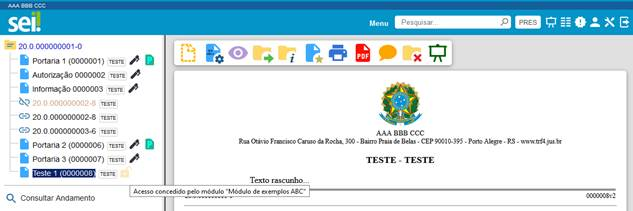


## verificarAcessoProtocoloExterno

| **Entrada** |
|---|
| `$arrObjProcedimentoAPI`:<br><ul><li>Instâncias representando os processos anexados preenchidas com IdProcedimento, IdTipoProcedimento, IdUnidadeGeradora e NivelAcesso.</li></ul> |
| `$arrObjDocumentoAPI`:<br><ul><li>Instâncias preenchidas com IdDocumento, IdProcedimento, IdSerie, IdUnidadeGeradora, SinAssinado, SinPublicado, Tipo, SubTipo e NivelAcesso.</li></ul> |
| **Saída** |
| `$arrLiberacoes`:<br><ul><li>Retornar um array indexado pelo número do protocolo onde cada item possui o valor P (Permitido) ou N (Negado) indicando o tipo de acesso ao processo ou documento.</li><li>Também podem ser utilizadas as constantes abaixo da classe SeiIntegracao:<br><code>//TAM = Tipo Acesso Modulo</code><br><code>public static $TAM_PERMITIDO = 'P';</code><br><code>public static $TAM_NEGADO = 'N';</code></li></ul> |
| **Observações** |
| Possibilita que o módulo permita ou negue acesso a determinados processos anexados ou documentos na consulta de acesso externo. Em situações conflitantes onde um módulo permite acesso e outro nega a negação terá prioridade.<br>**Atenção**: Esse evento requer cuidado redobrado na sua elaboração pois falhas na lógica de programação podem expor indevidamente informações restritas ou sigilosas. Todas as visualizações de processos ou documentos serão auditadas. |

**Exemplo:**

```php
//Bloqueia no acesso externo documentos da serie de teste que não estão publicados
public function verificarAcessoProtocoloExterno($arrObjProcedimentoAPI, $arrObjDocumentoAPI){
  $ret = null;

  $objInfraParametro = new InfraParametro(BancoSEI::getInstance());

  $numIdSerieAbc = $objInfraParametro->getValor('MD_ABC_ID_SERIE_TESTE', false);
  foreach($arrObjDocumentoAPI as $objDocumentoAPI){
    if ($objDocumentoAPI->getIdSerie() == $numIdSerieAbc && $objDocumentoAPI->getSinPublicado()=='N'){
      $ret[$objDocumentoAPI->getIdDocumento()] = SeiIntegracao::$TAM_NEGADO;
    }
  }
  return $ret;
}
```


## verificarAcessoTipoContato

| **Entrada** |
|---|
| `$arrObjTipoContatoAPI`:<br><ul><li>Instâncias preenchidas com IdTipoContato.</li></ul> |
| **Saída** |
| `$arrLiberacoes`:<br><ul><li>Retornar um array indexado pelo ID do tipo de contato onde cada item possui os valores:</li><li>N = nenhum acesso concedido pelo módulo</li><li>A = permissão para alteração de dados</li><li>C = Consulta Completa</li><li>R = Consulta Resumida</li><li>Também podem ser utilizadas as constantes abaixo da classe TipoContatoRN:<br><code>public static $TA_NENHUM = 'N';</code><br><code>public static $TA_ALTERACAO = 'A';</code><br><code>public static $TA_CONSULTA_COMPLETA = 'C';</code><br><code>public static $TA_CONSULTA_RESUMIDA = 'R';</code></li></ul> |
| **Observações** |
| Possibilita que o módulo permita ou negue acesso a determinados tipos de contato.<br>**Atenção**: Esse evento requer cuidado redobrado na sua elaboração pois falhas na lógica de programação podem expor indevidamente informações. |

**Exemplo:**

```php
//Libera alteração de um tipo de contato baseado em uma permissão especifica.
public function verificarAcessoTipoContato($arrObjTipoContatoAPI){
  $ret = array();
  if (SessaoSEI::getInstance()->verificarPermissao('md_abc_contratacao_cadastrar')) {
    $objInfraParametro = new InfraParametro(BancoSEI::getInstance());
    $numIdTipoContatoFornecedor = $objInfraParametro->getValor('MD_ABC_ID_TIPO_CONTATO_FORNECEDORES');
    //verifica se o tipo do contato esta na lista solicitada para verificação
    foreach($arrObjTipoContatoAPI as $objTipoContatoAPI){
      if ($objTipoContatoAPI->getIdTipoContato()==$numIdTipoContatoFornecedor){
        $ret[$numIdTipoContatoFornecedor] = TipoContatoRN::$TA_ALTERACAO;
        break;
      }
    }
  }
  return $ret;
}
```


## verificarLoginExterno

| **Entrada** |
|---|
| `$objUsuarioAPI`:<br><ul><li>Instâncias preenchidas com IdUsuario, Sigla, Nome e StaTipo.</li></ul> |
| **Saída** |
| `booleano`:<br><ul><li>Retornar true ou false.</li></ul> |
| **Observações** |
| Indica se o usuário tem autenticação externa. |

# 10. Operações

Os módulos podem realizar operações no sistema, como geração de processos, inclusão de documentos e atualização de andamentos, utilizando os objetos da API em conjunto com os métodos disponibilizados na classe SeiRN. A camada de Web Services do SEI também utiliza a API, sendo assim, todas as operações realizadas por meio de Web Services também podem ser realizadas diretamente pelos módulos.

- **Atenção**: Não é recomendado o uso de outras classes ou objetos
    internos do sistema.
- Eventuais alterações nos objetos da API e métodos da classe
    SeiRN serão documentadas em um roteiro de adaptação para os
    módulos. Alterações em outros componentes internos do sistema não
    serão documentadas.

Sempre que uma operação possuir opção de uso do ID interno ou do número de protocolo deve-se optar pelo ID, caso a informação esteja disponível, pois isso evitará um ou mais acessos ao banco.

## adicionarArquivo

| **Entrada** |
|---|
| Instância do objeto EntradaAdicionarArquivoAPI preenchida com:<br><ul><li>Nome</li><li>Tamanho</li><li>Hash</li><li>Conteudo</li></ul> |
| **Saída** |
| Retornar o identificador do arquivo criado no repositório. |

**Exemplo:**

```php
$strArquivo = DIR_SEI_TEMP.'/exemplo.pdf';
$fp = fopen($strArquivo, "rb");

$objEntradaAdicionarArquivoAPI = new EntradaAdicionarArquivoAPI();
$objEntradaAdicionarArquivoAPI->setNome('exemplo.pdf');
$objEntradaAdicionarArquivoAPI->setTamanho(filesize($strArquivo));
$objEntradaAdicionarArquivoAPI->setHash(md5_file($strArquivo));
$objEntradaAdicionarArquivoAPI->setConteudo(base64_encode(fread($fp, 1024*1024))); //blocos de 1Mb

$objSeiRN = new SeiRN();
$numIdArquivo = $objSeiRN->adicionarArquivo($objEntradaAdicionarArquivoAPI);
while (!feof($fp)) {
  $objEntradaAdicionarConteudoArquivoAPI = new EntradaAdicionarConteudoArquivoAPI();
  $objEntradaAdicionarConteudoArquivoAPI->setIdArquivo($numIdArquivo);
  $objEntradaAdicionarConteudoArquivoAPI->setConteudo(base64_encode(fread($fp, 1024*1024))); //blocos de 1Mb
  $objSeiRN->adicionarConteudoArquivo($objEntradaAdicionarConteudoArquivoAPI);
}
fclose($fp);
```

## adicionarConteudoArquivo

| **Entrada** |
|---|
| Instância do objeto EntradaAdicionarConteudoArquivoAPI preenchida com:<br><ul><li>IdArquivo</li><li>Conteudo</li></ul> |
| **Observação** |
| Ver exemplo em adicionarArquivo. |

## agendarPublicacao

| **Entrada** |
|---|
| Instância do objeto EntradaAgendarPublicacaoAPI preenchida com:<br><ul><li>IdDocumento ou ProtocoloDocumento</li><li>StaMotivo</li><li>IdVeiculoPublicacao</li><li>DataDisponibilizacao</li><li>Resumo</li><li>ImprensaNacional</li></ul> |
| **Observação** |
| Para identificação é necessário informar apenas um dos atributos IdDocumento ou ProtocoloDocumento. O atributo ImprensaNacional é opcional. |

**Exemplo:**

```php
$objEntradaAgendarPublicacaoAPI = new EntradaAgendarPublicacaoAPI();
//$objEntradaAgendarPublicacaoAPI->setIdDocumento(42039220124080979);
$objEntradaAgendarPublicacaoAPI->setProtocoloDocumento('0046786');
$objEntradaAgendarPublicacaoAPI->setStaMotivo(1);
$objEntradaAgendarPublicacaoAPI->setIdVeiculoPublicacao(21);
$objEntradaAgendarPublicacaoAPI->setDataDisponibilizacao('07/09/2018');
$objEntradaAgendarPublicacaoAPI->setResumo('teste');
$objPublicacaoImprensaNacionalAPI = new PublicacaoImprensaNacionalAPI();
$objPublicacaoImprensaNacionalAPI->setIdVeiculo(2);
$objPublicacaoImprensaNacionalAPI->setPagina(85);
$objPublicacaoImprensaNacionalAPI->setIdSecao(4);
$objPublicacaoImprensaNacionalAPI->setData('03/09/2018');
$objEntradaAgendarPublicacaoAPI->setImprensaNacional($objPublicacaoImprensaNacionalAPI);
$objSeiRN = new SeiRN();
$objPublicacaoAPI = $objSeiRN->agendarPublicacao($objEntradaAgendarPublicacaoAPI);
```

## alterarPublicacao

| **Entrada** |
|---|
| Instância do objeto EntradaAlterarPublicacaoAPI preenchida com:<br><ul><li>IdPublicacao ou IdDocumento ou ProtocoloDocumento</li><li>StaMotivo</li><li>IdVeiculoPublicacao</li><li>DataDisponibilizacao</li><li>Resumo</li><li>ImprensaNacional</li></ul> |
| **Observação** |
| Para identificação é necessário informar apenas um dos atributos IdPublicacao, IdDocumento ou ProtocoloDocumento. Os demais atributos são opcionais e somente os informados serão alterados se o estado da publicação permitir. |

**Exemplo:**

```php
$objEntradaAlterarPublicacaoAPI = new EntradaAlterarPublicacaoAPI();
//$objEntradaAlterarPublicacaoAPI->setIdPublicacao(100000960);
//$objEntradaAlterarPublicacaoAPI->setIdDocumento(42039220124080979);
$objEntradaAlterarPublicacaoAPI->setProtocoloDocumento('0046786');
$objEntradaAlterarPublicacaoAPI->setStaMotivo(null);
$objEntradaAlterarPublicacaoAPI->setIdVeiculoPublicacao(null);
$objEntradaAlterarPublicacaoAPI->setDataDisponibilizacao('10/09/2018');
$objEntradaAlterarPublicacaoAPI->setResumo('teste');
$objPublicacaoImprensaNacionalAPI = new PublicacaoImprensaNacionalAPI();
$objPublicacaoImprensaNacionalAPI->setIdVeiculo(2);
$objPublicacaoImprensaNacionalAPI->setPagina(85);
$objPublicacaoImprensaNacionalAPI->setIdSecao(4);
$objPublicacaoImprensaNacionalAPI->setData('06/09/2018');
$objEntradaAlterarPublicacaoAPI->setImprensaNacional($objPublicacaoImprensaNacionalAPI);
$objSeiRN = new SeiRN();
$objSeiRN->alterarPublicacao($objEntradaAlterarPublicacaoAPI);
```

## anexarProcesso

| **Entrada** |
|---|
| Instância do objeto EntradaAnexarProcessoAPI preenchida com:<br><ul><li>IdProcedimentoPrincipal ou ProtocoloProcedimentoPrincipal</li><li>IdProcedimentoAnexado ou ProtocoloProcedimentoAnexado</li></ul> |

**Exemplo:**

```php
$objEntradaAnexarProcessoAPI = new EntradaAnexarProcessoAPI();
//$objEntradaAnexarProcessoAPI->setIdProcedimentoPrincipal();
$objEntradaAnexarProcessoAPI->setProtocoloProcedimentoPrincipal('0000495-63.2014.4.04.8000');
//$objEntradaAnexarProcessoAPI->setIdProcedimentoAnexado();
$objEntradaAnexarProcessoAPI->setProtocoloProcedimentoAnexado('0000504-25.2014.4.04.8000');


$objSeiRN = new SeiRN();
$objSeiRN->anexarProcesso($objEntradaAnexarProcessoAPI);
```

## atribuirProcesso

| **Entrada** |
|---|
| Instância do objeto EntradaAtribuirProcessoAPI preenchida com:<br><ul><li>IdProcedimento ou ProtocoloProcedimento</li><li>IdUsuario</li><li>SinReabrir</li></ul> |

**Exemplo:**

```php
$objEntradaAtribuirProcessoAPI = new EntradaAtribuirProcessoAPI();
//$objEntradaAtribuirProcessoAPI->setIdProcedimento();
$objEntradaAtribuirProcessoAPI->setProtocoloProcedimento('0000262-95.2016.4.04.8000');
$objEntradaAtribuirProcessoAPI->setIdUsuario(100002382);

$objEntradaAtribuirProcessoAPI->setSinReabrir('S');
$objSeiRN = new SeiRN();
$objSeiRN->atribuirProcesso($objEntradaAtribuirProcessoAPI);
```

## atualizarContatos

| **Entrada** |
|---|
| Conjunto de Instâncias do objeto ContatoAPI preenchidas com:<br><ul><li>StaOperacao</li><li>IdContato</li><li>IdTipoContato</li><li>Sigla</li><li>Nome</li><li>NomeSocial</li><li>StaNatureza</li><li>IdContatoAssociado</li><li>SinEnderecoAssociado</li><li>Endereco</li><li>Complemento</li><li>Bairro</li><li>IdCidade</li><li>IdEstado</li><li>IdPais</li><li>Cep</li><li>StaGenero</li><li>IdCargo</li><li>Cpf</li><li>Cnpj</li><li>Rg</li><li>OrgaoExpedidor</li><li>Matricula</li><li>MatriculaOab</li><li>TelefoneFixo</li><li>TelefoneCelular</li><li>DataNascimento</li><li>Email</li><li>SitioInternet</li><li>Observação</li><li>NumeroPassaporte</li><li>IdPaisPassaporte</li><li>SinAtivo</li></ul> |

**Exemplo:**

```php
$objContatoAPI = new ContatoAPI();
$objContatoAPI->setStaOperacao('A');
$objContatoAPI->setIdContato(100003924);
$objContatoAPI->setIdTipoContato(1);
$objContatoAPI->setSigla('def');
$objContatoAPI->setNome('Dddddd Eeeeee Ffffff');
$objContatoAPI->setNomeSocial(null);
$objContatoAPI->setStaNatureza('F');
$objContatoAPI->setIdContatoAssociado(null);
$objContatoAPI->setSinEnderecoAssociado('N');
$objContatoAPI->setEndereco('Rua Otávio Francisco Caruso da Rocha, 2000');
$objContatoAPI->setComplemento(null);
$objContatoAPI->setBairro('Praia de Belas');
$objContatoAPI->setIdCidade(4927);
$objContatoAPI->setIdEstado(23);
$objContatoAPI->setIdPais(76);
$objContatoAPI->setCep('90010-395');
$objContatoAPI->setStaGenero('M');
$objContatoAPI->setIdCargo(100001865);
$objContatoAPI->setCpf(11572070730);
$objContatoAPI->setCnpj(null);
$objContatoAPI->setRg(56584632);
$objContatoAPI->setOrgaoExpedidor('SSP/RS');
$objContatoAPI->setMatricula('54834');
$objContatoAPI->setMatriculaOab(null);
$objContatoAPI->setTelefoneFixo(null);
$objContatoAPI->setTelefoneCelular('(99)9999-9999');
$objContatoAPI->setDataNascimento('13/05/1971');
$objContatoAPI->setEmail('def@abc.gov.br');
$objContatoAPI->setSitioInternet(null);
$objContatoAPI->setObservacao('Exemplo alteração contato.');
$objContatoAPI->setNumeroPassaporte(null);
$objContatoAPI->setIdPaisPassaporte(null);
$objContatoAPI->setSinAtivo('S');

$objSeiRN = new SeiRN();
$objSeiRN->atualizarContatos(array($objContatoAPI));
```

## bloquearDocumento

| **Entrada** |
|---|
| Instância do objeto EntradaBloquearDocumentoAPI preenchida com:<br><ul><li>IdDocumento ou ProtocoloDocumento</li></ul> |
| **Observações** |
| Não será possível alterar o conteúdo nem cancelar assinaturas de documentos bloqueados. Entretanto novas assinaturas poderão ser adicionadas. Os metadados do documento não são bloqueados. |

**Exemplo:**

```php
$objEntradaBloquearDocumentoAPI = new EntradaBloquearDocumentoAPI();
//$objEntradaBloquearDocumentoAPI->setIdDocumento();
$objEntradaBloquearDocumentoAPI->setProtocoloDocumento('0031076');

$objSeiRN = new SeiRN();
$objSeiRN->bloquearDocumento($objEntradaBloquearDocumentoAPI);
```

## bloquearProcesso

| **Entrada** |
|---|
| Instância do objeto EntradaBloquearProcessoAPI preenchida com:<br><ul><li>IdProcedimento ou ProtocoloProcedimento</li></ul> |
| **Observações** |
| Quando um processo estiver bloqueado as operações abaixo NÃO serão permitidas:<br><ul><li>alterar cadastro do processo</li><li>alterar cadastro do documento</li><li>incluir documento no processo</li><li>alterar conteúdo de documentos (internos/externos)</li><li>enviar processo</li><li>enviar email</li><li>agendar publicação</li><li>assinar documento</li><li>mover documento</li><li>cancelar documento</li><li>gerar circular</li><li>excluir documento</li><li>excluir processo</li><li>sobrestar processo</li><li>anexar processo</li></ul><br>Operações permitidas em processos bloqueados:<br><ul><li>atribuir marcador da unidade (*)</li><li>atribuir processo (*)</li><li>atualizar andamento (*)</li><li>liberar/cancelar acesso externo (*)</li><li>incluir em bloco de reunião (*)</li><li>relacionar processo (*)</li><li>duplicar processo (*)</li><li>dar ciência (*)</li><li>registrar anotação</li><li>cadastrar acompanhamento especial</li><li>solicitar desarquivamento</li><li>concluir processo</li><li>reabrir processo</li></ul><br>* somente com processo aberto<br>Não é possível bloquear processos sigilosos. |

**Exemplo:**

```php
$objEntradaBloquearProcessoAPI = new EntradaBloquearProcessoAPI();
//$objEntradaBloquearProcessoAPI->setIdProcedimento();
$objEntradaBloquearProcessoAPI->setProtocoloProcedimento('0000262-95.2016.4.04.8000');

$objSeiRN = new SeiRN();
$objSeiRN->bloquearProcesso($objEntradaBloquearProcessoAPI);
```

## cancelarAgendamentoPublicacao

| **Entrada** |
|---|
| Instância do objeto EntradaCancelarAgendamentoPublicacaoAPI preenchida com pelo menos um dos atributos:<br><ul><li>IdPublicacao ou IdDocumento ou ProtocoloDocumento</li></ul> |

**Exemplo:**

```php
$objEntradaCancelarAgendamentoPublicacaoAPI = new EntradaCancelarAgendamentoPublicacaoAPI();
$objEntradaCancelarAgendamentoPublicacaoAPI->setProtocoloDocumento('0046786');
//$objEntradaCancelarAgendamentoPublicacaoAPI->setIdDocumento(42039220124080979);
//$objEntradaCancelarAgendamentoPublicacaoAPI->setIdPublicacao(100000960);
$objSeiRN = new SeiRN();
$objSeiRN->cancelarAgendamentoPublicacao($objEntradaCancelarAgendamentoPublicacaoAPI);
```

## cancelarDisponibilizacaoBloco

| **Entrada** |
|---|
| Instância do objeto EntradaCancelarDisponibilizacaoBlocoAPI preenchida com:<br><ul><li>IdBloco</li></ul> |

**Exemplo:**

```php
$objEntradaCancelarDisponibilizacaoBlocoAPI = new EntradaCancelarDisponibilizacaoBlocoAPI();
$objEntradaCancelarDisponibilizacaoBlocoAPI->setIdBloco(932);

$objSeiRN = new SeiRN();
$objSeiRN->cancelarDisponibilizacaoBloco($objEntradaCancelarDisponibilizacaoBlocoAPI);
```

## cancelarDocumento

| **Entrada** |
|---|
| Instância do objeto EntradaCancelarDocumentoAPI preenchida com:<br><ul><li>IdDocumento ou ProtocoloDocumento</li><li>Motivo</li></ul> |

**Exemplo:**

```php
$objEntradaCancelarDocumentoAPI = new EntradaCancelarDocumentoAPI();
//$objEntradaCancelarDocumentoAPI->setIdDocumento();
$objEntradaCancelarDocumentoAPI->setProtocoloDocumento('0031076');
$objEntradaCancelarDocumentoAPI->setMotivo('Exemplo cancelamento de documento módulo ABC.');


$objSeiRN = new SeiRN();
$objSeiRN->cancelarDocumento($objEntradaCancelarDocumentoAPI);
```

## concluirBloco

| **Entrada** |
|---|
| Instância do objeto EntradaConcluirBlocoAPI preenchida com:<br><ul><li>IdBloco</li></ul> |

**Exemplo:**

```php
$objEntradaConcluirBlocoAPI = new EntradaConcluirBlocoAPI();
$objEntradaConcluirBlocoAPI->setIdBloco(1043);

$objSeiRN = new SeiRN();
$objSeiRN->concluirBloco($objEntradaConcluirBlocoAPI);
```

## concluirControlePrazo

| **Entrada** |
|---|
| Instâncias do objeto EntradaConcluirControlePrazoAPI preenchidas com:<br><ul><li>IdProcedimento ou ProtocoloProcedimento</li></ul> |

**Exemplo:**

```php
$arrObjEntradaConcluirControlePrazoAPI = array();
$objEntradaConcluirControlePrazoAPI = new EntradaConcluirControlePrazoAPI();
//$objEntradaConcluirControlePrazoAPI->setIdProcedimento();
$objEntradaConcluirControlePrazoAPI->setProtocoloProcedimento('11.1.000000485-4');
$arrObjEntradaConcluirControlePrazoAPI[] = $objEntradaConcluirControlePrazoAPI;
$objEntradaConcluirControlePrazoAPI = new EntradaConcluirControlePrazoAPI();
//$objEntradaConcluirControlePrazoAPI->setIdProcedimento();
$objEntradaConcluirControlePrazoAPI->setProtocoloProcedimento('11.1.000000467-6');
$arrObjEntradaConcluirControlePrazoAPI[] = $objEntradaConcluirControlePrazoAPI;
$objSeiRN = new SeiRN();
$objSeiRN->concluirControlePrazo($arrObjEntradaConcluirControlePrazoAPI);
```

## concluirProcesso

| **Entrada** |
|---|
| Instância do objeto EntradaConcluirProcessoAPI preenchida com:<br><ul><li>IdProcedimento ou ProtocoloProcedimento</li></ul> |

**Exemplo:**

```php
$objEntradaConcluirProcessoAPI = new EntradaConcluirProcessoAPI();
//$objEntradaConcluirProcessoAPI->setIdProcedimento();
$objEntradaConcluirProcessoAPI->setProtocoloProcedimento('0000262-95.2016.4.04.8000');

$objSeiRN = new SeiRN();
$objSeiRN->concluirProcesso($objEntradaConcluirProcessoAPI);
```

## ConfirmarDisponibilizacaoPublicacao

| **Entrada** |
|---|
| Instância do objeto EntradaConfirmarDisponibilizacaoPublicacaoAPI preenchida com:<br><ul><li>IdVeiculoDisponibilizacao</li><li>DataDisponibilizacao</li><li>DataPublicacao</li><li>Numero</li><li>IdDocumentos</li></ul> |
| **Observações** |
| Esse método é responsável por atualizar o andamento de agendamento no processo com o número e a data efetiva da publicação. Além disso, haverá mudança no nível de acesso do documento para público e o conteúdo será disponibilizado na pesquisa de publicações do SEI (se a opção Exibir as publicações enviadas para este veículo na pesquisa de publicações interna estiver marcada no cadastro do veículo de publicação). |

**Exemplo:**

```php
$objEntradaConfirmarDisponibilizacaoPublicacaoAPI = new EntradaConfirmarDisponibilizacaoPublicacaoAPI();
$objEntradaConfirmarDisponibilizacaoPublicacaoAPI->setIdVeiculoPublicacao(21);
$objEntradaConfirmarDisponibilizacaoPublicacaoAPI->setDataDisponibilizacao('10/09/2018');
$objEntradaConfirmarDisponibilizacaoPublicacaoAPI->setDataPublicacao('11/09/2018');
$objEntradaConfirmarDisponibilizacaoPublicacaoAPI->setNumero('57');
$objEntradaConfirmarDisponibilizacaoPublicacaoAPI->setIdDocumentos(array('42039220124080979','42039220124082477'));
$objSeiRN = new SeiRN();
$objSeiRN->confirmarDisponibilizacaoPublicacao($objEntradaConfirmarDisponibilizacaoPublicacaoAPI);
```

## consultarBloco

| **Entrada** |
|---|
| Instância do objeto EntradaConsultarBlocoAPI preenchida com:<br><ul><li>IdBloco</li><li>SinRetornarProtocolos</li></ul> |
| **Saída** |
| Instância do objeto SaidaConsultarBlocoAPI preenchida com:<br><ul><li>IdBloco</li><li>Descricao</li><li>Tipo</li><li>Estado</li><li>Unidade (UnidadeAPI)<ul><li>IdUnidade</li><li>Sigla</li><li>Descricao</li></ul></li><li>Usuario (UsuarioAPI)<ul><li>IdUsuario</li><li>Sigla</li><li>Nome</li></ul></li><li>SinPrioridade</li><li>SinRevisao</li><li>UsuarioAtribuicao (UsuarioAPI)<ul><li>IdUsuario</li><li>Sigla</li><li>Nome</li></ul></li><li>UnidadesDisponibilizacao (array: UnidadeAPI)<ul><li>IdUnidade</li><li>Sigla</li><li>Descricao</li></ul></li><li>Protocolos (array: ProtocoloBlocoAPI)<ul><li>ProtocoloFormatado</li><li>Identificacao</li><li>Assinaturas (array: AssinaturaAPI)<ul><li>Nome</li><li>CargoFuncao</li><li>DataHora</li><li>IdUsuario</li><li>IdOrigem</li><li>IdOrgao</li><li>Sigla</li></ul></li></ul></li></ul> |

**Exemplo:**

```php
$objEntradaConsultarBlocoAPI = new EntradaConsultarBlocoAPI();
$objEntradaConsultarBlocoAPI->setIdBloco(911);
$objEntradaConsultarBlocoAPI->setSinRetornarProtocolos('S');

$objSeiRN = new SeiRN();

$objSaidaConsultarBlocoAPI = $objSeiRN->consultarBloco($objEntradaConsultarBlocoAPI);

SaidaConsultarBlocoAPI Object (
  [IdBloco] =>911
  [Descricao] =>Teste...
  [Tipo] =>A
  [Estado] =>D
  [Unidade] =>UnidadeAPI Object (
    [IdUnidade] =>110000001
    [Sigla] =>TESTE
    [Descricao] =>Unidade de Teste
  )
  [Usuario] =>UsuarioAPI Object (
    [IdUsuario] =>33645
    [Sigla] =>abc
    [Nome] =>Aaaaaa Bbbbbb Cccccc
  )
  [SinPrioridade] =>S
  [SinRevisao] =>N
  [UsuarioAtribuicao] =>UsuarioAPI Object (
    [IdUsuario] =>28767
    [Sigla] =>def
    [Nome] =>Dddddd Eeeeee Ffffff
  )
  [UnidadesDisponibilizacao] =>Array (
    [0] =>UnidadeAPI Object (
      [IdUnidade] =>100000555
      [Sigla] =>DG
      [Descricao] =>Diretoria-geral
    )
    [1] =>UnidadeAPI Object (
      [IdUnidade] =>100000644
      [Sigla] =>VPRES
      [Descricao] =>Vice-presidência
    )
  )
  [Protocolos] =>Array (
    [0] =>ProtocoloBlocoAPI Object (
      [ProtocoloFormatado] =>0011108
      [Identificacao] =>Ato 52
      [Assinaturas] =>Array (
        [0] =>AssinaturaAPI Object (
          [Nome] =>Dddddd Eeeeee Ffffff
          [CargoFuncao] =>Supervisor
          [DataHora] =>21/19/2016 16:59:12
          [IdUsuario] =>10000142
          [IdOrigem] =>20011987745
          [IdOrgao] =>1
          [Sigla] =>def
        )
      )
    )
    [1] =>ProtocoloBlocoAPI Object (
      [ProtocoloFormatado] =>0024507
      [Identificacao] =>Atestado
      [Assinaturas] =>Array (
        [0] =>AssinaturaAPI Object (
          [Nome] =>Gggggg Hhhhhh Iiiiii
          [CargoFuncao] =>Diretor
          [DataHora] =>15/09/2016 16:43:13
          [IdUsuario] =>10000217
          [IdOrigem] =>58480521101
          [IdOrgao] =>1
          [Sigla] =>ghi
        )
      )
    )
  )
)
```

## consultarDocumento

| **Entrada** |
|---|
| Instância do objeto EntradaConsultarDocumentoAPI preenchida com:<br><ul><li>IdDocumento ou ProtocoloDocumento</li><li>SinRetornarAndamentoGeracao</li><li>SinRetornarAssinaturas</li><li>SinRetornarPublicacao</li><li>SinRetornarCampos</li><li>SinRetornarBlocos</li></ul> |
| **Saída** |
| Instância do objeto SaidaConsultarDocumentoAPI preenchida com:<br><ul><li>IdProcedimento</li><li>ProcedimentoFormatado</li><li>IdDocumento</li><li>DocumentoFormatado</li><li>Serie<ul><li>IdSerie</li><li>Nome</li></ul></li><li>Numero</li><li>NomeArvore</li><li>DinValor</li><li>Data</li><li>UnidadeElaboradora (UnidadeAPI)<ul><li>IdUnidade</li><li>Sigla</li><li>Descricao</li></ul></li><li>AndamentoGeracao (array:AndamentoAPI)<ul><li>Descricao</li><li>DataHora</li><li>Usuario (UsuarioAPI)<ul><li>IdUsuario</li><li>Sigla</li><li>Nome</li></ul></li><li>Unidade (UnidadeAPI)<ul><li>IdUnidade</li><li>Sigla</li><li>Descricao</li></ul></li></ul></li><li>Assinaturas (array:AssinaturaAPI)<ul><li>Nome</li><li>CargoFuncao</li><li>DataHora</li><li>IdUsuario</li><li>IdOrigem</li><li>IdOrgao</li><li>Sigla</li></ul></li><li>Publicacao (PublicacaoAPI)<ul><li>IdPublicacao</li><li>IdDocumento</li><li>StaMotivo</li><li>Resumo</li><li>IdVeiculoPublicacao</li><li>NomeVeiculo</li><li>StaTipoVeiculo</li><li>Numero</li><li>DataDisponibilizacao</li><li>DataPublicacao</li><li>Estado</li><li>ImprensaNacional (PublicacaoImprensaNacionalAPI)<ul><li>IdVeiculo</li><li>SiglaVeiculo</li><li>DescricaoVeiculo</li><li>Pagina</li><li>IdSecao</li><li>Secao</li><li>Data</li></ul></li></ul></li><li>Campos (CampoAPI)<ul><li>Nome</li><li>Valor</li></ul></li><li>NivelAcessoLocal<ul><li>0=Público</li><li>1=Restrito</li><li>2=Sigiloso</li></ul></li><li>NivelAcessoGlobal<ul><li>0=Público</li><li>1=Restrito</li><li>2=Sigiloso</li></ul></li><li>Blocos</li><li>LinkAcesso (link não assinado para montar a árvore de processo posicionando no documento)</li></ul> |
| **Observações** |
| Cada um dos sinalizadores do objeto de entrada implica em processamento adicional realizado pelo sistema, sendo assim, recomenda-se que seja solicitado o retorno somente para informações estritamente necessárias. Todos os sinalizadores de entrada são opcionais com valor padrão N. |

**Exemplo:**

```php
$objEntradaConsultarDocumentoAPI = new EntradaConsultarDocumentoAPI();
//$objEntradaConsultarDocumentoAPI->setIdDocumento();
$objEntradaConsultarDocumentoAPI->setProtocoloDocumento('0023930');
$objEntradaConsultarDocumentoAPI->setSinRetornarAssinaturas('S');

$objEntradaConsultarDocumentoAPI->setSinRetornarPublicacao('S');


$objSeiRN = new SeiRN();
$objSaidaConsultarDocumentoAPI =  $objSeiRN->consultarDocumento($objEntradaConsultarDocumentoAPI);

SaidaConsultarDocumentoAPI Object (
  [IdProcedimento] =>42039220124056042
  [ProcedimentoFormatado] =>0000277-98.2015.4.04.8000
  [IdDocumento] =>42039220124060399
  [DocumentoFormatado] =>0023930
  [LinkAcesso] =\>
  https://sei-desenv.trf4.jus.br/mga/controlador.php?acao=procedimento_trabalhar&id_procedimento=42039220124056042&id_documento=42039220124060399
  [Serie] =>SerieAPI Object (
    [IdSerie] =>371
    [Nome] =>Ata
  )
  [Numero] =\>
  [NomeArvore] =\>
  [DinValor] =\>
  [Data] =>03/06/2015
  [UnidadeElaboradora] =>UnidadeAPI Object (
    [IdUnidade] =>110000001
    [Sigla] =>TESTE
    [Descricao] =>Unidade de Teste
  )
  [Assinaturas] =>Array (
    [0] =>AssinaturaAPI Object (
      [Nome] =>Aaaaaa Bbbbbb Cccccc
      [CargoFuncao] =>Diretor
      [DataHora] =>10/06/2015 15:31:00
      [IdUsuario] =>10000082
      [IdOrigem] =>26654779110
      [IdOrgao] =>1
      [Sigla] =>abc
    )
  )
  [Publicacao] =>stdClass Object (
    [IdPublicacao] =>100000878
    [IdDocumento] =>42039220124060399
    [StaMotivo] =>1
    [Resumo] =\>
    [IdVeiculoPublicacao] =>21
    [NomeVeiculo] =>Diário Eletrônico Administrativo
    [StaTipoVeiculo] =>E
    [Numero] =\>
    [DataDisponibilizacao] =>12/06/2015
    [DataPublicacao] =\>
    [Estado] =>A
    [ImprensaNacional] =>stdClass Object (
      [IdVeiculo] =>2
      [SiglaVeiculo] =>DJU
      [DescricaoVeiculo] =>Diário da Justiça
      [Pagina] =>122
      [IdSecao] =>4
      [Secao] =>2
      [Data] =>01/06/2015
    )
  )
)
```

## consultarProcedimento

| **Entrada** |
|---|
| Instância do objeto EntradaConsultarProcedimentoAPI preenchida com:<br><ul><li>IdProcedimento ou ProtocoloProcedimento</li><li>SinRetornarAssuntos</li><li>SinRetornarInteressados</li><li>SinRetornarObervacoes</li><li>SinRetornarAndamentoGeracao</li><li>SinRetornarAndamentoConclusao</li><li>SinRetornarUltimoAndamento</li><li>SinRetornarUnidadesProcedimentoAberto</li><li>SinRetornarProcedimentosRelacionados</li><li>SinRetornarProcedimentosAnexados</li></ul> |
| **Saída** |
| Instância do objeto SaidaConsultarProcedimentoAPI preenchida com:<br><ul><li>IdProcedimento</li><li>ProcedimentoFormatado</li><li>Especificacao</li><li>DataAutuacao</li><li>TipoProcedimento<ul><li>IdTipoProcedimento</li><li>Nome</li></ul></li><li>TipoPrioridade<ul><li>IdTipoPrioridade</li><li>Nome</li></ul></li><li>Assuntos (array:AssuntoAPI)<ul><li>CodigoEstruturado</li><li>Descricao</li></ul></li><li>Interessados (array:InteressadoAPI)<ul><li>Sigla</li><li>Nome</li></ul></li><li>Observacoes (array:ObservacaoAPI)<ul><li>Descricao</li><li>Unidade (UnidadeAPI)<ul><li>IdUnidade</li><li>Sigla</li><li>Descricao</li></ul></li></ul></li><li>AndamentoGeracao (array:AndamentoAPI)<ul><li>Descricao</li><li>DataHora</li><li>Usuario (UsuarioAPI)<ul><li>IdUsuario</li><li>Sigla</li><li>Nome</li></ul></li><li>Unidade (UnidadeAPI)<ul><li>IdUnidade</li><li>Sigla</li><li>Descricao</li></ul></li></ul></li><li>AndamentoConclusao (array:AndamentoAPI)<ul><li>Descricao</li><li>DataHora</li><li>Usuario (UsuarioAPI)<ul><li>IdUsuario</li><li>Sigla</li><li>Nome</li></ul></li><li>Unidade (UnidadeAPI)<ul><li>IdUnidade</li><li>Sigla</li><li>Descricao</li></ul></li></ul></li><li>UltimoAndamento (array:AndamentoAPI)<ul><li>Descricao</li><li>DataHora</li><li>Usuario (UsuarioAPI)<ul><li>IdUsuario</li><li>Sigla</li><li>Nome</li></ul></li><li>Unidade (UnidadeAPI)<ul><li>IdUnidade</li><li>Sigla</li><li>Descricao</li></ul></li></ul></li><li>UnidadesProcedimentoAberto (array:UnidadeProcedimentoAbertoAPI)<ul><li>Unidade (UnidadeAPI)<ul><li>IdUnidade</li><li>Sigla</li><li>Descricao</li></ul></li><li>UsuarioAtribuicao (UsuarioAPI)<ul><li>IdUsuario</li><li>Sigla</li><li>Nome</li></ul></li></ul></li><li>ProcedimentosRelacionados (array:ProcedimentoResumidoAPI)<ul><li>IdProcedimento</li><li>ProcedimentoFormatado</li><li>TipoProcedimento<ul><li>IdTipoProcedimento</li><li>Nome</li></ul></li></ul></li><li>ProcedimentosAnexados (array:ProcedimentoResumidoAPI)<ul><li>IdProcedimento</li><li>ProcedimentoFormatado</li><li>TipoProcedimento<ul><li>IdTipoProcedimento</li><li>Nome</li></ul></li></ul></li><li>NivelAcessoLocal<ul><li>0=Público</li><li>1=Restrito</li><li>2=Sigiloso</li></ul></li><li>NivelAcessoGlobal<ul><li>0=Público</li><li>1=Restrito</li><li>2=Sigiloso</li></ul></li><li>LinkAcesso (link não assinado para montar a árvore de processo)</li></ul> |
| **Observações** |
| Cada um dos sinalizadores do objeto de entrada implica em processamento adicional realizado pelo sistema, sendo assim, recomenda-se que seja solicitado o retorno somente para informações estritamente necessárias. Todos os sinalizadores de entrada são opcionais com valor padrão N. |

**Exemplo:**

```php
$objEntradaConsultarProcedimentoAPI = new EntradaConsultarProcedimentoAPI();
//$objEntradaConsultarProcedimentoAPI->setIdProcedimento();
$objEntradaConsultarProcedimentoAPI->setProtocoloProcedimento('0000486-33.2016.4.04.8000');
$objEntradaConsultarProcedimentoAPI->setSinRetornarAndamentoGeracao('S');
$objEntradaConsultarProcedimentoAPI->setSinRetornarUnidadesProcedimentoAberto('S');

$objSeiRN = new SeiRN();


$objSaidaConsultarProcedimentoAPI = $objSeiRN->consultarProcedimento($objEntradaConsultarProcedimentoAPI);

SaidaConsultarProcedimentoAPI Object (
  [IdProcedimento] =>10000000012635
  [ProcedimentoFormatado] =>0000486-33.2016.4.04.8000
  [Especificacao] =>Exemplo ABC com 2 documentos
  [DataAutuacao] =>04/10/2016
  [LinkAcesso] =\>
  https://sei-desenv.trf4.jus.br/mga/controlador.php?acao=procedimento_trabalhar&id_procedimento=10000000012635
  [TipoProcedimento] =>TipoProcedimentoAPI Object (
    [IdTipoProcedimento] =>100000312
    [Nome] =>Autorização
  )
  [TipoPrioridade] =>TipoPrioridadeAPI Object (
    [IdTipoPrioridade] =>1
    [Nome] =>Pessoa com Deficiência
  )
  [AndamentoGeracao] =>AndamentoAPI Object (
    [Descricao] =>Processo público gerado
    [DataHora] =>04/10/2016 18:08:59
    [Usuario] =>UsuarioAPI Object (
      [IdUsuario] =>100002382
      [Sigla] =>abc
      [Nome] =>Aaaaaa Bbbbbb Cccccc
    )
    [Unidade] =>UnidadeAPI Object (
      [IdUnidade] =>110000001
      [Sigla] =>TESTE
      [Descricao] =>Unidade de Teste
    )
  )
  [UnidadesProcedimentoAberto] =>Array (
    [0] =>UnidadeProcedimentoAbertoAPI Object (
      [Unidade] =>UnidadeAPI Object (
        [IdUnidade] =>100000555
        [Sigla] =>DG
        [Descricao] =>Diretoria-geral
      )
      [UsuarioAtribuicao] =\>
    )
    [1] =>UnidadeProcedimentoAbertoAPI Object (
      [Unidade] =>UnidadeAPI Object (
        [IdUnidade] =>100000644
        [Sigla] =>VPRES
        [Descricao] =>Vice-presidência
      )
      [UsuarioAtribuicao] =\>
    )
  )
)
```

## consultarProcedimentoIndividual

| **Entrada** |
|---|
| Instância do objeto EntradaConsultarProcedimentoIndividualAPI preenchida com:<br><ul><li>IdOrgaoProcedimento</li><li>IdTipoProcedimento</li><li>IdOrgaoUsuario</li><li>SiglaUsuario</li></ul> |
| **Saída** |
| Instância do objeto ProcedimentoResumidoAPI preenchida com:<br><ul><li>IdProcedimento</li><li>ProcedimentoFormatado</li><li>TipoProcedimento<ul><li>IdTipoProcedimento</li><li>Nome</li></ul></li></ul> |
| **Observações** |
| Se houver mais de um processo individual onde o usuário é interessado então será retornado o mais recente. Caso nenhum processo seja encontrado será retornado nulo. |

**Exemplo:**

```php
$objEntradaConsultarProcedimentoIndividualAPI = new EntradaConsultarProcedimentoIndividualAPI();
$objEntradaConsultarProcedimentoIndividualAPI->setIdOrgaoProcedimento(1);
$objEntradaConsultarProcedimentoIndividualAPI->setIdTipoProcedimento(100000189);
$objEntradaConsultarProcedimentoIndividualAPI->setIdOrgaoUsuario(1);
$objEntradaConsultarProcedimentoIndividualAPI->setSiglaUsuario('abc');

$objSeiRN = new SeiRN();
$objProcedimentoResumidoAPI = $objSeiRN->consultarProcedimentoIndividual($objEntradaConsultarProcedimentoIndividualAPI);

ProcedimentoResumidoAPI Object (
  [IdProcedimento] =>1000000005880
  [ProcedimentoFormatado] =>12.1.000000261-0
  [TipoProcedimento] =>TipoProcedimentoAPI Object (
    [IdTipoProcedimento] =>100000189
    [Nome] =>Averbação de Cursos
  )
)
```

## consultarPublicacao

| **Entrada** |
|---|
| Instância do objeto EntradaConsultarPublicacaoAPI:<br><ul><li>IdPublicacao ou IdDocumento ou ProtocoloDocumento</li><li>SinRetornarAndamento</li><li>SinRetornarAssinaturas</li></ul> |
| **Saída** |
| Instância do objeto PublicacaoAPI preenchida com:<br><ul><li>IdPublicacao</li><li>IdDocumento</li><li>StaMotivo</li><li>Resumo</li><li>IdVeiculoPublicacao</li><li>NomeVeiculo</li><li>StaTipoVeiculo</li><li>Numero</li><li>DataDisponibilizacao</li><li>DataPublicacao</li><li>Estado</li><li>ImprensaNacional (PublicacaoImprensaNacionalAPI)<ul><li>IdVeiculo</li><li>SiglaVeiculo</li><li>DescricaoVeiculo</li><li>Pagina</li><li>IdSecao</li><li>Secao</li><li>Data</li></ul></li></ul> |

**Exemplo:**

```php
$objEntradaConsultarPublicacaoAPI = new EntradaConsultarPublicacaoAPI();
//$objEntradaConsultarPublicacaoAPI->setIdPublicacao(100000960);
//$objEntradaConsultarPublicacaoAPI->setIdDocumento(42039220124080979);
$objEntradaConsultarPublicacaoAPI->setProtocoloDocumento('0046786');
$objSeiRN = new SeiRN();
$objSaidaConsultarPublicacaoAPI = $objSeiRN->consultarPublicacao($objEntradaConsultarPublicacaoAPI);
SaidaConsultarPublicacaoAPI Object (
  [Publicacao] =>stdClass Object (
    [IdPublicacao] =>100000878
    [IdDocumento] =>42039220124060399
    [StaMotivo] =>1
    [Resumo] =\>
    [IdVeiculoPublicacao] =>21
    [NomeVeiculo] =>Diário Eletrônico Administrativo
    [StaTipoVeiculo] =>E
    [Numero] =\>
    [DataDisponibilizacao] =>12/06/2015
    [DataPublicacao] =\>
    [Estado] =>A
    [ImprensaNacional] =>stdClass Object (
      [IdVeiculo] =>2
      [SiglaVeiculo] =>DJU
      [DescricaoVeiculo] =>Diário da Justiça
      [Pagina] =>122
      [IdSecao] =>4
      [Secao] =>2
      [Data] =>01/06/2015
    )
  )
  [Andamento] =>stdClass Object (
    [Descricao] =>Publicação do documento 0023930 (Ata) no veículo Diário Eletrônico Administrativo de 12/06/2015 (Data de Disponibilização)
    [DataHora] =>11/06/2015 10:41:57
    [Unidade] =>stdClass Object (
      [IdUnidade] =>110000001
      [Sigla] =>TESTE
      [Descricao] =>Unidade de Teste de Sistemas
    )
    [Usuario] =>stdClass Object (
      [IdUsuario] =>100002382
      [Sigla] =>abc
      [Nome] =>Aaaaaa Bbbbbb Cccccc
    )
  )
  [Assinaturas] =>Array (
    [0] =>AssinaturaAPI Object (
      [Nome] =>Aaaaaa Bbbbbb Cccccc
      [CargoFuncao] =>Diretor
      [DataHora] =>10/06/2015 15:31:00
      [IdUsuario] =>10000082
      [IdOrigem] =>26654779110
      [IdOrgao] =>1
      [Sigla] =>abc
    )
  )
)
```

## definirControlePrazo

| **Saída** |
|---|
| Conjunto de Instâncias do objeto EntradaDefinirControlePrazoAPI preenchidas com:<br><ul><li>IdProcedimento ou ProtocoloProcedimento</li><li>DataPrazo</li><li>Dias</li><li>SinDiasUteis</li></ul> |

**Exemplo:**

```php
$arrObjEntradaDefinirControlePrazoAPI = array();
$objEntradaDefinirControlePrazoAPI = new EntradaDefinirControlePrazoAPI();
//$objEntradaDefinirControlePrazoAPI->setIdProcedimento();
$objEntradaDefinirControlePrazoAPI->setProtocoloProcedimento('12.1.000000989-5');
$objEntradaDefinirControlePrazoAPI->setDataPrazo('01/10/2018');
$objEntradaDefinirControlePrazoAPI->setDias(null);
$objEntradaDefinirControlePrazoAPI->setSinDiasUteis(null);
$arrObjEntradaDefinirControlePrazoAPI[] = $objEntradaDefinirControlePrazoAPI;
$objEntradaDefinirControlePrazoAPI = new EntradaDefinirControlePrazoAPI();
//$objEntradaDefinirControlePrazoAPI->setIdProcedimento();
$objEntradaDefinirControlePrazoAPI->setProtocoloProcedimento('10.1.000000470-0');
$objEntradaDefinirControlePrazoAPI->setDataPrazo(null);
$objEntradaDefinirControlePrazoAPI->setDias(15);
$objEntradaDefinirControlePrazoAPI->setSinDiasUteis('S');
$arrObjEntradaDefinirControlePrazoAPI[] = $objEntradaDefinirControlePrazoAPI;
$objSeiRN = new SeiRN();
$objSeiRN->definirControlePrazo($arrObjEntradaDefinirControlePrazoAPI);
```

## definirMarcador

| **Saída** |
|---|
| Conjunto de Instâncias do objeto DefinicaoMarcadorAPI preenchidas com:<br><ul><li>IdProcedimento ou ProtocoloProcedimento</li><li>IdMarcador</li><li>Texto</li></ul> |

**Exemplo:**

```php
$arrObjDefinicaoMarcadorAPI = array();

$objDefinicaoMarcadorAPI = new DefinicaoMarcadorAPI();
//$objDefinicaoMarcadorAPI->setIdProcedimento();
$objDefinicaoMarcadorAPI->setProtocoloProcedimento('0000488-03.2016.4.04.8000');

$objDefinicaoMarcadorAPI->setIdMarcador(9);
$objDefinicaoMarcadorAPI->setTexto('Exemplo definição marcador processo módulo ABC.');
$arrObjDefinicaoMarcadorAPI[] = $objDefinicaoMarcadorAPI;

$objDefinicaoMarcadorAPI = new DefinicaoMarcadorAPI();
//$objDefinicaoMarcadorAPI->setIdProcedimento();
$objDefinicaoMarcadorAPI->setProtocoloProcedimento('0000442-14.2016.4.04.8000');
$objDefinicaoMarcadorAPI->setIdMarcador(4);
$objDefinicaoMarcadorAPI->setTexto('Exemplo definição marcador processo módulo ABC.');
$arrObjDefinicaoMarcadorAPI[] = $objDefinicaoMarcadorAPI;

$objSeiRN = new SeiRN();
$objSeiRN->definirMarcador($arrObjDefinicaoMarcadorAPI);
```

## desanexarProcesso

| **Entrada** |
|---|
| Instância do objeto EntradaDesanexarProcessoAPI preenchida com:<br><ul><li>IdProcedimentoPrincipal ou ProtocoloProcedimentoPrincipal</li><li>IdProcedimentoAnexado ou ProtocoloProcedimentoAnexado</li><li>Motivo</li></ul> |

**Exemplo:**

```php
$objEntradaDesanexarProcessoAPI = new EntradaDesanexarProcessoAPI();
//$objEntradaDesanexarProcessoAPI->setIdProcedimentoPrincipal();
$objEntradaDesanexarProcessoAPI->setProtocoloProcedimentoPrincipal('0000495-63.2014.4.04.8000');
//$objEntradaDesanexarProcessoAPI->setIdProcedimentoAnexado();
$objEntradaDesanexarProcessoAPI->setProtocoloProcedimentoAnexado('0000504-25.2014.4.04.8000');
$objEntradaDesanexarProcessoAPI->setMotivo('Exemplo desanexação de processo módulo ABC.');

$objSeiRN = new SeiRN();
$objSeiRN->desanexarProcesso($objEntradaDesanexarProcessoAPI);
```

## desbloquearProcesso

| **Entrada** |
|---|
| Instância do objeto EntradaBloquearProcessoAPI preenchida com:<br><ul><li>IdProcedimento ou ProtocoloProcedimento</li></ul> |

**Exemplo:**

```php
$objEntradaDesbloquearProcessoAPI = new EntradaDesbloquearProcessoAPI();
//$objEntradaDesbloquearProcessoAPI->setIdProcedimento();


$objEntradaDesbloquearProcessoAPI->setProtocoloProcedimento('0000262-95.2016.4.04.8000');

$objSeiRN = new SeiRN();
$objSeiRN->desbloquearProcesso($objEntradaDesbloquearProcessoAPI);
```

## devolverBloco

| **Entrada** |
|---|
| Instância do objeto EntradaDevolverBlocoAPI preenchida com:<br><ul><li>IdBloco</li></ul> |

**Exemplo:**

```php
$objEntradaDevolverBlocoAPI = new EntradaDevolverBlocoAPI();
$objEntradaDevolverBlocoAPI->setIdBloco(944);

$objSeiRN = new SeiRN();
$objSeiRN->devolverBloco($objEntradaDevolverBlocoAPI);
```

## disponibilizarBloco

| **Entrada** |
|---|
| Instância do objeto EntradaDisponibilizarBlocoAPI preenchida com:<br><ul><li>IdBloco</li></ul> |

**Exemplo:**

```php
$objEntradaDisponibilizarBlocoAPI = new EntradaDisponibilizarBlocoAPI();
$objEntradaDisponibilizarBlocoAPI->setIdBloco(932);

$objSeiRN = new SeiRN();
$objSeiRN->disponibilizarBloco($objEntradaDisponibilizarBlocoAPI);
```

## enviarEmail

| **Entrada** |
|---|
| Instância do objeto EntradaEnviarEmailAPI preenchida com:<br><ul><li>IdProcedimento ou ProtocoloProcedimento</li><li>De</li><li>Para</li><li>CCO</li><li>Assunto</li><li>Mensagem</li><li>NivelAcesso Opcional<ul><li>0 = Público (valor padrão)</li><li>1 = Restrito</li></ul></li><li>IdHipoteseLegal Opcional, Identificador interno da hipótese legal associada</li><li>IdDocumentos</li><li>Arquivos</li></ul> |
| **Saída** |
| Instância do objeto SaidaEnviarEmailAPI preenchida com:<br><ul><li>IdDocumento</li><li>DocumentoFormatado</li><li>LinkAcesso</li></ul> |
| **Observações** |
| No atributo Arquivos a chave deve conter o nome que o arquivo receberá no e-mail e o valor deve conter o nome do arquivo localizado no diretório temporário do SEI (/opt/sei/temp). Após o envio do e-mail os arquivos serão removidos do diretório. Se não informado o nível de acesso será assumido o nível de acesso Público. |

**Exemplo:**

```php
$objEntradaEnviarEmailAPI = new EntradaEnviarEmailAPI();
//$objEntradaEnviarEmailAPI->setIdProcedimento();
$objEntradaEnviarEmailAPI->setProtocoloProcedimento('0000508-57.2017.4.04.8000');
$objEntradaEnviarEmailAPI->setDe('aaa@abc.gov.br');
$objEntradaEnviarEmailAPI->setPara('bbb@abc.gov.br;ccc@abc.gov.br');
$objEntradaEnviarEmailAPI->setCCO(null);
$objEntradaEnviarEmailAPI->setAssunto('Teste');
$objEntradaEnviarEmailAPI->setMensagem('Conteúdo da Mensagem');

$objEntradaEnviarEmailAPI->setNivelAcesso('1');
$objEntradaEnviarEmailAPI->setIdDocumentos(array('42039220124073679','42039220124074073'));
$objEntradaEnviarEmailAPI->setArquivos(array('Folheto.png' => '4317899510884396eb43bb25357939ea', 'Resumo.pdf' => 'b9fdce2f728b076b7a7cb60b9453ec19'));

$objSeiRN = new SeiRN();
$objSaidaEnviarEmailAPI = $objSeiRN->enviarEmail($objEntradaEnviarEmailAPI);
```

## enviarProcesso

| **Entrada** |
|---|
| Instância do objeto EntradaEnviarProcessoAPI preenchida com:<br><ul><li>IdProcedimento ou ProtocoloProcedimento</li><li>UnidadesDestino</li><li>SinManterAbertoUnidade (valor padrão N)</li><li>SinRemoverAnotacao (valor padrão N)</li><li>SinEnviarEmailNotificacao (valor padrão N)</li><li>DataRetornoProgramado (valor padrão nulo)</li><li>DiasRetornoProgramado (valor padrão nulo)</li><li>SinDiasUteisRetornoProgramado (valor padrão N)</li><li>SinReabrir (valor padrão N)</li></ul> |

**Exemplo:**

```php
$objEntradaEnviarProcessoAPI = new EntradaEnviarProcessoAPI();
 $objEntradaEnviarProcessoAPI->setIdProcedimento(10000000012057);
//$objEntradaEnviarProcessoAPI->setProtocoloProcedimento();
$objEntradaEnviarProcessoAPI->setUnidadesDestino(array(100000555,100000644));
$objEntradaEnviarProcessoAPI->setSinManterAbertoUnidade('S');

$objSeiRN = new SeiRN();
$objSeiRN->enviarProcesso($objEntradaEnviarProcessoAPI);
```

## excluirBloco

| **Entrada** |
|---|
| Instância do objeto EntradaExcluirBlocoAPI preenchida com:<br><ul><li>IdBloco</li></ul> |

**Exemplo:**

```php
$objEntradaExcluirBlocoAPI = new EntradaExcluirBlocoAPI();
$objEntradaExcluirBlocoAPI->setIdBloco(933);

$objSeiRN = new SeiRN();
$objSeiRN->excluirBloco($objEntradaExcluirBlocoAPI);
```

## excluirDocumento

| **Entrada** |
|---|
| Instância do objeto EntradaExcluirDocumentoAPI preenchida com:<br><ul><li>IdDocumento ou ProtocoloDocumento</li></ul> |

**Exemplo:**

```php
$objEntradaExcluirDocumentoAPI = new EntradaExcluirDocumentoAPI();
//$objEntradaExcluirDocumentoAPI->setIdDocumento();
$objEntradaExcluirDocumentoAPI->setProtocoloDocumento('0031076');

$objSeiRN = new SeiRN();
$objSeiRN->excluirDocumento($objEntradaExcluirDocumentoAPI);
```

## excluirProcesso

| **Entrada** |
|---|
| Instância do objeto EntradaExcluirProcessoAPI preenchida com:<br><ul><li>IdProcedimento ou ProtocoloProcedimento</li></ul> |

**Exemplo:**

```php
$objEntradaExcluirProcessoAPI = new EntradaExcluirProcessoAPI();
//$objEntradaExcluirProcessoAPI->setIdProcedimento();
$objEntradaExcluirProcessoAPI->setProtocoloProcedimento('0000495-63.2014.4.04.8000');

$objSeiRN = new SeiRN();
$objSeiRN->excluirProcesso($objEntradaExcluirProcessoAPI);
```

## gerarBloco

| **Entrada** |
|---|
| Instância do objeto EntradaGerarBlocoAPI preenchida com:<br><ul><li>Tipo<ul><li>A = Assinatura</li><li>R = Reunião</li><li>I = Interno</li></ul></li><li>Descricao</li><li>UnidadesDisponibilizacao</li><li>Documentos ou IdDocumentos</li><li>SinDisponibilizar</li></ul> |
| **Saída** |
| Retorna o ID do bloco gerado. |

**Exemplo:**

```php
$objEntradaGerarBlocoAPI = new EntradaGerarBlocoAPI();
$objEntradaGerarBlocoAPI->setTipo('A');
$objEntradaGerarBlocoAPI->setDescricao('Exemplo geração de bloco módulo ABC');
$objEntradaGerarBlocoAPI->setUnidadesDisponibilizacao(array('100000555','100000644'));

//se os identificadores estiverem disponíveis utilizar setIdDocumentos evitando consulta ao banco
$objEntradaGerarBlocoAPI->setDocumentos(array('0031064','0030780'));

//$objEntradaGerarBlocoAPI->setIdDocumentos();
$objEntradaGerarBlocoAPI->setSinDisponibilizar('S');

$objSeiRN = new SeiRN();
$numIdBloco = $objSeiRN->gerarBloco($objEntradaGerarBlocoAPI);
```

## gerarProcedimento

| **Entrada** |
|---|
| Instância do objeto EntradaGerarProcedimentoAPI preenchida com:<br><ul><li>Procedimento (ProcedimentoAPI)<ul><li>IdTipoProcedimento</li><li>NumeroProtocolo e DataAutuacao (opcionais)</li><li>Especificacao</li><li>Assuntos (array:AssuntoAPI preenchido com CodigoEstruturado, também adicionará automaticamente os assuntos sugeridos para o tipo de processo),</li><li>Interessados (array:InteressadoAPI),</li><li>Observacao</li><li>NivelAcesso (se não informado assumirá o nível padrão especificado para o tipo de processo)</li><li>IdHipoteseLegal</li></ul></li><li>Documentos - array:DocumentoAPI<ul><li>Tipo</li><li>IdSerie</li><li>Numero</li><li>Data</li><li>Descricao</li><li>IdTipoConferencia</li><li>SinArquivamento</li><li>Remetente (RemetenteAPI)</li><li>Interessados (array:InteressadoAPI)</li><li>Destinatarios (array:DestinatarioAPI)</li><li>Observacao</li><li>NivelAcesso (se não informado assumirá o nível padrão especificado para o tipo de processo)</li><li>IdHipoteseLegal</li><li>NomeArquivo (obrigatório para documentos externos)</li><li>IdArquivo ou Conteudo (Base64) ou ConteudoMTOM (Binário)</li><li>Campos (array:CampoAPI preenchidos com Nome/Valor, somente para formulários)</li></ul></li><li>ProcedimentosRelacionados - array com os IDs dos processos</li><li>UnidadesEnvio - array com os IDs das unidades</li><li>SinManterAbertoUnidade</li><li>SinEnviarEmailNotificacao</li><li>DataRetornoProgramado</li><li>DiasRetornoProgramado</li><li>SinDiasUteisRetornoProgramado</li><li>IdMarcador</li><li>TextoMarcador</li><li>DataControlePrazo</li><li>DiasControlePrazo</li><li>SinDiasUteisControlePrazo</li></ul> |
| **Saída** |
| Instância do objeto SaidaGerarProcedimentoAPI preenchida com:<br><ul><li>IdProcedimento</li><li>ProcedimentoFormatado</li><li>LinkAcesso (link não assinado para montar a árvore de processo)</li><li>RetornoInclusaoDocumentos - array:SaidaIncluirDocumentoAPI<ul><li>IdDocumento</li><li>DocumentoFormatado</li><li>LinkAcesso (link não assinado para montar a árvore de processo posicionando no documento)</li></ul></li></ul> |
| **Observações** |
| Ao utilizar a operação gerarProcedimento, atenção para a boa prática descrita neste manual em:<br><ul><li>3\. Considerações Prévias \> Conexões e Transações \> Transações de informações utilizando a operação GerarProcedimento</li></ul> |

**Exemplo:**

```php
$objProcedimentoAPI = new ProcedimentoAPI();
$objProcedimentoAPI->setIdTipoProcedimento(100000312);
$objProcedimentoAPI->setEspecificacao('Exemplo ABC');

$arrObjInteressadoAPI = array();
$objInteressadoAPI = new InteressadoAPI();
$objInteressadoAPI->setCpf('437.095.810-52');
$objInteressadoAPI->setNome('Marcos');
$arrObjInteressadoAPI[] = $objInteressadoAPI;
$objInteressadoAPI = new InteressadoAPI();
$objInteressadoAPI->setSigla('lmr');
$objInteressadoAPI->setNome('Luiza');
$arrObjInteressadoAPI[] = $objInteressadoAPI;

$objProcedimentoAPI->setInteressados($arrObjInteressadoAPI);
$objEntradaGerarProcedimentoAPI = new EntradaGerarProcedimentoAPI();
$objEntradaGerarProcedimentoAPI->setProcedimento($objProcedimentoAPI);

$objSeiRN = new SeiRN();
$objSeiRN->gerarProcedimento($objEntradaGerarProcedimentoAPI);

//Gera processo com 2 documentos enviando para 2 unidades mantendo aberto na unidade atual
$objProcedimentoAPI = new ProcedimentoAPI();
$objProcedimentoAPI->setIdTipoProcedimento(100000312);
$objProcedimentoAPI->setEspecificacao('Exemplo ABC com 2 documentos');

$objDocumentoAPIGerado = new DocumentoAPI();
$objDocumentoAPIGerado->setTipo('G');
$objDocumentoAPIGerado->setIdSerie(371);


$objDocumentoAPIGerado->setConteudo(base64_encode('Texto do documento interno'));

$objDocumentoAPIExterno = new DocumentoAPI();
$objDocumentoAPIExterno->setTipo('R');
$objDocumentoAPIExterno->setIdSerie(293);
$objDocumentoAPIExterno->setData('26/03/2014');
$objDocumentoAPIExterno->setNomeArquivo('exemplo.pdf');
$objDocumentoAPIExterno->setConteudo(base64_encode(file_get_contents(DIR_SEI_TEMP.'/exemplo.pdf')));

$objEntradaGerarProcedimentoAPI = new EntradaGerarProcedimentoAPI();
$objEntradaGerarProcedimentoAPI->setProcedimento($objProcedimentoAPI);
$objEntradaGerarProcedimentoAPI->setDocumentos(array($objDocumentoAPIGerado, $objDocumentoAPIExterno));
$objEntradaGerarProcedimentoAPI->setUnidadesEnvio(array(100000555,100000644));
$objEntradaGerarProcedimentoAPI->setSinManterAbertoUnidade('S');

$objSeiRN = new SeiRN();
$objSeiRN->gerarProcedimento($objEntradaGerarProcedimentoAPI);
```

## incluirDocumento

| **Entrada** |
|---|
| Instância do objeto DocumentoAPI preenchida com:<br><ul><li>Tipo</li><li>IdProcedimento ou ProtocoloProcedimento</li><li>IdSerie</li><li>Numero</li><li>NomeArvore</li><li>DinValor</li><li>Data</li><li>Descricao</li><li>IdTipoConferencia</li><li>SinArquivamento</li><li>Remetente (RemetenteAPI)</li><li>Interessados (array:InteressadoAPI)</li><li>Destinatarios (array:DestinatarioAPI)</li><li>Observacao</li><li>NivelAcesso (se não informado assumirá o nível padrão especificado para o tipo de processo)</li><li>IdHipoteseLegal</li><li>NomeArquivo (obrigatório para documentos externos)</li><li>IdArquivo ou Conteudo (Base64) ou ConteudoMTOM (Binário)</li><li>Campos (array:CampoAPI preenchidos com Nome/Valor, somente para formulários)</li><li>SinBloqueado (valor padrão N, se informado com S então não será possível alterar o conteúdo)</li></ul> |
| **Saída** |
| Instância do objeto SaidaIncluirDocumentoAPI preenchida com:<br><ul><li>IdDocumento</li><li>DocumentoFormatado</li><li>LinkAcesso (link não assinado para montar a árvore de processo posicionando no documento)</li></ul> |

**Exemplo:**

```php
//Incluir documento interno
$objDocumentoAPI = new DocumentoAPI();
//Se o ID do processo é conhecido utilizar setIdProcedimento no lugar de setProtocoloProcedimento
//evitando uma consulta ao banco
$objDocumentoAPI->setProtocoloProcedimento('0000488-03.2016.4.04.8000');
//$objDocumentoAPI->setIdProcedimento();
$objDocumentoAPI->setTipo('G');
$objDocumentoAPI->setIdSerie(371);
$objDocumentoAPI->setConteudo(base64_encode('Texto do documento interno'));

$objSeiRN = new SeiRN();
$objSeiRN->incluirDocumento($objDocumentoAPI);

//Incluir documento externo
$objDocumentoAPI = new DocumentoAPI();

//Se o ID do processo é conhecido utilizar setIdProcedimento no lugar de setProtocoloProcedimento
//evitando uma consulta ao banco
$objDocumentoAPI->setProtocoloProcedimento('0000488-03.2016.4.04.8000');
//$objDocumentoAPI->setIdProcedimento();

$objDocumentoAPI->setTipo('R');
$objDocumentoAPI->setIdSerie(293);
$objDocumentoAPI->setData('26/03/2014');
$objDocumentoAPI->setNomeArquivo('exemplo.pdf');
$objDocumentoAPI->setConteudo(base64_encode(file_get_contents(DIR_SEI_TEMP.'/exemplo.pdf')));

$objSeiRN = new SeiRN();
$objSeiRN->incluirDocumento($objDocumentoAPI);
```

## incluirDocumentoBloco

| **Entrada** |
|---|
| Instância do objeto EntradaIncluirDocumentoBlocoAPI preenchida com:<br><ul><li>IdBloco</li><li>IdDocumento ou ProtocoloDocumento</li><li>Anotacao</li></ul> |

**Exemplo:**

```php
$objEntradaIncluirDocumentoBlocoAPI = new EntradaIncluirDocumentoBlocoAPI();
$objEntradaIncluirDocumentoBlocoAPI->setIdBloco(932);
//$objEntradaIncluirDocumentoBlocoAPI->setIdDocumento();
$objEntradaIncluirDocumentoBlocoAPI->setProtocoloDocumento('0011323');
$objEntradaIncluirDocumentoBlocoAPI->setAnotacao('Exemplo anotação em documento do bloco módulo ABC.');

$objSeiRN = new SeiRN();
$objSeiRN->incluirDocumentoBloco($objEntradaIncluirDocumentoBlocoAPI);
```

## incluirProcessoBloco

| **Entrada** |
|---|
| Instância do objeto EntradaIncluirProcessoBlocoAPI preenchida com:<br><ul><li>IdBloco</li><li>IdProcedimento ou ProtocoloProcedimento</li><li>Anotacao</li></ul> |

**Exemplo:**

```php
$objEntradaIncluirProcessoBlocoAPI = new EntradaIncluirProcessoBlocoAPI();
$objEntradaIncluirProcessoBlocoAPI->setIdBloco(777);
//$objEntradaIncluirProcessoBlocoAPI->setIdProcedimento();
$objEntradaIncluirProcessoBlocoAPI->setProtocoloProcedimento('0001570-06.2015.4.04.8000');
$objEntradaIncluirProcessoBlocoAPI->setAnotacao('Exemplo anotação em processo do bloco módulo ABC.');

$objSeiRN = new SeiRN();
$objSeiRN->incluirProcessoBloco($objEntradaIncluirProcessoBlocoAPI);
```

## lancarAndamento

| **Entrada** |
|---|
| Instância do objeto EntradaLancarAndamentoAPI preenchida com:<br><ul><li>IdProcedimento ou ProtocoloProcedimento</li><li>IdTarefa ou IdTarefaModulo</li><li>Atributos (array:AtributoAndamentoAPI)<ul><li>Nome</li><li>Valor</li><li>IdOrigem</li></ul></li></ul> |
| **Saída** |
| Instância do objeto AndamentoAPI preenchida com:<br><ul><li>IdAndamento</li><li>IdTarefa</li><li>IdTarefaModulo</li><li>Descricao</li><li>DataHora</li><li>Usuario (UsuarioAPI)<ul><li>IdUsuario</li><li>Sigla</li><li>Nome</li></ul></li><li>Unidade (UnidadeAPI)<ul><li>IdUnidade</li><li>Sigla</li><li>Descricao</li></ul></li><li>Atributos (array: AtributoAndamentoAPI)<ul><li>Nome</li><li>Valor</li><li>IdOrigem</li></ul></li></ul> |
| **Observações** |
| Se informado o atributo IdTarefa do objeto de entrada então ele deve ser um número maior ou igual a 1000 (identificadores abaixo desse valor são reservados do core do SEI) ou então 65 que equivale à tarefa de atualização de andamento (nesse caso informar um atributo com Nome=DESCRICAO e Valor=texto do andamento). |

**Exemplo:**

```php
$objEntradaLancarAndamentoAPI = new EntradaLancarAndamentoAPI();
$objEntradaLancarAndamentoAPI->setIdProcedimento(10000000012057);
$objEntradaLancarAndamentoAPI->setIdTarefaModulo('MD_ABC_AUDIENCIA_REALIZADA');

$arrObjAtributoAndamentoAPI = array();
$objAtributoAndamentoAPI = new AtributoAndamentoAPI();
$objAtributoAndamentoAPI->setNome('PREDIO');
$objAtributoAndamentoAPI->setValor('101');
$objAtributoAndamentoAPI->setIdOrigem(54); //ID do prédio, pode ser null
$arrObjAtributoAndamentoAPI[] = $objAtributoAndamentoAPI;
$objAtributoAndamentoAPI = new AtributoAndamentoAPI();
$objAtributoAndamentoAPI->setNome('SALA');
$objAtributoAndamentoAPI->setValor('3A');
$objAtributoAndamentoAPI->setIdOrigem(9334); //ID da sala, pode ser null
$arrObjAtributoAndamentoAPI[] = $objAtributoAndamentoAPI;
$objEntradaLancarAndamentoAPI->setAtributos($arrObjAtributoAndamentoAPI);

$objSeiRN = new SeiRN();
$objAndamentoAPI = $objSeiRN->lancarAndamento($objEntradaLancarAndamentoAPI);

AndamentoAPI Object (
  [IdAndamento] =>106159
  [IdTarefa] =>1016
  [IdTarefaModulo] =>MD_ABC_AUDIENCIA_REALIZADA
  [Descricao] =>Audiência agendada no prédio 101 (sala 3A)
  [DataHora] =>05/10/2016 16:12:40
  [Usuario] =>UsuarioAPI Object (
    [IdUsuario] =>100002382
    [Sigla] =>abc
    [Nome] =>Aaaaaa Bbbbbb Cccccc
  )
  [Unidade] =>UnidadeAPI Object (
    [IdUnidade] =>110000001
    [Sigla] =>TESTE
    [Descricao] =>Unidade de Teste
  )
  [Atributos] =>Array (
    [0] =>AtributoAndamentoAPI Object (
      [Nome] =>PREDIO
      [Valor] =>101
      [IdOrigem] =>54
    )
    [1] =>AtributoAndamentoAPI Object (
      [Nome] =>SALA
      [Valor] =>3A
      [IdOrigem] =>9334
    )
  )
)
```

## listarAndamentos

| **Entrada** |
|---|
| Instância do objeto EntradaListarAndamentosAPI preenchida com:<br><ul><li>IdProcedimento ou ProtocoloProcedimento</li><li>SinRetornarAtributos</li><li>Andamentos</li><li>Tarefas</li><li>TarefasModulos</li></ul> |
| **Saída** |
| Lista de instâncias do objeto AndamentoAPI preenchidas com:<br><ul><li>IdAndamento</li><li>IdTarefa</li><li>IdTarefaModulo</li><li>Descricao</li><li>DataHora</li><li>Usuario (UsuarioAPI)<ul><li>IdUsuario</li><li>Sigla</li><li>Nome</li></ul></li><li>Unidade (UnidadeAPI)<ul><li>IdUnidade</li><li>Sigla</li><li>Descricao</li></ul></li><li>Atributos (array: AtributoAndamentoAPI)<ul><li>Nome</li><li>Valor</li><li>IdOrigem</li></ul></li></ul> |
| **Observações** |
| No objeto de entrada é necessário informar pelo menos um dos atributos Andamentos, Tarefas ou TarefasModulos. No atributo Tarefas é possível filtrar por qualquer tarefa do sistema (verificar os valores de tarefas internas nas constantes existentes no arquivo TarefaRN.php). |

**Exemplo:**

```php
$objEntradaListarAndamentosAPI = new EntradaListarAndamentosAPI();
$objEntradaListarAndamentosAPI->setIdProcedimento(10000000012057);
//$objEntradaListarAndamentosAPI->setProtocoloProcedimento();
$objEntradaListarAndamentosAPI->setTarefasModulos(array('MD_ABC_AUDIENCIA_REALIZADA'));
$objEntradaListarAndamentosAPI->setSinRetornarAtributos('S');


$objSeiRN = new SeiRN();
$arrObjAndamentoAPI = $objSeiRN->listarAndamentos($objEntradaListarAndamentosAPI);

Array (
  [0] =>AndamentoAPI Object (
    [IdAndamento] =>106159
    [IdTarefa] =>1016
    [IdTarefaModulo] =>MD_ABC_AUDIENCIA_REALIZADA
    [Descricao] =>Audiência agendada no prédio 101 (sala 3A)
    [DataHora] =>05/10/2016 16:12:40
    [Usuario] =>UsuarioAPI Object (
      [IdUsuario] =>100002382
      [Sigla] =>abc
      [Nome] =>Aaaaaa Bbbbbb Cccccc
    )
    [Unidade] =>UnidadeAPI Object (
      [IdUnidade] =>110000001
      [Sigla] =>TESTE
      [Descricao] =>Unidade de Teste
    )
    [Atributos] =>Array (
      [0] =>AtributoAndamentoAPI Object (
        [Nome] =>PREDIO
        [Valor] =>101
        [IdOrigem] =>54
      )
      [1] =>AtributoAndamentoAPI Object (
        [Nome] =>SALA
        [Valor] =>3A
        [IdOrigem] =>9334
      )
    )
  )
)
```

## listarAndamentosMarcadores

| **Entrada** |
|---|
| Conjunto de Instâncias do objeto EntradaListarAndamentosMarcadoresAPI preenchidas com:<br><ul><li>IdProcedimento ou ProtocoloProcedimento</li><li>Marcadores</li></ul> |
| **Saída** |
| Conjunto de Instâncias do objeto AndamentoMarcadorAPI preenchidas com:<br><ul><li>IdAndamentoMarcador</li><li>Texto</li><li>DataHora</li><li>Usuario (UsuarioAPI)<ul><li>IdUsuario</li><li>Sigla</li><li>Nome</li></ul></li><li>Marcador (MarcadorAPI)<ul><li>IdMarcador</li><li>Nome</li><li>Icone</li><li>SinAtivo</li></ul></li><li>DataHora</li></ul> |

**Exemplo:**

```php
$objEntradaListarAndamentosMarcadoresAPI = new EntradaListarAndamentosMarcadoresAPI();
//$objEntradaListarAndamentosMarcadoresAPI->setIdProcedimento();
$objEntradaListarAndamentosMarcadoresAPI->setProtocoloProcedimento('0000488-03.2016.4.04.8000');
//$objEntradaListarAndamentosMarcadoresAPI->setMarcadores($Marcadores);

$objSeiRN = new SeiRN();


$arrObjAndamentoMarcadorAPI = $objSeiRN->listarAndamentosMarcadores($objEntradaListarAndamentosMarcadoresAPI);

Array (
  [0] =>AndamentoMarcadorAPI Object (
    [IdAndamentoMarcador] =>99
    [Texto] =>Texto do andamento
    [DataHora] =>07/10/2016 11:30:15
    [Usuario] =>UsuarioAPI Object (
      [IdUsuario] =>56555
      [Sigla] =>abc
      [Nome] =>Aaaaaa Bbbbbb Cccccc
    )
    [Marcador] =>MarcadorAPI Object (
      [IdMarcador] =>12
      [Nome] =>Teste 4
      [Icone] =\>
      data:image/png;base64,iVBORw0KGgoAAAANSUhEUgAAABAAAAAQCAIAAACQkWg2AAAABnRSTlMA/wB/ACdeZVobAAAACXBIWXMAAA7EAAAOxAGVKw4bAAAAgklEQVR4nJWSyxHAIAhEkbGXNEFulkIfacRSvGFfycGMMUqIctL1LR8Hdx4brIT/esghjiIl1g05xJ32TpQseoWWLhAAVAV/c1Pi9oo2DcMw3qZHBQ1aDZykJUsZph/apqcMLX0bKHH9b5t+KqiekX611HlUGrrVoMQCUs9qk251vS8g0UT9daGY9AAAAABJRU5ErkJggg==
      [SinAtivo] =>S
    )
  )
  [1] =>AndamentoMarcadorAPI Object (
    [IdAndamentoMarcador] =>98
    [Texto] =>Texto do andamento com marcador removido
    [DataHora] =>07/10/2016 11:29:56
    [Usuario] =>UsuarioAPI Object (
      [IdUsuario] =>56555
      [Sigla] =>abc
      [Nome] =>Aaaaaa Bbbbbb Cccccc
    )
    [Marcador] =\>
  )
  [2] =>AndamentoMarcadorAPI Object (
    [IdAndamentoMarcador] =>97
    [Texto] =>Texto do andamento
    [DataHora] =>06/10/2016 18:48:37
    [Usuario] =>UsuarioAPI Object (
      [IdUsuario] =>37322
      [Sigla] =>def
      [Nome] =>Dddddd Eeeeee Ffffff
    )
    [Marcador] =>MarcadorAPI Object (
      [IdMarcador] =>8
      [Nome] =>Teste 3
      [Icone] =\>
      data:image/png;base64,iVBORw0KGgoAAAANSUhEUgAAABAAAAAQCAIAAACQkWg2AAAABnRSTlMA/wB/ACdeZVobAAAACXBIWXMAAA7EAAAOxAGVKw4bAAAAZklEQVR4nGP8X6/OQApgwSWRuaUEU3C6Tw8T8apx2oCserpPD5ogug14zMaigaBqFCdhVY0pyES82QgNRKqGBAD2YMWlmlgNcNVQDch8/KoRNuDSgynOhEcOqylMuFTgspOR1OQNAPr/JbzEDsOcAAAAAElFTkSuQmCC
      [SinAtivo] =>S
    )
  )
  [3] =>AndamentoMarcadorAPI Object (
    [IdAndamentoMarcador] =>96
    [Texto] =>Texto do andamento
    [DataHora] =>06/10/2016 18:48:26
    [Usuario] =>UsuarioAPI Object (
      [IdUsuario] =>56555
      [Sigla] =>abc
      [Nome] =>Aaaaaa Bbbbbb Cccccc
    )
    [Marcador] =>MarcadorAPI Object (
      [IdMarcador] =>9
      [Nome] =>Marcador1
      [Icone] =\>
      data:image/png;base64,iVBORw0KGgoAAAANSUhEUgAAABAAAAAQCAIAAACQkWg2AAAABnRSTlMA/wB/ACdeZVobAAAACXBIWXMAAA7EAAAOxAGVKw4bAAAAZklEQVR4nGP8X6/OQApgwSVx0HEmpqD9/nQm4lXjtAFZtf3+dDRBdBvwmI1FA0HVKE7CqhpTkIl4sxEaiFQNCQDswYpLNbEa4KqhGpD5+FUjbMClB1OcCY8cVlOYcKnAZScjqckbAEmjJZ7CtTvqAAAAAElFTkSuQmCC
      [SinAtivo] =>S
    )
  )
)
```

## listarCargos

| **Entrada** |
|---|
| Instância do objeto EntradaListarCargosAPI preenchida com:<br><ul><li>IdCargo</li></ul> |
| **Saída** |
| Conjunto de Instâncias do objeto CargoAPI preenchidas com:<br><ul><li>IdCargo</li><li>ExpressaoCargo</li><li>ExpressaoTratamento</li><li>ExpressaoVocativo</li></ul> |

**Exemplo:**

```php
$objEntradaListarCargosAPI = new EntradaListarCargosAPI();
$objEntradaListarCargosAPI->setIdCargo(null); //listar todos
$objSeiRN = new SeiRN();
$arrObjCargoAPI = $objSeiRN->listarCargos($objEntradaListarCargosAPI);

Array (
  [0] =>CargoAPI Object (
    [IdCargo] =>100001843
    [ExpressaoCargo] =>Almirante da Marinha do Brasil
    [ExpressaoTratamento] =>A Sua Excelência o Senhor
    [ExpressaoVocativo] =>Senhor Almirante
  )
  [1] =>CargoAPI Object (
    [IdCargo] =>100001845
    [ExpressaoCargo] =>Chefe de Gabinete
    [ExpressaoTratamento] =>Ao Senhor
    [ExpressaoVocativo] =>Senhor Chefe de Gabinete
  )
  [2] =>CargoAPI Object (
    [IdCargo] =>100001846
    [ExpressaoCargo] =>Cidadão
    [ExpressaoTratamento] =>Ao Senhor
    [ExpressaoVocativo] =>Senhor
  )
  [3] =>CargoAPI Object (
    [IdCargo] =>100001847
    [ExpressaoCargo] =>Cônsul
    [ExpressaoTratamento] =>A Sua Excelência o Senhor
    [ExpressaoVocativo] =>Senhor Cônsul
    ...
  )
```

## listarCidades

| **Entrada** |
|---|
| Conjunto de Instâncias do objeto EntradaListarCidadesAPI preenchidas com:<br><ul><li>IdPais</li><li>IdEstado</li></ul> |
| **Saída** |
| Conjunto de Instâncias do objeto EstadoAPI preenchidas com:<br><ul><li>IdCidade</li><li>IdEstado</li><li>IdPais</li><li>Nome</li><li>CodigoIbge</li><li>SinCapital</li><li>Latitude</li><li>Longitude</li></ul> |

**Exemplo:**

```php
$objEntradaListarCidadesAPI = new EntradaListarCidadesAPI();
$objEntradaListarCidadesAPI->setIdPais(76); //Brasil
$objEntradaListarCidadesAPI->setIdEstado(2); //Acre

$objSeiRN = new SeiRN();
$arrObjCidadeAPI = $objSeiRN->listarCidades($objEntradaListarCidadesAPI);

Array (
  [0] =>CidadeAPI Object (
    [IdCidade] =>67
    [IdEstado] =>2
    [IdPais] =>76
    [Nome] =>Rio Branco
    [CodigoIbge] =>1200401
    [SinCapital] =>S
    [Latitude] =>-9,9783
    [Longitude] =>-67,81053
  )
  [1] =>CidadeAPI Object (
    [IdCidade] =>53
    [IdEstado] =>2
    [IdPais] =>76
    [Nome] =>Acrelândia
    [CodigoIbge] =>1200013
    [SinCapital] =>N
    [Latitude] =>-10,073794
    [Longitude] =>-67,052317
  )
  [2] =>CidadeAPI Object (
    [IdCidade] =>54
    [IdEstado] =>2
    [IdPais] =>76
    [Nome] =>Assis Brasil
    [CodigoIbge] =>1200054
    [SinCapital] =>N
    [Latitude] =>-10,942866
    [Longitude] =>-69,563459
  )
  ....
)
```

## listarContatos

| **Entrada** |
|---|
| Instância do objeto EntradaListarContatosAPI preenchidas com:<br><ul><li>IdContatos</li><li>IdTipoContato</li><li>PaginaRegistros (opcional 1 a 1000 com valor padrão 1)</li><li>PaginaAtual (opcional começando em 1)</li><li>Sigla</li><li>Nome</li><li>Cpf</li><li>Cnpj</li><li>Matricula</li></ul> |
| **Saída** |
| Conjunto de Instâncias do objeto ContatoAPI preenchidas com:<br><ul><li>IdContato</li><li>IdTipoContato</li><li>NomeTipoContato</li><li>Sigla</li><li>Nome</li><li>NomeSocial</li><li>StaNatureza</li><li>IdContatoAssociado</li><li>NomeContatoAssociado</li><li>SinEnderecoAssociado</li><li>CnpjAssociado</li><li>Endereco</li><li>Complemento</li><li>Bairro</li><li>IdCidade</li><li>NomeCidade</li><li>IdEstado</li><li>SiglaEstado</li><li>IdPais</li><li>NomePais</li><li>Cep</li><li>StaGenero</li><li>IdCargo</li><li>ExpressaoCargo</li><li>ExpressaoTratamento</li><li>ExpressaoVocativo</li><li>Cpf</li><li>Cnpj</li><li>Rg</li><li>OrgaoExpedidor</li><li>Matricula</li><li>MatriculaOab</li><li>TelefoneFixo</li><li>TelefoneCelular</li><li>DataNascimento</li><li>Email</li><li>SitioInternet</li><li>Observação</li><li>NumeroPassaporte</li><li>IdPaisPassaporte</li><li>NomePaisPassaporte</li><li>SinAtivo</li></ul> |

**Exemplo:**

```php
//Ler todos os contatos de um tipo em grupos de 100 registros

$numPaginaAtual = 1;
$objEntradaListarContatosAPI = new EntradaListarContatosAPI();
$objEntradaListarContatosAPI->setIdTipoContato(1);
$objEntradaListarContatosAPI->setPaginaRegistros(100);
$objEntradaListarContatosAPI->setPaginaAtual($numPaginaAtual++);

$objSeiRN = new SeiRN();

$arrObjContatoAPI = $objSeiRN->listarContatos($objEntradaListarContatosAPI);

while(count($arrObjContatoAPI)){

  //processar contatos
  $objEntradaListarContatosAPI->setPaginaAtual($numPaginaAtual++);

  $arrObjContatoAPI = $objSeiRN->listarContatos($objEntradaListarContatosAPI);
};

$objEntradaListarContatosAPI = new EntradaListarContatosAPI();
$objEntradaListarContatosAPI->setIdTipoContato(1);

$objEntradaListarContatosAPI->setCpf(11572070730);


$objSeiRN = new SeiRN();
$arrObjContatoAPI = $objSeiRN->listarContatos($objEntradaListarContatosAPI);

Array (
  [0] =>ContatoAPI Object (
    [IdContato] =>100003924
    [IdTipoContato] =>1
    [NomeTipoContato] =>Autoridades
    [Sigla] =>def
    [Nome] =>Dddddd Eeeeee Ffffff
    [StaNatureza] =>F
    [IdContatoAssociado] =\>
    [NomeContatoAssociado] =\>
    [SinEnderecoAssociado] =>N
    [CnpjAssociado] =\>
    [Endereco] =>Rua Otávio Francisco Caruso da Rocha, 2000
    [Complemento] =\>
    [Bairro] =>Praia de Belas
    [IdCidade] =>4927
    [NomeCidade] =>Porto Alegre
    [IdEstado] =>23
    [SiglaEstado] =>RS
    [IdPais] =>76
    [NomePais] =>Brasil
    [Cep] =>90010-395
    [StaGenero] =>M
    [IdCargo] =>100001865
    [ExpressaoCargo] =>Diretor
    [ExpressaoTratamento] =>Ao Senhor
    [ExpressaoVocativo] =>Senhor Diretor
    [Cpf] =>11572070730
    [Cnpj] =\>
    [Rg] =>56584632
    [OrgaoExpedidor] =>SSP/RS
    [Matricula] =>54834
    [MatriculaOab] =\>
    [TelefoneFixo] =\>
    [TelefoneCelular] =>(99)9999-9999
    [DataNascimento] =>13/05/1971
    [Email] =>def@abc.gov.br
    [SitioInternet] =\>
    [Observacao] =\>
    [NumeroPassaporte] =\>
    [IdPaisPassaporte] =\>
    [NomePaisPassaporte] =\>
    [SinAtivo] =>S
  )
)
```

## listarEstados

| **Entrada** |
|---|
| Conjunto de Instâncias do objeto EntradaListarEstadosAPI preenchidas com:<br><ul><li>IdPais</li></ul> |
| **Saída** |
| Conjunto de Instâncias do objeto EstadoAPI preenchidas com:<br><ul><li>IdEstado</li><li>IdPais</li><li>Sigla</li><li>Nome</li><li>CodigoIbge</li></ul> |

**Exemplo:**

```php
$objEntradaListarEstadosAPI = new EntradaListarEstadosAPI();
$objEntradaListarEstadosAPI->setIdPais(76); //Brasil

$objSeiRN = new SeiRN();
$arrObjEstadoAPI = $objSeiRN->listarEstados($objEntradaListarEstadosAPI);

Array (
  [0] =>EstadoAPI Object (
    [IdEstado] =>2
    [IdPais] =>76
    [Sigla] =>AC
    [Nome] =>Acre
    [CodigoIbge] =>12
  )
  [1] =>EstadoAPI Object (
    [IdEstado] =>14
    [IdPais] =>76
    [Sigla] =>AL
    [Nome] =>Alagoas
    [CodigoIbge] =>27
  )
  [2] =>EstadoAPI Object (
    [IdEstado] =>3
    [IdPais] =>76
    [Sigla] =>AM
    [Nome] =>Amazonas
    [CodigoIbge] =>13
  )
  ...
)
```

## listarExtensoesPermitidas

| **Entrada** |
|---|
| Conjunto de Instâncias do objeto EntradaListarExtensoesPermitidasAPI preenchidas com:<br><ul><li>IdArquivoExtensao</li></ul> |
| **Saída** |
| Conjunto de Instâncias do objeto ArquivoExtensaoAPI preenchidas com:<br><ul><li>IdArquivoExtensao</li><li>Extensao</li><li>Descricao</li></ul> |

**Exemplo:**

```php
$objEntradaListarExtensoesPermitidasAPI = new EntradaListarExtensoesPermitidasAPI();
$objEntradaListarExtensoesPermitidasAPI->setIdArquivoExtensao(null); //lista todas

$objSeiRN = new SeiRN();
$arrObjArquivoExtensaoAPI = $objSeiRN->listarExtensoesPermitidas($objEntradaListarExtensoesPermitidasAPI);

Array (
  [0] =>ArquivoExtensaoAPI Object (
    [IdArquivoExtensao] =>1
    [Extensao] =>html
    [Descricao] =>Linguagem de Marcação de Hipertexto utilizada em
    páginas da Web
  )
  [1] =>ArquivoExtensaoAPI Object (
    [IdArquivoExtensao] =>14
    [Extensao] =>jpg
    [Descricao] =>Imagem
  )
  [2] =>ArquivoExtensaoAPI Object (
    [IdArquivoExtensao] =>6
    [Extensao] =>odt
    [Descricao] =>Texto com formatação (padrão aberto)
  )
  ...
)
```

## listarFeriados

| **Entrada** |
|---|
| Instâncias de EntradaListarFeriadosAPI preenchida com:<br><ul><li>IdOrgao</li><li>DataInicial</li><li>DataFinal</li></ul> |
| **Saída** |
| Conjunto de Instâncias do objeto FeriadoAPI preenchidas com:<br><ul><li>Data</li><li>Descricao</li></ul> |

**Exemplo:**

```php
$objEntradaListarFeriadosAPI = new EntradaListarFeriadosAPI();
$objEntradaListarFeriadosAPI->setIdOrgao(1);
$objEntradaListarFeriadosAPI->setDataInicial('01/04/2017');
$objEntradaListarFeriadosAPI->setDataFinal('30/06/2017');
$objSeiRN = new SeiRN();
$arrObjFeriadoAPI = $objSeiRN->listarFeriados($objEntradaListarFeriadosAPI);

Array (
  [0] =>FeriadoAPI Object (
    [Data] =>14/04/2017
    [Descricao] =>Sexta-feira Santa
  )
  [1] =>FeriadoAPI Object (
    [Data] =>21/04/2017
    [Descricao] =>Tiradentes
  )
  [2] =>FeriadoAPI Object (
    [Data] =>01/05/2017
    [Descricao] =>Dia do Trabalho
  )
  [3] =>FeriadoAPI Object (
    [Data] =>15/06/2017
    [Descricao] =>Corpus Christi
  )
)
```

## listarHipotesesLegais

| **Entrada** |
|---|
| Conjunto de Instâncias do objeto EntradaListarHipotesesLegaisAPI preenchidas com:<br><ul><li>NivelAcesso<ul><li>1 = Restrito</li><li>2 = Sigiloso</li></ul></li></ul> |
| **Saída** |
| Conjunto de Instâncias do objeto HipoteseLegalAPI preenchidas com:<br><ul><li>IdHipoteseLegal</li><li>Nome</li><li>BaseLegal</li><li>NivelAcesso</li></ul> |

**Exemplo:**

```php
$objEntradaListarHipotesesLegaisAPI = new EntradaListarHipotesesLegaisAPI();
$objEntradaListarHipotesesLegaisAPI->setNivelAcesso(null); //listar todas


$objSeiRN = new SeiRN();
$arrObjHipoteseLegalAPI = $objSeiRN->listarHipotesesLegais($objEntradaListarHipotesesLegaisAPI);

Array (
  [0] =>HipoteseLegalAPI Object (
    [IdHipoteseLegal] =>1
    [Nome] =>Hipótese A
    [BaseLegal] =>Lei 1.000
    [NivelAcesso] =>2
  )
  [1] =>HipoteseLegalAPI Object (
    [IdHipoteseLegal] =>10
    [Nome] =>Hipótese B
    [BaseLegal] =>Lei 2.000
    [NivelAcesso] =>1
  )
  [2] =>HipoteseLegalAPI Object (
    [IdHipoteseLegal] =>2
    [Nome] =>Hipótese C
    [BaseLegal] =>Lei 3.000
    [NivelAcesso] =>1
  )
  ...
)
```

## listarMarcadoresUnidade

| **Saída** |
|---|
| Conjunto de Instâncias do objeto MarcadorAPI preenchidas com:<br><ul><li>IdMarcador</li><li>Nome</li><li>Icone</li><li>SinAtivo</li></ul> |

**Exemplo:**

```php
$objSeiRN = new SeiRN();
$arrObjMarcadorAPI = $objSeiRN->listarMarcadoresUnidade();

Array (
  [0] =>MarcadorAPI Object (
    [IdMarcador] =>9
    [Nome] =>Marcador A
    [Icone] =\>
    data:image/png;base64,iVBORw0KGgoAAAANSUhEUgAAABAAAAAQCAIAAACQkWg2AAAABnRSTlMA/wB/ACdeZVobAAAACXBIWXMAAA7EAAAOxAGVKw4bAAAAZklEQVR4nGP8X6/OQApgwSVx0HEmpqD9/nQm4lXjtAFZtf3+dDRBdBvwmI1FA0HVKE7CqhpTkIl4sxEaiFQNCQDswYpLNbEa4KqhGpD5+FUjbMClB1OcCY8cVlOYcKnAZScjqckbAEmjJZ7CtTvqAAAAAElFTkSuQmCC
    [SinAtivo] =>S
  )
  [1] =>MarcadorAPI Object (
    [IdMarcador] =>10
    [Nome] =>Marcador B
    [Icone] =\>
    data:image/png;base64,iVBORw0KGgoAAAANSUhEUgAAABAAAAAQCAIAAACQkWg2AAAABnRSTlMA/wB/ACdeZVobAAAACXBIWXMAAA7EAAAOxAGVKw4bAAAAhUlEQVR4nJWSvRGAIAyFA8culi4QO0bJHi7CKHSwABNpgYcYYpRU8PhefriYY19gJtzbQ/ZhFDGSbMg+4LpxsSS5Qk9XCACaYj9zY6T+anUahmGcTo+KVWgx7E86l1SH4UPr9C9DT18GjNT+W6fvCqJnpB8tMY9IA1sNjJQhtbPYpJld7xPPmkUafFnHsgAAAABJRU5ErkJggg==  [SinAtivo] =>S
  )
  [2] =>MarcadorAPI Object (
    [IdMarcador] =>4
    [Nome] =>Marcador C
    [Icone] =\>
    data:image/png;base64,iVBORw0KGgoAAAANSUhEUgAAABAAAAAQCAIAAACQkWg2AAAABnRSTlMA/wB/ACdeZVobAAAACXBIWXMAAA7EAAAOxAGVKw4bAAAAaklEQVR4nGP8X6/OQApgwSXxbu5fTEGhZGYm4lXjtAFZtVAyM5ogug14zMaigaBqFCdhVY0pyES82QgNRKqGBAD2YMWlmlgNcNVQDch8/KoRNuDSgynOhEcOqylMuFTgshM9LeH3DwMDAwBgvyGtI+3dDAAAAABJRU5ErkJggg==  [SinAtivo] =>S
  )
  ...
)
```

## listarPaises

| **Saída** |
|---|
| Conjunto de Instâncias do objeto PaisAPI preenchidas com:<br><ul><li>IdPais</li><li>Nome</li></ul> |

**Exemplo:**

```php
$objSeiRN = new SeiRN();
$arrObjPaisAPI = $objSeiRN->listarPaises();

Array (
  [0] =>PaisAPI Object (
    [IdPais] =>4
    [Nome] =>Afeganistão
  )
  [1] =>PaisAPI Object (
    [IdPais] =>710
    [Nome] =>África do Sul
  )
  [2] =>PaisAPI Object (
    [IdPais] =>8
    [Nome] =>Albânia
  )
  ...
)
```

## listarSeries

| **Saída** |
|---|
| Conjunto de Instâncias do objeto SerieAPI preenchidas com:<br><ul><li>IdSerie</li><li>Nome</li><li>Aplicabilidade</li></ul> |

**Exemplo:**

```php
$objSeiRN = new SeiRN();
$arrObjSerieAPI = $objSeiRN->listarSeries();

Array (
  [0] =>SerieAPI Object (
    [IdSerie] =>349
    [Nome] =>Abono de Faltas
    [Aplicabilidade] =>T
  )
  [1] =>SerieAPI Object (
    [IdSerie] =>475
    [Nome] =>Acórdão
    [Aplicabilidade] =>I
  )
  [2] =>SerieAPI Object (
    [IdSerie] =>293
    [Nome] =>Anexo
    [Aplicabilidade] =>E
  )
  ...
)
```

## listarTiposConferencia

| **Saída** |
|---|
| Conjunto de Instâncias do objeto TipoConferenciaAPI preenchidas com:<br><ul><li>IdTipoConferencia</li><li>Descricao</li></ul> |

**Exemplo:**

```php
$objSeiRN = new SeiRN();
$arrObjTipoConferenciaAPI = $objSeiRN->listarTiposConferencia();

Array (
  [0] =>TipoConferenciaAPI Object (
    [IdTipoConferencia] =>3
    [Descricao] =>Cópia autenticada administrativamente
  )
  [1] =>TipoConferenciaAPI Object (
    [IdTipoConferencia] =>2
    [Descricao] =>Cópia autenticada por cartório
  )
  [2] =>TipoConferenciaAPI Object (
    [IdTipoConferencia] =>4
    [Descricao] =>Cópia simples
  )
  [3] =>TipoConferenciaAPI Object (
    [IdTipoConferencia] =>1
    [Descricao] =>Documento Original
  )
)
```

## listarTiposProcedimento

| **Saída** |
|---|
| Conjunto de Instâncias do objeto TipoProcedimentoAPI preenchidas com:<br><ul><li>IdTipoProcedimento</li><li>Nome</li></ul> |

**Exemplo:**

```php
$objSeiRN = new SeiRN();
$arrObjTipoProcedimentoAPI = $objSeiRN->listarTiposProcedimento();

Array (
  [0] =>TipoProcedimentoAPI Object (
    [IdTipoProcedimento] =>100000311
    [Nome] =>Abono de Faltas
  )
  [1] =>TipoProcedimentoAPI Object (
    [IdTipoProcedimento] =>100000334
    [Nome] =>Abono Permanência
  )
  [2] =>TipoProcedimentoAPI Object (
    [IdTipoProcedimento] =>100000258
    [Nome] =>Afastamentos
  )
  ...
)
```

## listarTiposProcedimentoOuvidoria

| **Saída** |
|---|
| Lista os tipos de processos sinalizados como de Ouvidoria retornando um conjunto de Instâncias do objeto TipoProcedimentoAPI preenchidas com:<br><ul><li>IdTipoProcedimento</li><li>Nome</li><li>SinOuvidoriaAnonimo</li></ul> |

**Exemplo:**

```php
$objSeiRN = new SeiRN();
$arrObjTipoProcedimentoAPI = $objSeiRN->listarTiposProcedimentoOuvidoria();

Array (
  [0] =>TipoProcedimentoAPI Object (
    [IdTipoProcedimento] =>100000373
    [Nome] =>Acesso à Informação Pública
    [SinOuvidoriaAnonimo] =>N
  )
  [1] =>TipoProcedimentoAPI Object (
    [IdTipoProcedimento] =>100000347
    [Nome] =>Elogio
    [SinOuvidoriaAnonimo] =>N
  )
  [2] =>TipoProcedimentoAPI Object (
    [IdTipoProcedimento] =>100000348
    [Nome] =>Pedido de Informação
    [SinOuvidoriaAnonimo] =>N
  )
  [3] =>TipoProcedimentoAPI Object (
    [IdTipoProcedimento] =>100000349
    [Nome] =>Pedido de Preferência
    [SinOuvidoriaAnonimo] =>N
  )
  [4] =>TipoProcedimentoAPI Object (
    [IdTipoProcedimento] =>100000350
    [Nome] =>Reclamação/Denúncia
    [SinOuvidoriaAnonimo] =>S
  )
  [5] =>TipoProcedimentoAPI Object (
    [IdTipoProcedimento] =>100000351
    [Nome] =>Sugestão
    [SinOuvidoriaAnonimo] =>N
  )
)
```

## listarUnidades

| **Entrada** |
|---|
| Conjunto de Instâncias do objeto EntradaListarUnidadesAPI preenchidas com:<br><ul><li>IdUnidade</li><li>IdOrgao</li><li>PalavrasPesquisa</li></ul> |
| **Saída** |
| Conjunto de Instâncias do objeto UnidadeAPI preenchidas com:<br><ul><li>IdUnidade</li><li>Sigla</li><li>Descricao</li><li>SinProtocolo</li><li>SinArquivamento</li><li>SinOuvidoria</li></ul> |

**Exemplo:**

```php
$objEntradaListarUnidadesAPI = new EntradaListarUnidadesAPI();
$objEntradaListarUnidadesAPI->setIdOrgao(2);
$objEntradaListarUnidadesAPI->setPalavrasPesquisa('nucleo');

$objSeiRN = new SeiRN();
$arrObjUnidadeAPI = $objSeiRN->listarUnidades($objEntradaListarUnidadesAPI);

Array (
  [0] =>UnidadeAPI Object (
    [IdUnidade] =>110000274
    [Sigla] =>RSPOANCI
    [Descricao] =>Núcleo de Controle Interno
    [SinProtocolo] =>N
    [SinArquivamento] =>N
    [SinOuvidoria] =>N
  )
  [1] =>UnidadeAPI Object (
    [IdUnidade] =>110000290
    [Sigla] =>RSPOANDOC
    [Descricao] =>Núcleo de Documentação
    [SinProtocolo] =>N
    [SinArquivamento] =>S
    [SinOuvidoria] =>N
  )
  [2] =>UnidadeAPI Object (
    [IdUnidade] =>110000276
    [Sigla] =>RSPOANGF
    [Descricao] =>Núcleo de Gestão Funcional
    [SinProtocolo] =>N
    [SinArquivamento] =>N
    [SinOuvidoria] =>N
  )
  ...
)
```

## listarUsuarios

| **Entrada** |
|---|
| Conjunto de Instâncias do objeto EntradaListarUsuariosAPI preenchidas com:<br><ul><li>IdUsuario</li></ul> |
| **Saída** |
| Conjunto de Instâncias do objeto UsuarioAPI preenchidas com:<br><ul><li>IdUsuario</li><li>Sigla</li><li>Nome</li></ul> |

**Exemplo:**

```php
$objEntradaListarUsuariosAPI = new EntradaListarUsuariosAPI();
$objEntradaListarUsuariosAPI->setIdUsuario(null);

$objSeiRN = new SeiRN();
$arrObjUsuarioAPI = $objSeiRN->listarUsuarios($objEntradaListarUsuariosAPI);

Array (
  [0] =>UsuarioAPI Object (
    [IdUsuario] =>100008510
    [Sigla] =>abc
    [Nome] =>Aaaaaa Bbbbbb Cccccc
  )
  [1] =>UsuarioAPI Object (
    [IdUsuario] =>100011470
    [Sigla] =>def
    [Nome] =>Dddddd Eeeeee Ffffff
  )
  [2] =>UsuarioAPI Object (
    [IdUsuario] =>100008709
    [Sigla] =>ghi
    [Nome] =>Gggggg Hhhhhh Iiiiii
  )
  ...
)
```

## reabrirBloco

| **Entrada** |
|---|
| Instância do objeto EntradaReabrirBlocoAPI preenchida com:<br><ul><li>IdBloco</li></ul> |

**Exemplo:**

```php
$objEntradaReabrirBlocoAPI = new EntradaReabrirBlocoAPI();
$objEntradaReabrirBlocoAPI->setIdBloco(1195);

$objSeiRN = new SeiRN();
$objSeiRN->reabrirBloco($objEntradaReabrirBlocoAPI);
```

## reabrirProcesso

| **Entrada** |
|---|
| Instância do objeto EntradaReabrirProcessoAPI preenchida com:<br><ul><li>IdProcedimento ou ProtocoloProcedimento</li></ul> |

**Exemplo:**

```php
$objEntradaReabrirProcessoAPI = new EntradaReabrirProcessoAPI();
//$objEntradaReabrirProcessoAPI->setIdProcedimento();
$objEntradaReabrirProcessoAPI->setProtocoloProcedimento('0000262-95.2016.4.04.8000');

$objSeiRN = new SeiRN();
$objSeiRN->reabrirProcesso($objEntradaReabrirProcessoAPI);
```

## registrarAnotacao

| **Saída** |
|---|
| Conjunto de Instâncias do objeto EntradaRegistrarAnotacaoAPI preenchidas com:<br><ul><li>IdProcedimento ou ProtocoloProcedimento</li><li>Descricao</li><li>SinPrioridade</li></ul> |

**Exemplo:**

```php
$arrObjEntradaRegistrarAnotacaoAPI = array();
$objEntradaRegistrarAnotacaoAPI = new EntradaRegistrarAnotacaoAPI();

//$objEntradaRegistrarAnotacaoAPI->setIdProcedimento();
$objEntradaRegistrarAnotacaoAPI->setProtocoloProcedimento('12.1.000000989-5');
$objEntradaRegistrarAnotacaoAPI->setDescricao('Texto da Anotação');
$objEntradaRegistrarAnotacaoAPI->setSinPrioridade('N');
$arrObjEntradaRegistrarAnotacaoAPI[] = $objEntradaRegistrarAnotacaoAPI;
$objEntradaRegistrarAnotacaoAPI = new EntradaRegistrarAnotacaoAPI();
//$objEntradaRegistrarAnotacaoAPI->setIdProcedimento();
$objEntradaRegistrarAnotacaoAPI->setProtocoloProcedimento('10.1.000000470-0');
$objEntradaRegistrarAnotacaoAPI->setDescricao('Texto da Anotação');
$objEntradaRegistrarAnotacaoAPI->setSinPrioridade('S');
$arrObjEntradaRegistrarAnotacaoAPI[] = $objEntradaRegistrarAnotacaoAPI;
$objSeiRN = new SeiRN();
$objSeiRN->registrarAnotacao($arrObjEntradaRegistrarAnotacaoAPI);
```

## registrarOuvidoria

| **Entrada** |
|---|
| Instância do objeto EntradaRegistrarOuvidoriaAPI preenchida com:<br><ul><li>IdOrgao</li><li>Nome</li><li>NomeSocial</li><li>Email</li><li>Cpf (opcional se Rg/OrgaoExpedidor informados)</li><li>Rg (opcional se Cpf informado)</li><li>OrgaoExpedidor (opcional se Cpf informado)</li><li>Telefone</li><li>Estado</li><li>Cidade</li><li>IdTipoProcedimento</li><li>Processos</li><li>SinRetorno</li><li>Mensagem</li><li>AtributosAdicionais (opcional)</li></ul> |

**Exemplo:**

```php
$objEntradaRegistrarOuvidoriaAPI = new EntradaRegistrarOuvidoriaAPI();
$objEntradaRegistrarOuvidoriaAPI->setIdOrgao(1);
$objEntradaRegistrarOuvidoriaAPI->setNome('Fulano da Silva');
$objEntradaRegistrarOuvidoriaAPI->setNomeSocial(null);
$objEntradaRegistrarOuvidoriaAPI->setEmail('fulano.silva@abc.def.com');
$objEntradaRegistrarOuvidoriaAPI->setCpf('65292096032');
$objEntradaRegistrarOuvidoriaAPI->setRg(null);

$objEntradaRegistrarOuvidoriaAPI->setOrgaoExpedidor(null);
$objEntradaRegistrarOuvidoriaAPI->setTelefone('(51) 3322-9987');
$objEntradaRegistrarOuvidoriaAPI->setEstado('RS');
$objEntradaRegistrarOuvidoriaAPI->setCidade('Porto Alegre');

$objEntradaRegistrarOuvidoriaAPI->setIdTipoProcedimento(100000347);

$objEntradaRegistrarOuvidoriaAPI->setProcessos('12.1.000039131-9 e 0005689-15.2017.4.04.8000');
$objEntradaRegistrarOuvidoriaAPI->setSinRetorno('S');
$objEntradaRegistrarOuvidoriaAPI->setMensagem('Texto da mensagem do contato com a ouvidoria...');

$arrObjAtributoOuvidoriaAPI = array();
$objAtributoOuvidoriaAPI = new AtributoOuvidoriaAPI();
$objAtributoOuvidoriaAPI->setId('C');
$objAtributoOuvidoriaAPI->setNome('RELACAO');

$objAtributoOuvidoriaAPI->setTitulo('Relação com a Justiça Federal');
$objAtributoOuvidoriaAPI->setValor('Cidadão');

$arrObjAtributoOuvidoriaAPI[] = $objAtributoOuvidoriaAPI;

$objAtributoOuvidoriaAPI = new AtributoOuvidoriaAPI();
$objAtributoOuvidoriaAPI->setId('56');
$objAtributoOuvidoriaAPI->setNome('ORIGEM');
$objAtributoOuvidoriaAPI->setTitulo('Origem');
$objAtributoOuvidoriaAPI->setValor('Itália');
$arrObjAtributoOuvidoriaAPI[] = $objAtributoOuvidoriaAPI;
$objEntradaRegistrarOuvidoriaAPI->setAtributosAdicionais($arrObjAtributoOuvidoriaAPI);

$objSeiRN = new SeiRN();
$objProcedimentoResumidoAPI = $objSeiRN->registrarOuvidoria($objEntradaRegistrarOuvidoriaAPI);
ProcedimentoResumidoAPI Object (
  [IdProcedimento] =>42039220124158072
  [ProcedimentoFormatado] =>0055122-41.2019.4.04.8000
)
```

## relacionarProcesso

| **Entrada** |
|---|
| Instância do objeto EntradaRelacionarProcessoAPI preenchida com:<br><ul><li>IdProcedimento1 ou ProtocoloProcedimento1</li><li>IdProcedimento2 ou ProtocoloProcedimento2</li></ul> |

**Exemplo:**

```php
$objEntradaRelacionarProcessoAPI = new EntradaRelacionarProcessoAPI();
//$objEntradaRelacionarProcessoAPI->setIdProcedimento1();
$objEntradaRelacionarProcessoAPI->setProtocoloProcedimento1('11.1.000000485-4');
//$objEntradaRelacionarProcessoAPI->setIdProcedimento2();
$objEntradaRelacionarProcessoAPI->setProtocoloProcedimento2('11.1.000000467-6');

$objSeiRN = new SeiRN();
$objSeiRN->relacionarProcesso($objEntradaRelacionarProcessoAPI);
```

## removerControlePrazo

| **Entrada** |
|---|
| Instâncias do objeto EntradaRemoverControlePrazoAPI preenchidas com:<br><ul><li>IdProcedimento ou ProtocoloProcedimento</li></ul> |

**Exemplo:**

```php
$arrObjEntradaRemoverControlePrazoAPI = array();
$objEntradaRemoverControlePrazoAPI = new EntradaRemoverControlePrazoAPI();
//$objEntradaRemoverControlePrazoAPI->setIdProcedimento();
$objEntradaRemoverControlePrazoAPI->setProtocoloProcedimento('11.1.000000485-4');
$arrObjEntradaRemoverControlePrazoAPI[] = $objEntradaRemoverControlePrazoAPI;
$objEntradaRemoverControlePrazoAPI = new EntradaRemoverControlePrazoAPI();
//$objEntradaRemoverControlePrazoAPI->setIdProcedimento();
$objEntradaRemoverControlePrazoAPI->setProtocoloProcedimento('11.1.000000467-6');
$arrObjEntradaRemoverControlePrazoAPI[] = $objEntradaRemoverControlePrazoAPI;
$objSeiRN = new SeiRN();
$objSeiRN->removerControlePrazo($arrObjEntradaRemoverControlePrazoAPI);
```

## removerRelacionamentoProcesso

| **Entrada** |
|---|
| Instância do objeto EntradaRemoverRelacionamentoProcessoAPI preenchida com:<br><ul><li>IdProcedimento1 ou ProtocoloProcedimento1</li><li>IdProcedimento2 ou ProtocoloProcedimento2</li></ul> |

**Exemplo:**

```php
$objEntradaRemoverRelacionamentoProcessoAPI = new EntradaRemoverRelacionamentoProcessoAPI();
//$objEntradaRemoverRelacionamentoProcessoAPI->setIdProcedimento1();
$objEntradaRemoverRelacionamentoProcessoAPI->setProtocoloProcedimento1('11.1.000000485-4');
//$objEntradaRemoverRelacionamentoProcessoAPI->setIdProcedimento2();
$objEntradaRemoverRelacionamentoProcessoAPI->setProtocoloProcedimento2('11.1.000000467-6');

$objSeiRN = new SeiRN();
$objSeiRN->removerRelacionamentoProcesso($objEntradaRemoverRelacionamentoProcessoAPI);
```

## removerSobrestamentoProcesso

| **Entrada** |
|---|
| Instância do objeto EntradaRemoverSobrestamentoProcessoAPI preenchida com:<br><ul><li>IdProcedimento ou ProtocoloProcedimento</li></ul> |

**Exemplo:**

```php
$objEntradaRemoverSobrestamentoProcessoAPI = new EntradaRemoverSobrestamentoProcessoAPI();
//$objEntradaRemoverSobrestamentoProcessoAPI->setIdProcedimento();
$objEntradaRemoverSobrestamentoProcessoAPI->setProtocoloProcedimento('0000495-63.2014.4.04.8000');

$objSeiRN = new SeiRN();
$objSeiRN->removerSobrestamentoProcesso($objEntradaRemoverSobrestamentoProcessoAPI);
```

## retirarDocumentoBloco

| **Entrada** |
|---|
| Instância do objeto EntradaRetirarDocumentoBlocoAPI preenchida com:<br><ul><li>IdBloco</li><li>IdDocumento ou ProtocoloDocumento</li></ul> |

**Exemplo:**

```php
$objEntradaRetirarDocumentoBlocoAPI = new EntradaRetirarDocumentoBlocoAPI();
$objEntradaRetirarDocumentoBlocoAPI->setIdBloco(932);
//$objEntradaRetirarDocumentoBlocoAPI->setIdDocumento();
$objEntradaRetirarDocumentoBlocoAPI->setProtocoloDocumento('0011323');

$objSeiRN = new SeiRN();
$objSeiRN->retirarDocumentoBloco($objEntradaRetirarDocumentoBlocoAPI);
```

## retirarProcessoBloco

| **Entrada** |
|---|
| Instância do objeto EntradaRetirarProcessoBlocoAPI preenchida com:<br><ul><li>IdBloco</li><li>IdProcedimento ou ProtocoloProcedimento</li></ul> |

**Exemplo:**

```php
$objEntradaRetirarProcessoBlocoAPI = new EntradaRetirarProcessoBlocoAPI();
$objEntradaRetirarProcessoBlocoAPI->setIdBloco(777);
//$objEntradaRetirarProcessoBlocoAPI->setIdProcedimento();
$objEntradaRetirarProcessoBlocoAPI->setProtocoloProcedimento('0001570-06.2015.4.04.8000');

$objSeiRN = new SeiRN();
$objSeiRN->retirarProcessoBloco($objEntradaRetirarProcessoBlocoAPI);
```

## sobrestarProcesso

| **Entrada** |
|---|
| Instância do objeto EntradaSobrestarProcessoAPI preenchida com:<br><ul><li>IdProcedimento ou ProtocoloProcedimento</li><li>IdProcedimentoVinculado ou ProtocoloProcedimentoVinculado (opcional)</li><li>Motivo</li></ul> |

**Exemplo:**

```php
$objEntradaSobrestarProcessoAPI = new EntradaSobrestarProcessoAPI();
//$objEntradaSobrestarProcessoAPI->setIdProcedimento();
$objEntradaSobrestarProcessoAPI->setProtocoloProcedimento('0000495-63.2014.4.04.8000');
$objEntradaSobrestarProcessoAPI->setMotivo('Exemplo sobrestamento de processo módulo ABC');

$objSeiRN = new SeiRN();
$objSeiRN->sobrestarProcesso($objEntradaSobrestarProcessoAPI);
```
