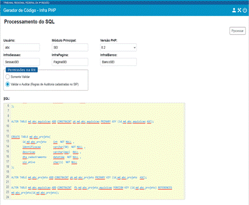
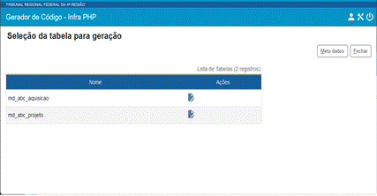
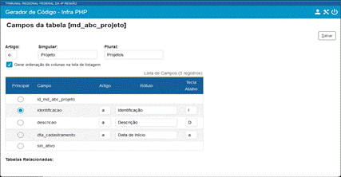
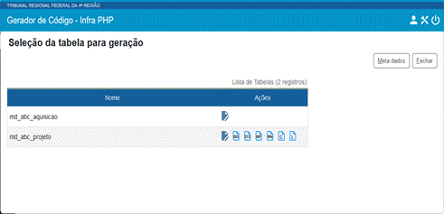

# 7. Gerador de Código

As operações básicas podem ser geradas no framework InfraPHP através de um gerador de código disponível no endereço: [*https://gerador.trf4.jus.br*](https://gerador.trf4.jus.br/)

A geração do código é realizada com base na interpretação dos comandos DDL utilizados para criação da base de dados. É muito importante seguir o padrão de modelagem de dados, principalmente com relação aos prefixos dos campos, pois o gerador utilizará essas informações para gerar máscaras para os campos na interface e validações específicas tanto em javascript como na camada de regras de negócio.

Os comandos SQL podem ser escritos em vários dialetos e o gerador aceita somente alguns deles.

**Exemplo** de comandos SQL de duas tabelas e informações necessárias para geração de código de operações básicas por meio do framework InfraPHP:


```sql
CREATE TABLE md_abc_aquisicao(
    id_md_abc_aquisicao integer NOT NULL,
    id_md_abc_projeto int NOT NULL,
    descricao varchar(50) NOT NULL,
    din_custo numeric(12,2) NOT NULL
);

ALTER TABLE md_abc_aquisicao ADD CONSTRAINT pk_md_abc_aquisicao PRIMARY KEY (id_md_abc_aquisicao ASC);

CREATE TABLE md_abc_projeto(
    id_md_abc_projeto int NOT NULL,
    identificacao varchar(50) NOT NULL,
    descricao varchar(max) NULL,
    dta_cadastramento datetime NOT NULL,
    sin_ativo char(1) NOT NULL
);

ALTER TABLE md_abc_projeto ADD CONSTRAINT pk_md_abc_projeto PRIMARY KEY (id_md_abc_projeto ASC);

ALTER TABLE md_abc_aquisicao ADD CONSTRAINT fk_md_abc_projeto_aquisicao FOREIGN KEY (id_md_abc_projeto) REFERENCES md_abc_projeto(id_md_abc_projeto);

CREATE INDEX fk_md_abc_projeto_aquisicao ON md_abc_aquisicao (id_md_abc_projeto ASC);
```

1\)  processar os comandos SQL preenchendo os campos: Usuário, Módulo Principal (que inclui o `InfraPHP`), Versão do PHP, as classes de `InfraSessao`, `InfraPagina` e `InfraBanco`. Na seção `Permissões na RN`, informar se o código na RN deve prever auditoria das permissões por meio de Regras de Auditoria cadastradas no SIP:




2\)  clique no botão de ação `Cadastrar Campos` da tabela escolhida para a geração do código; neste exemplo será `md_abc_projeto`:




3\)  informar o campo principal, os rótulos dos campos e teclas de atalho:




Campo principal:

- será retornado automaticamente na tela de lista junto com o ID;

- será gerado um método para montagem de combo na classe MdAbcProjetoINT buscando por esse campo;

- no DTO das tabelas relacionadas ele será recuperado automaticamente, ou seja, em `MdAbcAquisicaoDTO` será adicionada uma FK para `md_abc_projeto` e um atributo relacionado `IdentificacaoMdAbcProjeto`. Para que isso ocorra é necessário configurar o campo principal da tabela `md_abc_projeto` antes de gerar o código de `md_abc_aquisicao`. Se o código de `md_abc_projeto` fosse gerado em outra ocasião, bastaria selecionar a tabela e avançar até o passo final escolhendo apenas o campo principal (sem preencher todos os campos).

4\)  Ao final o código poderá ser baixado clicando nos botões de ação `Gerar BD`, `Gerar DTO`, `Gerar INT`, `Gerar RN`, `Gerar Tela Cadastro` e `Gerar Tela Listagem`:



