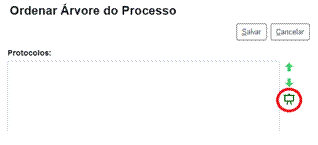

# 9. Eventos

A interceptação de eventos ocorre na classe de integração do módulo através da sobrecarga de métodos da classe `SeiIntegracao`. Dependendo do evento interceptado o módulo pode realizar processamentos adicionais ou cancelar o processamento do sistema lançando validações ou exceções.

Nos eventos que recebem múltiplos objetos como parâmetros deve ser evitada a consulta individual de registros. Por exemplo, caso a tela de **Controle de Processos** esteja com a paginação configurada em 100, isso significa que poderão ser exibidos até 200 processos (100 na coluna de gerados e 100 nos recebidos). Assim, o evento `montarIconeControleProcessos` poderá receber um array com até 200 objetos `ProcedimentoAPI`. Se for realizada uma consulta para cada processo serão 200 acessos ao banco. Nesse caso é melhor fazer uma única consulta utilizando `IN`.

Exemplos para alguns dos métodos descritos nesta seção podem ser visualizados no código do módulo de exemplo ABC disponibilizado junto com o sistema.

## adicionarElementoMenu

| **Saída** |
|---|
| `strElemento`:<br><ul><li>Conteúdo HTML para inclusão abaixo do menu.</li></ul> |

**Exemplo:**

```php
public function adicionarElementoMenu(){
  return '<div style="text-align:center;"></div>';
}
```


## agendarPublicacao

| **Entrada** |
|---|
| `$objPublicacaoAPI`:<br><ul><li>Instância preenchida com IdPublicacao, IdDocumento, IdVeiculoPublicacao, StaTipoVeiculo e DataDisponibilizacao.</li></ul> |

## alterarContato

| **Entrada** |
|---|
| `$objContatoAPI`:<br><ul><li>Instância preenchida com IdContato, IdTipoContato, IdContatoAssociado, StaNatureza, SinEnderecoAssociado, StaGenero, Cpf, Rg, OrgaoExpedidor, Matricula, MatriculaOab, NumeroPassaporte, IdPaisPassaporte, DataNascimento, Cnpj, IdCargo, Sigla, Nome, NomeSocial, TelefoneFixo, TelefoneCelular, Email, SitioInternet, Endereco, Complemento, Bairro, Cep, Observacao, SinAtivo, IdPais, IdEstado e IdCidade.</li></ul> |

## alterarDocumento

| **Entrada** |
|---|
| `$objDocumentoAPI`:<br><ul><li>Instância preenchida com IdDocumento, NumeroProtocolo, IdProcedimento, IdSerie, NivelAcesso, SubTipo, Numero, Data, IdUnidadeGeradora, DinValor, IdPlanoTrabalho e AtributosModulo.</li></ul> |

## alterarHipoteseLegal

| **Entrada** |
|---|
| `$objHipoteseLegalAPI`:<br><ul><li>Instância preenchida com IdHipoteseLegal, Nome, Descricao, BaseLegal, NivelAcesso e SinAtivo.</li></ul> |

## alterarIconeArvoreDocumento

| **Entrada** |
|---|
| `objProcedimentoAPI`:<br><ul><li>Ocorrência de ProcedimentoAPI preenchida com: IdProcedimento, NumeroProtocolo, IdTipoProcedimento, NomeTipoProcedimento, IdTipoPrioridade, NivelAcesso, IdUnidadeGeradora, IdOrgaoUnidadeGeradora, IdHipoteseLegal, GrauSigilo, CodigoAcesso e SinAberto.</li></ul> |
| `$arrObjDocumentoAPI`:<br><ul><li>Conjunto de ocorrências de DocumentoAPI preenchidas com:<br> IdDocumento, NumeroProtocolo, IdSerie, NomeSerie, IdUnidadeGeradora, IdOrgaoUnidadeGeradora, SinAssinado, SinPublicado, SinBloqueado, CodigoAcesso, Tipo e SubTipo.</li></ul> |
| **Saída** |
| `arrIcones`:<br><ul><li>Um array PHP indexado pelos IDs dos documentos onde cada posição contém o caminho para a imagem. Documentos que não devem ter o ícone alterado pelo módulo não precisam estar no array. Para as imagens é recomendado utilizar o formato SVG com tamanho 24x24.</li></ul> |

**Exemplo:**

```php
public function alterarIconeArvoreDocumento(ProcedimentoAPI $objProcedimentoAPI, $arrObjDocumentoAPI){
  $arrIcones = array();
  $objInfraParametro = new InfraParametro(BancoSEI::getInstance());
  $numIdSerieAbc = $objInfraParametro->getValor('MD_ABC_ID_SERIE_TESTE', false);
  foreach ($arrObjDocumentoAPI as $objDocumentoAPI) {
    if ($objDocumentoAPI->getIdSerie()==$numIdSerieAbc) {
      $arrIcones[$objDocumentoAPI->getIdDocumento()] = 'modulos/abc/exemplo/svg/exemplo.svg';
    }
  }
  return $arrIcones;
}
```


## alterarProcesso

| **Entrada** |
|---|
| `$objProcedimentoAPI`:<br><ul><li>Instância preenchida com IdProcedimento, IdTipoProcedimento e IdTipoPrioridade.</li></ul> |

## alterarPublicacao

| **Entrada** |
|---|
| `$objPublicacaoAPI`:<br><ul><li>Instância preenchida com IdPublicacao, IdDocumento, IdVeiculoPublicacao, StaTipoVeiculo e DataDisponibilizacao.</li></ul> |

## alterarVeiculoPublicacao

| **Entrada** |
|---|
| `$objVeiculoPublicacaoAPI`:<br><ul><li>Instância preenchida com IdVeiculoPublicacao, Nome, Descricao, StaTipo, SinFonteFeriados, SinPermiteExtraordinaria, SinExibirPesquisaInterna, WebService e SinAtivo.</li></ul> |

## anexarProcesso

| **Entrada** |
|---|
| `$objProcedimentoAPIPrincipal`:<br><ul><li>Instância preenchida com IdProcedimento e NumeroProtocolo.</li></ul> |
| `$objProcedimentoAPIAnexado`:<br><ul><li>Instância preenchida com IdProcedimento e NumeroProtocolo.</li></ul> |

## assinarDocumento

| **Entrada** |
|---|
| `$arrObjDocumentoAPI`:<br><ul><li>Instâncias preenchidas com IdDocumento, IdProcedimento, NumeroProtocolo, IdSerie, IdUnidadeGeradora, IdOrgaoUnidadeGeradora, IdUsuarioGerador, Tipo, SubTipo e NivelAcesso.</li></ul> |

## atualizarConteudoDocumento

| **Entrada** |
|---|
| `$objDocumentoAPI`:<br><ul><li>Instância preenchida com IdDocumento.</li></ul> |

## bloquearProcesso

| **Entrada** |
|---|
| `$arrObjProcedimentoAPI`:<br><ul><li>Instâncias preenchidas com IdProcedimento e NumeroProtocolo.</li></ul> |

## cadastrarContato

| **Entrada** |
|---|
| `$objContatoAPI`:<br><ul><li>Instância preenchida com IdContato, IdTipoContato, IdContatoAssociado, StaNatureza, SinEnderecoAssociado, StaGenero, Cpf, Rg, OrgaoExpedidor, Matricula, MatriculaOab, NumeroPassaporte, IdPaisPassaporte, DataNascimento, Cnpj, IdCargo, Sigla, Nome, NomeSocial, TelefoneFixo, TelefoneCelular, Email, SitioInternet, Endereco, Complemento, Bairro, Cep, Observacao, SinAtivo, IdPais, IdEstado e IdCidade.</li></ul> |

## cadastrarHipoteseLegal

| **Entrada** |
|---|
| `$objHipoteseLegalAPI`:<br><ul><li>Instância preenchida com IdHipoteseLegal, Nome, Descricao, BaseLegal, NivelAcesso e SinAtivo.</li></ul> |

## cadastrarVeiculoPublicacao

| **Entrada** |
|---|
| `$objVeiculoPublicacaoAPI`:<br><ul><li>Instância preenchida com IdVeiculoPublicacao, Nome, Descricao, StaTipo, SinFonteFeriados, SinPermiteExtraordinaria, SinExibirPesquisaInterna, WebService e SinAtivo.</li></ul> |

## cancelarAgendamentoPublicacao

| **Entrada** |
|---|
| `$objPublicacaoAPI`:<br><ul><li>Instância preenchida com IdPublicacao, IdDocumento, IdVeiculoPublicacao, StaTipoVeiculo e DataDisponibilizacao.</li></ul> |

## cancelarDocumento

| **Entrada** |
|---|
| `$objDocumentoAPI`:<br><ul><li>Instância preenchida com IdDocumento, NumeroProtocolo, IdSerie, IdUnidadeGeradora, Tipo, SubTipo e NivelAcesso.</li></ul> |

## cancelarDisponibilizacaoAcessoExterno

| **Entrada** |
|---|
| `$arrObjAcessoExternoAPI`:<br><ul><li>Instâncias preenchidas com IdAcessoExterno e Procedimento.IdProcedimento.</li></ul> |

## cancelarLiberacaoAssinaturaExterna

| **Entrada** |
|---|
| `$arrObjAcessoExternoAPI`:<br><ul><li>Instâncias preenchidas com IdAcessoExterno, Procedimento.IdProcedimento e Documento.IdDocumento.</li></ul> |

## confirmarAtualizacaoConteudoDocumento

| **Entrada** |
|---|
| `objDocumentoAPI`:<br><ul><li>Ocorrência de DocumentoAPI preenchida com IdDocumento.</li></ul> |
| **Saída** |
| `strMensagem`:<br><ul><li>Mensagem que será exibida antes de salvar o documento seguida pelo texto Deseja salvar o documento?</li></ul> |

**Exemplo:**

```php
public function confirmarAtualizacaoConteudoDocumento(DocumentoAPI $objDocumentoAPI){
  $ret = '';

  //if (...condicao...){
  $ret = 'A alteração do documento cancelará a solicitação.';
  //}
  return $ret;
}
```


## confirmarPublicacao

| **Entrada** |
|---|
| `$arrObjPublicacaoAPI`:<br><ul><li>Instâncias preenchidas com IdPublicacao, IdDocumento, IdSerieDocumento, IdVeiculoPublicacao, StaTipoVeiculo, DataDisponibilizacao e DataPublicacao.</li></ul> |

## concluirProcesso

| **Entrada** |
|---|
| `$arrObjProcedimentoAPI`:<br><ul><li>Instâncias preenchidas com IdProcedimento.</li></ul> |

## darCienciaDocumento

| **Entrada** |
|---|
| `$objDocumentoAPI`:<br><ul><li>Instâncias preenchidas com IdDocumento, IdProcedimento, NumeroProtocolo, IdSerie, IdUnidadeGeradora, IdOrgaoUnidadeGeradora, IdUsuarioGerador, Tipo, SubTipo e NivelAcesso.</li></ul> |

## darCienciaProcesso

| **Entrada** |
|---|
| `$objProcedimentoAPI`:<br><ul><li>Instâncias preenchidas com IdProcedimento, NumeroProtocolo, IdTipoProcedimento, IdUnidadeGeradora, IdOrgaoUnidadeGeradora, IdUsuarioGerador e NivelAcesso.</li></ul> |

## desanexarProcesso

| **Entrada** |
|---|
| `$objProcedimentoAPIPrincipal`:<br><ul><li>Instância preenchida com IdProcedimento e NumeroProtocolo.</li></ul> |
| `$objProcedimentoAPIAnexado`:<br><ul><li>Instância preenchida com IdProcedimento e NumeroProtocolo.</li></ul> |

## desativarArquivoExtensao

| **Entrada** |
|---|
| `$arrObjArquivoExtensaoAPI`:<br><ul><li>Instâncias preenchidas com IdArquivoExtensao e Extensao.</li></ul> |

## desativarContato

| **Entrada** |
|---|
| `$arrObjContatoAPI`:<br><ul><li>Instâncias preenchidas com IdContato, IdTipoContato, IdContatoAssociado, Sigla, Nome e NomeSocial.</li></ul> |

## desativarHipoteseLegal

| **Entrada** |
|---|
| `$arrObjHipoteseLegalAPI`:<br><ul><li>Instâncias preenchidas com IdHipoteseLegal, Nome, BaseLegal e NivelAcesso.</li></ul> |

## desativarTipoContato

| **Entrada** |
|---|
| `$arrObjTipoContatoAPI`:<br><ul><li>Instâncias preenchidas com IdTipoContato e Nome.</li></ul> |

## desativarTipoDocumento

| **Entrada** |
|---|
| `$arrObjSerieAPI`:<br><ul><li>Instâncias preenchidas com IdSerie, Nome e Aplicabilidade.</li></ul> |

## desativarTipoProcesso

| **Entrada** |
|---|
| `$arrObjTipoProcedimentoAPI`:<br><ul><li>Instâncias preenchidas com IdTipoProcedimento e Nome.</li></ul> |

## desativarUnidade

| **Entrada** |
|---|
| `$arrObjUnidadeAPI`:<br><ul><li>Instâncias preenchidas com IdUnidade, Sigla e Descricao.</li></ul> |

## desativarUsuario

| **Entrada** |
|---|
| `$arrObjUsuarioAPI`:<br><ul><li>Instâncias preenchidas com IdUsuario, Sigla, Nome e StaTipo.</li></ul> |

## desativarVeiculoPublicacao

| **Entrada** |
|---|
| `$arrObjVeiculoPublicacaoAPI`:<br><ul><li>Instâncias preenchidas com IdVeiculoPublicacao.</li></ul> |

## desbloquearProcesso

| **Entrada** |
|---|
| `$arrObjProcedimentoAPI`:<br><ul><li>Instâncias preenchidas com IdProcedimento e NumeroProtocolo.</li></ul> |

## eliminarDocumento

| **Entrada** |
|---|
| `$arrObjDocumentoAPI`:<br><ul><li>Instâncias preenchidas com IdDocumento e NumeroProtocolo.</li></ul> |

## eliminarProcesso

| **Entrada** |
|---|
| `$objProcedimentoAPI`:<br><ul><li>Instância preenchida com IdProcedimento e NumeroProtocolo.</li></ul> |

## enviarProcesso

| **Entrada** |
|---|
| `$arrObjProcedimentoAPI`:<br><ul><li>Instâncias preenchidas com IdProcedimento, NumeroProtocolo, IdTipoProcedimento, NomeTipoProcedimento e IdUnidadeGeradora.</li></ul> |
| `$arrObjUnidadeAPI`:<br><ul><li>Instâncias preenchidas com IdUnidade, Sigla, Descricao e OrgaoAPI (IdOrgao, Sigla, Descricao).</li></ul> |

## excluirArquivoExtensao

| **Entrada** |
|---|
| `$arrObjArquivoExtensaoAPI`:<br><ul><li>Instâncias preenchidas com IdArquivoExtensao e Extensao.</li></ul> |

## excluirContato

| **Entrada** |
|---|
| `$arrObjContatoAPI`:<br><ul><li>Instâncias preenchidas com IdContato, IdTipoContato, IdContatoAssociado, Sigla, Nome e NomeSocial.</li></ul> |

## excluirDocumento

| **Entrada** |
|---|
| `$objDocumentoAPI`:<br><ul><li>Instância preenchida com IdDocumento.</li></ul> |

## excluirHipoteseLegal

| **Entrada** |
|---|
| `$arrObjHipoteseLegalAPI`:<br><ul><li>Instâncias preenchidas com IdHipoteseLegal, Nome, BaseLegal e NivelAcesso.</li></ul> |

## excluirProcesso

| **Entrada** |
|---|
| `$objProcedimentoAPI`:<br><ul><li>Instância preenchida com IdProcedimento.</li></ul> |

## excluirTipoContato

| **Entrada** |
|---|
| `$arrObjTipoContatoAPI`:<br><ul><li>Instâncias preenchidas com IdTipoContato e Nome.</li></ul> |

## excluirTipoDocumento

| **Entrada** |
|---|
| `$arrObjSerieAPI`:<br><ul><li>Instâncias preenchidas com IdSerie, Nome e Aplicabilidade.</li></ul> |

## excluirTipoProcesso

| **Entrada** |
|---|
| `$arrObjTipoProcedimentoAPI`:<br><ul><li>Instâncias preenchidas com IdTipoProcedimento e Nome.</li></ul> |

## excluirUnidade

| **Entrada** |
|---|
| `$arrObjUnidadeAPI`:<br><ul><li>Instâncias preenchidas com IdUnidade, Sigla e Descricao.</li></ul> |

## excluirUsuario

| **Entrada** |
|---|
| `$arrObjUsuarioAPI`:<br><ul><li>Instâncias preenchidas com IdUsuario, Sigla, Nome e StaTipo.</li></ul> |

## excluirVeiculoPublicacao

| **Entrada** |
|---|
| `$arrObjVeiculoPublicacaoAPI`:<br><ul><li>Instâncias preenchidas com IdVeiculoPublicacao.</li></ul> |

## gerarDocumento

| **Entrada** |
|---|
| `$objDocumentoAPI`:<br><ul><li>Instância preenchida com IdDocumento, NumeroProtocolo, IdProcedimento, IdSerie, NivelAcesso, SubTipo, Numero, Data, IdUnidadeGeradora, DinValor, IdPlanoTrabalho, IdEtapaTrabalho, IdItemEtapa, IdOperacao e AtributosModulo.</li></ul> |

## gerarProcesso

| **Entrada** |
|---|
| `$objProcedimentoAPI`:<br><ul><li>Instância preenchida com IdProcedimento, NumeroProtocolo, IdTipoProcedimento, IdTipoPrioridade e NivelAcesso.</li></ul> |

## Inicializar

| **Entrada** |
|---|
| `strVersaoSEI`:<br><ul><li>Número da versão do SEI (exemplo: 3.1.0).</li></ul> |
| **Observações** |
| Esse método é chamado a cada acesso ao sistema e pode ser utilizado, por exemplo, para verificar a compatibilidade do módulo com a versão do SEI. Ele é executado em cada acesso ao sistema então se for necessário realizar um processamento complexo e demorado é recomendado o uso das classes SessaoSEI e CacheSEI para salvar o resultado na sessão do usuário ou no servidor memcache (garantindo que o processamento seja realizado apenas uma vez). |

## listarUnidadesEnvioProcesso

| **Entrada** |
|---|
| `$arrObjProcedimentoAPI`:<br><ul><li>Instâncias preenchidas com IdProcedimento, NumeroProtocolo, IdTipoProcedimento, NomeTipoProcedimento e IdUnidadeGeradora.</li></ul> |
| **Saída** |
| `$arrObjUnidadeAPI`:<br><ul><li>Instâncias preenchidas com IdUnidade.</li></ul> |

## montarAcaoControleAcessoExterno

| **Entrada** |
|---|
| `arrAcessoExternoAPI`:<br><ul><li>Conjunto de ocorrências de AcessoExternoAPI preenchidas com: IdAcessoExterno, DataValidade, SinAcessoProcesso, Procedimento (ocorrência de ProcedimentoAPI preenchida com IdProcedimento, NumeroProtocolo, IdTipoProcedimento, NomeTipoProcedimento, IdTipoPrioridade e NivelAcesso), Documento (ocorrência de DocumentoAPI preenchida com IdDocumento, NumeroProtocolo, IdSerie, IdUnidadeGeradora, Tipo, SinAssinado, SinPublicado e NivelAcesso).</li></ul> |
| **Saída** |
| `arrIcones`:<br><ul><li>Um array PHP indexado pelos IDs dos acessos externos onde cada posição contém outro array com o conjunto de ícones para exibição. Acessos externos que não devem exibir ícones do módulo não precisam estar no array. Para as imagens é recomendado utilizar o formato SVG com tamanho 24x24.</li></ul> |

**Exemplo:**

```php
public function montarAcaoControleAcessoExterno($arrObjAcessoExternoAPI){
  $arrIcones = array();
  foreach($arrObjAcessoExternoAPI as $objAcessoExternoAPI) {
    $arrIcones[$objAcessoExternoAPI->getIdAcessoExterno()][] = '<a href="javascript:void(0);" '.PaginaSEI::montarTitleTooltip('Ícone Ação Acesso Externo ABC','Módulo ABC').'></a>';
  }
  return $arrIcones;
}
```


## montarAcaoDocumentoAcessoExternoAutorizado

| **Entrada** |
|---|
| `arrDocumentoAPI`:<br><ul><li>Conjunto de ocorrências de DocumentoAPI preenchidas com:<br> IdDocumento, NumeroProtocolo, IdSerie, IdUnidadeGeradora, Tipo, SinAssinado, SinPublicado e NivelAcesso.</li></ul> |
| **Saída** |
| `arrIcones`:<br><ul><li>Um array PHP indexado pelos IDs dos documentos onde cada posição contém outro array com o conjunto de ícones para exibição. Documentos que não devem exibir ícones do módulo não precisam estar no array. Para as imagens é recomendado utilizar o formato SVG com tamanho 24x24.</li></ul> |

**Exemplo:**

```php
public function montarAcaoDocumentoAcessoExternoAutorizado($arrObjDocumentoAPI){
  $arrIcones = array();
  foreach($arrObjDocumentoAPI as $objDocumentoAPI) {
    $arrIcones[$objDocumentoAPI->getIdDocumento()][] = '<a href="javascript:void(0);" '.PaginaSEI::montarTitleTooltip('Ícone Ação Documento Acesso Externo Autorizado ABC','Módulo ABC').'></a>';
  }
  return $arrIcones;
}
```


## montarAcaoDocumentoAcessoExternoNegado

| **Entrada** |
|---|
| `arrDocumentoAPI`:<br><ul><li>Conjunto de ocorrências de DocumentoAPI preenchidas com: IdDocumento, NumeroProtocolo, IdSerie, IdUnidadeGeradora, Tipo, SinAssinado, SinPublicado e NivelAcesso.</li></ul> |
| **Saída** |
| `arrIcones`:<br><ul><li>Um array PHP indexado pelos IDs dos documentos onde cada posição contém outro array com o conjunto de ícones para exibição. Documentos que não devem exibir ícones do módulo não precisam estar no array. Para as imagens é recomendado utilizar o formato SVG com tamanho 24x24.</li></ul> |

**Exemplo:**

```php
public function montarAcaoDocumentoAcessoExternoNegado($arrObjDocumentoAPI){
  $arrIcones = array();
  foreach($arrObjDocumentoAPI as $objDocumentoAPI) {
    $arrIcones[$objDocumentoAPI->getIdDocumento()][] = '<a href="javascript:void(0);" '.PaginaSEI::montarTitleTooltip('Ícone Ação Documento Acesso Externo Negado ABC','Módulo ABC').'></a>';
  }
  return $arrIcones;
}
```


## montarAcaoProcessoAnexadoAcessoExternoAutorizado

| **Entrada** |
|---|
| `arrProcedimentoAPI`:<br><ul><li>Conjunto de ocorrências de ProcedimentoAPI preenchidas com:<br> IdProcedimento, NumeroProtocolo, IdTipoProcedimento, NomeTipoProcedimento e NivelAcesso.</li></ul> |
| **Saída** |
| `arrIcones`:<br><ul><li>Um array PHP indexado pelos IDs dos processos onde cada posição contém outro array com o conjunto de ícones para exibição. Processos que não devem exibir ícones do módulo não precisam estar no array. Para as imagens é recomendado utilizar o formato SVG com tamanho 24x24.</li></ul> |

**Exemplo:**

```php
public function montarAcaoProcessoAnexadoAcessoExternoAutorizado($arrObjProcedimentoAPI){
  $arrIcones = array();
  foreach($arrObjProcedimentoAPI as $objProcedimentoAPI) {
    $arrIcones[$objProcedimentoAPI->getIdProcedimento()][] = '<a href="javascript:void(0);" '.PaginaSEI::montarTitleTooltip('Ícone Ação Processo Anexado Acesso Externo Autorizado ABC','Módulo ABC').'></a>';
  }
  return $arrIcones;
}
```


## montarAcaoProcessoAnexadoAcessoExternoNegado

| **Entrada** |
|---|
| `arrProcedimentoAPI`:<br><ul><li>Conjunto de ocorrências de ProcedimentoAPI preenchidas com:<br> IdProcedimento, NumeroProtocolo, IdTipoProcedimento, NomeTipoProcedimento e NivelAcesso.</li></ul> |
| **Saída** |
| `arrIcones`:<br><ul><li>Um array PHP indexado pelos IDs dos processos onde cada posição contém outro array com o conjunto de ícones para exibição. Processos que não devem exibir ícones do módulo não precisam estar no array. Para as imagens é recomendado utilizar o formato SVG com tamanho 24x24.</li></ul> |

**Exemplo:**

```php
public function montarAcaoProcessoAnexadoAcessoExternoNegado($arrObjProcedimentoAPI){
  $arrIcones = array();
  foreach($arrObjProcedimentoAPI as $objProcedimentoAPI) {
    $arrIcones[$objProcedimentoAPI->getIdProcedimento()][] = '<a href="javascript:void(0);" '.PaginaSEI::montarTitleTooltip('Ícone Ação Processo Anexado Acesso Externo Negado ABC','Módulo ABC').'></a>';
  }
  return $arrIcones;
}
```


## montarAcaoPublicacao

| **Entrada** |
|---|
| `arrObjPublicacaoAPI`:<br><ul><li>Conjunto de ocorrências de PublicacaoAPI preenchidas com:<br> IdPublicacao, IdDocumento e Estado.</li></ul> |
| **Saída** |
| `arrIcones`:<br><ul><li>Um array PHP indexado pelos IDs das publicações que possuem ações liberadas pelo módulo. Cada posição contém outro array com o conjunto de ícones para exibição. Para as imagens é recomendado utilizar o formato SVG com tamanho 24x24.</li></ul> |

**Exemplo:**

```php
public function montarAcaoPublicacao($arrObjPublicacaoAPI){
  $arrIcones = array();
  foreach($arrObjPublicacaoAPI as $objPublicacaoAPI) {
    $arrIcones[$objPublicacaoAPI->getIdPublicacao()][] = '<a href="javascript:void(0);" '.PaginaSEI::montarTitleTooltip('Ícone Ação Publicação ABC','Módulo ABC').'></a>';
  }
  return $arrIcones;
}
```


## montarAcaoVeiculoPublicacao

| **Entrada** |
|---|
| `arrObjVeiculoPublicacaoAPI`:<br><ul><li>Conjunto de ocorrências de VeiculoPublicacaoAPI preenchidas com:<br> IdVeiculoPublicacao e Nome.</li></ul> |
| **Saída** |
| `arrIcones`:<br><ul><li>Um array PHP indexado pelos IDs dos veículos que possuem ações liberadas pelo módulo. Cada posição contém outro array com o conjunto de ícones para exibição. Para as imagens é recomendado utilizar o formato SVG com tamanho 24x24.</li></ul> |

**Exemplo:**

```php
public function montarAcaoVeiculoPublicacao($arrObjVeiculoPublicacaoDTO){
  $arrIcones = array();
  foreach($arrObjVeiculoPublicacaoDTO as $objVeiculoPublicacaoAPI) {
    $arrIcones[$objVeiculoPublicacaoAPI->getIdVeiculoPublicacao()][] = '<a href="javascript:void(0);" '.PaginaSEI::montarTitleTooltip('Ícone Ação Veículo Publicação ABC','Módulo ABC').'></a>';
  }
  return $arrIcones;
}
```


## montarBotaoAcessoExternoAutorizado

| **Entrada** |
|---|
| `objProcedimentoAPI`:<br><ul><li>Ocorrência de ProcedimentoAPI preenchida com: IdProcedimento, NumeroProtocolo, IdTipoProcedimento, NomeTipoProcedimento, IdTipoPrioridade e NivelAcesso.</li></ul> |
| **Saída** |
| `arrBotoes`:<br><ul><li>Um array PHP onde cada item representa um botão.</li></ul> |

**Exemplo:**

```php
public function montarBotaoAcessoExternoAutorizado(ProcedimentoAPI $objProcedimentoAPI){
  $arrBotoes = array();
  $arrBotoes[] = '<button type="button" id="btnExemploABC1" name="btnExemploABC1" value="ABC 1" class="infraButton">ABC 1</button>';
  $arrBotoes[] = '<button type="button" id="btnExemploABC2" name="btnExemploABC2" value="ABC 2" class="infraButton">ABC 2</button>';
  return $arrBotoes;
}
```


## montarBotaoAssinaturaExterno

| **Entrada** |
|---|
| `objUsuarioAPI`:<br><ul><li>Ocorrência de UsuarioAPI preenchida com: IdUsuario, Sigla, Nome e StaTipo.</li></ul> |
| **Saída** |
| `strHtml`:<br><ul><li>Código HTML do botão.</li></ul> |

**Exemplo:**

```php
public function montarBotaoAssinaturaExterno(UsuarioAPI $objUsuarioAPI){
  return '<button type="button" id="btnAbc" value="Assinar Externo ABC" class="infraButton">Assinar Externo ABC</button>';
}
```


## montarBotaoAssinaturaInterno

| **Entrada** |
|---|
| `objUsuarioAPI`:<br><ul><li>Ocorrência de UsuarioAPI preenchida com: IdUsuario, Sigla, Nome e StaTipo.</li></ul> |
| **Saída** |
| `strHtml`:<br><ul><li>Código HTML do botão.</li></ul> |

**Exemplo:**

```php
public function montarBotaoAssinaturaInterno(UsuarioAPI $objUsuarioAPI){
  return '<button type="button" id="btnAbc" value="Assinar Interno ABC" class="infraButton">Assinar Interno ABC</button>';
}
```


## montarBotaoChatIA

| **Saída** |
|---|
| `strBotao`:<br><ul><li>Texto com o código do botão para inclusão na página.</li></ul> |

## montarBotaoControleAcessoExterno

| **Saída** |
|---|
| `arrBotoes`:<br><ul><li>Um array PHP onde cada item representa um botão.</li></ul> |

**Exemplo:**

```php
public function montarBotaoControleAcessoExterno(){
  $arrBotoes = array();
  $arrBotoes[] = '<button type="button" id="btnExemploABC1" name="btnExemploABC1" value="ABC 1" class="infraButton">ABC 1</button>';
  $arrBotoes[] = '<button type="button" id="btnExemploABC2" name="btnExemploABC2" value="ABC 2" class="infraButton">ABC 2</button>';
  return $arrBotoes;
}
```


## montarBotaoControleProcessos

| **Saída** |
|---|
| `arrBotoes`:<br><ul><li>Um array PHP onde cada item representa um botão. Para as imagens<br> é recomendado utilizar o formato SVG com tamanho 24x24.</li></ul> |

**Exemplo:**

```php
public function montarBotaoControleProcessos(){
  $arrBotoes = array();
  /* Função javascript disponível na página de Controle de Processos: 
    acaoControleProcessos(link, requerSelecionado, aceitaSigiloso)
    onde: link - link para a página
    requerSelecionado - true/false, indica necessidade ou não de selecionar processos para executar a acao
    aceitaSigiloso - true/false, indica se o usuario podera selecionar processos sigilosos
  */
  if (SessaoSEI::getInstance()->verificarPermissao('md_abc_andamento_lancar'))
  {
    $arrBotoes[] = '<a href="#" onclick="return
        acaoControleProcessos(\'' . SessaoSEI::getInstance()->assinarLink('controlador.php?acao=md_abc_andamento_lancar&acao_origem=procedimento_controlar&acao_retorno=procedimento_controlar') . '\', true, false);" tabindex="' . PaginaSEI::getInstance()->getProxTabBarraComandosSuperior() . '" class="botaoSEI">
    </a>';
  }
  return $arrBotoes;
}
```


## montarBotaoDocumento

| **Entrada** |
|---|
| `objProcedimentoAPI`:<br><ul><li>Ocorrência de ProcedimentoAPI preenchida com: IdProcedimento, NumeroProtocolo, IdTipoProcedimento, NomeTipoProcedimento, IdTipoPrioridade, NivelAcesso, GrauSigilo, IdHipoteseLegal, IdUnidadeGeradora, IdOrgaoUnidadeGeradora, CodigoAcesso e SinAberto.</li></ul> |
| `$arrObjDocumentoAPI`:<br><ul><li>Conjunto de ocorrências de DocumentoAPI preenchidas com: IdDocumento, NumeroProtocolo, IdSerie, NomeSerie, IdUnidadeGeradora, IdOrgaoUnidadeGeradora, SinAssinado, SinPublicado, SinBloqueado, CodigoAcesso, Tipo, SubTipo.</li></ul> |
| **Saída** |
| `arrBotoes`:<br><ul><li>Um array PHP indexado pelos IDs dos documentos onde cada posição contém outro array com o conjunto de botões para exibição junto ao documento. Documentos que não devem exibir botões do módulo não precisam estar no array. Para as imagens é recomendado utilizar o formato SVG com tamanho 40x40.</li></ul> |

**Exemplo:**

```php
public function montarBotaoDocumento(ProcedimentoAPI $objProcedimentoAPI, $arrObjDocumentoAPI){
  $arrBotoes = array();
  if ($objProcedimentoAPI->getCodigoAcesso() > 0 && $objProcedimentoAPI->getSinAberto()=='S'){
    $dblIdProcedimento = $objProcedimentoAPI->getIdProcedimento();
    $bolAcaoAbcDocumentoProcessar = SessaoSEI::getInstance()->verificarPermissao('md_abc_documento_processar');
    //$bolAcaoAbcDocumentoProcessar2 = SessaoSEI::getInstance()->verificarPermissao('md_abc_documento_processar2');
    //$bolAcaoAbcDocumentoProcessar3 = SessaoSEI::getInstance()->verificarPermissao('md_abc_documento_processar3');
    //$bolAcaoAbcDocumentoProcessarN = SessaoSEI::getInstance()->verificarPermissao('md_abc_documento_processarN');
    foreach ($arrObjDocumentoAPI as $objDocumentoAPI) {
      if ($objDocumentoAPI->getCodigoAcesso() > 0) {
        $dblIdDocumento = $objDocumentoAPI->getIdDocumento();
        $arrBotoes[$dblIdDocumento] = array();
        if ($bolAcaoAbcDocumentoProcessar) {
          $arrBotoes[$dblIdDocumento][] = '<a href="#"
            onclick="location.href=\\\'' . SessaoSEI::getInstance()->assinarLink('controlador.php?acao=md_abc_documento_processar&id_procedimento=' . $dblIdProcedimento . '&id_documento=' . $dblIdDocumento . '&arvore=1') . '\\\';"
            tabindex="' . PaginaSEI::getInstance()->getProxTabBarraComandosSuperior() . '" class="botaoSEI"></a>';
        }
        /*
        if ($bolAcaoAbcDocumentoProcessar2) {
          $arrBotoes[$dblIdDocumento][] = '...';
        }
        if ($bolAcaoAbcDocumentoProcessar3) {
          $arrBotoes[$dblIdDocumento][] = '...';
        }
        if ($bolAcaoAbcDocumentoProcessarN) {
          $arrBotoes[$dblIdDocumento][] = '...';
        }
        */
      }
    }
  }
  return $arrBotoes;
}
```


## montarBotaoCadastroDocumento

| **Entrada** |
|---|
| `objDocumentoAPI`:<br><ul><li>Ocorrência de DocumentoAPI preenchida com: IdProcedimento, IdDocumento, IdSerie, Data, IdUnidadeGeradora, Numero, NomeArvore, DinValor, IdPlanoTrabalho e Tipo.</li></ul> |
| **Saída** |
| `arrBotoes`:<br><ul><li>Um array PHP onde cada item representa um botão.</li></ul> |

**Exemplo:**

```php
public function montarBotaoCadastroDocumento(DocumentoAPI $objDocumentoAPI){
  $arrBotoes = array();

  $objInfraParametro = new InfraParametro(BancoSEI::getInstance());
  $numIdSerieEmpenho = $objInfraParametro->getValor('MD_ABC_ID_SERIE_EMPENHO', false);
  if ($objDocumentoAPI->getIdSerie()==$numIdSerieEmpenho) {
    $arrBotoes[] = '<button type="button"
    id="btnMdAbcImportarDados" onclick="..."
    class="infraButton">Importar Dados</button>';
  }
  return $arrBotoes;
}
```


## montarBotaoLoginExterno

| **Saída** |
|---|
| `strHtml`:<br><ul><li>Código HTML do botão.</li></ul> |

**Exemplo:**

```php
public function montarBotaoLoginExterno()
{
  return '<button type="button" id="btnAbc" class="btn text-white infraCorBarraSuperior w-100">ABC</button>';
}
```


## montarBotaoProcesso

| **Entrada** |
|---|
| `objProcedimentoAPI`:<br><ul><li>Ocorrência de ProcedimentoAPI preenchida com: IdProcedimento, NumeroProtocolo, IdTipoProcedimento, NomeTipoProcedimento, IdTipoPrioridade, NivelAcesso, GrauSigilo, IdHipoteseLegal, IdUnidadeGeradora, IdOrgaoUnidadeGeradora, CodigoAcesso e SinAberto.</li></ul> |
| **Saída** |
| `arrBotoes`:<br><ul><li>Um array PHP onde cada item representa um botão. Para as imagens é recomendado utilizar o formato SVG com tamanho 40x40.</li></ul> |

**Exemplo:**

```php
public function montarBotaoProcesso(ProcedimentoAPI $objProcedimentoAPI){
  $arrBotoes = array();
  if (SessaoSEI::getInstance()->verificarPermissao('md_abc_processo_processar') && $objProcedimentoAPI->getSinAberto()=='S' && $objProcedimentoAPI->getCodigoAcesso() > 0) {
    $arrBotoes[] = '<a href="#" onclick="location.href=\\\'' . SessaoSEI::getInstance()->assinarLink('controlador.php?acao=md_abc_processo_processar&id_procedimento=' . $objProcedimentoAPI->getIdProcedimento() . '&arvore=1') . '\\\';" tabindex="' . PaginaSEI::getInstance()->getProxTabBarraComandosSuperior() . '" class="botaoSEI"></a>';
  }
  return $arrBotoes;
}
```


## montarBotaoVeiculoPublicacao

| **Entrada** |
|---|
| `arrObjVeiculoPublicacaoAPI`:<br><ul><li>Conjunto de ocorrências de VeiculoPublicacaoAPI preenchidas com:<br> IdVeiculoPublicacao e Tipo.</li></ul> |
| **Saída** |
| `arrBotoes`:<br><ul><li>Um array indexado pelos Ids dos veículos de publicação e pelos identificadores dos botões contendo o código html do botão. é importante que o ID do botão informado no índice do array seja o mesmo da tag id do html, pois essa informação será utilizada para controlar a visualização de acordo com o veículo selecionado na tela.</li></ul> |

**Exemplo:**

```php
public function montarBotaoVeiculoPublicacao($arrObjVeiculoPublicacaoAPI){
  $arrBotoes = array();
  $objInfraParametro = new InfraParametro(BancoSEI::getInstance());
  $numIdVeiculoPublicacaoAbc = $objInfraParametro->getValor('MD_ABC_ID_VEICULO_PUBLICACAO', false);
  foreach($arrObjVeiculoPublicacaoAPI as $objVeiculoPublicacaoAPI) {
    if ($objVeiculoPublicacaoAPI->getIdVeiculoPublicacao()==$numIdVeiculoPublicacaoAbc) {
      $arrBotoes[$objVeiculoPublicacaoAPI->getIdVeiculoPublicacao()]['btnMdABCExemplo1'] = '<button type="button" id="btnMdABCExemplo1" name="btnMdABCExemplo1" onclick="alert(\'Alert ABC 1\');" value="ABC 1" class="infraButton">ABC 1</button>';
      $arrBotoes[$objVeiculoPublicacaoAPI->getIdVeiculoPublicacao()]['btnMdABCExemplo2'] = '<button type="button" id="btnMdABCExemplo2" name="btnMdABCExemplo2" onclick="if(this.form.onsubmit()){this.form.action=\''.SessaoSEI::getInstance()->assinarLink('controlador.php?acao=....').'\';this.form.submit();}" value="ABC 2" class="infraButton">ABC 2</button>';
    }
  }
  return $arrBotoes;
}
```


## montarDadosImprensaNacional

| **Entrada** |
|---|
| `objPublicacaoAPI`:<br><ul><li>Instância de PublicacaoAPI preenchida com: IdPublicacao, IdVeiculoPublicacao e StaTipoVeiculo.</li></ul> |
| **Saída** |
| `texto`:<br><ul><li>Texto da Imprensa Nacional para exibição na tela de publicações do documento, na tela de pesquisa de publicações e no carimbo de publicação do documento.</li></ul> |

**Exemplo:**

```php
public function montarDadosImprensaNacional(PublicacaoAPI $objPublicacaoAPI){
  return 'Texto Imprensa Nacional ABC';
}
```


## montarIconeAcompanhamentoEspecial

| **Entrada** |
|---|
| `arrObjProcedimentoAPI`:<br><ul><li>Conjunto de ocorrências de ProcedimentoAPI preenchidas com:<br> IdProcedimento, NumeroProtocolo, IdTipoProcedimento, NomeTipoProcedimento, IdTipoPrioridade, NivelAcesso, GrauSigilo, IdHipoteseLegal, IdUnidadeGeradora e IdOrgaoUnidadeGeradora.</li></ul> |
| **Saída** |
| `arrIcones`:<br><ul><li>Um array PHP indexado pelos IDs dos processos onde cada posição contém outro array com o conjunto de ícones para exibição junto ao processo. Processos que não devem exibir ícones do módulo não precisam estar no array. Para as imagens é recomendado utilizar o formato SVG com tamanho 24x24.</li></ul> |

**Exemplo:**

```php
public function montarIconeAcompanhamentoEspecial($arrObjProcedimentoAPI){
  $arrIcones = array();
  foreach($arrObjProcedimentoAPI as $objProcedimentoAPI) {
    $arrIcones[$objProcedimentoAPI->getIdProcedimento()][] = '<a href="javascript:void(0);" '.PaginaSEI::montarTitleTooltip('Ícone Acompanhamento Especial ABC','Módulo ABC').'></a>';
  }
  return $arrIcones;
}
```


## montarIconeControleProcessos

| **Entrada** |
|---|
| `arrObjProcedimentoAPI`:<br><ul><li>Conjunto de ocorrências de ProcedimentoAPI preenchidas com:<br> IdProcedimento, NumeroProtocolo, IdTipoProcedimento, NomeTipoProcedimento, NivelAcesso, GrauSigilo, IdHipoteseLegal, IdUnidadeGeradora e IdOrgaoUnidadeGeradora.</li></ul> |
| **Saída** |
| `arrIcones`:<br><ul><li>Um array PHP indexado pelos IDs dos processos onde cada posição contém outro array com o conjunto de ícones para exibição junto ao processo. Processos que não devem exibir ícones do módulo não precisam estar no array. Para as imagens é recomendado utilizar o formato SVG com tamanho 24x24.</li></ul> |

**Exemplo:**

```php
public function montarIconeControleProcessos($arrObjProcedimentoAPI){
  $arrIcones = array();
  foreach($arrObjProcedimentoAPI as $objProcedimentoAPI) {
    $arrIcones[$objProcedimentoAPI->getIdProcedimento()][] = '<a href="javascript:void(0);" '.PaginaSEI::montarTitleTooltip('Ícone Controle de Processos ABC','Módulo ABC').'></a>';
  }
  return $arrIcones;
}
```


## montarIconeDocumento

| **Entrada** |
|---|
| `objProcedimentoAPI`:<br><ul><li>Ocorrência de ProcedimentoAPI preenchida com: IdProcedimento, NumeroProtocolo, IdTipoProcedimento, NomeTipoProcedimento, IdTipoPrioridade, NivelAcesso, GrauSigilo, IdHipoteseLegal, IdUnidadeGeradora, IdOrgaoUnidadeGeradora, CodigoAcesso e SinAberto.</li></ul> |
| `$arrObjDocumentoAPI`:<br><ul><li>Conjunto de ocorrências de DocumentoAPI preenchidas com:<br> IdDocumento, NumeroProtocolo, IdSerie, NomeSerie, IdUnidadeGeradora, IdOrgaoUnidadeGeradora, SinAssinado, SinPublicado, SinBloqueado, CodigoAcesso, Tipo, SubTipo.</li></ul> |
| **Saída** |
| `arrIcones`:<br><ul><li>Um array PHP indexado pelos IDs dos documentos onde cada posição contém um array de ocorrências de ArvoreAcaoItemAPI com os<br> ícones para exibição junto ao documento. Documentos que não devem exibir ícones do módulo não precisam estar no array.</li></ul> |

**Exemplo:**

```php
public function montarIconeDocumento(ProcedimentoAPI $objProcedimentoAPI, $arrObjDocumentoAPI){
  $arrIcones = array();
  if ($objProcedimentoAPI->getCodigoAcesso() > 0 && $objProcedimentoAPI->getSinAberto()=='S') {
    $bolAcaoAbcDocumentoProcessar = SessaoSEI::getInstance()->verificarPermissao('md_abc_documento_processar');
    foreach ($arrObjDocumentoAPI as $objDocumentoAPI) {
      if ($objDocumentoAPI->getCodigoAcesso() > 0) {
        $dblIdDocumento = $objDocumentoAPI->getIdDocumento();
        $arrIcones[$dblIdDocumento] = array();
        if ($bolAcaoAbcDocumentoProcessar) {
          $objArvoreAcaoItemAPI = new ArvoreAcaoItemAPI();
          $objArvoreAcaoItemAPI->setTipo('MD_ABC_DOCUMENTOS');
          $objArvoreAcaoItemAPI->setId('MD_ABC_DOC_' . $dblIdDocumento);
          $objArvoreAcaoItemAPI->setIdPai($dblIdDocumento);
          $objArvoreAcaoItemAPI->setTitle('Ícone Documento ABC');
          $objArvoreAcaoItemAPI->setIcone('modulos/abc/exemplo/svg/exemplo.svg');
          $objArvoreAcaoItemAPI->setTarget(null);
          $objArvoreAcaoItemAPI->setHref('javascript:alert(\'Ícone Documento ABC\');');
          //$objArvoreAcaoItemAPI->setTarget('_blank');
          //$objArvoreAcaoItemAPI->setTarget('ifrVisualizacao');
          //$objArvoreAcaoItemAPI->setHref(SessaoSEI::getInstance()->assinarLink('controlador.php?acao=md_abc_documento_processar&id_procedimento=' . $dblIdProcedimento . '&id_documento=' . $dblIdDocumento . '&arvore=1'));

          $objArvoreAcaoItemAPI->setSinHabilitado('S');
          $arrIcones[$dblIdDocumento][] = $objArvoreAcaoItemAPI;
        }
      }
    }
  }
  return $arrIcones;
}
```


## montarIconeOrdenarArvore

| **Entrada** |
|---|
| `objProcedimentoAPI`:<br><ul><li>Ocorrência de ProcedimentoAPI preenchida com: IdProcedimento.</li></ul> |
| **Saída** |
| `$strIcone`:<br><ul><li>Ícone para exibição.</li></ul> |

**Exemplo:**

```php
public function montarIconeOrdenarArvore(ProcedimentoAPI $objProcedimentoAPI){
  return '<a href="#" onclick="alert(\'Ícone Ordenar Árvore ABC\')">getProxTabDados().'" /></a>';
}
```





## montarIconeProcesso

| **Entrada** |
|---|
| `objProcedimentoAPI`:<br><ul><li>Ocorrência de ProcedimentoAPI preenchida com: IdProcedimento, NumeroProtocolo, IdTipoProcedimento, NomeTipoProcedimento, IdTipoPrioridade, NivelAcesso, GrauSigilo, IdHipoteseLegal, IdUnidadeGeradora, IdOrgaoUnidadeGeradora, CodigoAcesso e SinAberto.</li></ul> |
| **Saída** |
| `arrObjArvoreAcaoItemAPI`:<br><ul><li>Conjunto de ocorrências da estrutura ArvoreAcaoItemAPI.</li></ul> |

**Exemplo:**

```php
public function montarIconeProcesso(ProcedimentoAPI $objProcedimentoAPI){
  $arrObjArvoreAcaoItemAPI = array();
  if (SessaoSEI::getInstance()->verificarPermissao('md_abc_processo_processar') && $objProcedimentoAPI->getCodigoAcesso() > 0 && $objProcedimentoAPI->getSinAberto()=='S') {
    $dblIdProcedimento = $objProcedimentoAPI->getIdProcedimento();
    $objArvoreAcaoItemAPI = new ArvoreAcaoItemAPI();
    $objArvoreAcaoItemAPI->setTipo('MD_ABC_PROCESSO');
    $objArvoreAcaoItemAPI->setId('MD_ABC_PROC_' . $dblIdProcedimento);
    $objArvoreAcaoItemAPI->setIdPai($dblIdProcedimento);
    $objArvoreAcaoItemAPI->setTitle('Ícone Processo ABC');
    $objArvoreAcaoItemAPI->setIcone('modulos/abc/exemplo/svg/exemplo.svg');
    $objArvoreAcaoItemAPI->setTarget(null);
    $objArvoreAcaoItemAPI->setHref('javascript:alert(\'Ícone Processo ABC\');');
    //$objArvoreAcaoItemAPI->setTarget('_blank');
    //$objArvoreAcaoItemAPI->setTarget('ifrVisualizacao');
    //$objArvoreAcaoItemAPI->setHref(SessaoSEI::getInstance()->assinarLink('controlador.php?acao=md_abc_processo_processar&id_procedimento=' . $dblIdProcedimento . '&arvore=1'));
    $objArvoreAcaoItemAPI->setSinHabilitado('S');
    $arrObjArvoreAcaoItemAPI[] = $objArvoreAcaoItemAPI;
  }
  return $arrObjArvoreAcaoItemAPI;
}
```


## montarIconeSistema

| **Saída** |
|---|
| `arrIcones`:<br><ul><li>Um array PHP com o conjunto de ícones para exibição na barra superior. Para as imagens é recomendado utilizar o formato SVG com tamanho 24x24.</li></ul> |

**Exemplo:**

```php
public function montarIconeSistema(){
  $arrIcones = array();
  if (SessaoSEI::getInstance()->verificarPermissao('md_abc_processo_processar'))
  {
    $arrIcones[] = '<a class="align-self-center d-none d-md-block"
      href="'.SessaoSEI::getInstance()->assinarLink('controlador.php?acao=md_abc_processo_processar').'"
      title="Botão Sistema Padrão ABC"
      tabindex="' .PaginaSEI::getInstance()->getProxTabBarraSistema().'">
      
    </a>

    <span title="Controle de Processos" class="nav-link d-flex d-md-none" >
      
      <a class="align-self-center text-white pl-1" href="'.SessaoSEI::getInstance()->assinarLink('controlador.php?acao=md_abc_processo_processar').'"
      title="Botão Sistema Móvel ABC" tabindex="' . PaginaSEI::getInstance()->getProxTabBarraSistema() . '" >
      Botão Sistema Móvel ABC
      </a>
    </span>';
  }
  return $arrIcones;
}
```


## montarMensagemProcesso

| **Entrada** |
|---|
| `objProcedimentoAPI`:<br><ul><li>Ocorrência de ProcedimentoAPI preenchida com: IdProcedimento, NumeroProtocolo, IdTipoProcedimento, NomeTipoProcedimento, IdTipoPrioridade, NivelAcesso, GrauSigilo, IdHipoteseLegal, IdUnidadeGeradora, IdOrgaoUnidadeGeradora, CodigoAcesso e SinAberto.</li></ul> |
| **Saída** |
| `strMsg`:<br><ul><li>Texto da mensagem.</li></ul> |

**Exemplo:**

```php
public function montarMensagemProcesso(ProcedimentoAPI $objProcedimentoAPI){
  $strMsg = null;
  $objInfraParametro = new InfraParametro(BancoSEI::getInstance());
  $numIdTipoProcAbc = $objInfraParametro->getValor('MD_ABC_ID_TIPO_PROCEDIMENTO_TESTE', false);
  if ($objProcedimentoAPI->getSinAberto()=='S' && $objProcedimentoAPI->getIdTipoProcedimento()==$numIdTipoProcAbc) {
    $strMsg = 'Mensagem do módulo ABC...';
  }
  return $strMsg;
}
```


## montarMenuConsultaProcessual

| **Saída** |
|---|
| `$arrItens`:<br><ul><li>Um array de itens montados com a estrutura:<br> *[nível]\^[url]\^[título]\^[rótulo]\^[target (opcional)]*</li><li>Onde o nível é representado pelo número de "hífens" informados.</li></ul> |

## montarMenuPublicacoes

| **Saída** |
|---|
| `$arrItens`:<br><ul><li>Um array de itens montados com a estrutura:<br> *[nível]\^[url]\^[título]\^[rótulo]\^[target (opcional)]*</li><li>Onde o nível é representado pelo número de hífens informados.</li></ul> |

**Exemplo:**

```php
public function montarMenuPublicacoes(){
  $strURL = ConfiguracaoSEI::getInstance()->getValor('SEI','URL');
  $arrMenu = array();
  $arrMenu[] = '-^'.$strURL.'/publicacoes/controlador_publicacoes.php?acao=md_abc_publicacao_exemplo^Formulário Exemplo ABC - Publicações^Publicação ABC';
  $arrMenu[] = '-^#^Sites de busca sugeridos^Sites de Busca';
  $arrMenu[] = '--^http://www.google.com^Página do Google^Google^_blank';
  $arrMenu[] = '--^http://br.search.yahoo.com^Página do Yahoo!^Yahoo!^_blank';
  return $arrMenu;
}
```


## montarMenuUsuarioExterno

| **Saída** |
|---|
| `$arrItens`:<br><ul><li>Um array de itens montados com a estrutura:<br> *[nível]\^[url]\^[título]\^[rótulo]\^[target (opcional)]*</li><li>Onde o nível é representado pelo número de hífens informados.</li></ul> |

**Exemplo:**

```php
public function montarMenuUsuarioExterno(){
  $strURL = ConfiguracaoSEI::getInstance()->getValor('SEI','URL');
  $arrMenu = array();
  $arrMenu[] = '-^'.$strURL.'/controlador_externo.php?acao=md_abc_usuario_externo_exemplo^Formulário Exemplo ABC - Usuário Externo^Usuário Externo ABC';
  $arrMenu[] = '-^#^Sites de busca sugeridos^Sites de Busca';
  $arrMenu[] = '--^http://www.google.com^Página do Google^Google^_blank';
  $arrMenu[] = '--^http://br.search.yahoo.com^Página do Yahoo!^Yahoo!^_blank';
  return $arrMenu;
}
```


## montarTextoInformativoPublicacao

| **Entrada** |
|---|
| `objPublicacaoAPI`:<br><ul><li>Instância de PublicacaoAPI preenchida com: IdPublicacao, IdVeiculoPublicacao, StaTipoVeiculo e IdDocumento.</li></ul> |
| **Saída** |
| `texto`:<br><ul><li>Texto para exibição junto ao documento após a publicação.</li></ul> |

**Exemplo:**

```php
public function montarTextoInformativoPublicacao(PublicacaoAPI $objPublicacaoAPI){
  return 'Texto Informativo Publicação ABC';
}
```


## moverDocumento

| **Entrada** |
|---|
| `$objDocumentoAPI`:<br><ul><li>Instância preenchida com IdDocumento e NumeroProtocolo.</li></ul> |
| `$objProcedimentoAPIOrigem`:<br><ul><li>Instância preenchida com IdProcedimento e NumeroProtocolo.</li></ul> |
| `$objProcedimentoAPIDestino`:<br><ul><li>Instância preenchida com IdProcedimento e NumeroProtocolo.</li></ul> |

## obterAcoesAjaxExternasSemLogin

| **Saída** |
|---|
| `$arrAcoes`:<br><ul><li>Conjunto de ações.</li></ul> |
| **Observações** |
| Possibilita a chamada de eventos ajax em telas onde não é necessário que exista um usuário logado (como no formulário de Ouvidoria e de Conferência de Autenticidade de Documentos). |

**Exemplo:**

```php
public function obterAcoesAjaxExternasSemLogin(){
  return array('cidade_montar_combo');
}
```


## obterAcoesExternasSemLogin

| **Saída** |
|---|
| `$arrAcoes`:<br><ul><li>Conjunto de ações.</li></ul> |
| **Observações** |
| Possibilita a implementação de telas onde não é necessário que exista um usuário logado (como no formulário de Ouvidoria e de Conferência de Autenticidade de Documentos). |

**Exemplo:**

```php
public function obterAcoesExternasSemLogin(){
  return array('treinamento_gerencial_avaliar');
}
```


## obterConfiguracoesAssinatura

| **Entrada** |
|---|
| `objConfiguracoesAssinaturaAPI`:<br><ul><li>Instância de ConfiguracoesAssinaturaAPI preenchida com NomeModulo.</li></ul> |
| **Saída** |
| `$objConfiguracoesAssinaturaAPI`:<br><ul><li>Instância com as configurações do módulo.</li></ul> |

## obterDiretorioIconesMenu

| **Saída** |
|---|
| `$strDiretorio`:<br><ul><li>Caminho do diretório que contém as imagens associadas com itens de menu.</li></ul> |
| **Observações** |
| As imagens são referenciadas no cadastro do Item de Menu no SIP e o nome deve possuir o prefixo do módulo para evitar conflitos (exemplo: md_abc_item.svg). |

**Exemplo:**

```php
public function obterDiretorioIconesMenu(){
  return 'modulos/instituicao/abc/menu';
}
```


## obterProximaDataPublicacao

| **Entrada** |
|---|
| `objPublicacaoAPI`:<br><ul><li>Instância de PublicacaoAPI preenchida com: IdVeiculoPublicacao e StaTipoVeiculo.</li></ul> |
| **Saída** |
| `data`:<br><ul><li>Próxima data disponível para o veículo no formato dd/mm/aaaa.</li></ul> |

**Exemplo:**

```php
public function obterProximaDataPublicacao(PublicacaoAPI $objPublicacaoAPI){
  $ret = null;
  $objInfraParametro = new InfraParametro(BancoSEI::getInstance());
  $numIdVeiculoPublicacaoAbc = $objInfraParametro->getValor('MD_ABC_ID_VEICULO_PUBLICACAO', false);
  if ($objPublicacaoAPI->getIdVeiculoPublicacao()==$numIdVeiculoPublicacaoAbc)
  {
    //busca proximo dia que nao seja fim de semana
    $ret = InfraData::calcularData(1, InfraData::$UNIDADE_DIAS, InfraData::$SENTIDO_ADIANTE, InfraData::getStrDataAtual());
    while(InfraData::obterDescricaoDiaSemana($ret)=='sábado' || InfraData::obterDescricaoDiaSemana($ret)=='domingo'){
      $ret = InfraData::calcularData(1, InfraData::$UNIDADE_DIAS, InfraData::$SENTIDO_ADIANTE, $ret);
    }
  }
  return $ret;
}
```


## obterRelacaoVariaveisEditor

| **Saída** |
|---|
| `$arrVariaveis`:<br><ul><li>Conjunto onde a chave é o nome da variável e o valor é sua descrição.</li></ul> |
| **Observações** |
| O nome das variáveis deve começar por `md_<instituição/módulo>` e pode conter apenas letras minúsculas sem acentuação e números. Os valores retornados serão exibidos na tela de ajuda Variáveis Disponíveis na Seção e também serão validados pelo método processarVariaveisEditor. |

**Exemplo:**

```php
public function obterRelacaoVariaveisEditor() {
  $arrVariaveis = array();
  $arrVariaveis['md_julgar_sigla_colegiado']='Sigla do Colegiado';
  $arrVariaveis['md_julgar_nome_colegiado']='Nome do Colegiado';
  return $arrVariaveis;
}
```


## ocultarAcaoAlterarPublicacao

| **Entrada** |
|---|
| `arrObjPublicacaoAPI`:<br><ul><li>Conjunto de ocorrências de PublicacaoAPI preenchidas com:<br> IdPublicacao, IdDocumento e Estado.</li></ul> |
| **Saída** |
| `arrIdPublicacao`:<br><ul><li>Um array com os Ids das publicações que não devem exibir o ícone padrão de alteração.</li></ul> |

**Exemplo:**

```php
public function ocultarAcaoAlterarPublicacao($arrObjPublicacaoAPI){
  $ret = array();
  foreach($arrObjPublicacaoAPI as $objPublicacaoAPI) {
    $ret[] = $objPublicacaoAPI->getIdPublicacao();
  }
  return $ret;
}
```


## ocultarAcaoCancelarAgendamentoPublicacao

| **Entrada** |
|---|
| `arrObjPublicacaoAPI`:<br><ul><li>Conjunto de ocorrências de PublicacaoAPI preenchidas com:<br> IdPublicacao, IdDocumento e Estado.</li></ul> |
| **Saída** |
| `arrIdPublicacao`:<br><ul><li>Um array com os Ids das publicações que não devem exibir o ícone padrão Cancelar Agendamento. Esse ícone é exibido quando o documento está no Estado A (Agendado).</li></ul> |

**Exemplo:**

```php
public function ocultarAcaoCancelarAgendamentoPublicacao($arrObjPublicacaoAPI){
  $ret = array();
  foreach($arrObjPublicacaoAPI as $objPublicacaoAPI) {
    $ret[] = $objPublicacaoAPI->getIdPublicacao();
  }
  return $ret;
}
```


## ocultarBotaoSalvarPublicacao

| **Entrada** |
|---|
| `arrObjVeiculoPublicacaoAPI`:<br><ul><li>Conjunto de ocorrências de VeiculoPublicacaoAPI preenchidas com:<br> IdVeiculoPublicacao e Tipo.</li></ul> |
| **Saída** |
| `arrIdVeiculoPublicacao`:<br><ul><li>Um array com os Ids dos veículos de publicação que não devem exibir o botão padrão Salvar.</li></ul> |

**Exemplo:**

```php
public function ocultarBotaoSalvarPublicacao($arrObjVeiculoPublicacaoAPI){
  $ret = array();
  foreach($arrObjVeiculoPublicacaoAPI as $objVeiculoPublicacaoAPI) {
    $ret[] = $objVeiculoPublicacaoAPI->getIdVeiculoPublicacao();
  }
  return $ret;
}
```


## ocultarDadosImprensaNacionalPublicacao

| **Entrada** |
|---|
| `arrObjVeiculoPublicacaoAPI`:<br><ul><li>Conjunto de ocorrências de VeiculoPublicacaoAPI preenchidas com: IdVeiculoPublicacao e Tipo.</li></ul> |
| **Saída** |
| `arrIdVeiculoPublicacao`:<br><ul><li>Um array com os Ids dos veículos de publicação que não devem exibir os campos para preenchimento dos dados da Imprensa Nacional.</li></ul> |

**Exemplo:**

```php
public function ocultarDadosImprensaNacionalPublicacao($arrObjVeiculoPublicacaoAPI){
  $ret = array();
  foreach($arrObjVeiculoPublicacaoAPI as $objVeiculoPublicacaoAPI) {
    $ret[] = $objVeiculoPublicacaoAPI->getIdVeiculoPublicacao();
  }
  return $ret;
}
```


## permitirAndamentoConcluido

| **Entrada** |
|---|
| `$objAndamentoAPI`:<br><ul><li>Instância preenchida com IdProtocolo e IdTarefa.</li></ul> |
| **Saída** |
| `$bolPermitir`:<br><ul><li>Retornar true para permitir lançar o andamento concluído.</li></ul> |
| **Observações** |
| Permite ignorar a configuração padrão de um andamento (ver seção Andamentos). |

## prepararAssinaturaDocumento

| **Entrada** |
|---|
| `$objAssinaturaAPI`:<br><ul><li>Instância preenchida com IdUsuario, Sigla, Nome, CargoFuncao, Cpf, StaFormaAutenticacao e Agrupador.</li></ul> |
| **Observações** |
| Permite processamento adicional em assinaturas por Certificado Digital ou Módulo. |

## prepararCloneDocumento

| **Entrada** |
|---|
| `$objDocumentoAPI`:<br><ul><li>Instância preenchida com IdProcedimento e IdDocumento.</li></ul> |
| **Saída** |
| `$objDocumentoAPI`:<br><ul><li>Instância preenchida opcionalmente com Data e/ou AtributosModulo.</li></ul> |

## processarControlador

| **Entrada** |
|---|
| `$strAcao`:<br><ul><li>Ação recebida na URL.</li></ul> |

**Exemplo:**

```php
public function processarControlador($strAcao){
  switch($strAcao) {
    case 'md_abc_processo_processar': require_once dirname(__FILE__).'/frm_processo.php';
    return true;
    case 'md_abc_documento_processar': require_once dirname(__FILE__).'/frm_documento.php';
    return true;
  }
  return false;
}
```


## processarControladorAjax

| **Entrada** |
|---|
| `$strAcaoAjax`:<br><ul><li>Ação ajax recebida na URL.</li></ul> |

**Exemplo:**

```php
public function processarControladorAjax($strAcao){
  $xml = null;
  switch($strAcao) {
    case 'md_abc_assunto_auto_completar': $arrObjAssuntoDTO = AssuntoINT::autoCompletarAssuntosRI1223($_POST['palavras_pesquisa']);
    $xml = InfraAjax::gerarXMLItensArrInfraDTO($arrObjAssuntoDTO,'IdAssunto', 'CodigoEstruturado');
    break;
  }
  return $xml;
}
```


## processarControladorAjaxExterno

| **Entrada** |
|---|
| `$strAcaoAjax`:<br><ul><li>Ação ajax recebida na URL.</li></ul> |

**Exemplo:**

```php
public function processarControladorAjaxExterno($strAcao){
  $xml = null;
  switch($strAcao) {
    case 'md_abc_cargo_auto_completar': $xml = InfraAjax::gerarXMLItensArrInfraDTO(CargoINT::autoCompletarExpressao($_POST['palavras_pesquisa']),'IdCargo', 'Expressao');
    break;
  }
  return $xml;
}
```


## processarControladorExterno

| **Entrada** |
|---|
| `$strAcao`:<br><ul><li>Ação recebida na URL.</li></ul> |

**Exemplo:**

```php
public function processarControladorExterno($strAcao){
  switch($strAcao) {
    case 'md_abc_usuario_externo_exemplo': require_once dirname(__FILE__) . '/usuario_externo_exemplo.php';
    return true;
  }
  return false;
}
```


## processarControladorPublicacoes

| **Entrada** |
|---|
| `$strAcao`:<br><ul><li>Ação recebida na URL.</li></ul> |

**Exemplo:**

```php
public function processarControladorPublicacoes($strAcao){
  switch($strAcao) {
    case 'md_abc_publicacao_exemplo': require_once dirname(__FILE__) . '/publicacao_exemplo.php';
    return true;
  }
  return false;
}
```


## processarControladorWebServices

| **Entrada** |
|---|
| `$strServico`:<br><ul><li>Serviço recebido na URL.</li></ul> |
| **Observação** |
| O WSDL poderá ser referenciado por:<br>https://[servidor]/sei/controlador_ws.php?servico=[nome do serviço do módulo] |

**Exemplo:**

```php
public function processarControladorWebServices($strServico){
  $strArq = null;
  switch ($strServico) {
    case 'md_abc_servico_1': $strArq = 'servico1.wsdl';
    break;
    case 'md_abc_servico_2': $strArq = 'servico2.wsdl';
    break;
  }
  if ($strArq!=null){
    $strArq = dirname(__FILE__).'/ws/'.$strArq;
  }
  return $strArq;
}
```


## processarPaginaCadastroDocumento

| **Entrada** |
|---|
| `$objDocumentoAPI`:<br><ul><li>Instância preenchida com IdProcedimento, IdDocumento, IdSerie, Data, IdUnidadeGeradora, Numero, NomeArvore, DinValor, IdPlanoTrabalho e Tipo.</li></ul> |
| **Saída** |
| `$objPaginaComplementoAPI`:<br><ul><li>Objeto com código para inserção de comportamento na página.</li></ul> |

## processarPaginaInclusaoDocumentoItemEtapa

| **Entrada** |
|---|
| `$objDocumentoAPI`:<br><ul><li>Instância preenchida com IdProcedimento, IdSerie, IdPlanoTrabalho, IdEtapaTrabalho, IdItemEtapa e IdOperacao.</li></ul> |
| **Saída** |
| `$objPaginaComplementoAPI`:<br><ul><li>Objeto com código para inserção de comportamento na página.</li></ul> |

**Exemplo:**

```php
public function processarPaginaInclusaoDocumentoItemEtapa(DocumentoAPI $objDocumentoAPI){
  if ($_GET['acao_origem']!='item_etapa_incluir_documento') {
    $strMdAbcComplemento = SessaoSEI::getInstance()->getAtributo('MD_ABC_INCLUSAO_ITEM_ETAPA_'.$objDocumentoAPI->getIdOperacao());
  }else{
    $strMdAbcComplemento = $_POST['txtMdAbcComplemento'];
    SessaoSEI::getInstance()->setAtributo('MD_ABC_INCLUSAO_ITEM_ETAPA_'.$objDocumentoAPI->getIdOperacao(), $strMdAbcComplemento);
  }
  $objPaginaComplementoAPI = new PaginaComplementoAPI();
  $objPaginaComplementoAPI->setCss( '
    #lblMdAbcComplemento {position:absolute;left:0%;top:0%;width:80%;}
    #txtMdAbcComplemento {position:absolute;left:0%;top:40%;width:80%;} ');
  $objPaginaComplementoAPI->setJavascriptValidacao( "
    if (infraTrim(document.getElementById('txtMdAbcComplemento').value)=='') {
    alert('Complemento do módulo ABC não informado.');
    document.getElementById('txtMdAbcComplemento').focus();
    return false;
    } ");
  $objPaginaComplementoAPI->setHtml( '
    <br>
    <div class="infraAreaDados" style="height:5em">
    <label id="lblMdAbcComplemento" for="txtMdAbcComplemento" accesskey="" class="infraLabelObrigatorio">Complemento ABC:</label>
    <input type="text" id="txtMdAbcComplemento" name="txtMdAbcComplemento" class="infraText" value="'.PaginaSEI::tratarHTML($strMdAbcComplemento).'" onkeypress="return infraMascaraTexto(this,event,250);" maxlength="250" tabindex="'.PaginaSEI::getInstance()->getProxTabDados().'"/>
    </div> ');
  return $objPaginaComplementoAPI;
}
```


## processarPesquisaRapida

| **Entrada** |
|---|
| `$strTexto`:<br><ul><li>Texto preenchido pelo usuário.</li></ul> |

## processarVariaveisEditor

| **Entrada** |
|---|
| `$objDocumentoAPI`:<br><ul><li>Instância preenchida com IdProcedimento e IdDocumento..</li></ul> |
| **Saída** |
| `$arrVariaveis`:<br><ul><li>Conjunto de valores onde a chave é o nome da variável.</li></ul> |
| **Observação** |
| Serão consideradas somente as variáveis retornadas pelo método obterRelacaoVariaveisEditor. |

**Exemplo:**

```php
public function processarVariaveisEditor(DocumentoAPI $objDocumentoAPI){
  $arrVariaveis = array();$objMdJulgarColegiadoDTO = new MdJulgarColegiadoDTO();
  $objMdJulgarColegiadoDTO->retStrSigla();
  $objMdJulgarColegiadoDTO->retStrNome();
  $objMdJulgarColegiadoDTO->setNumIdColegiado(1);
  $objMdJulgarColegiadoRN = new MdJulgarColegiadoRN();
  $objMdJulgarColegiadoDTO = $objMdJulgarColegiadoRN->consultar($objMdJulgarColegiadoDTO);
  if ($objMdJulgarColegiadoDTO!=null) {
    $arrVariaveis['md_julgar_sigla_colegiado'] = $objMdJulgarColegiadoDTO->getStrSigla();
    $arrVariaveis['md_julgar_nome_colegiado'] = $objMdJulgarColegiadoDTO->getStrNome();
  }
  return $arrVariaveis;
}
```


## reabrirProcesso

| **Entrada** |
|---|
| `$objProcedimentoAPI`:<br><ul><li>Instância preenchida com IdProcedimento.</li></ul> |

## reativarArquivoExtensao

| **Entrada** |
|---|
| `$arrObjArquivoExtensaoAPI`:<br><ul><li>Instâncias preenchidas com IdArquivoExtensao e Extensao.</li></ul> |

## reativarContato

| **Entrada** |
|---|
| `$arrObjContatoAPI`:<br><ul><li>Instâncias preenchidas com IdContato, IdTipoContato, IdContatoAssociado, Sigla, Nome e NomeSocial.</li></ul> |

## reativarHipoteseLegal

| **Entrada** |
|---|
| `$arrObjHipoteseLegalAPI`:<br><ul><li>Instâncias preenchidas com IdHipoteseLegal, Nome, BaseLegal e NivelAcesso.</li></ul> |

## reativarTipoContato

| **Entrada** |
|---|
| `$arrObjTipoContatoAPI`:<br><ul><li>Instâncias preenchidas com IdTipoContato e Nome.</li></ul> |

## reativarTipoDocumento

| **Entrada** |
|---|
| `$arrObjSerieAPI`:<br><ul><li>Instâncias preenchidas com IdSerie, Nome e Aplicabilidade.</li></ul> |

## reativarTipoProcesso

| **Entrada** |
|---|
| `$arrObjTipoProcedimentoAPI`:<br><ul><li>Instâncias preenchidas com IdTipoProcedimento e Nome.</li></ul> |

## reativarUnidade

| **Entrada** |
|---|
| `$arrObjUnidadeAPI`:<br><ul><li>Instâncias preenchidas com IdUnidade, Sigla e Descricao.</li></ul> |

## reativarUsuario

| **Entrada** |
|---|
| `$arrObjUsuarioAPI`:<br><ul><li>Instâncias preenchidas com IdUsuario, Sigla, Nome e StaTipo.</li></ul> |

## reativarVeiculoPublicacao

| **Entrada** |
|---|
| `$arrObjVeiculoPublicacaoAPI`:<br><ul><li>Instâncias preenchidas com IdVeiculoPublicacao.</li></ul> |

## relacionarProcesso

| **Entrada** |
|---|
| `$objProcedimentoAPI1`:<br><ul><li>Instância preenchida com IdProcedimento e NumeroProtocolo.</li></ul> |
| `$objProcedimentoAPI2`:<br><ul><li>Instância preenchida com IdProcedimento e NumeroProtocolo.</li></ul> |

## removerRelacionamentoProcesso

| **Entrada** |
|---|
| `$objProcedimentoAPI1`:<br><ul><li>Instância preenchida com IdProcedimento e NumeroProtocolo.</li></ul> |
| `$objProcedimentoAPI2`:<br><ul><li>Instância preenchida com IdProcedimento e NumeroProtocolo.</li></ul> |

## removerSobrestamentoProcesso

| **Entrada** |
|---|
| `$objProcedimentoAPI`:<br><ul><li>Instância preenchida com IdProcedimento e NumeroProtocolo.</li></ul> |
| `$objProcedimentoAPIVinculado`:<br><ul><li>Instância preenchida com IdProcedimento e NumeroProtocolo (nulo se não estiver vinculado a outro processo).</li></ul> |

## sobrestarProcesso

| **Entrada** |
|---|
| `$objProcedimentoAPI`:<br><ul><li>Instância preenchida com IdProcedimento e NumeroProtocolo.</li></ul> |
| `$objProcedimentoAPIVinculado`:<br><ul><li>Instância preenchida com IdProcedimento e NumeroProtocolo (nulo se não estiver vinculado a outro processo).</li></ul> |

## substituirContato

| **Entrada** |
|---|
| `$objContatoAPI`:<br><ul><li>Contato para substituição informado na tela Relatórios de Contatos Temporários. Instância preenchida com IdContato, IdTipoContato, Sigla e Nome.</li></ul> |
| `$arrObjContatoAPI`:<br><ul><li>Lista de contatos que serão substituídos. Instâncias preenchidas com IdContato, IdTipoContato, Sigla e Nome.</li></ul> |

## tratarLinkSemAssinatura

| **Entrada** |
|---|
| `$strLink`:<br><ul><li>Link sem assinatura para redirecionamento automático pelo sistema.</li></ul> |
| **Saída** |
| `$bolValido`:<br><ul><li>Retornar true ou false.</li></ul> |
| **Observações** |
| Possibilita criar links com redirecionamento automático para páginas<br>do sistema e/ou módulos.<br>ATENÇÃO: Sempre aplicar uma expressão regular para validar o formato do link que deve ser aceito. |

**Exemplo:**

```php
public function tratarLinkSemAssinatura($strLink){
  return preg_match('/^controlador.php\?acao=abc_processar&id_item=\d+$/', $strLink)===1;
}
```


## validarContato

| **Entrada** |
|---|
| `$objContatoAPI`:<br><ul><li>Instância preenchida com IdContato, IdTipoContato, IdContatoAssociado, StaNatureza, SinEnderecoAssociado, StaGenero, Cpf, Rg, OrgaoExpedidor, Matricula, MatriculaOab, NumeroPassaporte, IdPaisPassaporte, DataNascimento, Cnpj, IdCargo, Sigla, Nome, NomeSocial, TelefoneFixo, TelefoneCelular, Email, SitioInternet, Endereco, Complemento, Bairro, Cep, Observacao, SinAtivo, IdPais, IdEstado e IdCidade.</li></ul> |
| **Observações** |
| Esse método é chamado antes que as operações de cadastramento e alteração de contato sejam realizadas no banco de dados (no cadastramento o atributo IdContato será nulo). |

## validarEliminacaoDocumento

| **Entrada** |
|---|
| `$arrObjDocumentoAPI`:<br><ul><li>Instâncias preenchidas com IdDocumento e NumeroProtocolo.</li></ul> |

## validarEliminacaoProcesso

| **Entrada** |
|---|
| `$objProcedimentoAPI`:<br><ul><li>Instância preenchida com IdProcedimento e NumeroProtocolo.</li></ul> |

## verificarAcessoProtocolo

| **Entrada** |
|---|
| `$arrObjProcedimentoAPI`:<br><ul><li>Instâncias preenchidas com IdProcedimento, IdTipoProcedimento, IdUnidadeGeradora e NivelAcesso.</li></ul> |
| `$arrObjDocumentoAPI`:<br><ul><li>Instâncias preenchidas com IdDocumento, IdProcedimento, IdSerie, IdUnidadeGeradora, Tipo, SubTipo e NivelAcesso.</li></ul> |
| **Saída** |
| `$arrLiberacoes`:<br><ul><li>Retornar um array indexado pelo número do protocolo onde cada item possui o valor P (Permitido) ou N (Negado) indicando o tipo de acesso ao processo ou documento.</li><li>Também podem ser utilizadas as constantes abaixo da classe SeiIntegracao:<br><code>//TAM = Tipo Acesso Modulo</code><br><code>public static $TAM_PERMITIDO = 'P';</code><br><code>public static $TAM_NEGADO = 'N';</code></li></ul> |
| **Observações** |
| Possibilita que o módulo permita ou negue acesso a determinados processos ou documentos. Se o acesso for exclusivamente devido ao módulo então ao visualizar a árvore de processo aparecerá ao lado do processo ou documento um cadeado aberto indicando o módulo que liberou o acesso. Da mesma forma se o acesso foi negado exclusivamente pelo módulo então será visualizado um cadeado fechado. Em situações conflitantes onde um módulo permite acesso e outro nega a negação terá prioridade.<br>**Atenção**: Esse evento requer cuidado redobrado na sua elaboração pois falhas na lógica de programação podem expor indevidamente informações restritas ou sigilosas. Todas as visualizações de processos ou documentos serão auditadas. |

**Exemplo:**

```php
//Libera rascunhos da serie de teste em processos que não sejam sigilosos.
public function verificarAcessoProtocolo($arrObjProcedimentoAPI, $arrObjDocumentoAPI){
  $ret = null;
  $objInfraParametro = new InfraParametro(BancoSEI::getInstance());
  $numIdSerieAbc = $objInfraParametro->getValor('MD_ABC_ID_SERIE_TESTE', false);

  foreach($arrObjDocumentoAPI as $objDocumentoAPI){
    if ($objDocumentoAPI->getIdSerie() == $numIdSerieAbc && $objDocumentoAPI->getSubTipo() == DocumentoRN::$TD_EDITOR_INTERNO && $objDocumentoAPI->getNivelAcesso() != ProtocoloRN::$NA_SIGILOSO){
      $ret[$objDocumentoAPI->getIdDocumento()] = SeiIntegracao::$TAM_PERMITIDO;
    }
  }
  return $ret;
}
```


## verificarAcessoProtocoloExterno

| **Entrada** |
|---|
| `$arrObjProcedimentoAPI`:<br><ul><li>Instâncias representando os processos anexados preenchidas com<br> IdProcedimento, IdTipoProcedimento, IdUnidadeGeradora e NivelAcesso.</li></ul> |
| `$arrObjDocumentoAPI`:<br><ul><li>Instâncias preenchidas com IdDocumento, IdProcedimento, IdSerie, IdUnidadeGeradora, SinAssinado, SinPublicado, Tipo, SubTipo e NivelAcesso.</li></ul> |
| **Saída** |
| `$arrLiberacoes`:<br><ul><li>Retornar um array indexado pelo número do protocolo onde cada item possui o valor P (Permitido) ou N (Negado) indicando o tipo de acesso ao processo ou documento.</li><li>Também podem ser utilizadas as constantes abaixo da classe SeiIntegracao:<br><code>//TAM = Tipo Acesso Modulo</code><br><code>public static $TAM_PERMITIDO = 'P';</code><br><code>public static $TAM_NEGADO = 'N';</code></li></ul> |
| **Observações** |
| Possibilita que o módulo permita ou negue acesso a determinados processos anexados ou documentos na consulta de acesso externo. Em situações conflitantes onde um módulo permite acesso e outro nega a negação terá prioridade.<br>**Atenção**: Esse evento requer cuidado redobrado na sua elaboração pois falhas na lógica de programação podem expor indevidamente informações restritas ou sigilosas. Todas as visualizações de processos ou documentos serão auditadas. |

**Exemplo:**

```php
//Bloqueia no acesso externo documentos da serie de teste que não estão publicados
public function verificarAcessoProtocoloExterno($arrObjProcedimentoAPI, $arrObjDocumentoAPI){
  $ret = null;

  $objInfraParametro = new InfraParametro(BancoSEI::getInstance());

  $numIdSerieAbc = $objInfraParametro->getValor('MD_ABC_ID_SERIE_TESTE', false);
  foreach($arrObjDocumentoAPI as $objDocumentoAPI){
    if ($objDocumentoAPI->getIdSerie() == $numIdSerieAbc && $objDocumentoAPI->getSinPublicado()=='N'){
      $ret[$objDocumentoAPI->getIdDocumento()] = SeiIntegracao::$TAM_NEGADO;
    }
  }
  return $ret;
}
```


## verificarAcessoTipoContato

| **Entrada** |
|---|
| `$arrObjTipoContatoAPI`:<br><ul><li>Instâncias preenchidas com IdTipoContato.</li></ul> |
| **Saída** |
| `$arrLiberacoes`:<br><ul><li>Retornar um array indexado pelo ID do tipo de contato onde cada item possui os valores:</li><li>N = nenhum acesso concedido pelo módulo</li><li>A = permissão para alteração de dados</li><li>C = Consulta Completa</li><li>R = Consulta Resumida</li><li>Também podem ser utilizadas as constantes abaixo da classe TipoContatoRN:<br><code>public static $TA_NENHUM = 'N';</code><br><code>public static $TA_ALTERACAO = 'A';</code><br><code>public static $TA_CONSULTA_COMPLETA = 'C';</code><br><code>public static $TA_CONSULTA_RESUMIDA = 'R';</code></li></ul> |
| **Observações** |
| Possibilita que o módulo permita ou negue acesso a determinados tipos de contato.<br>**Atenção**: Esse evento requer cuidado redobrado na sua elaboração pois falhas na lógica de programação podem expor indevidamente informações. |

**Exemplo:**

```php
//Libera alteração de um tipo de contato baseado em uma permissão especifica.
public function verificarAcessoTipoContato($arrObjTipoContatoAPI){
  $ret = array();
  if (SessaoSEI::getInstance()->verificarPermissao('md_abc_contratacao_cadastrar')) {
    $objInfraParametro = new InfraParametro(BancoSEI::getInstance());
    $numIdTipoContatoFornecedor = $objInfraParametro->getValor('MD_ABC_ID_TIPO_CONTATO_FORNECEDORES');
    //verifica se o tipo do contato esta na lista solicitada para verificação
    foreach($arrObjTipoContatoAPI as $objTipoContatoAPI){
      if ($objTipoContatoAPI->getIdTipoContato()==$numIdTipoContatoFornecedor){
        $ret[$numIdTipoContatoFornecedor] = TipoContatoRN::$TA_ALTERACAO;
        break;
      }
    }
  }
  return $ret;
}
```


## verificarLoginExterno

| **Entrada** |
|---|
| `$objUsuarioAPI`:<br><ul><li>Instâncias preenchidas com IdUsuario, Sigla, Nome e StaTipo.</li></ul> |
| **Saída** |
| `booleano`:<br><ul><li>Retornar true ou false.</li></ul> |
| **Observações** |
| Indica se o usuário tem autenticação externa. |
